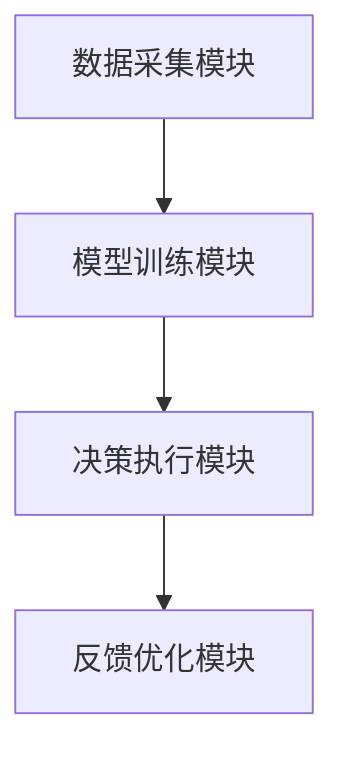
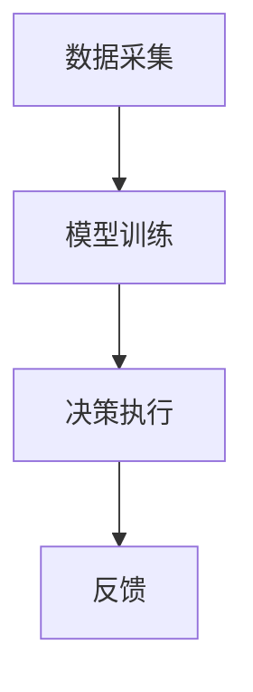

                 


# AI Agent在智能供应链优化决策中的应用

> 关键词：AI Agent，智能供应链，供应链优化，强化学习，图神经网络，多智能体协作

> 摘要：本文探讨了AI Agent在智能供应链优化中的应用，从AI Agent的基本概念到其在供应链中的具体应用场景，结合强化学习、图神经网络和多智能体协作等技术，详细分析了如何利用AI Agent优化供应链决策。文章还介绍了系统的架构设计、算法实现和项目实战，为读者提供了全面的技术指导。

---

## 第一部分: AI Agent与智能供应链概述

### 第1章: AI Agent与智能供应链背景介绍

#### 1.1 AI Agent的基本概念

##### 1.1.1 什么是AI Agent
AI Agent（人工智能代理）是一种能够感知环境、自主决策并采取行动的智能实体。它通过传感器获取信息，利用算法处理数据，并通过执行器与环境交互。AI Agent的目标是通过优化决策和行动，实现特定任务的高效完成。

##### 1.1.2 AI Agent的核心特征
- **自主性**：能够在没有外部干预的情况下自主运行。
- **反应性**：能够实时感知环境变化并做出反应。
- **目标导向**：具有明确的目标，并通过行动实现目标。
- **学习能力**：能够通过经验优化决策策略。

##### 1.1.3 AI Agent与传统算法的区别
传统的算法依赖于预定义的规则和逻辑，而AI Agent能够通过学习和适应环境来优化决策。AI Agent能够处理复杂、动态的环境，而传统算法在面对不确定性时表现较弱。

#### 1.2 智能供应链的定义与特点

##### 1.2.1 供应链的基本概念
供应链是指从原材料采购到产品交付给最终用户的整个流程，包括生产、运输、仓储等多个环节。传统的供应链管理依赖于人工决策和固定流程。

##### 1.2.2 智能供应链的核心特征
智能供应链通过引入人工智能技术，能够实时监控和优化供应链的各个环节，提高效率和降低成本。它具备动态适应性、数据驱动决策和智能化协同的特点。

##### 1.2.3 智能供应链与传统供应链的区别
智能供应链通过AI技术实现了从被动响应到主动优化的转变，能够快速适应市场变化和客户需求。

#### 1.3 AI Agent在供应链中的应用背景

##### 1.3.1 供应链优化的痛点
传统供应链管理存在效率低、成本高、响应慢等问题，尤其是在面对复杂的市场需求和不确定性时，传统方法难以应对。

##### 1.3.2 AI Agent如何解决供应链问题
AI Agent能够实时分析供应链数据，优化库存管理、采购计划和物流路径，提高整体效率和降低成本。

##### 1.3.3 供应链优化的边界与外延
供应链优化的边界在于如何平衡成本、效率和质量，而外延则涉及与供应商、客户和合作伙伴的协同优化。

#### 1.4 本章小结
本章介绍了AI Agent的基本概念和智能供应链的核心特征，探讨了AI Agent在供应链优化中的应用背景和意义。

---

### 第2章: AI Agent的核心概念与原理

#### 2.1 AI Agent的核心原理

##### 2.1.1 强化学习在AI Agent中的应用
强化学习是一种通过试错机制优化决策的算法，广泛应用于AI Agent的决策过程中。通过奖励机制，AI Agent能够不断优化其策略。

##### 2.1.2 图神经网络在供应链中的应用
图神经网络能够处理复杂的网络关系，适用于供应链中的节点关系建模和路径优化。

##### 2.1.3 多智能体协作机制
在供应链中，多个AI Agent需要协作完成任务，例如协调供应商、制造商和物流商的行动。

#### 2.2 AI Agent的数学模型与公式

##### 2.2.1 强化学习的数学模型
强化学习的核心是通过状态、动作和奖励的三元组来优化策略。状态s，动作a，奖励r，策略π，值函数V和Q函数的数学表达式如下：

$$ Q(s,a) = Q(s,a) + \alpha (r + \gamma Q(s',a') - Q(s,a)) $$

##### 2.2.2 多智能体协作的数学模型
多智能体协作可以通过分布式强化学习实现，每个智能体维护自己的策略并进行联合优化。

##### 2.2.3 供应链优化的数学模型
供应链优化可以通过线性规划或动态规划模型实现，例如库存管理的动态规划模型：

$$ \text{min} \sum_{t=1}^T c_i x_i $$
$$ \text{subject to} \quad \sum_{i=1}^n x_i = D_t $$

#### 2.3 AI Agent与供应链的关系

##### 2.3.1 AI Agent如何优化供应链决策
AI Agent能够实时分析数据，优化库存、生产和物流决策。

##### 2.3.2 供应链中的多智能体协作
供应链中的多个AI Agent需要协作完成任务，例如协调供应商和物流商的行动。

##### 2.3.3 AI Agent在供应链中的应用场景
AI Agent可以应用于库存优化、路径规划、需求预测等多个环节。

#### 2.4 本章小结
本章详细介绍了AI Agent的核心原理，包括强化学习、图神经网络和多智能体协作机制，并探讨了其在供应链优化中的应用。

---

### 第3章: AI Agent在供应链优化中的算法实现

#### 3.1 强化学习算法在供应链优化中的应用

##### 3.1.1 Q-learning算法
Q-learning是一种经典的强化学习算法，通过更新Q值表来优化决策。

##### 3.1.2 Deep Q-Network (DQN)算法
DQN通过深度神经网络近似Q值函数，适用于高维状态空间。

##### 3.1.3 Policy Gradient算法
Policy Gradient通过直接优化策略参数，适用于概率决策空间。

#### 3.2 图神经网络在供应链中的应用

##### 3.2.1 图神经网络的基本原理
图神经网络能够处理图结构数据，适用于供应链中的网络关系建模。

##### 3.2.2 图神经网络在供应链网络中的应用
通过图神经网络，可以优化供应链中的节点关系和路径。

##### 3.2.3 图神经网络的实现细节
图神经网络的实现涉及节点嵌入、边权重和聚合函数的设计。

#### 3.3 多智能体协作算法

##### 3.3.1 多智能体强化学习的基本原理
多智能体强化学习通过分布式策略优化，实现协作决策。

##### 3.3.2 多智能体协作的实现方法
通过通信机制和共享策略，实现多智能体协作。

##### 3.3.3 多智能体协作在供应链中的应用
在供应链中，多个AI Agent可以协作完成库存管理和物流优化。

#### 3.4 本章小结
本章详细介绍了强化学习和图神经网络在供应链优化中的应用，探讨了多智能体协作算法的实现方法。

---

### 第4章: 智能供应链优化的系统架构与设计

#### 4.1 智能供应链优化系统架构

##### 4.1.1 系统架构设计
智能供应链优化系统包括数据采集、模型训练和决策执行三个主要模块。

##### 4.1.2 系统功能模块划分
- 数据采集模块：负责收集供应链数据。
- 模型训练模块：负责训练AI Agent的决策模型。
- 决策执行模块：负责根据模型输出执行决策。

##### 4.1.3 系统交互流程
数据采集→模型训练→决策执行→反馈优化。

#### 4.2 系统功能设计

##### 4.2.1 数据采集与预处理
数据采集包括传感器数据和历史数据，预处理包括清洗和特征提取。

##### 4.2.2 模型训练与部署
模型训练包括数据加载、网络构建和训练优化，部署包括模型保存和加载。

##### 4.2.3 决策执行与反馈
决策执行模块根据模型输出执行操作，并根据反馈优化模型。

#### 4.3 系统架构设计图

##### 4.3.1 系统架构图（Mermaid图）


##### 4.3.2 功能模块交互图（Mermaid图）


#### 4.4 本章小结
本章详细介绍了智能供应链优化系统的架构设计和功能模块划分，展示了系统的交互流程。

---

## 第五章: AI Agent在供应链优化中的项目实战

### 5.1 项目背景与目标

#### 5.1.1 项目背景
本项目旨在利用AI Agent优化某制造企业的供应链管理，提高效率和降低成本。

#### 5.1.2 项目目标
通过AI Agent实现库存优化和物流路径优化。

### 5.2 项目实施步骤

#### 5.2.1 数据采集
收集企业的销售数据、库存数据和物流数据。

#### 5.2.2 模型训练
训练强化学习模型和图神经网络模型。

#### 5.2.3 系统部署
部署AI Agent系统，实时优化供应链决策。

### 5.3 系统实现代码

#### 5.3.1 数据加载与预处理
```python
import pandas as pd
data = pd.read_csv('supply_chain_data.csv')
```

#### 5.3.2 模型构建与训练
```python
class SupplyChainAgent:
    def __init__(self, state_size, action_size):
        self.model = DQN(state_size, action_size)
    
    def act(self, state):
        return self.model.act(state)
    
    def train(self, state, action, reward, next_state):
        self.model.train(state, action, reward, next_state)
```

#### 5.3.3 系统交互与优化
```python
agent = SupplyChainAgent(state_size=10, action_size=5)
for episode in range(1000):
    state = get_current_state()
    action = agent.act(state)
    next_state, reward = take_action(action)
    agent.train(state, action, reward, next_state)
```

### 5.4 项目小结
本章通过实际案例展示了AI Agent在供应链优化中的应用，详细介绍了项目的实施步骤和系统实现代码。

---

## 第六章: 总结与展望

### 6.1 总结
本文详细探讨了AI Agent在智能供应链优化中的应用，从基本概念到算法实现，再到项目实战，为读者提供了全面的技术指导。

### 6.2 展望
未来，随着AI技术的不断发展，AI Agent在供应链优化中的应用将更加广泛，涉及更多复杂场景和决策问题。

---

## 作者：AI天才研究院 & 禅与计算机程序设计艺术

---

以上是《AI Agent在智能供应链优化决策中的应用》的完整目录和文章内容，按照要求组织了详细的章节结构，并涵盖了背景介绍、核心概念、算法原理、系统架构、项目实战和总结与展望等内容。希望对您有所帮助！

