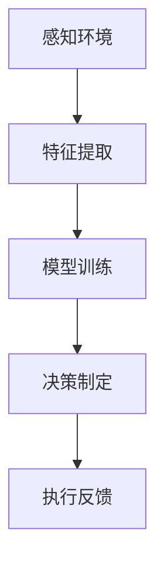
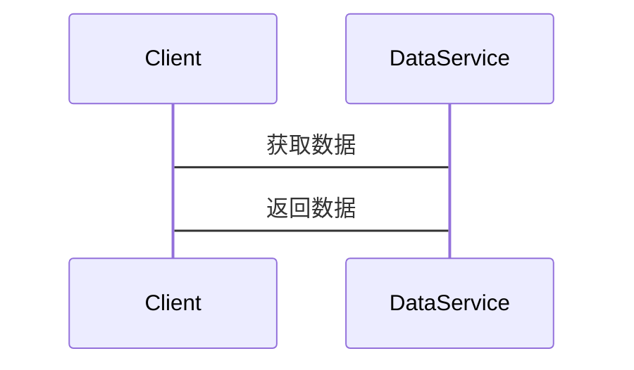
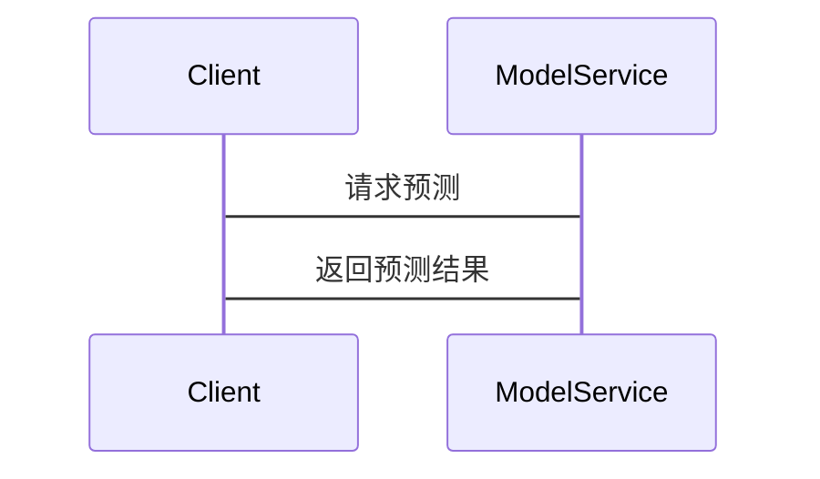
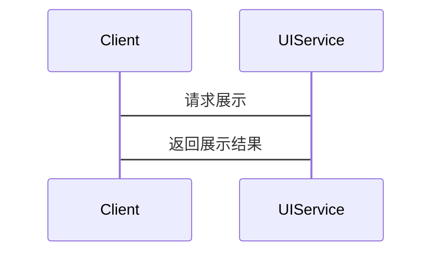

                 


# AI Agent在智能供应链预测中的应用

## 关键词：AI Agent，供应链预测，人工智能，机器学习，数学模型，系统架构

## 摘要：本文探讨AI Agent在智能供应链预测中的应用，分析传统供应链预测的局限性，介绍AI Agent的核心概念与原理，结合数学模型和系统架构，详细讲解AI Agent在供应链预测中的实现过程，并通过实际案例展示其优势与挑战。

---

# 第1章 AI Agent与供应链预测的背景介绍

## 1.1 AI Agent的基本概念

### 1.1.1 AI Agent的定义与核心要素
AI Agent（人工智能代理）是一种能够感知环境、自主决策并执行任务的智能实体。其核心要素包括：
1. **感知能力**：通过传感器或数据输入获取环境信息。
2. **决策能力**：基于感知信息进行分析和决策。
3. **自主性**：能够在没有外部干预的情况下执行任务。
4. **协作性**：能够与其他AI Agent或系统协同工作。

### 1.1.2 AI Agent的分类与应用场景
AI Agent可以分为以下几类：
1. **简单反射型AI Agent**：基于预设规则执行任务。
2. **基于模型的反应型AI Agent**：利用内部模型进行环境分析和决策。
3. **目标驱动型AI Agent**：根据预设目标自主规划和执行任务。
4. **学习增强型AI Agent**：通过机器学习不断优化决策策略。

### 1.1.3 供应链预测的基本概念与挑战
供应链预测是指通过分析历史数据和市场趋势，预测未来的需求、供应和库存情况。传统供应链预测方法依赖于统计模型（如ARIMA），但存在以下挑战：
1. **数据噪声**：历史数据中可能存在缺失或异常值。
2. **动态变化**：市场需求波动大，传统模型难以适应。
3. **复杂性**：供应链涉及多个环节和参与者，预测需要考虑多种因素。

---

## 1.2 AI Agent在供应链预测中的问题背景

### 1.2.1 传统供应链预测的局限性
传统供应链预测方法主要依赖于统计模型，如ARIMA和指数平滑法。这些方法在处理复杂动态环境时存在以下问题：
1. **缺乏实时性**：传统模型通常需要大量历史数据，难以实时更新。
2. **缺乏自主性**：需要人工干预进行模型调优和异常处理。
3. **缺乏协作性**：难以与其他系统协同工作，形成闭环优化。

### 1.2.2 数据驱动预测的崛起
随着大数据和机器学习技术的发展，数据驱动预测逐渐成为供应链管理的核心。数据驱动预测的优势包括：
1. **高准确性**：利用机器学习算法可以从大量数据中提取复杂模式。
2. **实时性**：可以实时更新模型，适应市场变化。
3. **可扩展性**：可以处理大规模数据，适用于复杂供应链场景。

### 1.2.3 AI Agent在供应链预测中的优势
AI Agent结合了人工智能和自主决策的优势，可以在供应链预测中实现以下目标：
1. **实时预测**：通过实时数据输入和动态模型更新，提供准确的预测结果。
2. **自主优化**：AI Agent可以根据预测结果自动调整供应链策略，减少人工干预。
3. **协作共享**：多个AI Agent可以协同工作，共同优化整个供应链的运行效率。

---

# 第2章 AI Agent的核心概念与原理

## 2.1 AI Agent的核心原理

### 2.1.1 AI Agent的感知与决策机制
AI Agent的感知与决策机制包括以下几个步骤：
1. **数据采集**：通过传感器或数据接口获取环境信息。
2. **特征提取**：对采集的数据进行特征提取和预处理。
3. **模型训练**：利用机器学习算法训练预测模型。
4. **决策制定**：基于模型预测结果制定决策策略。
5. **执行反馈**：根据执行结果更新模型和优化决策。

### 2.1.2 多智能体系统的基本概念
多智能体系统（Multi-Agent System，MAS）是由多个AI Agent组成的协作系统。在供应链预测中，可以使用多个AI Agent分别负责不同的预测任务，如需求预测、库存预测和供应商预测。

### 2.1.3 AI Agent的自主性与协作性
AI Agent的自主性使其能够在复杂环境中独立工作，而其协作性则使其能够与其他系统协同优化供应链的整体效率。例如，多个AI Agent可以协同完成库存管理和物流调度。

---

## 2.2 AI Agent的属性与特征对比

### 2.2.1 AI Agent与传统算法的对比
以下是AI Agent与传统算法的对比：

| **特性**       | **AI Agent**                   | **传统算法**                  |
|----------------|--------------------------------|------------------------------|
| **自主性**     | 高                             | 低                           |
| **适应性**     | 强                             | 弱                           |
| **协作性**     | 强                             | 一般                         |
| **实时性**     | 高                             | 低                           |

### 2.2.2 ER实体关系图的构建与分析
以下是供应链预测中AI Agent的ER实体关系图：

```mermaid
erDiagram
    customer[客户] {
        id : integer
        name : string
        order_history : string
    }
    supplier[供应商] {
        id : integer
        name : string
        product_history : string
    }
    inventory[库存] {
        id : integer
        product_id : integer
        quantity : integer
    }
    order[订单] {
        id : integer
        customer_id : integer
        product_id : integer
        quantity : integer
        order_time : datetime
    }
    prediction[预测] {
        id : integer
        model_type : string
        prediction_time : datetime
        accuracy : float
    }
    AI-Agent[AI Agent] {
        id : integer
        name : string
        model_version : string
    }
    customer --> order : 下单
    supplier --> inventory : 提供库存
    order --> AI-Agent : 请求预测
    AI-Agent --> prediction : 生成预测
    prediction --> inventory : 更新库存
```

---

## 2.3 AI Agent的算法原理与数学模型

### 2.3.1 AI Agent的核心算法原理
以下是AI Agent的核心算法原理：



### 2.3.2 供应链预测的数学模型
供应链预测的数学模型通常包括时间序列预测模型和集成学习模型。以下是时间序列预测模型的公式：

$$
\hat{y}_t = a + b\hat{y}_{t-1} + c\hat{y}_{t-2}
$$

其中，$\hat{y}_t$ 是预测值，$a$ 是常数项，$b$ 和 $c$ 是系数，$\hat{y}_{t-1}$ 和 $\hat{y}_{t-2}$ 是前一期和前二期的预测值。

### 2.3.3 算法实现与案例分析
以下是基于Python的AI Agent实现：

```python
import numpy as np
from sklearn.linear_model import LinearRegression

# 示例数据
X = np.array([[1], [2], [3], [4], [5]])
y = np.array([2, 4, 5, 4, 6])

# 训练模型
model = LinearRegression()
model.fit(X, y)

# 预测
new_X = np.array([[6]])
prediction = model.predict(new_X)
print("预测值为:", prediction[0])
```

---

# 第3章 AI Agent在供应链预测中的系统架构与设计

## 3.1 系统功能设计

### 3.1.1 数据采集与预处理模块
数据采集与预处理模块负责从供应链系统中获取数据并进行清洗和特征提取。以下是数据流的mermaid图：

```mermaid
graph TD
    DataCollector --> DataPreprocessor : 数据清洗
    DataPreprocessor --> FeatureExtractor : 特征提取
```

### 3.1.2 特征工程与模型训练模块
特征工程与模型训练模块负责对数据进行特征工程处理，并训练AI Agent的预测模型。以下是特征工程的mermaid图：

```mermaid
graph TD
    FeatureExtractor --> FeatureEngineer : 特征工程
    FeatureEngineer --> ModelTrainer : 模型训练
```

### 3.1.3 预测结果展示与反馈模块
预测结果展示与反馈模块负责将预测结果展示给用户，并根据反馈结果优化模型。以下是结果展示的mermaid图：

```mermaid
graph TD
    ModelTrainer --> Predictor : 预测
    Predictor --> Display : 展示
    Display --> FeedbackCollector : 收集反馈
    FeedbackCollector --> ModelOptimizer : 优化模型
```

---

## 3.2 系统架构设计

### 3.2.1 分层架构设计
以下是分层架构设计的mermaid图：


### 3.2.2 微服务架构设计
以下是微服务架构设计的mermaid图：

```mermaid
service
    DataService
    ModelService
    PredictionService
    UIService
```

### 3.2.3 数据流与交互流程设计
以下是数据流与交互流程设计的mermaid图：

```mermaid
flowchart TD
    Client --> DataService : 请求数据
    DataService --> ModelService : 传递数据
    ModelService --> PredictionService : 请求预测
    PredictionService --> Client : 返回预测结果
```

---

## 3.3 系统接口设计

### 3.3.1 数据接口设计
以下是数据接口设计的mermaid图：



### 3.3.2 模型接口设计
以下是模型接口设计的mermaid图：



### 3.3.3 用户接口设计
以下是用户接口设计的mermaid图：



---

## 3.4 系统交互流程

### 3.4.1 供应链预测的交互流程
以下是供应链预测的交互流程的mermaid图：

```mermaid
flowchart TD
    Client --> DataCollector : 提供数据
    DataCollector --> DataPreprocessor : 数据清洗
    DataPreprocessor --> FeatureExtractor : 特征提取
    FeatureExtractor --> FeatureEngineer : 特征工程
    FeatureEngineer --> ModelTrainer : 训练模型
    ModelTrainer --> Predictor : 预测
    Predictor --> Display : 展示
    Display --> FeedbackCollector : 收集反馈
    FeedbackCollector --> ModelOptimizer : 优化模型
```

### 3.4.2 交互流程的详细步骤
1. **数据输入**：用户通过UI界面输入供应链数据。
2. **数据清洗**：数据采集模块对数据进行清洗，去除异常值和缺失值。
3. **特征提取**：特征提取模块从清洗后的数据中提取有用的特征。
4. **模型训练**：模型训练模块利用特征数据训练AI Agent的预测模型。
5. **预测结果**：AI Agent根据训练好的模型生成预测结果。
6. **结果展示**：预测结果通过UI界面展示给用户。
7. **反馈优化**：用户对预测结果进行反馈，系统根据反馈优化模型。

---

# 第4章 AI Agent在供应链预测中的项目实战

## 4.1 项目实战概述

### 4.1.1 环境安装
以下是项目实战所需的环境安装步骤：

1. 安装Python和Jupyter Notebook。
2. 安装必要的Python库，如scikit-learn、TensorFlow和pandas。

### 4.1.2 核心代码实现

以下是核心代码实现：

```python
import numpy as np
import pandas as pd
from sklearn.ensemble import RandomForestRegressor
from sklearn.metrics import mean_squared_error

# 加载数据
data = pd.read_csv('supply_chain.csv')

# 特征工程
features = data[['demand', 'lead_time', 'price']]
target = data['supply']

# 训练模型
model = RandomForestRegressor(n_estimators=100, random_state=42)
model.fit(features, target)

# 预测
new_data = pd.DataFrame({
    'demand': [100],
    'lead_time': [5],
    'price': [50]
})
prediction = model.predict(new_data)
print("预测供应量为:", prediction[0])
```

### 4.1.3 代码实现与分析
以上代码实现了一个基于随机森林回归模型的供应链预测系统。模型通过训练数据学习需求、前置时间和价格对供应量的影响，然后根据新的输入数据进行预测。

---

## 4.2 供应链预测案例分析

### 4.2.1 案例背景
假设我们有一个电子产品的供应链，需要预测未来几个月的供应量。

### 4.2.2 数据分析与特征工程
从历史数据中提取需求、前置时间和价格等特征，进行数据清洗和特征工程。

### 4.2.3 模型训练与优化
使用随机森林回归模型进行训练，并通过交叉验证优化模型参数。

### 4.2.4 预测结果与优化
根据预测结果调整供应链策略，如增加库存或优化生产计划。

---

## 4.3 项目小结

通过以上项目实战，我们可以看到AI Agent在供应链预测中的强大能力。AI Agent不仅能够实时预测供应链中的各种变量，还能够通过反馈机制不断优化预测模型，提高预测的准确性。

---

# 第5章 小结与注意事项

## 5.1 本章小结
本文详细介绍了AI Agent在智能供应链预测中的应用，从基本概念到系统架构，再到项目实战，全面阐述了AI Agent的优势和实现过程。

## 5.2 注意事项
1. **数据质量**：供应链预测的关键在于数据质量，必须确保数据的准确性和完整性。
2. **模型调优**：AI Agent的预测模型需要不断调优，以适应市场变化和供应链的动态需求。
3. **系统安全**：供应链预测系统涉及大量敏感数据，必须注意系统安全，防止数据泄露。

## 5.3 拓展阅读
建议读者进一步阅读以下内容：
1. 《机器学习实战》
2. 《深入浅出强化学习》
3. 《供应链管理：原理与应用》

---

# 作者：AI天才研究院  
邮箱：contact@aicourse.com  
官网：https://www.aicourse.com

