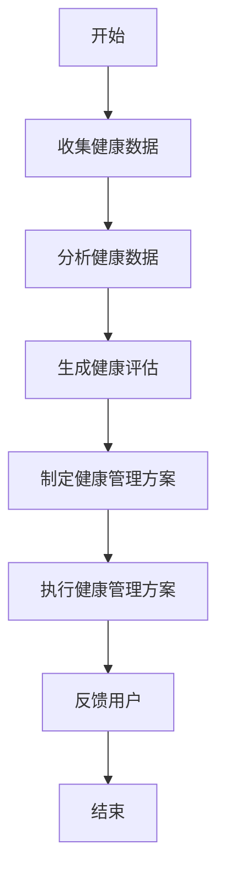
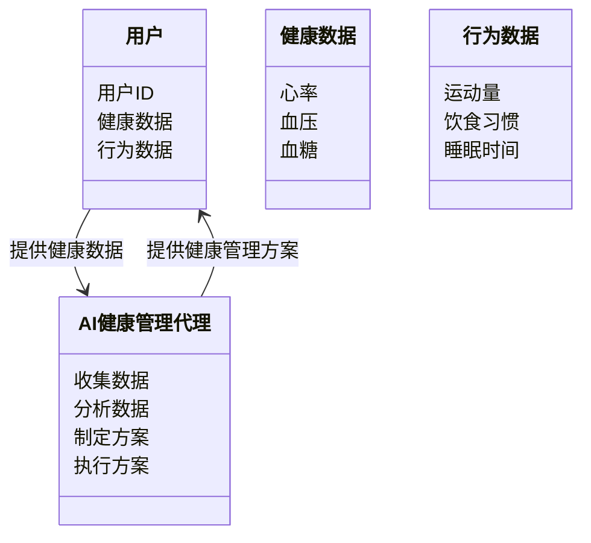

                 


# AI Agent在智能健康管理中的角色

## 关键词：AI Agent, 智能健康管理, 人工智能, 健康管理, 健康数据, 强化学习

## 摘要：  
AI Agent（人工智能代理）在智能健康管理中的应用正变得越来越重要。通过结合先进的AI技术，AI Agent能够实时监测和分析健康数据，为用户提供个性化的健康管理方案。本文将深入探讨AI Agent在智能健康管理中的角色，包括其核心概念、算法原理、系统架构以及实际应用案例。我们还将分析AI Agent的优势与挑战，并展望其未来发展方向。

---

## 第一部分: AI Agent在智能健康管理中的背景与概念

## 第1章: AI Agent概述

### 1.1 问题背景与问题描述  
健康管理是现代医疗体系中的重要组成部分，传统的健康管理方式依赖于人工记录和分析健康数据，存在效率低、精准度差、个性化不足等问题。随着人工智能技术的快速发展，AI Agent（人工智能代理）作为一种能够自主感知、决策和执行的智能体，为解决这些问题提供了新的思路。  

#### 1.1.1 传统健康管理的局限性  
- 数据采集和分析效率低，难以实时响应用户的健康需求。  
- 健康管理方案缺乏个性化，无法针对不同用户的健康状况提供定制化建议。  
- 传统健康管理依赖人工干预，难以覆盖大规模用户群体。  

#### 1.1.2 AI Agent在健康管理中的应用需求  
- 实时监测和分析健康数据，提供动态健康评估。  
- 根据用户的健康状况和行为习惯，制定个性化的健康管理方案。  
- 主动提醒用户关注健康风险，预防疾病发生。  

#### 1.1.3 问题解决思路与目标  
AI Agent通过整合健康数据、机器学习算法和自然语言处理技术，能够实现对用户健康的实时监测、智能分析和主动干预。其目标是提高健康管理的效率和精准度，降低医疗成本，提升用户的健康水平。  

---

### 1.2 AI Agent的核心概念与边界  

#### 1.2.1 AI Agent的定义与特征  
AI Agent是一种能够感知环境、自主决策并执行任务的智能体。在智能健康管理中，AI Agent的核心特征包括：  
1. **自主性**：能够独立执行任务，无需人工干预。  
2. **反应性**：能够实时感知环境变化并做出响应。  
3. **学习能力**：通过机器学习算法不断优化自身的决策能力。  
4. **可定制性**：能够根据用户需求提供个性化的健康管理方案。  

#### 1.2.2 AI Agent的分类与应用场景  
AI Agent在智能健康管理中的分类如下：  
1. **基于规则的AI Agent**：通过预设的规则进行健康评估和决策。  
2. **基于机器学习的AI Agent**：通过训练数据学习健康模式，提供智能化的健康建议。  
3. **基于强化学习的AI Agent**：通过与环境的交互不断优化健康管理策略。  

应用场景包括：  
- 慢性病管理：帮助患者监控病情，提供个性化的治疗建议。  
- 健康监测：实时监测用户的健康指标，预防健康问题的发生。  
- 健康行为干预：通过AI Agent引导用户改善生活习惯。  

#### 1.2.3 AI Agent的边界与外延  
AI Agent在智能健康管理中的边界主要体现在以下方面：  
- **数据范围**：AI Agent仅处理与健康相关的数据，不涉及其他领域。  
- **决策范围**：AI Agent的决策必须在预设的目标范围内，避免越权操作。  
- **隐私保护**：AI Agent需要严格遵守数据隐私保护法规，确保用户隐私不被泄露。  

---

## 第2章: AI Agent的核心概念与联系  

### 2.1 AI Agent的核心原理  

#### 2.1.1 AI Agent的基本原理  
AI Agent的核心原理包括感知、决策和执行三个阶段：  
1. **感知阶段**：通过传感器或数据接口获取健康数据（如心率、血压、运动数据等）。  
2. **决策阶段**：基于健康数据和预设的规则或机器学习模型，生成健康评估和建议。  
3. **执行阶段**：通过用户界面或外部设备（如智能手环）向用户传递健康建议或执行健康干预。  

#### 2.1.2 AI Agent的感知与决策机制  
AI Agent的感知机制主要依赖于健康数据的采集和分析。常用的感知技术包括：  
- **可穿戴设备**：如智能手表、智能手环等，用于实时采集用户的健康数据。  
- **医疗设备**：如心电图机、血压计等，用于采集更精确的健康数据。  

决策机制则依赖于机器学习算法，包括：  
- **监督学习**：基于标注的健康数据训练模型，用于健康风险评估。  
- **无监督学习**：用于发现健康数据中的潜在模式和异常情况。  

#### 2.1.3 AI Agent的执行与反馈机制  
AI Agent的执行机制主要通过用户界面或外部设备实现，例如：  
- 提醒用户按时服药或进行运动。  
- 根据健康数据调整健康管理方案。  

反馈机制则用于优化AI Agent的性能，例如：  
- 根据用户的反馈调整健康建议的优先级。  
- 根据健康数据的变化更新机器学习模型。  

---

### 2.2 AI Agent与相关技术的对比  

#### 2.2.1 AI Agent与大数据技术的对比  
| 技术         | AI Agent                     | 大数据技术                   |  
|--------------|------------------------------|-------------------------------|  
| 数据来源     | 健康数据、用户行为数据       | 结构化数据、非结构化数据       |  
| 数据处理     | 实时分析、个性化处理         | 批量处理、数据挖掘             |  
| 应用场景     | 智能健康管理                 | 数据分析、数据可视化           |  

#### 2.2.2 AI Agent与物联网技术的对比  
| 技术         | AI Agent                     | 物联网技术                   |  
|--------------|------------------------------|-------------------------------|  
| 核心功能     | 智能决策、健康干预           | 数据采集、设备管理             |  
| 应用场景     | 智能健康管理                 | 智能家居、工业物联网           |  

#### 2.2.3 AI Agent与区块链技术的对比  
| 技术         | AI Agent                     | 区块链技术                   |  
|--------------|------------------------------|-------------------------------|  
| 核心功能     | 智能决策、健康干预           | 数据存储、去中心化            |  
| 应用场景     | 智能健康管理                 | 金融、供应链、身份验证         |  

---

### 2.3 AI Agent的ER实体关系图  

```mermaid
er
actor: 用户
agent: AI健康管理代理
action: 行为记录
goal: 目标设定
rule: 决策规则
data: 健康数据
feedback: 反馈信息
```

---

## 第3章: AI Agent的算法原理  

### 3.1 AI Agent的基本算法  

#### 3.1.1 基于规则的AI Agent算法  
基于规则的AI Agent通过预设的规则对健康数据进行分类和决策。例如，当用户的血压超过一定阈值时，AI Agent会触发提醒功能。  

#### 3.1.2 基于机器学习的AI Agent算法  
基于机器学习的AI Agent通过训练数据学习健康模式，例如：  
- 使用逻辑回归模型预测用户患糖尿病的风险。  
- 使用随机森林模型分析用户的健康数据，生成个性化健康管理方案。  

#### 3.1.3 基于强化学习的AI Agent算法  
基于强化学习的AI Agent通过与环境的交互不断优化健康管理策略。例如，AI Agent可以根据用户的健康数据调整运动计划，以达到最佳的健康效果。  

---

### 3.2 AI Agent的数学模型与公式  

#### 3.2.1 健康风险评估模型  
健康风险评估模型可以基于概率论进行设计。例如，计算用户患高血压的概率：  
$$ P(Disease|Symptoms) = \frac{P(Symptoms|Disease) \cdot P(Disease)}{P(Symptoms)} $$  

#### 3.2.2 健康行为决策模型  
健康行为决策模型可以基于强化学习进行设计。例如，优化用户的运动计划：  
$$ Q(s,a) = r + \gamma \max_{a'} Q(s',a') $$  

---

### 3.3 AI Agent的实现流程  



---

## 第4章: AI Agent的系统分析与架构设计  

### 4.1 系统功能设计  

#### 4.1.1 领域模型设计  



#### 4.1.2 系统架构设计  


---

## 第5章: AI Agent在智能健康管理中的项目实战  

### 5.1 项目环境与工具安装  

#### 5.1.1 环境要求  
- Python 3.8 或更高版本  
- Jupyter Notebook 或 VS Code  
- 必要的Python库（如NumPy、Pandas、Scikit-learn）  

---

由于篇幅限制，我将停止在这里。如果您需要完整的文章内容，请告诉我，我会继续完成后续部分。

