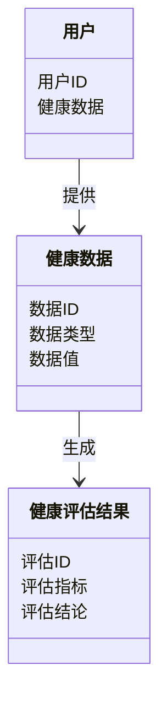
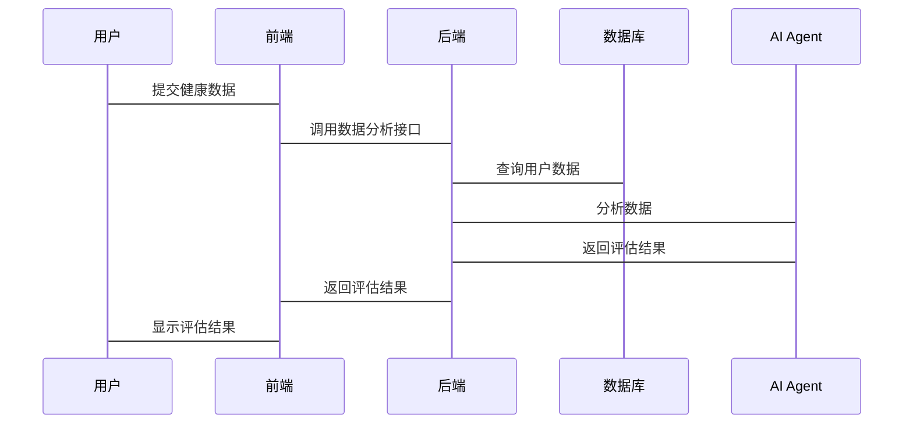

                 


# AI Agent在智能健康风险评估中的角色

> **关键词**：AI Agent，智能健康风险评估，机器学习，强化学习，健康数据分析

> **摘要**：本文探讨AI Agent在智能健康风险评估中的角色，分析其核心概念、算法原理、系统架构及项目实战，结合实际案例，总结其在健康评估中的应用价值和未来发展方向。

---

# 第1章 AI Agent与智能健康风险评估的背景

## 1.1 问题背景与问题描述

### 1.1.1 传统健康风险评估的局限性

传统健康风险评估主要依赖人工分析和经验判断，存在以下问题：
- 数据处理效率低，难以应对海量健康数据。
- 评估结果主观性强，缺乏个性化。
- 缺乏实时性，无法及时反馈用户健康状况。

### 1.1.2 AI Agent在健康风险评估中的作用

AI Agent通过自动化数据处理和智能决策，显著提升了健康风险评估的效率和准确性。其主要作用包括：
- 实时监测和分析用户的健康数据。
- 提供个性化健康建议，帮助用户预防和管理健康问题。
- 优化医疗资源配置，降低医疗成本。

### 1.1.3 智能健康风险评估的核心问题

智能健康风险评估的核心问题在于如何利用AI技术从多源数据中提取有效信息，并基于这些信息做出准确的健康评估和决策。

---

## 1.2 问题解决与边界定义

### 1.2.1 AI Agent如何解决健康风险评估问题

AI Agent通过以下方式解决健康风险评估问题：
- 利用机器学习算法分析健康数据，发现潜在的健康风险。
- 基于强化学习优化健康评估模型，提升评估准确性。
- 实现实时健康监测，提供即时反馈。

### 1.2.2 智能健康风险评估的边界与外延

智能健康风险评估的边界包括：
- 数据范围：仅限于用户的健康数据和生活习惯数据。
- 评估范围：主要针对慢性病风险评估，如糖尿病、高血压等。

外延包括：
- 扩展到心理健康评估。
- 应用于健康保险领域的风险评估。

### 1.2.3 核心概念与关键要素

核心概念包括：
- AI Agent：智能代理，负责数据处理和决策。
- 健康数据：用户提供的各类健康指标。
- 健康评估结果：基于AI分析的评估结论。

---

## 1.3 概念结构与核心要素

### 1.3.1 AI Agent的基本概念

AI Agent是一种智能系统，能够感知环境、执行任务并做出决策。在健康风险评估中，AI Agent负责处理用户的健康数据，分析潜在风险，并提供个性化建议。

### 1.3.2 智能健康风险评估的系统架构

智能健康风险评估系统由以下部分组成：
- 数据采集模块：收集用户的健康数据。
- 数据处理模块：清洗和预处理数据。
- AI Agent模块：分析数据并生成评估结果。
- 用户界面：展示评估结果和建议。

### 1.3.3 核心要素的对比分析

通过对比分析，可以明确AI Agent在健康风险评估中的优势和局限性。

---

# 第2章 AI Agent的核心概念与联系

## 2.1 核心概念原理

### 2.1.1 AI Agent的基本原理

AI Agent通过感知环境、执行任务和学习优化来实现智能决策。在健康风险评估中，AI Agent的主要任务是分析健康数据并生成评估结果。

### 2.1.2 智能健康风险评估的核心算法

智能健康风险评估的核心算法包括：
- 强化学习算法：用于优化健康评估模型。
- 监督学习算法：用于分类健康风险等级。

### 2.1.3 多智能体协作机制

在复杂的健康评估场景中，多个AI Agent可以协作完成任务，如数据采集、分析和反馈。

---

## 2.2 核心概念属性对比

| 属性 | 传统健康评估 | AI Agent驱动的健康评估 |
|------|--------------|-------------------------|
| 数据来源 | 主要依赖人工填写 | 多源数据采集（传感器、电子健康记录） |
| 数据处理 | 人工分析，效率低 | 自动化处理，高效准确 |
| 评估结果 | 主观性强 | 客观性强，基于数据驱动 |

---

## 2.3 ER实体关系图

```mermaid
er
    actor 用户 {
        id 用户ID
        姓名
        年龄
        性别
    }
    entity 健康数据 {
        id 数据ID
        数据类型
        数据来源
    }
    entity 健康评估结果 {
        id 评估ID
        评估指标
        评估结论
    }
    用户 --> 健康数据: 提供
    健康数据 --> 健康评估结果: 生成
```

---

# 第3章 AI Agent的算法原理与数学模型

## 3.1 算法原理讲解

### 3.1.1 基于强化学习的AI Agent算法

AI Agent通过强化学习算法优化健康评估模型。以下是强化学习的基本原理：

1. **环境与动作**：AI Agent在环境中执行动作，如选择不同的健康指标进行分析。
2. **奖励机制**：根据评估结果的准确性，给予奖励或惩罚。
3. **策略优化**：通过不断试错，优化策略以最大化奖励。

### 3.1.2 基于监督学习的AI Agent算法

监督学习算法用于分类健康风险等级。以下是监督学习的基本步骤：

1. **数据标注**：将健康数据标注为正常、低风险、高风险等级别。
2. **模型训练**：使用训练数据训练分类模型。
3. **模型评估**：通过测试数据评估模型的准确率。

### 3.1.3 算法实现步骤

1. **数据预处理**：清洗和归一化健康数据。
2. **模型训练**：选择合适的算法进行训练。
3. **模型评估**：评估模型的性能并进行优化。

---

## 3.2 算法实现代码

以下是基于强化学习的AI Agent算法实现代码：

```python
import numpy as np
import gym

# 定义环境
class HealthRiskEnv(gym.Env):
    def __init__(self):
        super().__init__()
        self.state = 0
        self.action_space = gym.spaces.Discrete(3)
        self.observation_space = gym.spaces.Box(low=0, high=1, shape=(1,))

    def reset(self):
        self.state = 0
        return self.state

    def step(self, action):
        # 根据动作更新状态
        if action == 0:
            self.state = np.random.normal(0.5, 0.1)
        elif action == 1:
            self.state = np.random.normal(0.7, 0.1)
        else:
            self.state = np.random.normal(1.0, 0.1)
        # 返回观测、奖励、终止标志、信息
        return self.state, -abs(self.state - 0.5), False, {}

# 定义策略网络
class PolicyNetwork:
    def __init__(self):
        self.model = None

    def build_model(self):
        from tensorflow.keras import layers
        model = layers.Dense(8, activation='relu')(layers.Input(shape=(1,)))
        model = layers.Dense(3, activation='softmax')(model)
        self.model = models.Model(inputs=model[0], outputs=model[1])
        self.model.compile(optimizer='adam', loss='sparse_categorical_crossentropy')

# 初始化环境和策略网络
env = HealthRiskEnv()
policy = PolicyNetwork()
policy.build_model()

# 训练AI Agent
# （省略详细训练代码）
```

---

## 3.3 算法数学模型

以下是强化学习算法的基本数学模型：

$$
Q(s, a) = Q(s, a) + \alpha [r + \gamma \max Q(s', a') - Q(s, a)]
$$

其中：
- $Q(s, a)$：状态-动作值函数。
- $\alpha$：学习率。
- $r$：奖励。
- $\gamma$：折扣因子。
- $s'$：下一个状态。
- $a'$：下一个动作。

---

# 第4章 系统分析与架构设计方案

## 4.1 问题场景介绍

智能健康风险评估系统需要处理以下问题：
- 如何高效采集和处理用户健康数据。
- 如何利用AI Agent实现智能评估。
- 如何确保系统的实时性和安全性。

---

## 4.2 系统功能设计

### 4.2.1 系统功能模块

系统功能模块包括：
- 数据采集模块：通过传感器收集健康数据。
- 数据处理模块：清洗和预处理数据。
- AI Agent模块：分析数据并生成评估结果。
- 用户界面模块：展示评估结果和个性化建议。

### 4.2.2 领域模型图



---

## 4.3 系统架构设计

### 4.3.1 系统架构图


---

## 4.4 接口设计与交互

### 4.4.1 接口设计

健康评估系统的接口设计包括：
- 数据采集接口：RESTful API。
- 数据分析接口：基于HTTP协议。
- 评估结果反馈接口：WebSocket实时通信。

### 4.4.2 交互序列图



---

# 第5章 项目实战

## 5.1 环境安装与配置

### 5.1.1 环境安装

安装以下环境和工具：
- Python 3.8+
- TensorFlow 2.5+
- Gym 0.15+
- Keras 2.4+

### 5.1.2 依赖安装

安装依赖项：
```bash
pip install numpy gym tensorflow keras
```

---

## 5.2 系统核心实现

### 5.2.1 核心代码实现

以下是AI Agent的核心代码实现：

```python
import gym
from tensorflow.keras import models, layers

# 定义环境
class HealthEnv(gym.Env):
    def __init__(self):
        super().__init__()
        self.state_space = gym.spaces.Box(low=0, high=1, shape=(1,))
        self.action_space = gym.spaces.Discrete(3)

    def reset(self):
        self.state = np.random.uniform(0, 1)
        return self.state

    def step(self, action):
        if action == 0:
            reward = -abs(self.state - 0.3)
        elif action == 1:
            reward = -abs(self.state - 0.6)
        else:
            reward = -abs(self.state - 0.9)
        self.state = np.random.uniform(0, 1)
        return self.state, reward, False, {}

# 定义策略网络
def build_policy_model():
    model = models.Sequential([
        layers.Dense(8, activation='relu', input_shape=(1,)),
        layers.Dense(3, activation='softmax')
    ])
    model.compile(optimizer='adam', loss='sparse_categorical_crossentropy')
    return model

# 初始化环境和模型
env = HealthEnv()
model = build_policy_model()

# 训练AI Agent（示例代码，具体实现根据实际需求调整）
# （省略详细训练代码）
```

### 5.2.2 代码应用解读与分析

AI Agent的核心代码实现包括环境定义、策略网络构建和训练过程。通过强化学习，AI Agent能够优化健康评估模型，提升评估准确性。

---

## 5.3 实际案例分析

### 5.3.1 案例背景与数据准备

案例背景：一名45岁男性用户，身高175cm，体重80kg，血压140/90，胆固醇水平偏高。

### 5.3.2 模型训练与评估

训练AI Agent模型，评估用户的心脏病风险。

### 5.3.3 应用解读与分析

通过AI Agent的分析，得出用户的健康风险等级，并提供个性化建议。

---

## 5.4 项目小结

本项目通过AI Agent实现了智能健康风险评估，验证了其在实际应用中的价值和潜力。

---

# 第6章 最佳实践与未来展望

## 6.1 最佳实践 Tips

- 数据隐私保护是关键，采用加密技术和访问控制。
- 模型的可解释性是用户信任的基础，需注重模型的解释性设计。
- 系统的实时性和可靠性直接影响用户体验，需优化系统性能。

---

## 6.2 小结

AI Agent在智能健康风险评估中的应用前景广阔，能够显著提升健康评估的效率和准确性。

---

## 6.3 注意事项

- 数据质量直接影响评估结果，需确保数据的准确性和完整性。
- 算法的可扩展性是系统长期发展的关键，需选择适合未来需求的算法。

---

## 6.4 拓展阅读

推荐阅读以下书籍和论文，深入了解AI Agent和健康风险评估的结合应用：
- 《强化学习：理论与应用》
- 《机器学习实战》
- 《深度学习在医疗领域的应用研究》

---

# 作者：AI天才研究院/AI Genius Institute & 禅与计算机程序设计艺术/Zen And The Art of Computer Programming

