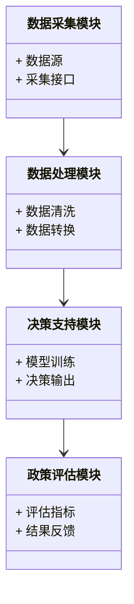
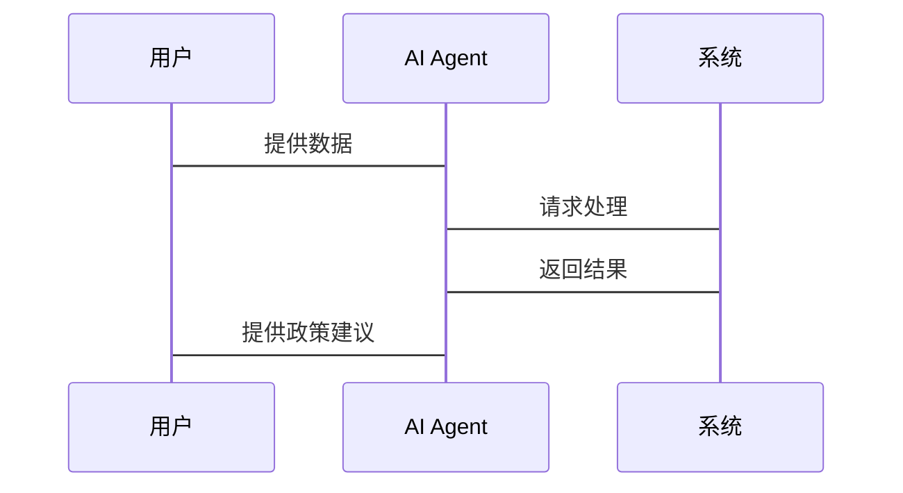

                 


# AI Agent在智能公共卫生政策制定中的角色

## 关键词：
AI Agent, 公共卫生政策, 数据驱动决策, 人工智能, 公共健康管理

## 摘要：
本文探讨AI Agent在公共卫生政策制定中的角色和应用。通过分析AI Agent的核心概念、算法原理和系统架构，结合实际案例，展示AI技术如何助力公共卫生决策。文章还提供了最佳实践建议，帮助读者理解AI Agent在智能公共卫生管理中的价值。

---

## 第一部分: AI Agent与公共卫生政策制定的背景与概念

### 第1章: AI Agent的基本概念与公共卫生政策制定的背景

#### 1.1 AI Agent的定义与特点

##### 1.1.1 AI Agent的定义
AI Agent是一种智能体，能够感知环境、自主决策并执行任务。它具备学习、推理和自适应能力，能够在动态环境中优化决策。

##### 1.1.2 AI Agent的核心特点
- **自主性**：无需外部干预，自主执行任务。
- **反应性**：实时感知环境变化，调整行为。
- **学习性**：通过数据优化决策模型。
- **协作性**：与其他系统或人类协同工作。

##### 1.1.3 AI Agent与传统决策支持系统的区别
| 特性 | AI Agent | 传统决策支持系统 |
|------|----------|-------------------|
| 数据处理能力 | 高度依赖大数据 | 依赖少量结构化数据 |
| 学习能力 | 具备自适应学习 | 无自适应能力 |
| 决策速度 | 实时决策 | 需人工干预 |

#### 1.2 公共卫生政策制定的背景

##### 1.2.1 公共卫生政策的定义与作用
公共卫生政策是政府为改善公众健康状况而制定的策略，旨在预防疾病、提高生活质量。

##### 1.2.2 公共卫生政策制定的复杂性
- 涉及多部门协作。
- 数据来源多样，处理难度大。
- 需要考虑伦理和社会因素。

##### 1.2.3 AI技术在公共卫生政策中的潜在价值
- 提高决策效率。
- 数据分析能力强，支持精准政策制定。
- 能够处理复杂场景，提供优化建议。

#### 1.3 AI Agent在公共卫生政策中的角色定位

##### 1.3.1 AI Agent在公共卫生决策中的功能定位
AI Agent作为辅助工具，帮助政策制定者分析数据、预测趋势、评估方案。

##### 1.3.2 AI Agent与公共卫生政策制定的结合点
- 数据分析与处理。
- 模型构建与优化。
- 决策支持与执行监控。

##### 1.3.3 AI Agent在公共卫生政策中的优势与局限性
**优势**：
- 高效处理复杂数据。
- 实时反馈优化决策。
**局限性**：
- 数据依赖性强。
- 需要大量计算资源。

### 第2章: AI Agent在公共卫生政策中的核心概念与联系

#### 2.1 核心概念原理

##### 2.1.1 AI Agent的决策机制
AI Agent通过感知环境、分析数据、评估选项，最终做出最优决策。其决策过程包括数据输入、模型分析、策略生成和结果输出四个阶段。

##### 2.1.2 数据驱动的公共卫生政策制定
AI Agent依赖大量数据，包括人口统计数据、疾病传播数据、政策执行数据等，通过分析这些数据生成政策建议。

##### 2.1.3 AI Agent的多目标优化模型
AI Agent在制定政策时需要平衡多个目标，如成本最小化、效果最大化和风险最小化，构建多目标优化模型。

#### 2.2 核心概念对比表格

| 特性 | AI Agent | 传统公共卫生政策制定 |
|------|----------|----------------------|
| 决策速度 | 实时决策 | 长周期决策          |
| 数据依赖 | 高度依赖 | 依赖较少数据        |
| 可扩展性 | 高 | 低                   |

#### 2.3 ER实体关系图
```mermaid
er
    entity 公共卫生政策 {
        key: 政策ID
        attribute: 政策内容, 政策目标, 政策效果
    }
    entity 数据源 {
        key: 数据源ID
        attribute: 数据类型, 数据来源, 数据时间
    }
    entity AI Agent {
        key: AgentID
        attribute: 决策模型, 数据处理能力, 学习能力
    }
    公共卫生政策 --|{--> 数据源: 数据支持
    公共卫生政策 --|{--> AI Agent: 智能辅助
    AI Agent --|{--> 数据源: 数据输入
```

---

## 第三部分: AI Agent的算法原理与数学模型

### 第3章: AI Agent的算法原理与数学模型

#### 3.1 算法原理

##### 3.1.1 强化学习算法
AI Agent通过与环境互动，学习最优策略。强化学习的核心是通过奖励机制优化决策模型。

##### 3.1.2 贝叶斯网络
贝叶斯网络用于概率推理，帮助AI Agent在不确定环境中做出决策。

##### 3.1.3 集成学习
集成学习通过组合多个模型的结果，提高决策的准确性和鲁棒性。

#### 3.2 数学模型

##### 3.2.1 贝叶斯定理
$$ P(A|B) = \frac{P(B|A)P(A)}{P(B)} $$

##### 3.2.2 多目标优化模型
$$ \text{目标函数} = \sum_{i=1}^n \alpha_i f_i(x) $$

#### 3.3 代码实现

##### 3.3.1 强化学习代码示例
```python
class AI_Policy-Agent:
    def __init__(self):
        self.model = self.build_model()
        
    def build_model(self):
        # 构建强化学习模型
        pass
    
    def perceive(self, environment):
        # 环境感知
        pass
    
    def decide(self, state):
        # 决策
        pass
```

##### 3.3.2 贝叶斯网络代码示例
```python
def calculate_probability(evidence, target):
    # 计算概率
    pass
```

---

## 第四部分: 系统分析与架构设计方案

### 第4章: 系统分析与架构设计

#### 4.1 问题场景介绍

##### 4.1.1 疫情预测与响应
AI Agent帮助预测疫情发展，制定防控策略。

#### 4.2 项目介绍

##### 4.2.1 项目目标
构建AI Agent系统，辅助公共卫生政策制定。

#### 4.3 系统功能设计

##### 4.3.1 功能模块
- 数据采集模块
- 数据处理模块
- 决策支持模块
- 政策评估模块

##### 4.3.2 功能模块的交互


#### 4.4 系统架构设计

##### 4.4.1 微服务架构


#### 4.5 系统接口设计

##### 4.5.1 API接口
- 数据接口：用于数据输入和输出。
- 模型接口：用于模型训练和预测。

#### 4.6 系统交互设计

##### 4.6.1 序列图


---

## 第五部分: 项目实战

### 第5章: 项目实战

#### 5.1 环境配置

##### 5.1.1 安装Python
安装Python 3.8以上版本。

##### 5.1.2 安装依赖库
安装Pandas、Scikit-learn、TensorFlow等库。

#### 5.2 核心代码实现

##### 5.2.1 数据处理代码
```python
import pandas as pd

def load_data():
    # 加载数据
    data = pd.read_csv('data.csv')
    return data
```

##### 5.2.2 决策模型代码
```python
from sklearn import tree

def train_model(X, y):
    # 训练决策树模型
    model = tree.DecisionTreeClassifier()
    model.fit(X, y)
    return model
```

##### 5.2.3 政策评估代码
```python
def evaluate_policy(policy):
    # 评估政策效果
    pass
```

#### 5.3 案例分析

##### 5.3.1 疫情数据预测
分析历史疫情数据，预测未来疫情趋势，制定防控措施。

##### 5.3.2 政策模拟
模拟不同政策的效果，选择最优方案。

#### 5.4 项目小结

##### 5.4.1 成果总结
AI Agent在公共卫生政策制定中的应用显著提高了效率和准确性。

##### 5.4.2 经验与教训
数据质量、模型选择和政策执行是成功的关键。

---

## 第六部分: 最佳实践与总结

### 第6章: 最佳实践与总结

#### 6.1 小结

##### 6.1.1 核心观点总结
AI Agent在公共卫生政策制定中具有重要作用，能够显著提高决策效率和准确性。

#### 6.2 注意事项

##### 6.2.1 数据隐私
确保数据隐私和合规性。

##### 6.2.2 模型可解释性
提高模型的可解释性，便于政策制定者理解。

#### 6.3 拓展阅读

##### 6.3.1 推荐书籍
- 《人工智能：一种现代的方法》
- 《公共卫生政策分析》

---

## 作者：AI天才研究院 & 禅与计算机程序设计艺术

