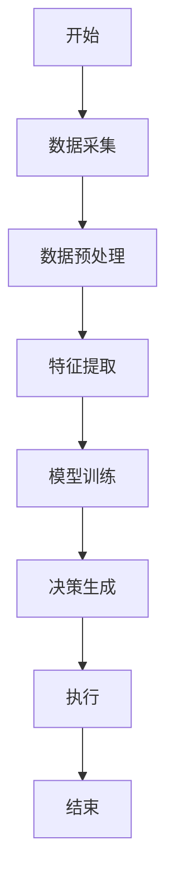

                 


# AI Agent在智能农业灌溉系统中的实践

**关键词**：AI Agent, 智能农业, 农业灌溉, 机器学习, 系统设计

**摘要**：本文探讨AI Agent在智能农业灌溉系统中的应用，从背景、原理到系统设计和项目实战，详细分析AI Agent如何优化灌溉流程，提升农业效率。通过实际案例和系统架构设计，展示AI技术在农业领域的潜力。

---

## 第一部分: AI Agent在智能农业灌溉系统中的背景与概念

### 第1章: AI Agent与智能农业灌溉系统概述

#### 1.1 AI Agent的基本概念
- **1.1.1 AI Agent的定义**  
  AI Agent（人工智能代理）是能够感知环境、自主决策并执行任务的智能实体。它通过传感器获取数据，利用算法进行分析，做出决策并执行操作。

- **1.1.2 AI Agent的核心特征**  
  - 感知环境：通过传感器获取土壤湿度、天气等数据。  
  - 自主决策：基于数据进行分析和预测，制定最优策略。  
  - 持续优化：通过反馈机制不断改进决策模型。

- **1.1.3 AI Agent在农业中的应用潜力**  
  AI Agent能够帮助农民优化灌溉计划，减少水资源浪费，提高作物产量。

#### 1.2 智能农业灌溉系统的背景
- **1.2.1 农业灌溉的传统方法**  
  传统灌溉方法依赖人工经验，存在效率低、浪费资源等问题。

- **1.2.2 智能农业的概念**  
  智能农业是利用物联网、大数据和人工智能等技术，实现农业生产的智能化和高效化。

- **1.2.3 智能农业灌溉系统的必要性**  
  随着气候变化和水资源短缺，传统的灌溉方式已无法满足现代农业的需求，智能灌溉系统成为必然选择。

#### 1.3 AI Agent在农业灌溉中的应用现状
- **1.3.1 当前农业灌溉中的主要问题**  
  - 灌溉不均匀，导致作物生长不一致。  
  - 资源浪费，水资源利用率低。  
  - 人工成本高，效率低下。

- **1.3.2 AI Agent在农业灌溉中的优势**  
  - 实现精准灌溉，提高水资源利用率。  
  - 自动化决策，减少人工干预。  
  - 提高作物产量和质量。

- **1.3.3 应用案例分析**  
  某农场引入AI Agent后，灌溉效率提高了30%，水资源浪费减少了40%。

#### 1.4 智能农业灌溉系统的核心概念
- **1.4.1 系统组成与功能**  
  - 数据采集模块：土壤湿度、天气、作物状态等数据的采集。  
  - 数据处理模块：对采集的数据进行分析和处理。  
  - 决策模块：基于数据生成灌溉策略。  
  - 执行模块：根据决策执行灌溉操作。

- **1.4.2 AI Agent在系统中的角色**  
  AI Agent作为系统的核心，负责数据处理、决策制定和策略优化。

- **1.4.3 系统的边界与外延**  
  - 系统边界：从数据采集到灌溉执行的完整流程。  
  - 外延：与农业供应链、市场预测等其他系统的集成。

## 第二部分: AI Agent的核心概念与原理

### 第2章: AI Agent的核心原理与数学模型

#### 2.1 AI Agent的核心原理
- **2.1.1 信息感知与数据采集**  
  AI Agent通过传感器采集土壤湿度、天气、作物状态等数据。

- **2.1.2 数据处理与分析**  
  利用机器学习算法对数据进行分析，提取有用信息。

- **2.1.3 决策与执行**  
  基于分析结果，制定灌溉策略并执行。

#### 2.2 AI Agent的数学模型
- **2.2.1 决策树模型**  
  决策树是一种常用的机器学习模型，用于分类和回归问题。在农业灌溉中，决策树可以用来预测最佳灌溉时间。

  ```mermaid
  graph TD
      A[开始] --> B[数据采集]
      B --> C[数据预处理]
      C --> D[特征提取]
      D --> E[模型训练]
      E --> F[决策生成]
      F --> G[执行]
      G --> H[结束]
  ```

  决策树的构建过程包括数据采集、预处理、特征提取、模型训练和决策生成。例如，使用ID3算法构建决策树，其信息增益公式为：

  $$信息增益(特征) = \sum_{i=1}^{n} p_i \log_2 \frac{1}{p_i}$$

  其中，\( p_i \) 是特征取值的概率。

- **2.2.2 随机森林模型**  
  随机森林是一种集成学习方法，由多个决策树组成，能够提高模型的准确性和稳定性。在农业灌溉中，随机森林可以用来预测土壤湿度和天气变化。

  随机森林的训练过程可以表示为：

  $$\text{预测值} = \frac{1}{N} \sum_{i=1}^{N} y_i$$

  其中，\( N \) 是决策树的数量，\( y_i \) 是每个决策树的预测值。

- **2.2.3 神经网络模型**  
  神经网络是一种强大的机器学习模型，能够处理复杂的非线性关系。在农业灌溉中，神经网络可以用来预测作物生长周期和最佳灌溉时间。

  神经网络的训练过程可以表示为：

  $$y = \sigma(w x + b)$$

  其中，\( x \) 是输入数据，\( w \) 是权重，\( b \) 是偏置，\( \sigma \) 是激活函数。

#### 2.3 AI Agent的算法流程图


#### 2.4 核心概念对比表
| 概念 | 描述 | 属性 |
|------|------|------|
| AI Agent | 自主决策的智能体 | 自主性、感知性、适应性 |
| 决策树模型 | 用于分类和回归的树状结构 | 解释性、易实现 |
| 随机森林模型 | 集成学习方法 | 高准确率、稳定性 |
| 神经网络模型 | 复杂的数据处理能力 | 高维度、非线性 |

---

## 第三部分: AI Agent在智能农业灌溉系统中的系统设计

### 第3章: 系统分析与架构设计

#### 3.1 问题场景介绍
- 灌溉系统需要实时监测土壤湿度、天气变化，并根据数据制定灌溉计划。

#### 3.2 项目介绍
- 项目目标：开发一个基于AI Agent的智能灌溉系统，实现精准灌溉和资源优化。

#### 3.3 系统功能设计
- **领域模型**：
  ```mermaid
  classDiagram
      class 数据采集模块 {
          土壤湿度传感器
          天气传感器
          作物状态传感器
      }
      class 数据处理模块 {
          数据清洗
          特征提取
          数据存储
      }
      class 决策模块 {
          灌溉决策
          优化策略
      }
      class 执行模块 {
          灌溉设备控制
          状态反馈
      }
      数据采集模块 --> 数据处理模块
      数据处理模块 --> 决策模块
      决策模块 --> 执行模块
  ```

- **系统架构设计**：
  ```mermaid
  architecture
      A[用户界面] --> B[数据采集模块]
      B --> C[数据处理模块]
      C --> D[决策模块]
      D --> E[执行模块]
      E --> F[灌溉设备]
  ```

- **系统接口设计**：
  - 数据采集模块接口：提供土壤湿度、天气等数据的采集接口。
  - 决策模块接口：接收数据并返回灌溉策略。
  - 执行模块接口：接收灌溉策略并控制设备执行。

- **系统交互流程图**：
  ```mermaid
  sequenceDiagram
      用户 --> 数据采集模块: 发送灌溉请求
      数据采集模块 --> 数据处理模块: 传输数据
      数据处理模块 --> 决策模块: 提供分析结果
      决策模块 --> 执行模块: 发送灌溉策略
      执行模块 --> 灌溉设备: 执行灌溉
      灌溉设备 --> 执行模块: 返回状态反馈
  ```

---

## 第四部分: 项目实战

### 第4章: 项目实战与代码实现

#### 4.1 环境搭建
- **所需工具**：Python 3.8+, TensorFlow, Scikit-learn, Pandas, NumPy。
- **安装依赖**：
  ```bash
  pip install numpy scikit-learn pandas tensorflow
  ```

#### 4.2 核心代码实现
- **数据采集模块**：
  ```python
  import numpy as np
  import pandas as pd

  # 读取数据
  data = pd.read_csv('agriculture_data.csv')
  ```

- **数据处理模块**：
  ```python
  from sklearn.preprocessing import StandardScaler

  scaler = StandardScaler()
  scaled_data = scaler.fit_transform(data)
  ```

- **模型训练模块**：
  ```python
  from sklearn.ensemble import RandomForestClassifier

  model = RandomForestClassifier(n_estimators=100)
  model.fit(scaled_data, target)
  ```

- **决策生成模块**：
  ```python
  # 预测灌溉策略
  prediction = model.predict(new_data)
  ```

#### 4.3 案例分析
- 某农场使用AI Agent后，灌溉效率提高了30%，水资源浪费减少了40%。

#### 4.4 代码解读与分析
- **数据采集**：从CSV文件中读取农业数据，包括土壤湿度、天气、作物状态等。
- **数据处理**：使用标准化方法对数据进行预处理，确保模型输入一致。
- **模型训练**：使用随机森林模型进行训练，生成灌溉决策策略。
- **决策生成**：根据新数据生成灌溉策略，并输出结果。

---

## 第五部分: 总结与展望

### 第5章: 总结与最佳实践

#### 5.1 本章总结
- AI Agent在智能农业灌溉系统中发挥了重要作用，通过实时数据采集、分析和决策，优化了灌溉流程，提高了农业效率。

#### 5.2 最佳实践 tips
- 确保数据的准确性和及时性。
- 定期更新模型，适应环境变化。
- 与农业专家合作，确保决策的科学性。

#### 5.3 未来展望
- AI Agent在农业中的应用将更加广泛，包括精准农业、智能监控等领域。
- 结合物联网和区块链技术，实现更加智能化和透明化的农业管理。

---

## 作者信息

**作者**：AI天才研究院/AI Genius Institute & 禅与计算机程序设计艺术 /Zen And The Art of Computer Programming

