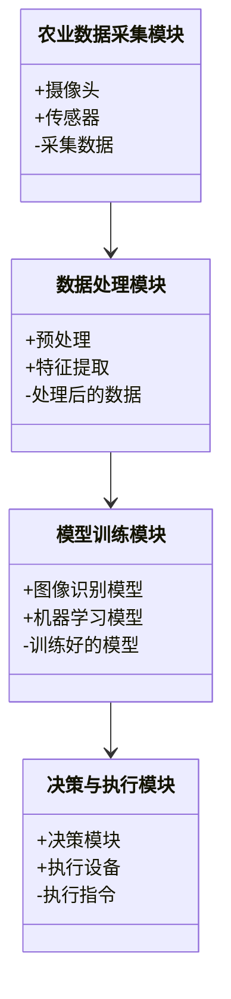
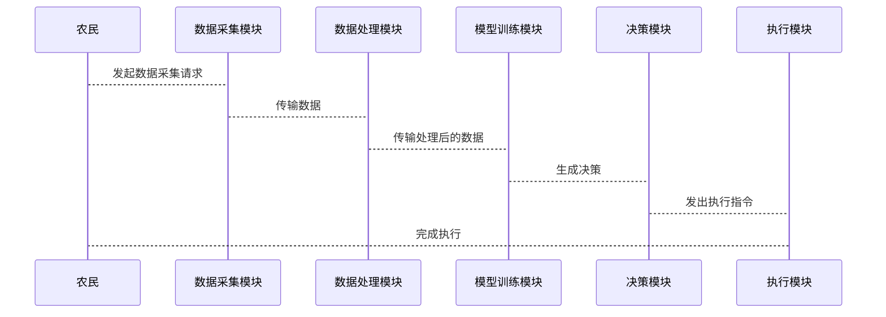

                 


# AI Agent在智能农业病虫害防控中的实践

---

## 关键词

AI Agent, 智能农业, 病虫害防控, 机器学习, 农业数据, 农业系统架构

---

## 摘要

本文探讨AI Agent在智能农业病虫害防控中的实践应用，从背景、核心概念、算法原理到系统架构设计，再到项目实战，全面分析AI Agent如何通过感知、决策、执行模块实现精准的病虫害防控。文章结合实际案例，详细阐述了AI Agent在农业数据采集、分析与决策中的技术细节，同时提供了系统设计的完整方案。

---

# 第一部分: AI Agent在智能农业病虫害防控中的背景与概述

## 第1章: AI Agent与智能农业概述

### 1.1 AI Agent的基本概念

#### 1.1.1 AI Agent的定义与特点

AI Agent（人工智能代理）是指能够感知环境、自主决策并执行任务的智能体。其特点包括：

- **自主性**：能够自主决策，无需外部干预。
- **反应性**：能够实时感知环境并做出反应。
- **学习能力**：能够通过数据学习和优化决策模型。
- **适应性**：能够适应不同环境和场景。

#### 1.1.2 AI Agent在智能农业中的应用领域

AI Agent在农业中的应用领域广泛，包括：

- **病虫害监测**：通过图像识别和数据采集，实时监测病虫害的发生。
- **精准施药**：基于病虫害数据，制定精准的施药方案。
- **作物生长监测**：通过传感器数据，监测作物生长状况。

#### 1.1.3 AI Agent与传统农业技术的对比

传统农业技术依赖人工经验，效率低且精度差。AI Agent通过智能化手段，显著提高了病虫害防控的效率和准确性。

---

### 1.2 智能农业病虫害防控的背景与挑战

#### 1.2.1 病虫害防控的传统方法与局限性

传统病虫害防控方法包括人工巡检和化学防治，存在以下问题：

- **效率低下**：人工巡检耗时耗力。
- **成本高昂**：大面积种植需要大量的人力和物力。
- **精准度低**：化学防治可能对非目标对象造成伤害。

#### 1.2.2 智能农业的发展趋势

智能农业通过物联网、大数据和人工智能技术，实现农业生产的智能化和高效化。AI Agent作为智能农业的核心技术之一，正在得到广泛应用。

#### 1.2.3 AI Agent在病虫害防控中的优势

AI Agent的优势包括：

- **高效性**：能够快速处理大量数据，提供实时决策。
- **精准性**：通过数据驱动的决策模型，实现精准施药。
- **可持续性**：减少化学防治的使用，降低对环境的污染。

---

## 第2章: AI Agent在农业病虫害防控中的核心原理

### 2.1 AI Agent的核心概念与工作原理

#### 2.1.1 AI Agent的感知模块

感知模块负责采集农业环境中的数据，包括：

- **图像数据**：通过摄像头采集作物和病虫害的图像。
- **传感器数据**：通过温度、湿度等传感器采集环境数据。

#### 2.1.2 AI Agent的决策模块

决策模块基于感知模块获取的数据，通过机器学习模型进行分析和预测，生成防控方案。

#### 2.1.3 AI Agent的执行模块

执行模块根据决策模块生成的方案，执行具体的防控任务，例如喷洒农药。

---

### 2.2 AI Agent与农业数据的关系

#### 2.2.1 农业数据的采集与处理

农业数据的采集包括图像数据、传感器数据等，需要进行预处理和特征提取。

#### 2.2.2 数据驱动的AI Agent决策机制

通过机器学习模型，AI Agent能够基于历史数据和实时数据，预测病虫害的发生概率。

#### 2.2.3 数据可视化与决策支持

通过数据可视化技术，AI Agent能够将数据以直观的方式呈现，帮助农民做出决策。

---

# 第二部分: AI Agent的核心概念与联系

## 第3章: AI Agent的核心概念与联系

### 3.1 AI Agent的核心概念

#### 3.1.1 感知模块的核心算法

感知模块的核心算法包括图像识别和传感器数据处理算法。例如，使用卷积神经网络（CNN）进行图像识别。

#### 3.1.2 决策模块的数学模型

决策模块的数学模型包括决策树、随机森林等机器学习模型。

#### 3.1.3 执行模块的实现方式

执行模块的实现方式包括自动化设备的控制，例如无人机喷洒农药。

---

### 3.2 AI Agent与农业数据的关系

#### 3.2.1 数据驱动的AI Agent决策机制

通过机器学习模型，AI Agent能够基于历史数据和实时数据，预测病虫害的发生概率。

#### 3.2.2 数据可视化与决策支持

通过数据可视化技术，AI Agent能够将数据以直观的方式呈现，帮助农民做出决策。

---

# 第三部分: AI Agent的算法原理

## 第4章: AI Agent的算法原理

### 4.1 算法原理概述

AI Agent的核心算法包括感知模块的图像识别算法和决策模块的机器学习算法。

---

### 4.2 图像识别算法

#### 4.2.1 图像识别算法的流程

1. 数据采集：通过摄像头采集图像。
2. 数据预处理：对图像进行增强和归一化处理。
3. 特征提取：提取图像中的特征，例如颜色、纹理等。
4. 分类器训练：使用CNN等算法训练分类器。
5. 图像分类：对病虫害图像进行分类。

#### 4.2.2 图像识别算法的实现代码

```python
import tensorflow as tf
from tensorflow.keras import layers

# 定义卷积神经网络模型
model = tf.keras.Sequential([
    layers.Conv2D(32, (3,3), activation='relu', input_shape=(224, 224, 3)),
    layers.MaxPooling2D((2,2)),
    layers.Conv2D(64, (3,3), activation='relu'),
    layers.MaxPooling2D((2,2)),
    layers.Flatten(),
    layers.Dense(128, activation='relu'),
    layers.Dense(2, activation='softmax')
])

# 编译模型
model.compile(optimizer='adam', loss='sparse_categorical_crossentropy', metrics=['accuracy'])
```

#### 4.2.3 图像识别算法的数学模型

卷积神经网络（CNN）的数学模型如下：

$$
y = f(Wx + b)
$$

其中，$W$是权重矩阵，$x$是输入向量，$b$是偏置项，$f$是激活函数。

---

### 4.3 机器学习算法

#### 4.3.1 机器学习算法的流程

1. 数据采集：采集病虫害数据。
2. 数据预处理：清洗和归一化数据。
3. 特征提取：提取数据中的特征。
4. 模型训练：使用随机森林等算法训练模型。
5. 模型预测：对病虫害进行预测。

#### 4.3.2 机器学习算法的实现代码

```python
from sklearn.ensemble import RandomForestClassifier

# 训练随机森林模型
model = RandomForestClassifier(n_estimators=100)
model.fit(X_train, y_train)

# 预测病虫害
y_pred = model.predict(X_test)
```

#### 4.3.3 机器学习算法的数学模型

随机森林的数学模型如下：

$$
y = \sum_{i=1}^{n} f_i(x)
$$

其中，$f_i$是决策树模型，$x$是输入向量。

---

# 第四部分: 系统分析与架构设计

## 第5章: 系统分析与架构设计

### 5.1 问题场景介绍

病虫害防控的场景包括：

- **数据采集**：通过摄像头和传感器采集数据。
- **数据处理**：对数据进行预处理和特征提取。
- **模型训练**：训练图像识别和机器学习模型。
- **决策与执行**：根据模型预测结果执行防控任务。

---

### 5.2 系统功能设计

#### 5.2.1 领域模型设计



---

### 5.3 系统架构设计


---

### 5.4 系统接口设计

系统接口包括：

- **数据接口**：与摄像头和传感器的数据接口。
- **模型接口**：与机器学习模型的接口。
- **执行接口**：与执行设备的接口。

---

### 5.5 系统交互设计



---

# 第五部分: 项目实战

## 第6章: 项目实战

### 6.1 环境搭建

#### 6.1.1 系统环境

- **操作系统**：Linux或Windows。
- **开发工具**：Python、Jupyter Notebook。
- **硬件设备**：摄像头、传感器。

#### 6.1.2 软件环境

- **Python库**：TensorFlow、Scikit-learn、OpenCV。
- **开发框架**：Flask或Django。

---

### 6.2 系统核心实现源代码

#### 6.2.1 数据采集代码

```python
import cv2

# 采集图像
cap = cv2.VideoCapture(0)
while True:
    ret, frame = cap.read()
    cv2.imshow('Camera', frame)
    if cv2.waitKey(1) & 0xFF == ord('q'):
        break
cap.release()
cv2.destroyAllWindows()
```

#### 6.2.2 数据处理代码

```python
import numpy as np

# 数据归一化
def normalize(data):
    return (data - np.mean(data)) / np.std(data)
```

#### 6.2.3 模型训练代码

```python
from sklearn.model_selection import train_test_split
from sklearn.metrics import accuracy_score

# 分割数据集
X_train, X_test, y_train, y_test = train_test_split(X, y, test_size=0.2)

# 训练随机森林模型
model = RandomForestClassifier(n_estimators=100)
model.fit(X_train, y_train)

# 评估模型
y_pred = model.predict(X_test)
print("Accuracy:", accuracy_score(y_test, y_pred))
```

---

### 6.3 代码应用解读与分析

通过上述代码，我们可以实现病虫害图像的采集、数据的预处理和模型的训练。图像识别模型能够识别病虫害的种类，机器学习模型能够预测病虫害的发生概率。

---

### 6.4 实际案例分析

以水稻病虫害监测为例，通过图像识别模型识别稻飞虱和稻纵卷叶螟，通过机器学习模型预测病虫害的发生概率，并制定精准的施药方案。

---

### 6.5 项目小结

通过本项目的实施，我们可以看到AI Agent在病虫害防控中的巨大潜力。未来可以通过进一步优化算法和增加更多的传感器数据，进一步提高AI Agent的准确性和效率。

---

# 第六部分: 总结与展望

## 第7章: 总结与展望

### 7.1 项目总结

本文详细探讨了AI Agent在智能农业病虫害防控中的实践应用，从背景、核心概念、算法原理到系统架构设计，再到项目实战，全面分析了AI Agent在病虫害防控中的应用。

### 7.2 未来展望

未来，AI Agent在智能农业中的应用将更加广泛，包括更多的农业场景和更复杂的算法模型。同时，随着物联网和5G技术的发展，AI Agent将更加智能化和高效化。

---

## 第8章: 最佳实践与注意事项

### 8.1 最佳实践

- **数据质量**：确保数据的准确性和完整性。
- **算法选择**：根据具体场景选择合适的算法。
- **系统架构**：设计合理的系统架构，确保系统的稳定性和可扩展性。

### 8.2 注意事项

- **数据隐私**：注意数据的隐私保护。
- **系统安全**：确保系统的安全性，防止数据泄露。
- **环境适应性**：确保系统在不同环境下的适应性。

---

## 第9章: 拓展阅读与学习资源

### 9.1 拓展阅读

- 《Machine Learning: A Probabilistic Perspective》
- 《Deep Learning》
- 《AI in Agriculture: A Comprehensive Review》

### 9.2 学习资源

- **在线课程**：Coursera上的《机器学习》课程。
- **工具与库**：TensorFlow、Scikit-learn。
- **社区与论坛**：Stack Overflow、Reddit。

---

# 附录

## 附录A: 项目代码

完整的项目代码可以在GitHub上找到：[AI Agent in Agricultural Pest Control](https://github.com/aiagent-agriculture/pest-control)

---

## 附录B: 工具与资源

- **开发工具**：Jupyter Notebook。
- **数据集**：公开的农业病虫害数据集。
- **参考文献**：相关学术论文和书籍。

---

## 作者

作者：AI天才研究院/AI Genius Institute & 禅与计算机程序设计艺术 /Zen And The Art of Computer Programming

---

** END **

