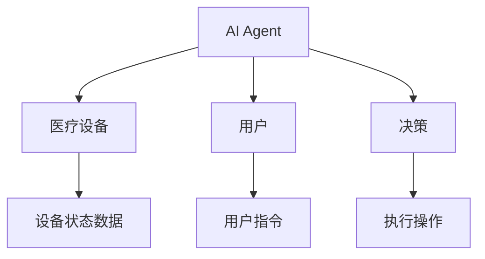
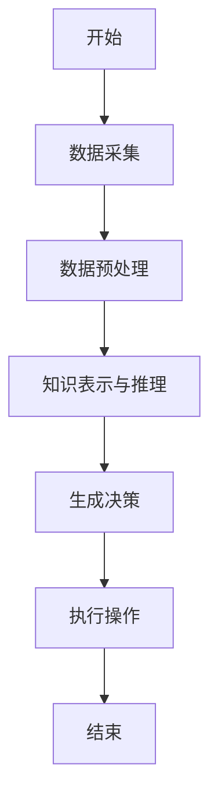
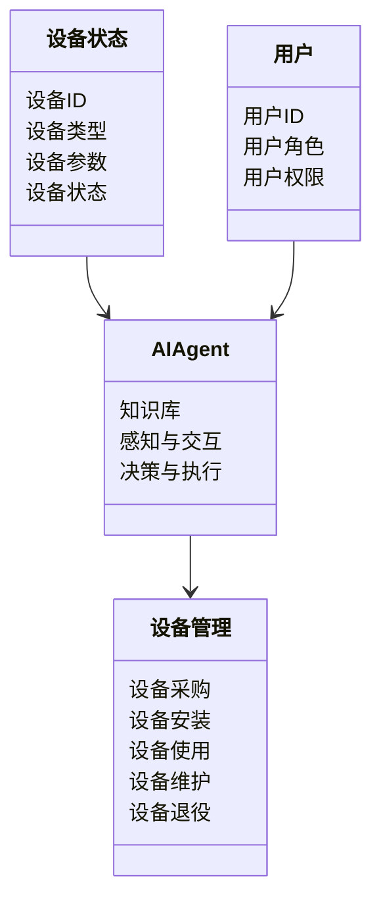
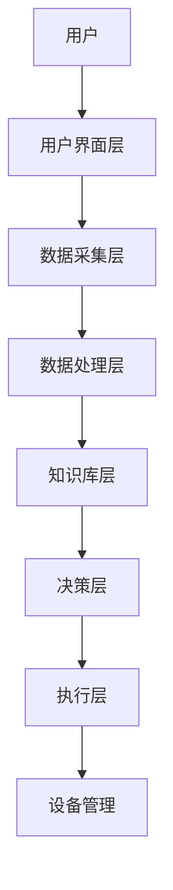
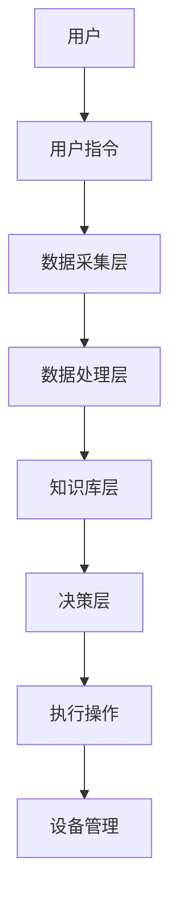

                 


# AI Agent在智能医疗设备管理中的角色

> 关键词：AI Agent, 智能医疗设备, 医疗设备管理, 人工智能, 系统架构设计

> 摘要：本文深入探讨了AI Agent在智能医疗设备管理中的角色与应用。从AI Agent的基本概念到其在医疗设备管理中的具体应用，结合算法原理、系统架构设计和项目实战，全面解析了AI Agent在智能医疗设备管理中的核心价值与实现路径。

---

# 第一部分: AI Agent与智能医疗设备管理的背景与概念

## 第1章: AI Agent与智能医疗设备管理的背景介绍

### 1.1 AI Agent的基本概念

#### 1.1.1 AI Agent的定义与特点
AI Agent（人工智能代理）是指能够感知环境、自主决策并执行任务的智能体。它具备以下特点：
- **自主性**：能够自主决策，无需外部干预。
- **反应性**：能够实时感知环境并做出反应。
- **学习能力**：通过数据和经验不断优化自身性能。
- **可扩展性**：能够适应不同场景和任务需求。

#### 1.1.2 AI Agent的核心模块与功能
AI Agent的核心模块包括：
1. **知识库模块**：存储医疗设备的相关知识，如设备类型、参数、操作流程等。
2. **感知与交互模块**：通过传感器或API获取医疗设备的状态数据，并与用户进行交互。
3. **决策与执行模块**：基于感知数据和知识库，生成决策并执行操作。

#### 1.1.3 AI Agent在医疗设备管理中的应用背景
随着医疗设备的智能化和复杂化，传统的设备管理模式已难以满足需求。AI Agent的引入能够显著提升设备管理的效率和准确性，例如：
- **设备状态监控**：实时监测设备运行状态，预测设备故障。
- **资源优化配置**：根据医院需求智能分配设备资源。
- **异常事件处理**：快速响应设备故障或异常情况。

### 1.2 智能医疗设备管理的现状与挑战

#### 1.2.1 智能医疗设备的定义与分类
智能医疗设备是指集成传感器、数据处理和通信技术，能够实现远程监控和智能管理的医疗设备。常见的智能医疗设备包括：
- **智能监护设备**：如智能血压计、心率监测仪。
- **智能手术设备**：如智能手术机器人。
- **智能诊断设备**：如智能X光机、MRI设备。

#### 1.2.2 医疗设备管理的痛点与难点
目前医疗设备管理面临以下问题：
1. **设备状态难以实时监控**：设备故障往往无法及时发现，导致停机时间长。
2. **设备资源分配不合理**：设备使用率低，资源浪费严重。
3. **管理效率低下**：设备维护和管理需要大量人工操作，效率低下。

#### 1.2.3 AI Agent在医疗设备管理中的潜在价值
AI Agent能够通过智能化手段解决上述问题，具体表现为：
- **实时监控与预警**：AI Agent能够实时分析设备数据，提前发现潜在故障。
- **智能调度与优化**：基于历史数据和实时需求，优化设备资源分配。
- **快速响应与决策**：在设备出现故障时，AI Agent能够快速生成解决方案，减少停机时间。

### 1.3 AI Agent与智能医疗设备管理的结合

#### 1.3.1 AI Agent在医疗设备管理中的应用场景
AI Agent在医疗设备管理中的应用场景包括：
1. **设备状态监控**：实时采集设备数据，分析设备运行状态。
2. **故障预测与诊断**：基于历史数据和机器学习模型，预测设备故障并提供诊断建议。
3. **资源优化配置**：根据医院需求和设备状态，智能分配设备资源。
4. **异常事件处理**：在设备出现异常时，快速响应并采取措施。

#### 1.3.2 AI Agent与医疗设备管理的协同机制
AI Agent与医疗设备管理的协同机制包括：
- **数据采集与传输**：设备传感器采集数据并传输给AI Agent。
- **数据分析与决策**：AI Agent分析数据，生成决策并反馈给设备或相关人员。
- **人机交互**：用户与AI Agent进行交互，获取信息或操作指导。

#### 1.3.3 AI Agent在智能医疗设备管理中的核心价值
AI Agent的核心价值体现在：
1. **提升管理效率**：通过自动化和智能化手段，显著提高设备管理效率。
2. **降低运营成本**：通过故障预测和资源优化，降低设备维护和运营成本。
3. **提高设备可用性**：通过实时监控和快速响应，减少设备停机时间，提高设备可用性。

### 1.4 本章小结
本章介绍了AI Agent的基本概念、核心模块与功能，并探讨了AI Agent在智能医疗设备管理中的应用背景和潜在价值。通过分析医疗设备管理的痛点与难点，阐述了AI Agent在解决这些问题中的重要作用。

---

## 第2章: AI Agent的核心概念与原理

### 2.1 AI Agent的核心模块

#### 2.1.1 知识库模块
知识库模块是AI Agent的核心模块之一，存储与医疗设备相关的知识，包括：
- **设备类型**：如X光机、MRI设备等。
- **设备参数**：如工作电压、功率、运行参数等。
- **操作流程**：如设备启动、关闭、维护流程等。
- **故障诊断知识**：如常见故障原因、解决方法等。

#### 2.1.2 感知与交互模块
感知与交互模块负责与医疗设备和用户进行交互，包括：
- **数据采集**：通过传感器或API获取设备的状态数据。
- **用户交互**：通过图形界面或语音交互与用户进行信息传递。
- **环境感知**：感知设备所处环境的变化，如温度、湿度等。

#### 2.1.3 决策与执行模块
决策与执行模块负责基于感知数据和知识库生成决策并执行操作，包括：
- **数据分析与推理**：对设备数据进行分析，推理出设备的健康状态。
- **决策生成**：基于分析结果生成决策，如设备维护建议、故障修复方案等。
- **执行操作**：通过API或控制接口执行决策操作，如启动设备维护、调整设备参数等。

### 2.2 AI Agent的工作原理

#### 2.2.1 数据采集与处理
AI Agent通过传感器或API获取医疗设备的状态数据，如设备运行参数、故障代码等。数据采集后，需要进行预处理，如数据清洗、特征提取等。

#### 2.2.2 知识表示与推理
知识库中的知识通过知识图谱的形式进行表示，如设备类型、设备参数、操作流程等。推理过程基于规则推理或机器学习模型，如决策树、随机森林等。

#### 2.2.3 决策与执行
基于推理结果，AI Agent生成决策并执行操作，如发出维护通知、调整设备参数、关闭设备等。

### 2.3 AI Agent的算法原理

#### 2.3.1 机器学习算法
机器学习算法是AI Agent的核心算法之一，包括：
- **监督学习**：如线性回归、支持向量机（SVM）。
- **无监督学习**：如聚类分析、主成分分析（PCA）。
- **深度学习**：如卷积神经网络（CNN）、循环神经网络（RNN）。

#### 2.3.2 自然语言处理算法
自然语言处理算法用于处理用户输入的自然语言指令，如意图识别、实体抽取等。常用的算法包括：
- **词袋模型（Bag-of-Words）**
- **TF-IDF（Term Frequency-Inverse Document Frequency）**
- **BERT（Bidirectional Encoder Representations from Transformers）**

#### 2.3.3 决策树与强化学习算法
决策树和强化学习算法用于生成决策策略，如设备维护计划、故障修复方案等。常用的算法包括：
- **ID3、C4.5、CART算法**
- **Q-Learning、Deep Q-Learning等强化学习算法**

### 2.4 本章小结
本章详细介绍了AI Agent的核心模块和工作原理，并重点讲解了AI Agent中常用的机器学习、自然语言处理和强化学习算法。这些算法为AI Agent的智能化决策提供了理论基础和技术支持。

---

## 第3章: AI Agent与医疗设备管理的核心概念与联系

### 3.1 医疗设备管理的领域模型

#### 3.1.1 医疗设备的分类与属性
医疗设备可以根据功能和用途进行分类，如诊断设备、治疗设备、监护设备等。每个设备都有其独特的属性，如设备类型、设备参数、设备状态等。

#### 3.1.2 医疗设备管理的流程与环节
医疗设备管理的流程包括：
1. **设备采购**：根据医院需求采购合适的设备。
2. **设备安装**：设备的安装和调试。
3. **设备使用**：设备的日常使用和维护。
4. **设备维护**：设备的定期维护和故障修复。
5. **设备退役**：设备的报废和更换。

#### 3.1.3 医疗设备管理的系统架构
医疗设备管理系统的系统架构包括：
- **数据采集层**：设备传感器和数据接口。
- **数据处理层**：数据清洗、特征提取。
- **知识库层**：存储设备知识和历史数据。
- **决策层**：生成决策并执行操作。
- **用户界面层**：与用户进行交互。

### 3.2 AI Agent在医疗设备管理中的角色定位

#### 3.2.1 AI Agent作为决策支持系统
AI Agent可以通过分析设备数据和历史数据，生成设备维护建议、故障诊断报告等，帮助医院管理人员做出决策。

#### 3.2.2 AI Agent作为智能交互界面
AI Agent可以通过图形界面或语音交互与用户进行信息传递，提供设备状态查询、操作指导等服务。

#### 3.2.3 AI Agent作为设备管理的优化工具
AI Agent可以通过优化算法，如遗传算法、模拟退火算法等，优化设备资源分配，提高设备使用效率。

### 3.3 AI Agent与医疗设备管理的实体关系图

#### 3.3.1 实体关系图的构建
以下是AI Agent与医疗设备管理的实体关系图：



#### 3.3.2 实体关系图的分析
AI Agent与医疗设备管理的实体关系图展示了AI Agent在医疗设备管理中的核心作用。AI Agent通过与医疗设备、用户交互，获取设备状态数据和用户指令，生成决策并执行操作。

### 3.4 本章小结
本章探讨了AI Agent在医疗设备管理中的角色定位，并通过实体关系图展示了AI Agent与医疗设备、用户之间的关系。AI Agent作为决策支持系统、智能交互界面和优化工具，能够显著提升医疗设备管理的效率和效果。

---

## 第4章: AI Agent的算法原理与数学模型

### 4.1 AI Agent的核心算法

#### 4.1.1 机器学习算法
机器学习算法是AI Agent的核心算法之一，以下是常用的机器学习算法及其数学表达：

1. **线性回归**：
   - 损失函数：$$L = \frac{1}{2n}\sum_{i=1}^{n}(y_i - \hat{y}_i)^2$$
   - 参数更新：$$w = w - \eta \frac{\partial L}{\partial w}$$

2. **支持向量机（SVM）**：
   - 分类函数：$$f(x) = \text{sign}(w \cdot x + b)$$
   - 软间隔损失函数：$$L = \sum_{i=1}^{n} \max(0, 1 - y_i(w \cdot x_i + b))$$

#### 4.1.2 自然语言处理算法
自然语言处理算法用于处理用户输入的自然语言指令，以下是常用的自然语言处理算法及其数学表达：

1. **词袋模型（Bag-of-Words）**：
   - 向量表示：$$v = [w_1, w_2, ..., w_n]$$
   - 其中，$$w_i$$ 是第i个词的权重。

2. **TF-IDF（Term Frequency-Inverse Document Frequency）**：
   - TF计算：$$\text{TF}(t, d) = \frac{\text{count}(t, d)}{\text{length}(d)}$$
   - IDF计算：$$\text{IDF}(t) = \log\left(\frac{N}{\text{count}(t)}\right)$$

3. **BERT模型**：
   - 输入表示：$$\text{Input} = \text{CLS} + \text{Segment} + \text{Tokens}$$
   - 输出表示：$$\text{Output} = [a_1, a_2, ..., a_n]$$

#### 4.1.3 决策树与强化学习算法
决策树和强化学习算法用于生成决策策略，以下是常用的算法及其数学表达：

1. **决策树（CART）**：
   - 内部节点：特征分割条件。
   - 叶节点：类别标签或数值预测。

2. **Q-Learning**：
   - 状态值函数：$$Q(s, a) = r + \gamma \max_{a'} Q(s', a')$$
   - 动作选择：$$a = \arg\max Q(s, a)$$

### 4.2 AI Agent的数学模型

#### 4.2.1 机器学习模型的数学表达
以下是常用的机器学习模型的数学表达：

1. **线性回归**：
   - 预测值：$$\hat{y} = w x + b$$
   - 损失函数：$$L = \frac{1}{2n}\sum_{i=1}^{n}(y_i - \hat{y}_i)^2$$

2. **逻辑回归**：
   - 预测概率：$$P(y=1|x) = \sigma(w x + b)$$
   - 损失函数：$$L = -\frac{1}{n}\sum_{i=1}^{n}(y_i \log p_i + (1 - y_i)\log(1 - p_i))$$
   - 其中，$$\sigma(x) = \frac{1}{1 + e^{-x}}$$

#### 4.2.2 自然语言处理模型的数学表达
以下是常用的自然语言处理模型的数学表达：

1. **词袋模型**：
   - 向量表示：$$v = [w_1, w_2, ..., w_n]$$

2. **TF-IDF**：
   - TF-IDF值：$$\text{TF-IDF}(t, d) = \text{TF}(t, d) \times \text{IDF}(t)$$

3. **BERT模型**：
   - 输入嵌入：$$\text{Input} = \text{CLS} + \text{Segment} + \text{Tokens}$$
   - 输出嵌入：$$\text{Output} = [a_1, a_2, ..., a_n]$$

#### 4.2.3 决策树与强化学习模型的数学表达
以下是常用的决策树与强化学习模型的数学表达：

1. **决策树（CART）**：
   - 内部节点：特征分割条件。
   - 叶节点：类别标签或数值预测。

2. **Q-Learning**：
   - 状态值函数：$$Q(s, a) = r + \gamma \max_{a'} Q(s', a')$$
   - 动作选择：$$a = \arg\max Q(s, a)$$

### 4.3 算法流程图

#### 4.3.1 AI Agent的算法流程图
以下是AI Agent的算法流程图：



#### 4.3.2 算法流程图的详细说明
AI Agent的算法流程图展示了从数据采集到执行操作的整个流程。数据采集后需要进行预处理，然后通过知识表示与推理生成决策，最后执行操作并结束流程。

### 4.4 本章小结
本章详细讲解了AI Agent的核心算法及其数学模型，包括机器学习算法、自然语言处理算法和强化学习算法。这些算法为AI Agent的智能化决策提供了理论基础和技术支持。

---

## 第5章: AI Agent在医疗设备管理中的系统分析与架构设计

### 5.1 系统分析

#### 5.1.1 问题场景介绍
医疗设备管理的难点在于设备状态难以实时监控、资源分配不合理以及管理效率低下。AI Agent可以通过智能化手段解决这些问题。

#### 5.1.2 项目介绍
本项目旨在开发一个基于AI Agent的智能医疗设备管理系统，实现设备状态监控、故障预测、资源优化配置等功能。

### 5.2 系统功能设计

#### 5.2.1 领域模型设计
以下是医疗设备管理的领域模型：



#### 5.2.2 系统功能模块
系统功能模块包括：
1. **设备状态监控**：实时监测设备运行状态，预警设备故障。
2. **故障诊断与修复**：基于历史数据和机器学习模型，诊断设备故障并生成修复方案。
3. **资源优化配置**：根据医院需求和设备状态，智能分配设备资源。
4. **用户交互与反馈**：通过图形界面或语音交互与用户进行信息传递，获取用户反馈。

### 5.3 系统架构设计

#### 5.3.1 系统架构设计
以下是系统的架构设计：



#### 5.3.2 系统接口设计
系统接口设计包括：
- **用户接口**：图形界面或语音交互。
- **设备接口**：设备传感器和API接口。
- **数据接口**：数据存储和传输接口。

#### 5.3.3 系统交互流程
以下是系统交互流程图：



### 5.4 本章小结
本章通过对医疗设备管理系统的分析，设计了系统的功能模块、架构和接口。系统架构设计为后续的项目实现提供了理论基础。

---

## 第6章: AI Agent在医疗设备管理中的项目实战

### 6.1 环境安装

#### 6.1.1 开发环境
开发环境包括：
- **操作系统**：Windows 10或更高版本，或Linux系统。
- **Python版本**：Python 3.6或更高版本。
- **开发工具**：PyCharm、VS Code等。
- **依赖库**：numpy、pandas、scikit-learn、tensorflow、pytorch等。

#### 6.1.2 项目安装
安装步骤如下：
1. 创建虚拟环境：```bash
    python -m venv venv
    source venv/bin/activate  # 在Linux或macOS中
    venv\Scripts\activate  # 在Windows中
    ```
2. 安装依赖库：```bash
    pip install numpy pandas scikit-learn tensorflow
    ```

### 6.2 系统核心实现源代码

#### 6.2.1 数据采集与预处理
以下是数据采集与预处理的代码示例：

```python
import pandas as pd
import numpy as np

# 数据采集
data = pd.read_csv('medical_device_data.csv')

# 数据预处理
data_clean = data.dropna()
data_clean = data_clean.drop_duplicates()
data_clean['timestamp'] = pd.to_datetime(data_clean['timestamp'])
data_clean.set_index('timestamp', inplace=True)
```

#### 6.2.2 知识库构建
以下是知识库构建的代码示例：

```python
from sklearn.feature_extraction.text import TfidfVectorizer

# 文本数据预处理
text = "This is an example text."

# TF-IDF特征提取
vectorizer = TfidfVectorizer()
tfidf = vectorizer.fit_transform([text])
feature_names = vectorizer.get_feature_names_out()
```

#### 6.2.3 决策模型实现
以下是决策模型实现的代码示例：

```python
from sklearn.tree import DecisionTreeClassifier

# 训练数据
X = [[1, 1], [1, 0], [0, 1], [0, 0]]
y = [0, 1, 1, 0]

# 训练决策树模型
model = DecisionTreeClassifier()
model.fit(X, y)

# 预测
print(model.predict([[1, 1]]))
```

### 6.3 代码应用解读与分析

#### 6.3.1 数据采集与预处理
数据采集与预处理是系统实现的基础，通过读取CSV文件并进行数据清洗，确保数据的完整性和准确性。

#### 6.3.2 知识库构建
知识库构建通过TF-IDF算法提取文本特征，为AI Agent的知识表示与推理提供支持。

#### 6.3.3 决策模型实现
决策树模型用于生成决策策略，通过训练数据生成决策树，并进行预测。

### 6.4 实际案例分析与详细讲解

#### 6.4.1 案例背景
某医院需要对智能血压计进行状态监控和故障预测。

#### 6.4.2 数据采集与分析
通过传感器采集血压计的运行数据，包括设备ID、设备类型、设备参数等。

#### 6.4.3 知识库构建与决策生成
基于历史数据构建知识库，训练决策树模型，生成设备维护建议和故障诊断报告。

#### 6.4.4 系统实现与优化
通过代码实现数据采集、知识库构建和决策生成，并进行系统优化，提高系统的运行效率和准确率。

### 6.5 本章小结
本章通过实际案例分析，详细讲解了AI Agent在医疗设备管理中的项目实战。通过代码实现和系统优化，展示了AI Agent在智能医疗设备管理中的实际应用价值。

---

## 第7章: 总结与展望

### 7.1 本章小结
本文深入探讨了AI Agent在智能医疗设备管理中的角色与应用，从AI Agent的基本概念到其在医疗设备管理中的具体应用，结合算法原理、系统架构设计和项目实战，全面解析了AI Agent在智能医疗设备管理中的核心价值与实现路径。

### 7.2 未来的发展方向
未来，AI Agent在智能医疗设备管理中的应用将更加广泛和深入，主要发展方向包括：
1. **多模态数据融合**：结合图像、文本、语音等多种数据源，提高系统的感知能力。
2. **强化学习的应用**：通过强化学习算法，进一步优化设备管理的决策策略。
3. **边缘计算与雾计算**：在边缘和雾计算环境下，提高系统的实时性和响应速度。
4. **人机协作**：通过人机协作，实现更高效的设备管理和维护。

### 7.3 最佳实践 tips
- **数据质量管理**：确保数据的完整性和准确性，是AI Agent实现智能管理的基础。
- **系统安全性**：医疗设备管理系统的安全性至关重要，需采取严格的安全措施。
- **用户友好性**：用户界面设计应简洁直观，方便用户操作和交互。

### 7.4 注意事项
- **数据隐私保护**：医疗设备数据涉及患者隐私，需严格遵守相关法律法规。
- **系统可靠性**：医疗设备管理系统的可靠性直接关系到医疗质量和患者安全。
- **技术可行性**：在实际应用中，需充分考虑技术可行性，避免过度依赖AI技术。

### 7.5 拓展阅读
- **《机器学习实战》**：深入讲解机器学习算法的实现与应用。
- **《深度学习》**：全面介绍深度学习的理论与实践。
- **《自然语言处理实战》**：详细讲解自然语言处理技术的实现与应用。

---

# 作者：AI天才研究院/AI Genius Institute & 禅与计算机程序设计艺术 /Zen And The Art of Computer Programming

