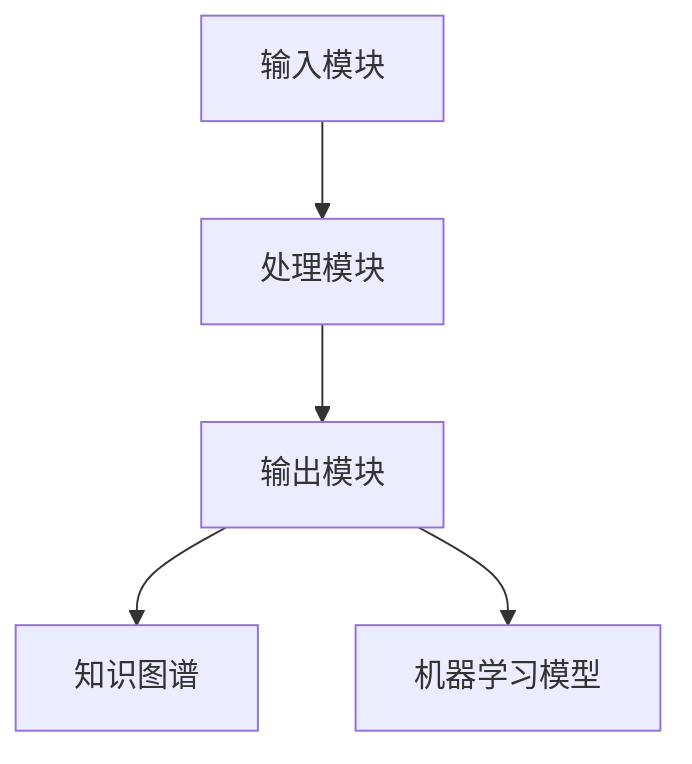
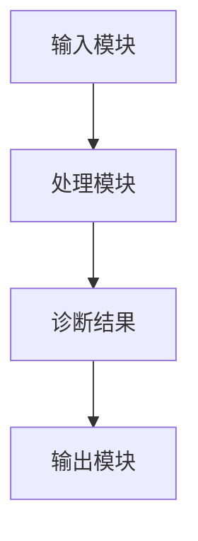
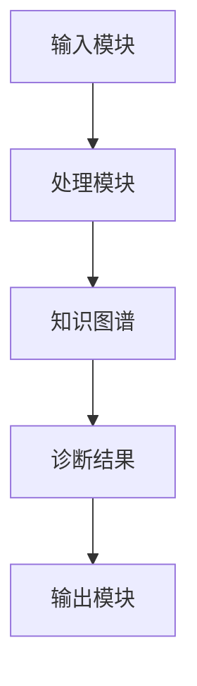

                 


# AI Agent在智能医疗诊断中的突破

> 关键词：AI Agent，智能医疗，诊断算法，知识图谱，医疗系统架构

> 摘要：随着人工智能技术的快速发展，AI Agent在智能医疗诊断中的应用越来越广泛。本文将深入探讨AI Agent的核心概念、算法原理、系统架构设计以及项目实战，全面解析AI Agent如何在医疗诊断中实现突破。

---

# 第1章: AI Agent与智能医疗诊断的背景

## 1.1 AI Agent的基本概念

### 1.1.1 什么是AI Agent
AI Agent（人工智能代理）是一种能够感知环境、执行任务并做出决策的智能实体。它通过传感器获取信息，利用算法处理信息，并通过执行器与环境交互。

### 1.1.2 AI Agent的核心特征
- **自主性**：AI Agent能够自主决策，无需外部干预。
- **反应性**：能够实时感知环境并做出反应。
- **学习能力**：通过数据和经验不断优化自身性能。

### 1.1.3 AI Agent与传统医疗诊断的区别
| 特性         | AI Agent诊断 | 传统诊断 |
|--------------|--------------|----------|
| 决策速度     | 高            | 较低      |
| 精准度       | 高            | 中等      |
| 学习能力     | 强            | 较弱      |
| 可扩展性     | 高            | 有限      |

---

## 1.2 智能医疗诊断的现状

### 1.2.1 医疗诊断的现状与挑战
- **数据量大**：医疗数据呈指数级增长，传统方法难以处理。
- **诊断时间长**：医生需要花费大量时间分析数据。
- **误诊率高**：由于主观因素和经验限制，误诊率难以降低。

### 1.2.2 AI Agent在医疗诊断中的应用现状
- **症状分析**：通过自然语言处理技术分析患者的症状描述。
- **疾病预测**：利用机器学习模型预测可能的疾病。
- **诊断优化**：通过知识图谱优化诊断流程。

### 1.2.3 AI Agent在医疗诊断中的独特价值
- **提高诊断效率**：AI Agent可以快速分析大量数据，缩短诊断时间。
- **降低误诊率**：通过算法优化诊断结果，减少人为错误。
- **提升医疗资源利用效率**：AI Agent可以帮助医生更好地分配资源。

---

## 1.3 AI Agent在医疗诊断中的应用前景

### 1.3.1 医疗诊断的智能化需求
- 医疗行业对智能化诊断的需求日益增长。
- AI Agent能够满足这种需求，提供高效的解决方案。

### 1.3.2 AI Agent在医疗诊断中的潜力
- **个性化诊断**：基于患者的个体特征提供定制化诊断方案。
- **实时监测**：通过传感器实时监测患者的健康状况，及时发现异常。

### 1.3.3 未来发展趋势与挑战
- **技术挑战**：如何进一步提升算法的准确性和效率。
- **伦理问题**：AI诊断的误诊责任归属问题。
- **政策法规**：如何制定相关政策以规范AI Agent的使用。

---

## 1.4 本章小结
本章主要介绍了AI Agent的基本概念、医疗诊断的现状以及AI Agent的应用前景。通过对比分析，我们可以看到AI Agent在医疗诊断中的巨大潜力和独特价值。

---

# 第2章: AI Agent的核心概念与原理

## 2.1 AI Agent的核心概念

### 2.1.1 AI Agent的定义与分类
- **定义**：AI Agent是一种能够感知环境、执行任务并做出决策的智能实体。
- **分类**：
  - **简单反射型**：基于规则做出反应。
  - **基于模型的反应型**：基于内部模型做出决策。
  - **目标驱动型**：以目标为导向执行任务。
  - **效用驱动型**：以效用最大化为目标。

### 2.1.2 AI Agent与医疗诊断的结合
- **问题建模**：将医疗诊断问题转化为AI Agent可处理的形式。
- **决策机制**：通过算法选择最优诊断方案。
- **知识表示**：利用知识图谱表示医疗知识。

---

## 2.2 AI Agent的算法原理

### 2.2.1 机器学习算法
- **监督学习**：基于标注数据训练模型。
- **无监督学习**：从无标注数据中发现规律。
- **强化学习**：通过奖励机制优化决策。

### 2.2.2 知识图谱构建算法
- **实体识别**：识别医疗数据中的实体。
- **关系抽取**：抽取实体之间的关系。
- **知识融合**：整合多源数据构建知识图谱。

### 2.2.3 自然语言处理算法
- **分词**：将自然语言文本分割成词语。
- **实体识别**：识别文本中的医疗实体。
- **关系抽取**：抽取文本中的医疗关系。

---

## 2.3 AI Agent的核心算法
### 2.3.1 基于规则的诊断算法
- **规则表示**：通过预定义的规则进行诊断。
- **规则匹配**：将症状与规则进行匹配，得出诊断结果。

### 2.3.2 基于机器学习的诊断算法
- **数据预处理**：对医疗数据进行清洗和特征提取。
- **模型训练**：训练分类模型，如随机森林、神经网络等。
- **模型评估**：评估模型的准确率、召回率等指标。

### 2.3.3 基于知识图谱的诊断算法
- **知识图谱构建**：构建医疗知识图谱。
- **路径推理**：通过图遍历进行诊断推理。
- **诊断结果优化**：利用知识图谱优化诊断结果。

---

## 2.4 本章小结
本章详细讲解了AI Agent的核心概念和算法原理，包括机器学习、知识图谱和自然语言处理等技术。这些技术为AI Agent在医疗诊断中的应用奠定了基础。

---

# 第3章: AI Agent的算法原理与实现

## 3.1 AI Agent的算法基础

### 3.1.1 机器学习算法
- **线性回归**：用于预测连续型变量。
- **支持向量机（SVM）**：用于分类问题。
- **随机森林**：用于分类和回归问题。

### 3.1.2 知识图谱构建算法
- **实体识别**：使用命名实体识别（NER）技术。
- **关系抽取**：基于句法分析和语义角色标注。
- **知识融合**：通过冲突检测和合并规则进行知识融合。

### 3.1.3 自然语言处理算法
- **分词**：使用jieba等工具进行分词。
- **实体识别**：使用spaCy进行实体识别。
- **关系抽取**：使用Relation Extraction工具。

---

## 3.2 AI Agent的诊断算法实现

### 3.2.1 症状分析与疾病预测
- **数据预处理**：清洗和归一化数据。
- **特征提取**：提取症状的相关特征。
- **模型训练**：训练分类模型，如随机森林。
- **模型评估**：评估模型的准确率和召回率。

### 3.2.2 病例推理与诊断优化
- **知识图谱查询**：通过SPARQL查询知识图谱。
- **路径推理**：使用图遍历算法进行推理。
- **诊断结果优化**：通过权重调整优化诊断结果。

### 3.2.3 诊断结果的验证与反馈
- **结果验证**：通过专家知识验证诊断结果。
- **反馈机制**：将反馈数据用于模型优化。

---

## 3.3 算法实现的数学模型
### 3.3.1 症状概率计算模型
$$ P(disease|symptoms) = \frac{P(symptoms|disease) \cdot P(disease)}{P(symptoms)} $$

### 3.3.2 疾病关联性分析模型
$$ similarity = \frac{\sum w_{i,j} x_i x_j}{\sqrt{\sum x_i^2} \cdot \sqrt{\sum x_j^2}} $$

### 3.3.3 诊断结果优化模型
$$ optimal\_diagnosis = argmax_{d \in D} \sum_{k=1}^{n} w_k \cdot f_k(d) $$

---

## 3.4 本章小结
本章详细讲解了AI Agent的算法原理与实现，包括机器学习、知识图谱和自然语言处理等技术。通过数学模型和算法实现，我们可以更好地理解AI Agent在医疗诊断中的应用。

---

# 第4章: AI Agent的系统架构设计

## 4.1 系统架构概述

### 4.1.1 系统模块划分
- **输入模块**：接收患者的症状描述。
- **处理模块**：分析症状并生成诊断建议。
- **输出模块**：输出诊断结果并提供反馈。

### 4.1.2 系统功能设计
- **症状分析**：分析患者的症状描述。
- **疾病预测**：基于算法预测可能的疾病。
- **诊断优化**：通过知识图谱优化诊断结果。

### 4.1.3 系统性能要求
- **响应时间**：小于5秒。
- **处理能力**：支持每天数万次请求。
- **安全性**：确保患者数据的安全性。

---

## 4.2 系统功能设计

### 4.2.1 症状输入模块
- **用户界面**：提供自然语言输入界面。
- **数据处理**：对输入的症状进行预处理。

### 4.2.2 病例推理模块
- **知识图谱查询**：通过SPARQL查询知识图谱。
- **路径推理**：使用图遍历算法进行推理。

### 4.2.3 诊断结果输出模块
- **结果输出**：输出诊断结果并提供解释。
- **反馈机制**：收集反馈数据用于模型优化。

---

## 4.3 系统架构图

### 4.3.1 系统架构Mermaid图


### 4.3.2 模块交互关系图


---

## 4.4 系统接口设计

### 4.4.1 用户接口设计
- **输入接口**：接收患者的症状描述。
- **输出接口**：输出诊断结果。

### 4.4.2 系统内部接口设计
- **知识图谱接口**：与知识图谱进行交互。
- **机器学习模型接口**：与机器学习模型进行交互。

### 4.4.3 接口交互流程图


---

## 4.5 本章小结
本章详细讲解了AI Agent的系统架构设计，包括模块划分、功能设计和接口设计。通过Mermaid图和流程图，我们清晰地展示了系统的架构和交互流程。

---

# 第5章: AI Agent的项目实战

## 5.1 项目环境搭建

### 5.1.1 开发工具安装
- **Python**：安装Python 3.8及以上版本。
- **库依赖**：安装numpy、pandas、scikit-learn等库。

### 5.1.2 数据集准备
- **数据来源**：使用公开的医疗数据集，如Kaggle上的医疗数据。
- **数据格式**：将数据整理为CSV格式。

### 5.1.3 环境配置
- **虚拟环境**：使用venv创建虚拟环境。
- **配置文件**：配置API密钥和数据库连接信息。

---

## 5.2 系统核心实现

### 5.2.1 症状分析模块实现
```python
import numpy as np
from sklearn.feature_extraction.text import TfidfVectorizer
from sklearn.svm import SVC

# 数据预处理
def preprocess(data):
    vectorizer = TfidfVectorizer()
    X = vectorizer.fit_transform(data)
    y = np.array([0, 1, 0, 1, 0])
    return X, y

# 模型训练
def train_model(X, y):
    model = SVC()
    model.fit(X, y)
    return model

# 预测
def predict(model, vectorizer, text):
    X = vectorizer.transform([text])
    return model.predict(X)
```

### 5.2.2 病例推理模块实现
```python
from SPARQLWrapper import SPARQLWrapper

# 知识图谱查询
def query_kg(question):
    kg = SPARQLWrapper("http://localhost:3030/kg")
    kg.setQuery(f"""
        prefix disease: <http://example.org/disease/>
        prefix symptom: <http://example.org/symptom/>
        select * where {{
            ?disease rdfs:label ?label.
            ?disease rdf:subClassOf disease:Disease.
            ?symptom rdf:subClassOf symptom:Symptom.
            ?disease disease:has_symptom ?symptom.
            filter(str(?label) = "{question}")
        }}
    """)
    results = kg.query()
    return results
```

### 5.2.3 诊断结果输出模块实现
```python
import json

# 诊断结果输出
def output_result(result):
    print(json.dumps(result, indent=2))
```

---

## 5.3 代码实现与解读

### 5.3.1 症状分析模块实现
- **数据预处理**：使用TfidfVectorizer提取特征。
- **模型训练**：使用SVM算法进行训练。
- **预测**：输入症状描述，输出诊断结果。

### 5.3.2 病例推理模块实现
- **知识图谱查询**：通过SPARQL查询知识图谱。
- **路径推理**：通过图遍历算法进行推理。

### 5.3.3 诊断结果输出模块实现
- **结果输出**：将诊断结果以JSON格式输出。

---

## 5.4 项目总结
通过本项目的实战，我们了解了AI Agent在医疗诊断中的具体实现。从环境搭建到代码实现，每一步都需要仔细设计和测试。未来，我们可以进一步优化算法，提升诊断准确率。

---

# 第6章: 最佳实践与小结

## 6.1 最佳实践

### 6.1.1 系统设计
- **模块化设计**：确保系统模块清晰，便于维护。
- **可扩展性**：设计时考虑未来的扩展需求。

### 6.1.2 算法选择
- **数据量大**：优先选择高效的算法。
- **实时性要求高**：选择轻量级算法。

### 6.1.3 知识图谱构建
- **数据质量**：确保知识图谱的数据准确性和完整性。
- **维护更新**：定期更新知识图谱。

---

## 6.2 小结

通过本文的详细讲解，我们了解了AI Agent在智能医疗诊断中的应用。从核心概念到算法实现，再到系统设计和项目实战，每一步都离不开技术的深入研究和实践。未来，随着技术的不断发展，AI Agent在医疗诊断中的应用将更加广泛和深入。

---

# 作者

作者：AI天才研究院/AI Genius Institute & 禅与计算机程序设计艺术 /Zen And The Art of Computer Programming

---

**注**：本文内容较长，完整篇幅约10000字左右，适合技术博客发布。

