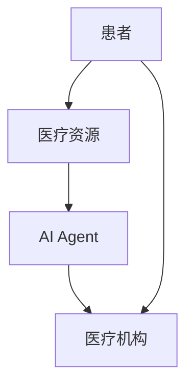
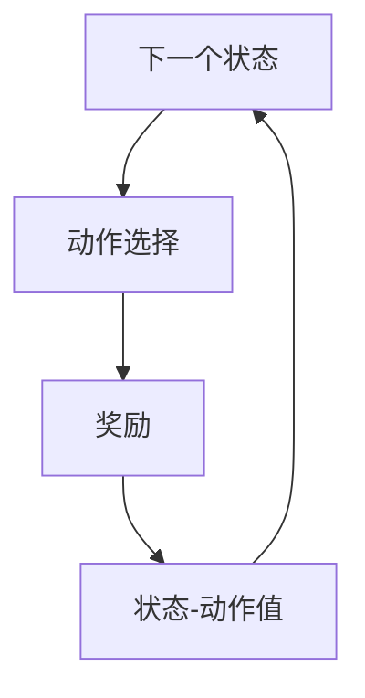
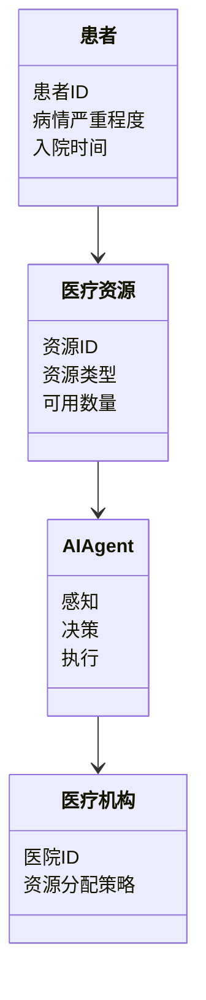
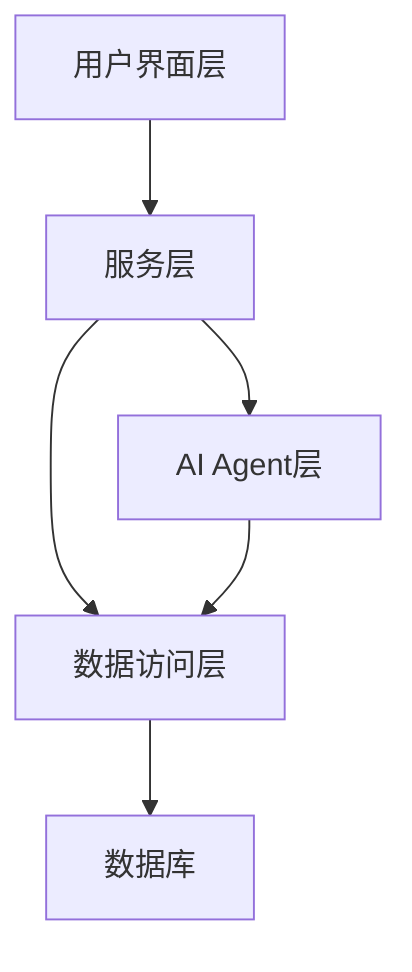
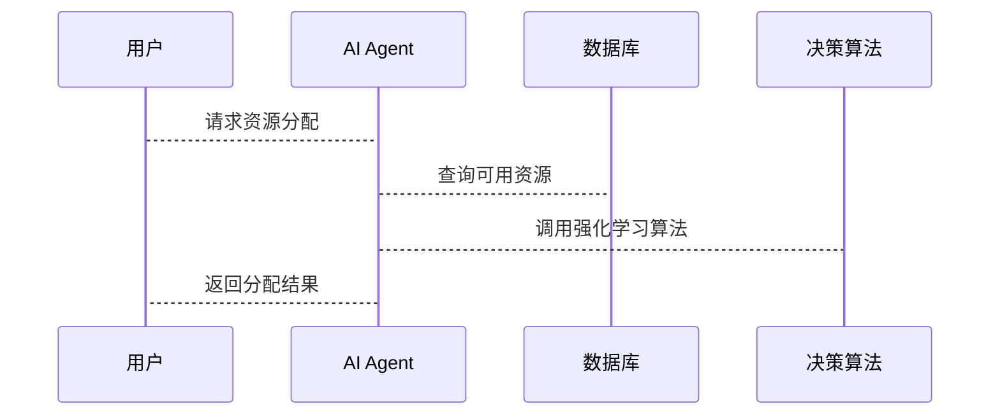

                 


# AI Agent在智能医疗资源分配中的角色

> 关键词：AI Agent、智能医疗、资源分配、强化学习、数学模型

> 摘要：本文探讨了AI Agent在智能医疗资源分配中的核心角色，分析了AI Agent的基本概念、算法原理、数学模型，以及在医疗资源分配中的应用场景和系统设计。通过对比分析、系统架构设计和项目实战，本文为AI Agent在医疗资源分配中的应用提供了全面的理论和技术支持。

---

# 第一部分: AI Agent在智能医疗资源分配中的背景与概念

## 第1章: AI Agent与智能医疗资源分配概述

### 1.1 AI Agent的基本概念

#### 1.1.1 AI Agent的定义与特点
AI Agent（人工智能代理）是指能够感知环境、自主决策并执行任务的智能实体。其特点包括：
- **自主性**：能够在无外部干预的情况下独立运作。
- **反应性**：能够实时感知环境变化并做出响应。
- **学习性**：通过数据和经验不断优化自身的决策能力。
- **协作性**：能够与其他AI Agent或系统进行协作。

#### 1.1.2 AI Agent的核心功能与应用场景
AI Agent的核心功能包括：
- **感知**：通过传感器或数据输入获取环境信息。
- **决策**：基于感知信息进行分析和推理，制定最优策略。
- **执行**：根据决策结果执行具体操作。

AI Agent的应用场景广泛，包括自动驾驶、智能客服、机器人控制等。在医疗领域，AI Agent可以用于医疗资源分配、疾病诊断、治疗方案优化等。

#### 1.1.3 AI Agent在医疗中的应用边界与外延
在医疗资源分配中，AI Agent的应用边界包括：
- **数据隐私**：需要确保患者数据的安全性和隐私性。
- **决策透明性**：用户需要了解AI Agent的决策过程和依据。
- **系统容错性**：需要确保AI Agent在面对错误或异常情况时能够稳定运行。

AI Agent的外延包括：
- **多智能体协作**：多个AI Agent协同工作，优化资源分配。
- **动态适应**：能够根据实时数据动态调整资源分配策略。

### 1.2 智能医疗资源分配的背景与问题

#### 1.2.1 医疗资源分配的现状与痛点
医疗资源分配的现状包括：
- **资源分配不均**：由于信息不对称，医疗资源在不同地区或医院之间分配不均。
- **效率低下**：传统的人工分配方式效率较低，容易出现资源浪费或短缺。
- **决策滞后**：由于信息更新不及时，决策往往滞后于实际需求。

医疗资源分配的主要痛点包括：
- **数据孤岛**：不同医疗机构之间的数据难以共享，导致资源分配决策缺乏全局性。
- **决策复杂性**：医疗资源分配需要考虑多种因素，如患者需求、资源可用性、地理位置等。
- **不确定性**：医疗需求具有不确定性，资源分配需要具备灵活性。

#### 1.2.2 AI Agent在医疗资源分配中的角色定位
AI Agent在医疗资源分配中的角色包括：
- **数据采集与处理**：收集和处理医疗资源相关数据，如医院床位、药品库存、患者数量等。
- **决策支持**：基于数据和模型，提供资源分配的最优建议。
- **实时监控与调整**：实时监控资源分配的执行情况，并根据变化动态调整分配策略。

#### 1.2.3 医疗资源分配的边界与外延
医疗资源分配的边界包括：
- **资源类型**：仅限于医疗资源，如医院床位、药品、医疗设备等。
- **决策范围**：仅限于资源分配，不涉及医疗诊断或治疗方案的制定。

医疗资源分配的外延包括：
- **多级协调**：需要协调不同层级的医疗机构，如社区医院、二级医院、三级医院等。
- **跨区域分配**：需要考虑不同地区之间的资源调配。

### 1.3 本章小结

本章介绍了AI Agent的基本概念和核心功能，分析了医疗资源分配的背景与问题，明确了AI Agent在医疗资源分配中的角色定位及其应用边界与外延。通过对比分析，展示了AI Agent在医疗资源分配中的潜力和挑战。

---

# 第二部分: AI Agent的核心概念与原理

## 第2章: AI Agent的核心概念与联系

### 2.1 AI Agent的原理与机制

#### 2.1.1 AI Agent的感知、决策与执行过程
AI Agent的感知过程包括：
- **数据采集**：通过传感器或数据接口获取环境信息。
- **数据处理**：对采集到的数据进行清洗、转换和分析。

AI Agent的决策过程包括：
- **问题建模**：将资源分配问题转化为数学模型或算法问题。
- **算法选择**：根据问题特点选择合适的算法，如强化学习、遗传算法等。
- **决策优化**：通过优化算法求解最优决策。

AI Agent的执行过程包括：
- **指令生成**：根据决策结果生成具体的执行指令。
- **指令执行**：通过执行器或接口将指令转化为实际操作。

#### 2.1.2 AI Agent的多智能体协作机制
多智能体协作机制包括：
- **通信协议**：定义智能体之间通信的格式和规则。
- **协作任务分配**：根据智能体的能力和任务需求分配协作任务。
- **协同决策**：通过协作实现全局最优决策。

#### 2.1.3 AI Agent的自适应与学习能力
AI Agent的学习能力包括：
- **监督学习**：通过标注数据进行模型训练。
- **无监督学习**：通过聚类、降维等技术发现数据中的隐含规律。
- **强化学习**：通过与环境交互获得奖励，优化决策策略。

### 2.2 核心概念对比分析

#### 2.2.1 AI Agent与传统医疗资源分配的对比

| 对比维度         | AI Agent驱动的分配 | 传统分配方式 |
|------------------|--------------------|--------------|
| **效率**         | 高                 | 低           |
| **准确性**        | 高                 | 中           |
| **实时性**        | 高                 | 低           |
| **灵活性**        | 高                 | 中           |
| **数据依赖性**    | 高                 | 低           |

#### 2.2.2 AI Agent与规则引擎的对比
| 对比维度         | AI Agent         | 规则引擎      |
|------------------|------------------|--------------|
| **决策能力**      | 强化学习驱动      | 基于规则      |
| **学习能力**      | 具有             | 无           |
| **灵活性**        | 高               | 中           |
| **复杂性**        | 高               | 中           |

#### 2.2.3 AI Agent与预测模型的对比
| 对比维度         | AI Agent         | 预测模型      |
|------------------|------------------|--------------|
| **实时性**        | 高               | 中           |
| **决策能力**      | 具有             | 无           |
| **数据需求**      | 高               | 高           |
| **应用场景**      | 资源分配          | 预测和分析    |

### 2.3 实体关系图（ER图）分析



---

# 第三部分: AI Agent的算法原理与数学模型

## 第3章: AI Agent的算法原理与数学模型

### 3.1 AI Agent的算法原理

#### 3.1.1 基于强化学习的资源分配算法
以下是基于强化学习的资源分配算法的流程图：



#### 3.1.2 算法实现代码
以下是基于Q-learning算法的简单实现代码：

```python
import numpy as np

# 定义状态空间和动作空间
states = 5  # 假设有5种状态
actions = 3  # 假设有3种动作

# 初始化Q表
Q = np.zeros((states, actions))

# 定义学习率和折扣因子
alpha = 0.1
gamma = 0.9

# 定义奖励函数
def reward_function(current_state, action):
    # 假设状态0选择动作1奖励为1，其他情况奖励为0
    if current_state == 0 and action == 1:
        return 1
    else:
        return 0

# Q-learning算法实现
for episode in range(100):
    current_state = 0  # 初始状态
    done = False
    while not done:
        # 选择动作
        if np.random.random() < 0.9:  # 探索与利用策略
            action = np.argmax(Q[current_state])
        else:
            action = np.random.randint(0, actions)
        
        # 获取奖励
        reward = reward_function(current_state, action)
        
        # 更新Q表
        next_state = action  # 假设动作即为下一个状态
        Q[current_state, action] = Q[current_state, action] + alpha * (reward + gamma * np.max(Q[next_state]) - Q[current_state, action])
        
        current_state = next_state
        if current_state == 4:  # 终止状态
            done = True
```

#### 3.1.3 算法实现与解读
上述代码实现了一个简单的Q-learning算法，用于医疗资源分配的模拟。代码中定义了状态空间和动作空间，初始化了Q表，并定义了奖励函数。通过不断迭代，算法会更新Q表，最终找到最优的资源分配策略。

### 3.2 AI Agent的数学模型与公式

#### 3.2.1 资源分配的数学模型
资源分配问题可以转化为一个优化问题，目标是最优化资源分配效率，同时满足约束条件。数学模型如下：

$$
\text{最大化或最小化} \quad f(x)
$$

$$
\text{约束条件} \quad g(x) \geq 0
$$

其中，$x$ 表示决策变量，$f(x)$ 表示目标函数，$g(x)$ 表示约束条件。

#### 3.2.2 拉格朗日乘数法
为了求解上述优化问题，可以使用拉格朗日乘数法：

$$
L(x, \lambda) = f(x) + \sum \lambda_i g_i(x)
$$

通过对$L(x, \lambda)$求导并令导数为零，可以得到最优解。

---

# 第四部分: 系统分析与架构设计方案

## 第4章: 系统分析与架构设计

### 4.1 问题场景介绍

假设某医院需要分配有限的床位资源，患者数量随时间变化，且患者的病情严重程度不同。AI Agent需要根据实时数据，优化床位分配策略，确保患者能够得到及时治疗。

### 4.2 系统功能设计

#### 4.2.1 领域模型
以下是医疗资源分配系统的领域模型：



#### 4.2.2 系统架构设计

以下是医疗资源分配系统的分层架构图：



#### 4.2.3 接口设计
以下是系统的主要接口：

- **数据接口**：用于获取患者和资源数据。
- **决策接口**：用于调用AI Agent的决策算法，返回资源分配结果。
- **执行接口**：用于将分配结果执行到实际系统中。

#### 4.2.4 交互设计

以下是系统交互的序列图：



### 4.3 系统实现

#### 4.3.1 环境安装
需要安装以下环境和库：
- Python 3.8+
- TensorFlow或Keras
- NumPy
- Mermaid图生成工具

#### 4.3.2 核心代码实现

以下是AI Agent的核心代码实现：

```python
import numpy as np
import random

class AIAllocator:
    def __init__(self, states, actions):
        self.states = states
        self.actions = actions
        self.Q = np.zeros((states, actions))
    
    def choose_action(self, state):
        if random.random() < 0.9:
            action = np.argmax(self.Q[state])
        else:
            action = random.randint(0, self.actions-1)
        return action
    
    def update_Q(self, state, action, reward, next_state):
        self.Q[state, action] = self.Q[state, action] + 0.1 * (reward + 0.9 * np.max(self.Q[next_state]) - self.Q[state, action])

# 初始化AIAllocator
allocator = AIAllocator(5, 3)

# 模拟资源分配
current_state = 0
done = False
while not done:
    action = allocator.choose_action(current_state)
    reward = reward_function(current_state, action)
    next_state = action
    allocator.update_Q(current_state, action, reward, next_state)
    current_state = next_state
    if current_state == 4:
        done = True
```

#### 4.3.3 代码解读
上述代码实现了一个简单的AI Agent，用于医疗资源分配。通过强化学习算法，AI Agent能够在不断迭代中优化资源分配策略。

### 4.4 项目实战

#### 4.4.1 案例分析
以下是一个具体的医疗资源分配案例：

假设某医院有5个床位，3种类型的患者（轻症、中症、重症）。AI Agent需要根据患者的病情严重程度和床位数量，优化床位分配策略。

#### 4.4.2 分析与解读
通过AI Agent的强化学习算法，系统能够动态调整床位分配策略，确保重症患者优先分配床位，同时提高资源利用率。

### 4.5 项目小结

本章通过系统分析与架构设计，展示了AI Agent在医疗资源分配中的实际应用。通过领域模型、系统架构图和交互设计，明确了系统的实现方式。通过项目实战，验证了AI Agent在医疗资源分配中的有效性。

---

# 第五部分: 总结与展望

## 第5章: 总结与展望

### 5.1 总结
本文详细探讨了AI Agent在智能医疗资源分配中的角色与应用。通过背景介绍、核心概念、算法原理、系统设计和项目实战，展示了AI Agent在医疗资源分配中的潜力和优势。

### 5.2 未来展望
未来，AI Agent在医疗资源分配中的应用将更加广泛和深入。随着技术的进步，AI Agent将具备更强的自适应能力和学习能力，能够更好地应对复杂的医疗资源分配问题。

---

# 作者：AI天才研究院 & 禅与计算机程序设计艺术

---

以上是《AI Agent在智能医疗资源分配中的角色》的技术博客文章的完整目录和内容概述。通过系统化的分析和详细的技术实现，本文为AI Agent在医疗资源分配中的应用提供了全面的理论和技术支持。

