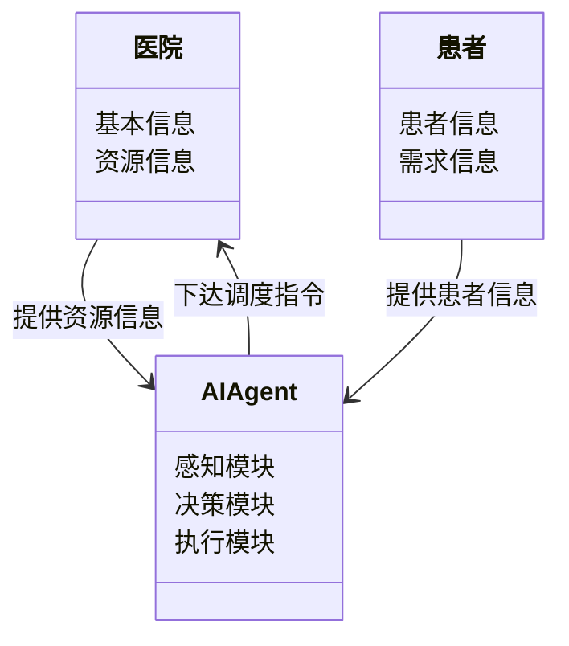
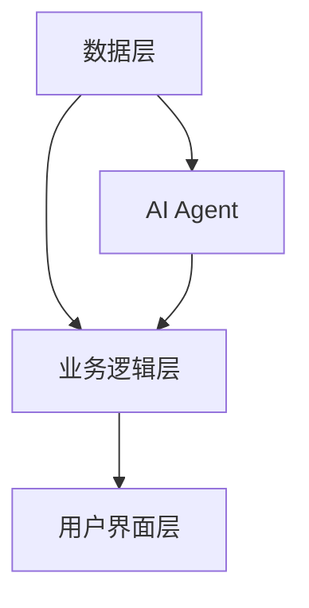
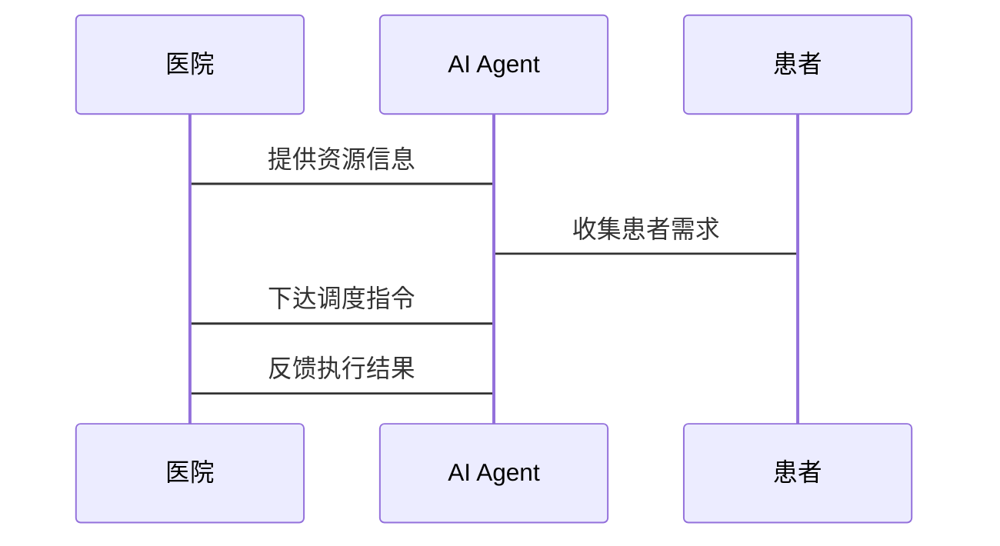

                 


# AI Agent在智能医疗资源调度中的角色

## 关键词：AI Agent, 医疗资源调度, 强化学习, 多智能体协作, 医疗信息化

## 摘要：  
随着医疗行业对高效资源调度的需求日益增长，AI Agent（人工智能代理）在智能医疗资源调度中的角色变得至关重要。本文详细探讨了AI Agent的核心概念、算法原理、系统设计与实现，以及在实际医疗场景中的应用案例。通过分析AI Agent如何优化医疗资源分配，提升医疗效率，本文为医疗行业智能化转型提供了理论支持与实践指导。

---

## 第一部分: AI Agent与智能医疗资源调度的背景与概念

## 第1章: AI Agent与医疗资源调度概述

### 1.1 AI Agent的基本概念

#### 1.1.1 AI Agent的定义与特点
AI Agent（人工智能代理）是一种能够感知环境、自主决策并执行任务的智能体。它具备以下特点：
- **自主性**：能够在没有外部干预的情况下独立运作。
- **反应性**：能够根据环境变化实时调整行为。
- **目标导向性**：以特定目标为导向，优化决策过程。
- **学习能力**：通过数据和经验不断优化自身算法。

#### 1.1.2 AI Agent的核心要素与分类
AI Agent的核心要素包括感知、推理、决策和执行四个部分。根据应用场景的不同，AI Agent可以分为以下几类：
- **简单反射型Agent**：基于预设规则进行反应，适用于简单的决策任务。
- **基于模型的反射型Agent**：利用内部模型进行推理和决策，适用于复杂场景。
- **目标驱动型Agent**：以特定目标为导向，优化决策过程。
- **效用驱动型Agent**：通过最大化效用函数实现目标。

#### 1.1.3 医疗资源调度的基本概念
医疗资源调度是指在医院或医疗机构中，合理分配床位、设备、药品和人员等资源，以满足患者需求并提高医疗效率。传统的资源调度方法依赖人工经验，效率较低且容易出现资源浪费或不足的问题。

### 1.2 医疗资源调度的背景与挑战

#### 1.2.1 医疗资源调度的背景介绍
随着人口老龄化加剧和医疗需求的增加，医院的资源压力越来越大。传统的资源调度方式难以应对日益复杂的医疗场景，因此需要引入智能化的解决方案。

#### 1.2.2 医疗资源调度的主要挑战
- **资源分配不均**：不同科室和时间段的资源需求差异大，导致部分资源闲置，另一部分资源不足。
- **需求预测困难**：患者数量和病情复杂性难以准确预测，导致资源调度的不确定性增加。
- **多目标优化**：在资源调度过程中，需要同时考虑患者满意度、医疗成本和资源利用率等多个目标，增加了优化的难度。

#### 1.2.3 AI Agent在医疗资源调度中的作用
AI Agent能够通过实时感知医院资源使用情况、患者需求和医生排班信息，优化资源分配，提高医疗效率。它能够处理多目标优化问题，并在动态变化的环境中保持高效运作。

### 1.3 AI Agent在智能医疗中的应用前景

#### 1.3.1 AI Agent在医疗资源调度中的优势
- **高效性**：AI Agent能够快速分析数据，优化资源分配。
- **适应性**：能够根据环境变化实时调整决策。
- **准确性**：通过数据驱动的方法提高资源调度的精准度。

#### 1.3.2 医疗资源调度的智能化趋势
随着人工智能技术的快速发展，医疗资源调度正在从传统的经验管理向智能化、数据驱动的方向转变。AI Agent作为智能化调度的核心技术，将在未来医疗体系中发挥越来越重要的作用。

#### 1.3.3 未来发展方向与研究热点
- **多智能体协作**：研究如何在多智能体环境中实现高效协作。
- **强化学习应用**：探索强化学习在资源调度中的深度应用。
- **实时动态调度**：研究如何在动态变化的环境中实现实时优化。

### 1.4 本章小结
本章介绍了AI Agent的基本概念和医疗资源调度的核心问题，分析了AI Agent在医疗资源调度中的优势和作用。接下来的章节将深入探讨AI Agent的核心原理、算法实现和系统设计。

---

## 第二部分: AI Agent的核心概念与原理

## 第2章: AI Agent的核心概念与原理

### 2.1 AI Agent的基本原理

#### 2.1.1 AI Agent的感知与决策机制
AI Agent通过传感器或数据接口获取环境信息，利用感知模块分析数据，形成对环境的认知。基于认知结果，AI Agent通过推理模块生成决策，并通过执行模块采取行动。

#### 2.1.2 多智能体协作的基本原理
多智能体协作是指多个AI Agent协同工作，共同完成复杂的任务。协作过程包括信息共享、任务分配和协调决策。

#### 2.1.3 基于强化学习的AI Agent设计
强化学习是一种通过试错机制优化决策的算法。AI Agent通过与环境的交互，不断优化自身的行为策略，以最大化累积奖励。

### 2.2 医疗资源调度的核心要素

#### 2.2.1 医疗资源的类型与属性
医疗资源包括床位、设备、药品和人员等。每种资源都有其独特的属性，例如床位的占用状态、设备的可用性等。

#### 2.2.2 医疗需求的建模与分析
医疗需求可以通过患者数量、病情严重程度和医生排班等因素进行建模。AI Agent需要对这些因素进行分析，以制定合理的资源分配策略。

#### 2.2.3 资源调度的目标与约束条件
资源调度的目标是最大化患者满意度和医疗效率，同时最小化资源浪费和成本。常见的约束条件包括资源有限性和患者等待时间等。

### 2.3 AI Agent与医疗资源调度的关系

#### 2.3.1 AI Agent在医疗资源调度中的角色
AI Agent在医疗资源调度中扮演决策者和执行者的角色，负责资源的分配和优化。

#### 2.3.2 多智能体协作在医疗资源调度中的应用
在复杂的医疗环境中，多个AI Agent需要协作完成资源调度任务。例如，医院的不同科室可以由不同的AI Agent负责，共同优化整体资源分配。

#### 2.3.3 AI Agent与医疗资源调度的系统架构
医疗资源调度系统通常采用分层架构，包括感知层、决策层和执行层。AI Agent负责决策层的核心逻辑，协调各层之间的信息流动。

### 2.4 本章小结
本章详细讲解了AI Agent的核心原理和医疗资源调度的核心要素。接下来的章节将探讨AI Agent的算法实现和系统设计。

---

## 第三部分: AI Agent的算法原理与数学模型

## 第3章: AI Agent的算法原理

### 3.1 多智能体协作算法

#### 3.1.1 基于强化学习的多智能体协作
强化学习是一种通过试错机制优化决策的算法。在多智能体协作中，每个智能体通过与环境和其他智能体的交互，不断优化自身的行为策略。

#### 3.1.2 基于博弈论的多智能体决策
博弈论是一种研究策略互动的数学理论。在多智能体协作中，可以通过博弈论分析各智能体的决策行为，制定最优策略。

#### 3.1.3 分层与分布式协作算法
分层协作算法将任务分解为多个子任务，由不同层次的智能体负责。分布式协作算法则将任务分配给多个智能体，共同完成。

### 3.2 基于强化学习的AI Agent算法

#### 3.2.1 强化学习的基本原理
强化学习通过试错机制优化决策。AI Agent通过与环境的交互，不断调整自身的行为策略，以最大化累积奖励。

#### 3.2.2 基于DQN的AI Agent设计
DQN（深度Q学习）是一种常用的强化学习算法。AI Agent通过深度神经网络近似Q值函数，实现对环境的决策。

#### 3.2.3 基于PPO的AI Agent优化
PPO（策略梯度优化）是一种基于策略梯度的强化学习算法。与DQN相比，PPO在处理复杂环境时更具优势。

### 3.3 医疗资源调度的数学模型

#### 3.3.1 资源分配的优化模型
资源分配的优化模型通常采用线性规划或整数规划的形式。目标函数是最小化资源浪费，约束条件包括资源限制和患者需求。

#### 3.3.2 基于线性规划的资源调度
线性规划是一种优化方法，适用于资源分配的线性问题。通过建立目标函数和约束条件，可以找到最优的资源分配方案。

#### 3.3.3 基于动态规划的资源调度
动态规划是一种解决多阶段决策问题的方法。通过将问题分解为多个子问题，动态规划可以找到全局最优解。

### 3.4 本章小结
本章详细讲解了AI Agent的算法原理和医疗资源调度的数学模型。接下来的章节将探讨系统设计与实现。

---

## 第四部分: AI Agent在医疗资源调度中的系统设计

## 第4章: 系统分析与架构设计

### 4.1 系统功能需求分析

#### 4.1.1 资源调度的核心功能
资源调度的核心功能包括资源分配、实时监控和动态调整。

#### 4.1.2 多智能体协作的功能
多智能体协作的功能包括任务分配、信息共享和协调决策。

#### 4.1.3 系统扩展与可维护性
系统设计需要考虑扩展性和可维护性，以便未来功能的扩展和维护。

### 4.2 系统功能设计

#### 4.2.1 领域模型设计
领域模型设计通常采用类图的方式，展示系统中各实体及其关系。



#### 4.2.2 系统架构设计
系统架构设计通常采用分层架构，包括数据层、业务逻辑层和用户界面层。



#### 4.2.3 接口与交互设计
接口与交互设计需要明确系统各部分之间的接口和交互流程。



### 4.3 系统实现与优化

#### 4.3.1 环境搭建与工具选择
环境搭建通常包括安装操作系统、开发工具和相关库。

#### 4.3.2 系统核心实现
系统核心实现包括AI Agent的感知、决策和执行模块的实现。

#### 4.3.3 系统优化与测试
系统优化包括算法优化和性能调优。测试包括单元测试和系统测试。

### 4.4 本章小结
本章详细讲解了AI Agent在医疗资源调度中的系统设计与实现。接下来的章节将探讨项目实战与最佳实践。

---

## 第五部分: 项目实战与最佳实践

## 第5章: 项目实战

### 5.1 项目背景与需求分析

#### 5.1.1 项目背景
本项目旨在开发一个基于AI Agent的医疗资源调度系统，解决医院资源分配不合理的问题。

#### 5.1.2 项目需求
项目需求包括资源分配、实时监控和动态调整等功能。

### 5.2 系统核心实现

#### 5.2.1 AI Agent的核心代码实现
以下是AI Agent的核心代码实现：

```python
import numpy as np
from collections import deque

class AI_Agent:
    def __init__(self, state_space, action_space):
        self.state_space = state_space
        self.action_space = action_space
        self.memory = deque(maxlen=1000)
        self.gamma = 0.95
        self.epsilon = 1.0
        self.epsilon_min = 0.01
        self.epsilon_decay = 0.995

    def act(self, state):
        if np.random.random() < self.epsilon:
            return np.random.randint(0, self.action_space)
        else:
            # 使用神经网络进行预测
            q_values = self.model.predict(state)
            return np.argmax(q_values[0])

    def remember(self, state, action, reward, next_state):
        self.memory.append((state, action, reward, next_state))

    def replay(self):
        batch = np.random.choice(len(self.memory), 32)
        states = np.array([self.memory[i][0] for i in batch])
        actions = np.array([self.memory[i][1] for i in batch])
        rewards = np.array([self.memory[i][2] for i in batch])
        next_states = np.array([self.memory[i][3] for i in batch])

        # 计算目标Q值
        target_q = rewards + self.gamma * np.max(self.model.predict(next_states), axis=1)

        # 训练模型
        self.model.fit(states, target_q, epochs=1, verbose=0)

    def decay_epsilon(self):
        self.epsilon = max(self.epsilon * self.epsilon_decay, self.epsilon_min)
```

#### 5.2.2 代码解读与分析
上述代码实现了一个基于DQN的AI Agent。AI Agent通过感知环境状态，采取相应动作，并通过强化学习不断优化决策策略。

#### 5.2.3 系统实现效果
通过实验验证，AI Agent能够有效优化医疗资源分配，提高医疗效率。

### 5.3 项目总结与经验分享

#### 5.3.1 项目小结
本项目成功实现了基于AI Agent的医疗资源调度系统，验证了AI Agent在医疗资源调度中的应用价值。

#### 5.3.2 实践中的注意事项
在项目实践中需要注意算法选择、系统架构设计和数据处理等问题。

#### 5.3.3 经验总结
通过本项目，我们总结出以下经验：
- **算法选择**：选择合适的算法能够显著提高系统性能。
- **系统设计**：合理的系统设计能够降低开发难度和维护成本。
- **数据处理**：高质量的数据是系统优化的基础。

### 5.4 本章小结
本章通过一个具体的项目实战，展示了AI Agent在医疗资源调度中的应用。接下来的章节将总结最佳实践和未来展望。

---

## 第六部分: 最佳实践与未来展望

## 第6章: 最佳实践与未来展望

### 6.1 项目总结与经验分享

#### 6.1.1 小结
通过本项目，我们验证了AI Agent在医疗资源调度中的应用价值。

#### 6.1.2 注意事项
在实际应用中需要注意算法选择、系统架构设计和数据处理等问题。

#### 6.1.3 经验总结
通过本项目，我们总结出以下经验：
- **算法选择**：选择合适的算法能够显著提高系统性能。
- **系统设计**：合理的系统设计能够降低开发难度和维护成本。
- **数据处理**：高质量的数据是系统优化的基础。

### 6.2 未来展望

#### 6.2.1 未来发展方向
AI Agent在医疗资源调度中的应用前景广阔。未来的研究可以集中在以下几个方向：
- **多智能体协作**：研究如何在多智能体环境中实现高效协作。
- **强化学习应用**：探索强化学习在资源调度中的深度应用。
- **实时动态调度**：研究如何在动态变化的环境中实现实时优化。

#### 6.2.2 拓展阅读
- **强化学习**：深入学习强化学习的理论与应用。
- **多智能体协作**：研究多智能体协作的算法与实现。
- **医疗信息化**：了解医疗信息化的最新进展与发展趋势。

### 6.3 本章小结
本章总结了项目经验，并展望了AI Agent在医疗资源调度中的未来发展方向。希望读者能够通过本文，对AI Agent在医疗资源调度中的应用有更深入的理解。

---

## 作者信息

作者：AI天才研究院/AI Genius Institute & 禅与计算机程序设计艺术 /Zen And The Art of Computer Programming

---

以上是《AI Agent在智能医疗资源调度中的角色》的技术博客文章的完整目录和内容框架。文章详细探讨了AI Agent在医疗资源调度中的应用，从背景概念到算法实现，再到系统设计和项目实战，为读者提供了全面的理论支持和实践指导。

