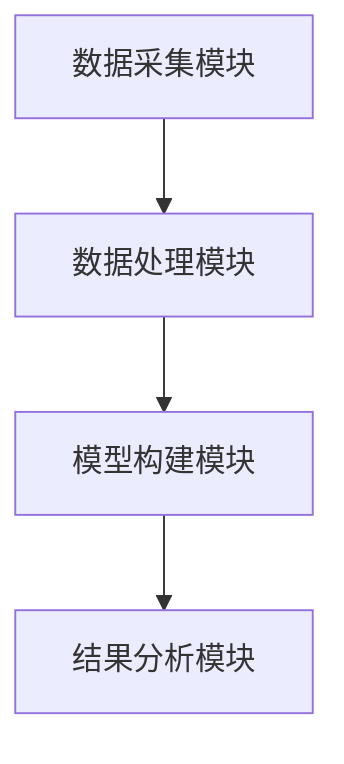

                 


# AI Agent在智能商业选址中的应用

## 关键词：AI Agent，智能商业选址，机器学习，数据驱动决策，地理位置分析

## 摘要：AI Agent通过数据驱动和智能算法优化商业选址过程，帮助企业在复杂的市场环境中做出更精准的决策，提升市场竞争力。

---

# 第一章：AI Agent的基本概念与应用背景

## 1.1 AI Agent的定义与核心原理

### 1.1.1 AI Agent的基本定义
AI Agent（人工智能代理）是一种能够感知环境、自主决策并执行任务的智能系统。它通过传感器获取信息，利用算法进行分析，然后采取行动以实现特定目标。

### 1.1.2 AI Agent的核心原理
AI Agent的核心原理包括数据采集与处理、信息分析与特征提取、决策模型构建等步骤。通过机器学习算法，AI Agent能够从大量数据中发现模式和趋势，从而做出优化决策。

### 1.1.3 AI Agent与传统算法的区别
AI Agent不同于传统算法，它具备自主学习和适应能力，能够根据环境变化动态调整策略，而传统算法通常需要手动调整参数。

## 1.2 商业选址的基本问题与挑战

### 1.2.1 商业选址的定义与重要性
商业选址是指选择一个地理位置开设店铺，以满足市场需求并实现盈利。它直接影响企业的市场表现和运营成本。

### 1.2.2 传统商业选址方法的局限性
传统选址方法依赖人工分析，存在效率低、覆盖面窄、难以量化等问题，难以应对复杂多变的市场环境。

### 1.2.3 智能化选址的需求与趋势
随着大数据和AI技术的发展，智能化选址成为趋势，能够显著提升选址效率和准确性，为企业创造更大价值。

---

# 第二章：AI Agent在商业选址中的应用价值

## 2.1 AI Agent的核心优势

### 2.1.1 数据处理能力
AI Agent能够处理海量数据，包括地理位置、人口统计、消费行为等，为选址提供全面支持。

### 2.1.2 智能决策能力
通过机器学习算法，AI Agent能够分析数据，评估多个候选位置的优劣，提供最优建议。

### 2.1.3 自适应优化能力
AI Agent能够实时跟踪市场变化，动态调整选址策略，确保企业始终处于最佳位置。

## 2.2 商业选址中的关键问题

### 2.2.1 区域选择与市场分析
AI Agent帮助分析不同区域的市场潜力，确定目标客户群体，评估区域竞争优势。

### 2.2.2 竞争分析与风险评估
通过分析竞争对手的分布和市场份额，AI Agent能够评估潜在风险，制定差异化策略。

### 2.2.3 资源分配与成本优化
AI Agent优化资源配置，降低运营成本，提升投资回报率，确保企业利润最大化。

## 2.3 AI Agent在商业选址中的具体应用场景

### 2.3.1 零售店选址
AI Agent帮助零售企业选择最佳店铺位置，考虑客流量、消费能力、竞争对手等因素。

### 2.3.2 物流中心布局
通过优化地理位置和运输效率，AI Agent帮助企业在物流网络中合理布局，降低成本。

### 2.3.3 服务网点优化
AI Agent分析服务区域的需求，优化服务网点分布，提升服务质量和服务效率。

---

# 第三章：AI Agent的核心技术与算法原理

## 3.1 AI Agent的感知与决策机制

### 3.1.1 数据采集与处理
AI Agent通过传感器、数据库等渠道获取地理位置、人口统计、消费行为等数据，并进行清洗和标准化处理。

### 3.1.2 信息分析与特征提取
利用自然语言处理和特征工程技术，AI Agent提取关键特征，如人口密度、交通流量、消费能力等。

### 3.1.3 决策模型的构建
基于提取的特征，AI Agent构建决策模型，如聚类分析、回归分析和强化学习模型，用于评估候选位置的优劣。

## 3.2 AI Agent的优化算法

### 3.2.1 遗传算法
遗传算法通过模拟生物进化过程，优化选址方案，适用于多目标优化问题。

### 3.2.2 蚁群算法
蚁群算法模拟蚂蚁觅食行为，适用于路径优化和位置选择问题。

### 3.2.3 粒子群优化算法
粒子群优化算法模拟鸟群觅食行为，适用于连续空间的优化问题。

---

# 第四章：AI Agent在商业选址中的系统架构与实现

## 4.1 系统架构设计

### 4.1.1 系统功能模块
- 数据采集模块：负责采集地理位置、人口统计等数据。
- 数据处理模块：清洗、标准化数据并提取特征。
- 模型构建模块：训练机器学习模型并生成选址建议。
- 结果分析模块：评估选址方案并优化策略。

### 4.1.2 系统架构图


## 4.2 算法实现与优化

### 4.2.1 数据预处理与特征工程
- 数据清洗：处理缺失值、异常值。
- 特征提取：利用主成分分析（PCA）降维。

### 4.2.2 基于聚类的选址模型
使用K-means算法将地理位置聚类，选择聚类中心作为候选位置。

### 4.2.3 强化学习的应用
通过Q-learning算法，AI Agent学习环境中的奖励机制，优化选址策略。

---

# 第五章：AI Agent在商业选址中的项目实战

## 5.1 项目背景与目标
以某连锁便利店为例，目标是在某城市选择最佳店铺位置，提升销售额和市场占有率。

## 5.2 环境安装与数据准备
- 安装Python、TensorFlow、Pandas等工具。
- 收集地理位置、人口统计、消费行为等数据。

## 5.3 核心代码实现

### 5.3.1 数据预处理
```python
import pandas as pd
import numpy as np

data = pd.read_csv('location_data.csv')
data.dropna(inplace=True)
```

### 5.3.2 模型训练
```python
from sklearn.cluster import KMeans

model = KMeans(n_clusters=5)
model.fit(data[['latitude', 'longitude']])
```

### 5.3.3 结果分析
```python
import matplotlib.pyplot as plt

plt.scatter(data['latitude'], data['longitude'], c=model.labels_)
plt.xlabel('纬度')
plt.ylabel('经度')
plt.title('聚类结果')
plt.show()
```

## 5.4 实际案例分析
通过模型分析，确定最佳店铺位置，评估投资回报率和市场潜力。

---

# 第六章：总结与展望

## 6.1 最佳实践
- 数据质量是关键，确保数据的完整性和准确性。
- 结合业务需求，选择合适的算法和模型。
- 定期更新模型，适应市场变化。

## 6.2 未来展望
随着AI技术的进步，AI Agent在商业选址中的应用将更加智能化和个性化，可能结合AR/VR技术提供沉浸式选址体验。

---

# 作者：AI天才研究院 & 禅与计算机程序设计艺术

---

通过本文的详细介绍，我们可以看到AI Agent在智能商业选址中的巨大潜力。它不仅能够提高选址效率，还能为企业创造更大的价值。未来，随着技术的不断发展，AI Agent的应用将更加广泛和深入。

