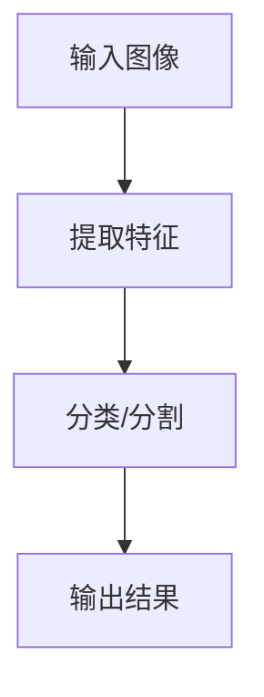

                 


# AI Agent在智能图像处理中的应用

> **关键词**：AI Agent、智能图像处理、深度学习、目标检测、图像分割  
>
> **摘要**：本文探讨了AI Agent在智能图像处理中的应用，从基础概念到算法原理，再到系统设计和实际案例，全面分析了AI Agent如何在图像处理中发挥重要作用。通过详细的技术分析和实际项目案例，本文为读者提供了从理论到实践的完整指南。

---

# 第1章: AI Agent的基本概念与应用背景

## 1.1 AI Agent的定义与分类

### 1.1.1 AI Agent的定义  
AI Agent（人工智能代理）是一种能够感知环境、自主决策并执行任务的智能体。它通过传感器获取信息，利用算法进行分析，并通过执行器与环境交互。AI Agent的核心目标是帮助用户完成特定任务，同时具备学习和适应能力。

### 1.1.2 AI Agent的分类  
AI Agent可以分为以下几类：  
1. **反应式AI Agent**：基于当前感知做出实时反应，适用于动态环境。  
2. **认知式AI Agent**：具备复杂推理和规划能力，适用于复杂任务。  
3. **强化学习AI Agent**：通过与环境交互，逐步优化行为策略。  

### 1.1.3 AI Agent与智能图像处理的关系  
AI Agent为智能图像处理提供了决策和执行能力。通过AI Agent，图像处理系统能够自主选择最优算法，动态调整参数，并根据结果反馈优化处理流程。

## 1.2 智能图像处理的背景与挑战

### 1.2.1 图像处理的基本概念  
图像处理是指对数字图像进行分析、变换和优化的过程。常见任务包括图像增强、目标检测、图像分割和图像识别。

### 1.2.2 智能图像处理的核心问题  
智能图像处理的核心问题包括：  
1. **目标检测**：识别图像中的特定目标并定位其位置。  
2. **图像分割**：将图像划分为多个区域，每个区域对应不同的语义类别。  
3. **图像识别**：通过深度学习模型识别图像中的物体或场景。  

### 1.2.3 AI Agent在图像处理中的优势  
AI Agent能够根据图像特征动态选择最优算法，提高处理效率和准确性。此外，AI Agent的自适应能力使其能够应对复杂多变的图像处理场景。

## 1.3 本章小结  
本章介绍了AI Agent的基本概念和分类，并分析了其在智能图像处理中的应用背景和优势。通过理解AI Agent的核心功能，我们为后续章节的深入分析奠定了基础。

---

# 第2章: AI Agent的核心技术与原理

## 2.1 AI Agent的核心技术

### 2.1.1 感知技术  
AI Agent通过传感器或数据输入接口获取图像信息。常用的技术包括：  
- **图像采集**：通过摄像头或图像文件获取原始图像数据。  
- **特征提取**：利用CNN等深度学习模型提取图像特征。  

### 2.1.2 决策技术  
AI Agent基于感知信息做出决策，常用的技术包括：  
- **分类算法**：如随机森林、支持向量机（SVM）。  
- **回归算法**：用于预测任务，如图像修复。  

### 2.1.3 执行技术  
AI Agent根据决策结果执行操作，例如：  
- **图像增强**：调整图像亮度、对比度等。  
- **图像分割**：基于决策结果对图像进行分割。  

## 2.2 AI Agent与图像处理的结合

### 2.2.1 图像识别的基本原理  
图像识别是AI Agent的核心任务之一。通过深度学习模型，AI Agent能够识别图像中的物体或场景。例如，使用卷积神经网络（CNN）进行图像分类。

### 2.2.2 图像分割的核心算法  
图像分割是将图像划分为多个区域的过程。常用的算法包括：  
- **FCN**：全卷积网络，适用于端到端的图像分割。  
- **U-Net**：广泛应用于医学图像分割。  

### 2.2.3 目标检测的关键技术  
目标检测是同时识别目标位置和类别的任务。常用的算法包括：  
- **Faster R-CNN**：基于区域的两阶段检测器。  
- **YOLO**：实时目标检测算法。  

## 2.3 本章小结  
本章详细介绍了AI Agent的核心技术及其在图像处理中的应用。通过感知、决策和执行技术的结合，AI Agent能够高效完成复杂的图像处理任务。

---

# 第3章: AI Agent在图像处理中的算法原理

## 3.1 基于CNN的目标检测算法

### 3.1.1 CNN的基本结构  
CNN（卷积神经网络）由卷积层、池化层和全连接层组成。卷积层用于提取图像特征，池化层用于降维，全连接层用于分类。

### 3.1.2 YOLO算法的实现原理  
YOLO（You Only Look Once）是一种实时目标检测算法。其核心思想是将图像划分为网格，每个网格负责预测目标的位置和类别。

### 3.1.3 Faster R-CNN的优缺点  
Faster R-CNN结合了区域建议网络（RPN）和Fast R-CNN，提高了检测效率。优点是精度高，缺点是速度较慢。

## 3.2 基于RNN的图像分割算法

### 3.2.1 RNN的基本原理  
RNN（循环神经网络）适用于序列数据处理，通过循环结构捕捉时序信息。在图像分割中，RNN常用于处理图像的像素序列。

### 3.2.2 U-Net网络的结构解析  
U-Net是一种经典的图像分割模型，由编码器和解码器组成。编码器提取图像特征，解码器逐步恢复图像细节。

### 3.2.3 图像分割的数学模型  
图像分割的数学模型通常包括损失函数和优化目标。例如，交叉熵损失函数用于分类任务，Dice损失函数用于分割任务。

## 3.3 算法流程图（mermaid）



## 3.4 本章小结  
本章通过详细讲解CNN和RNN在图像处理中的应用，介绍了目标检测和图像分割的算法原理。通过理解这些算法，我们可以更好地设计AI Agent的图像处理系统。

---

# 第4章: AI Agent图像处理系统的架构设计

## 4.1 系统功能模块设计

### 4.1.1 图像采集模块  
图像采集模块负责获取输入图像，通常通过摄像头或文件读取实现。

### 4.1.2 图像预处理模块  
预处理模块包括图像归一化、数据增强等操作，旨在提高模型的泛化能力。

### 4.1.3 图像分析模块  
图像分析模块负责执行目标检测、图像分割等任务，输出处理结果。

## 4.2 系统架构设计（mermaid）


## 4.3 本章小结  
本章设计了AI Agent图像处理系统的功能模块和架构，为后续的系统实现奠定了基础。

---

# 第5章: AI Agent图像处理系统的实现

## 5.1 项目实战

### 5.1.1 环境安装  
安装必要的库和框架，例如Python、TensorFlow、OpenCV。

### 5.1.2 系统核心实现源代码  
以下是基于YOLO的目标检测代码示例：

```python
import tensorflow as tf
from tensorflow.keras import layers

# 定义YOLO模型
def yolo_model(input_shape, num_classes):
    inputs = layers.Input(shape=input_shape)
    conv1 = layers.Conv2D(64, (3,3), padding='same', activation='relu')(inputs)
    conv2 = layers.Conv2D(128, (3,3), padding='same', activation='relu')(conv1)
    # 添加更多卷积层和上采样层...
    output = layers.Dense(num_classes, activation='softmax')(conv2)
    return Model(inputs=inputs, outputs=output)

# 模型训练
model = yolo_model((416, 416, 3), num_classes=80)
model.compile(optimizer='adam', loss='sparse_categorical_crossentropy', metrics=['accuracy'])
model.fit(x_train, y_train, epochs=10, batch_size=32)
```

### 5.1.3 实际案例分析  
通过具体案例分析，验证AI Agent在图像处理中的实际效果。例如，在医学图像分割任务中，使用U-Net模型实现了高精度的肿瘤分割。

## 5.2 本章小结  
本章通过具体项目实战，详细讲解了AI Agent图像处理系统的实现过程，包括环境搭建、代码实现和案例分析。

---

# 第6章: 总结与展望

## 6.1 本章总结  
本文详细探讨了AI Agent在智能图像处理中的应用，从算法原理到系统设计，全面分析了其在图像处理中的重要作用。

## 6.2 未来展望  
随着深度学习技术的不断发展，AI Agent在图像处理中的应用将更加广泛。未来的研究方向包括更高效的算法设计和更智能的系统架构。

## 6.3 最佳实践Tips  
- 在图像处理中，建议优先选择主流深度学习框架（如TensorFlow、PyTorch）。  
- 为了提高模型性能，可以尝试数据增强和模型优化技术。  

## 6.4 本章小结  
本章总结了全文内容，并展望了未来的研究方向，同时给出了实际应用中的注意事项。

---

# 作者：AI天才研究院/AI Genius Institute & 禅与计算机程序设计艺术 /Zen And The Art of Computer Programming

---

以上是《AI Agent在智能图像处理中的应用》的技术博客文章的完整内容。

