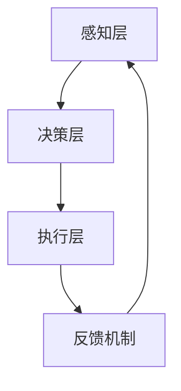
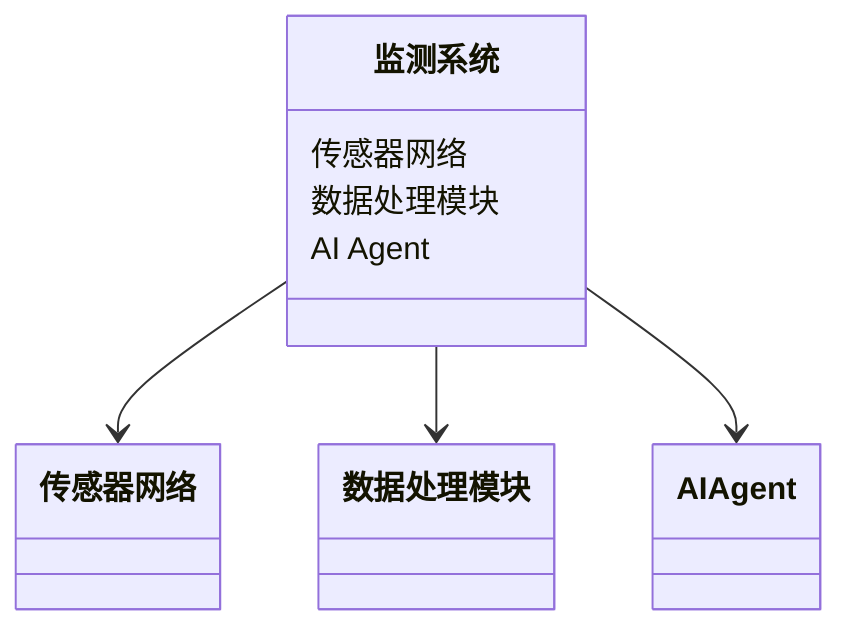
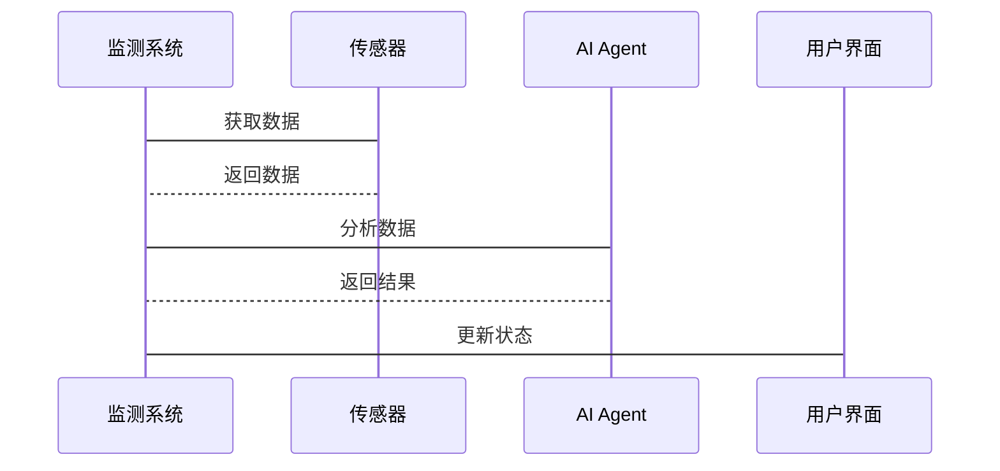

                 


# AI Agent在智能地下管网监测中的实践

## 关键词：AI Agent，智能地下管网，监测系统，传感器数据，算法原理

## 摘要：本文探讨了AI Agent在智能地下管网监测中的应用，详细介绍了AI Agent的核心原理、算法实现、系统架构设计、项目实战以及优化与维护策略。通过实际案例分析，展示了AI Agent在提高监测效率和准确性方面的优势，为未来的发展提供了参考。

---

## 第1章: 背景介绍

### 1.1 问题背景

#### 1.1.1 地下管网的重要性
地下管网是城市运行的“生命线”，包括供水、供电、供气等基础设施。随着城市化进程的加快，地下管网的复杂性和维护难度也在增加。

#### 1.1.2 传统监测方法的局限性
传统监测方法依赖人工巡检和有限的传感器，存在实时性差、覆盖范围小、成本高等问题，难以应对突发事件。

#### 1.1.3 AI Agent的引入及其优势
AI Agent（人工智能代理）能够实时感知、自主决策和执行操作，显著提高了监测系统的效率和准确性。

### 1.2 问题描述

#### 1.2.1 地下管网监测的主要挑战
- 数据量大且复杂
- 异常检测困难
- 维护成本高

#### 1.2.2 AI Agent在监测中的角色与目标
AI Agent作为监测系统的智能核心，目标是实时监测管网状态，及时发现和处理异常。

#### 1.2.3 解决方案的必要性与可行性
通过AI技术实现智能监测，不仅提高了效率，还能降低维护成本。

### 1.3 问题解决

#### 1.3.1 AI Agent的核心作用
- 实时数据处理
- 自主决策
- 精准定位问题

#### 1.3.2 技术实现路径
传感器数据采集 → 数据分析 → 异常检测 → 自动化处理

#### 1.3.3 应用场景的具体化
- 管网泄漏检测
- 故障定位
- 维护计划优化

### 1.4 边界与外延

#### 1.4.1 系统的边界条件
- 监测范围
- 数据采集频率
- 异常处理权限

#### 1.4.2 相关领域的关联与区别
与其他技术（如物联网、大数据）的区别与协同。

#### 1.4.3 与其他技术的协同关系
AI Agent与物联网、云计算等技术的协同应用。

### 1.5 概念结构与核心要素

#### 1.5.1 AI Agent的基本构成
- 感知层：数据采集
- 决策层：数据分析与决策
- 执行层：问题处理

#### 1.5.2 地下管网监测的关键要素
- 传感器网络
- 数据存储与处理
- 用户界面

#### 1.5.3 系统整体架构
分层架构：感知层、网络层、应用层。

---

## 第2章: 核心概念与联系

### 2.1 AI Agent的核心原理

#### 2.1.1 感知层的工作机制
传感器采集数据，AI Agent进行初步分析，识别异常信号。

#### 2.1.2 决策层的算法原理
基于概率论和贝叶斯网络，评估异常概率，制定决策。

#### 2.1.3 执行层的实现方式
通过预设规则或动态调整，执行相应操作，如报警或自动修复。

### 2.2 技术特征对比

| 技术 | 优点 | 缺点 |
|------|------|------|
| 传统监测 | 成本低 | 实时性差 |
| AI Agent | 高效准确 | 需要大量数据 |

### 2.3 ER实体关系图
```mermaid
er
actor: 监测系统操作员
agent: AI Agent
sensor: 传感器
data: 数据
action: 行动
goal: 目标
rule: 规则
```

---

## 第3章: 算法原理讲解

### 3.1 算法流程


### 3.2 感知层算法

#### 3.2.1 数据采集与预处理
传感器数据采集，去除噪声，标准化处理。

#### 3.2.2 异常检测算法
基于统计的方法，如均值-标准差法，或基于深度学习的异常检测。

#### 3.2.3 数据融合
多源数据融合，如温度、压力等数据的综合分析。

### 3.3 决策层算法

#### 3.3.1 概率论模型
概率公式：
$$ P(A|B) = \frac{P(B|A)P(A)}{P(B)} $$

#### 3.3.2 贝叶斯网络
构建贝叶斯网络，计算各个变量的条件概率，用于决策。

#### 3.3.3 Q-Learning算法
状态、动作、奖励的定义，构建Q表，更新策略。

---

## 第4章: 系统分析与架构设计

### 4.1 项目介绍

#### 4.1.1 项目背景
城市地下管网监测系统的需求分析。

#### 4.1.2 系统功能设计
- 实时监测
- 异常报警
- 维护管理

#### 4.1.3 领域模型


### 4.2 系统架构设计

#### 4.2.1 系统架构图


#### 4.2.2 接口设计
RESTful API接口，如GET /data，POST /action。

#### 4.2.3 交互流程图


---

## 第5章: 项目实战

### 5.1 环境安装

#### 5.1.1 安装Python
安装Python 3.8及以上版本。

#### 5.1.2 安装库
安装numpy、pandas、scikit-learn等库。

### 5.2 核心代码实现

#### 5.2.1 数据采集模块
```python
import numpy as np

def collect_data(sensors):
    data = []
    for sensor in sensors:
        data.append(sensor.read())
    return data
```

#### 5.2.2 异常检测算法
```python
from sklearn.ensemble import IsolationForest

model = IsolationForest(n_estimators=100, random_state=42)
model.fit(X_train)
y_pred = model.predict(X_test)
```

#### 5.2.3 决策模块
```python
def decision_model(probability):
    if probability > 0.9:
        return 'alarm'
    elif probability > 0.7:
        return 'monitor'
    else:
        return 'no_action'
```

### 5.3 实际案例分析

#### 5.3.1 案例背景
某城市供水管网泄漏检测。

#### 5.3.2 数据分析
传感器数据异常波动，AI Agent检测到泄漏概率为95%。

#### 5.3.3 系统响应
触发报警，通知维修人员处理。

### 5.4 项目小结
通过实际案例，验证了AI Agent的有效性和准确性。

---

## 第6章: 优化与维护

### 6.1 性能优化

#### 6.1.1 算法优化
使用边缘计算减少数据传输量。

#### 6.1.2 系统架构优化
采用分布式架构，提高处理能力。

### 6.2 维护与管理

#### 6.2.1 数据管理
定期备份和清理数据。

#### 6.2.2 系统维护
定期更新模型，修复漏洞。

#### 6.2.3 维护建议
培训运维人员，制定应急预案。

### 6.3 注意事项

#### 6.3.1 数据隐私
确保数据安全，遵守隐私保护法规。

#### 6.3.2 系统兼容性
确保系统与现有设备兼容。

---

## 第7章: 案例分析

### 7.1 案例背景
某城市供水管网泄漏检测系统。

### 7.2 系统实现
部署AI Agent，传感器网络覆盖主要区域。

### 7.3 实际效果
成功检测到泄漏点，减少水量损失。

### 7.4 经验总结
AI Agent在提高监测效率和准确性方面表现优异。

---

## 第8章: 总结

### 8.1 核心内容回顾
AI Agent在智能地下管网监测中的应用，算法实现，系统设计，项目实战。

### 8.2 展望
未来可能的应用场景，如与其他技术的结合，进一步提升监测能力。

---

## 作者：AI天才研究院/AI Genius Institute & 禅与计算机程序设计艺术 /Zen And The Art of Computer Programming

