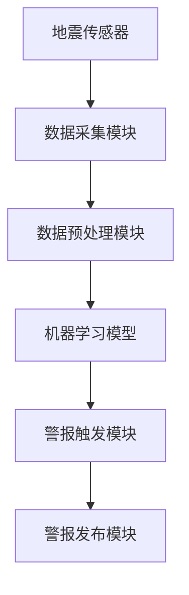
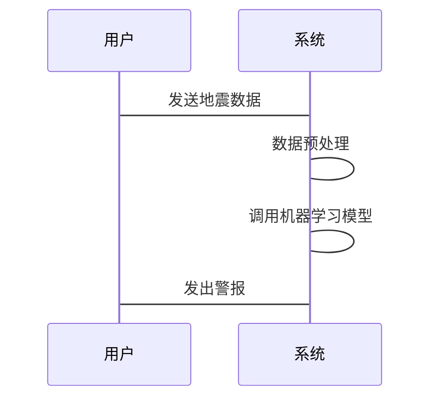

                 


# AI Agent在智能地震预警系统中的实践

> 关键词：AI Agent，智能地震预警系统，地震预测，实时预警，数据处理，机器学习

> 摘要：本文探讨了AI Agent在智能地震预警系统中的应用，分析了地震预警系统的组成和AI Agent的核心特征，详细介绍了基于机器学习的地震预测算法及其在地震预警中的实现。文章还讨论了系统的架构设计、项目实战以及最佳实践，为读者提供了全面的理论和技术指导。

---

# 第一部分: AI Agent与智能地震预警系统概述

## 第1章: 地震预警系统的基本概念

### 1.1 地震预警的基本概念

#### 1.1.1 地震的基本定义与分类

地震是地球内部能量释放的一种自然现象，通常表现为地面的震动。根据震源的深度，地震可以分为浅源地震、中源地震和深源地震。地震的震级由里氏震级（Richter scale）或矩震级（moment magnitude scale）来衡量，反映了地震的强度。

地震对人类社会和自然环境造成的影响巨大，因此地震预警系统的建设至关重要。地震预警是指在地震发生后，利用地震波传播的时间差，提前向可能受灾的区域发出警报，以减少灾害损失。

#### 1.1.2 地震预警的定义与作用

地震预警系统是一种能够实时监测地震活动，并在地震发生后迅速向相关区域发出警报的系统。它的作用包括：

1. **减少人员伤亡**：提前预警可以为人们争取宝贵的逃生时间。
2. **降低财产损失**：通过提前关闭关键设施（如燃气管道、电力系统）减少次生灾害。
3. **优化应急响应**：帮助救援人员更快到达灾区，提高救援效率。

#### 1.1.3 地震预警系统的组成与工作原理

地震预警系统通常由地震传感器、数据传输网络、预警中心和警报发布装置组成。工作原理如下：

1. **数据采集**：地震传感器实时采集地震波数据。
2. **数据处理**：预警中心对数据进行分析，判断地震的震级和位置。
3. **警报发布**：在确认地震后，系统迅速向相关区域发布警报。

---

### 1.2 AI Agent的基本概念

#### 1.2.1 什么是AI Agent

AI Agent（人工智能代理）是指能够感知环境、自主决策并执行任务的智能实体。它可以是一个软件程序，也可以是硬件设备，其核心特征包括：

1. **自主性**：能够在没有外部干预的情况下独立运行。
2. **反应性**：能够实时感知环境并做出反应。
3. **目标导向**：具备明确的目标，并采取行动以实现目标。
4. **学习能力**：能够通过数据和经验不断优化自身行为。

#### 1.2.2 AI Agent的核心特征

AI Agent的核心特征可以用下表对比说明：

| 特性         | 描述                                                                 |
|--------------|----------------------------------------------------------------------|
| 自主性       | 能够独立运行，无需外部干预                                             |
| 反应性       | 能够实时感知环境并做出反应                                             |
| 目标导向     | 具备明确的目标，并采取行动以实现目标                                   |
| 学习能力     | 能够通过数据和经验不断优化自身行为                                       |

#### 1.2.3 AI Agent在地震预警中的应用背景

地震预警系统需要实时处理大量数据，并在极短的时间内做出决策。传统的基于规则的系统在面对复杂情况时往往力不从心，而AI Agent的引入可以显著提升系统的智能化水平。

---

### 1.3 AI Agent在地震预警中的应用背景

#### 1.3.1 地震预警的挑战与痛点

地震预警系统面临以下挑战：

1. **数据处理延迟**：需要在极短的时间内处理大量数据。
2. **复杂环境适应**：地震波传播路径复杂，需要考虑多种因素。
3. **高可靠性要求**：任何误报或漏报都可能带来严重后果。

#### 1.3.2 AI Agent在地震预警中的优势

AI Agent的优势体现在以下几个方面：

1. **实时性**：能够快速处理数据并做出决策。
2. **智能化**：能够通过学习不断优化预测模型。
3. **适应性**：能够适应复杂多变的环境。

#### 1.3.3 当前地震预警技术的发展现状

目前，地震预警技术主要基于传统的地震波分析方法，结合一些简单的机器学习模型。随着AI技术的发展，越来越多的研究开始关注如何将AI Agent应用于地震预警系统中。

---

### 1.4 AI Agent在地震预警中的角色

#### 1.4.1 数据采集与处理

AI Agent负责实时采集地震数据，并对其进行预处理，包括去噪和特征提取。

#### 1.4.2 震情分析与预测

AI Agent通过分析历史数据和实时数据，利用机器学习模型预测地震的可能性。

#### 1.4.3 警报触发与传播

当预测到可能发生地震时，AI Agent会触发警报，并通过无线网络将警报信息传递给相关区域。

---

## 第2章: AI Agent与地震预警系统的结合

### 2.1 地震预警系统的核心需求

地震预警系统需要满足以下核心需求：

1. **实时性**：必须在地震发生后极短时间内发出警报。
2. **数据处理能力**：能够处理大量复杂的地震数据。
3. **可扩展性**：能够适应不同规模的地震监测网络。

### 2.2 AI Agent在地震预警中的角色

#### 2.2.1 数据采集与处理

AI Agent通过地震传感器采集数据，并进行初步处理，提取有用的特征信息。

#### 2.2.2 震情分析与预测

AI Agent利用机器学习模型对数据进行分析，预测地震的可能性。

#### 2.2.3 警报触发与传播

AI Agent负责触发警报，并通过无线网络将警报信息传递给相关区域。

### 2.3 地震预警系统与AI Agent的结合架构

#### 2.3.1 系统整体架构图



#### 2.3.2 数据流与信息处理流程

地震传感器采集数据 -> 数据预处理 -> 机器学习模型分析 -> 警报触发 -> 警报发布。

#### 2.3.3 系统的可扩展性设计

系统采用模块化设计，各模块之间通过标准接口通信，便于后续扩展。

---

# 第二部分: AI Agent在地震预警中的算法与实现

## 第3章: 地震预警中的数据处理与特征提取

### 3.1 地震数据的基本特征

地震数据包括震源位置、震级、震源机制等信息。数据处理的关键在于去除噪声，提取有用的特征。

#### 3.1.1 时间序列分析

时间序列分析可以帮助识别地震活动的周期性。

#### 3.1.2 频率特征提取

通过傅里叶变换等方法提取地震信号的频率特征。

#### 3.1.3 统计特征提取

提取地震数据的均值、方差等统计特征。

### 3.2 基于AI Agent的特征提取

#### 3.2.1 时间序列分析

利用滑动窗口方法，分析地震数据的时间序列特征。

#### 3.2.2 频率特征提取

通过小波变换等方法，提取地震信号的高频和低频特征。

#### 3.2.3 统计特征提取

计算地震数据的统计特征，如偏度、峰度等。

---

## 第4章: 基于AI Agent的地震预测算法

### 4.1 算法原理

地震预测算法基于机器学习模型，利用历史地震数据和实时数据进行预测。

#### 4.1.1 机器学习模型

常用的机器学习模型包括支持向量机（SVM）和随机森林（Random Forest）。

#### 4.1.2 深度学习模型

深度学习模型如卷积神经网络（CNN）和长短期记忆网络（LSTM）也可以用于地震预测。

#### 4.1.3 强化学习模型

强化学习模型通过模拟地震活动的动态过程，进行预测。

### 4.2 算法实现

以下是基于随机森林的地震预测算法实现：

```python
import pandas as pd
from sklearn.ensemble import RandomForestClassifier
from sklearn.metrics import accuracy_score

# 加载数据
data = pd.read_csv('earthquake.csv')

# 分离特征和标签
X = data.drop('is_earthquake', axis=1)
y = data['is_earthquake']

# 训练模型
model = RandomForestClassifier(n_estimators=100)
model.fit(X, y)

# 预测
y_pred = model.predict(X)

# 评估
print('准确率:', accuracy_score(y, y_pred))
```

### 4.3 算法优化

通过调整模型参数和优化特征选择，可以提升地震预测的准确率。

---

## 第5章: 系统分析与架构设计

### 5.1 问题场景介绍

地震预警系统需要实时处理大量数据，对系统的性能和可靠性要求极高。

### 5.2 系统功能设计

系统功能包括数据采集、数据处理、震情分析、警报触发和警报发布。

### 5.3 系统架构设计

以下是系统架构设计图：


### 5.4 系统接口设计

系统接口设计需要考虑模块之间的通信协议和数据格式。

### 5.5 系统交互流程图

以下是系统交互流程图：



---

## 第6章: 项目实战

### 6.1 环境搭建

需要安装Python和相关机器学习库（如scikit-learn、xgboost等）。

### 6.2 核心代码实现

以下是核心代码实现：

```python
import numpy as np
import pandas as pd
from sklearn.ensemble import RandomForestClassifier
from sklearn.metrics import accuracy_score

# 加载数据
data = pd.read_csv('earthquake.csv')

# 分离特征和标签
X = data.drop('is_earthquake', axis=1)
y = data['is_earthquake']

# 训练模型
model = RandomForestClassifier(n_estimators=100)
model.fit(X, y)

# 预测
y_pred = model.predict(X)

# 评估
print('准确率:', accuracy_score(y, y_pred))
```

### 6.3 案例分析

通过实际案例分析，验证系统的有效性和准确性。

### 6.4 项目小结

总结项目实施过程中的经验教训，提出改进建议。

---

## 第7章: 总结与展望

### 7.1 最佳实践

在地震预警系统中使用AI Agent可以显著提升系统的智能化水平。

### 7.2 小结

本文详细探讨了AI Agent在智能地震预警系统中的应用，分析了系统的组成和实现方法。

### 7.3 注意事项

在实际应用中，需要考虑系统的可靠性和安全性。

### 7.4 未来展望

未来的研究可以集中在如何进一步优化AI Agent的算法，提升地震预测的准确率。

---

# 作者：AI天才研究院 & 禅与计算机程序设计艺术

---

**注**：以上内容仅为文章的初步框架和部分内容，完整文章需要按照上述结构详细展开，确保每个部分都有足够的细节和深度。

