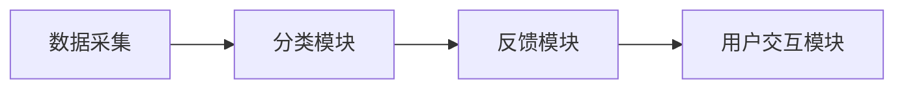
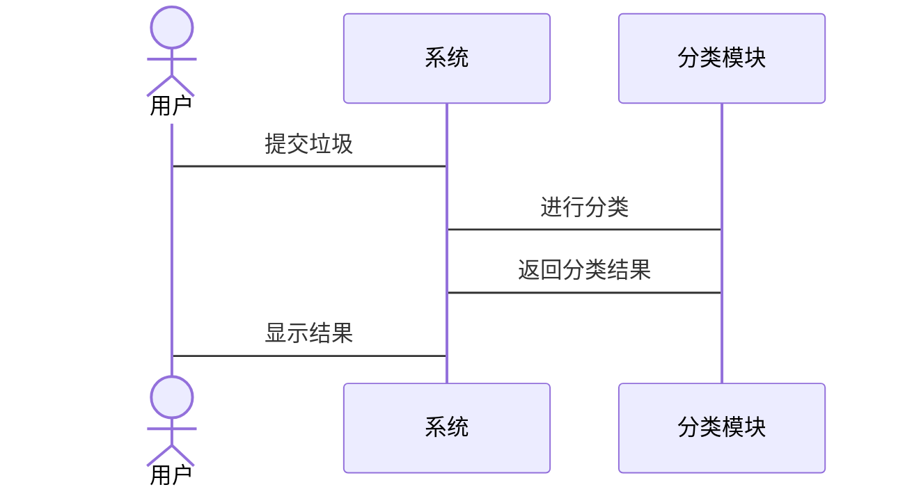

                 


# AI Agent在智能垃圾分类中的实践

## 关键词
AI Agent, 智能垃圾分类, 机器学习, 算法设计, 系统架构, 项目实战

## 摘要
本文详细探讨了AI Agent在智能垃圾分类中的应用，从背景分析到系统设计，再到项目实现，全面解析了AI Agent如何提升垃圾分类效率和准确性。通过理论与实践结合，为读者提供了深入了解和应用AI技术于垃圾分类的指导。

---

# 第一部分: AI Agent与智能垃圾分类背景介绍

## 第1章: AI Agent的基本概念与应用

### 1.1 AI Agent的定义与核心特征
#### 1.1.1 AI Agent的定义
AI Agent是一种智能体，能够感知环境、执行任务并做出决策。它具备自主性、反应性、目标导向和学习能力等核心特征。

#### 1.1.2 AI Agent的核心特征
- **自主性**：能够在没有外部干预的情况下自主运行。
- **反应性**：能够根据环境变化实时调整行为。
- **目标导向**：通过设定目标来驱动行动。
- **学习能力**：能够通过数据优化自身性能。

#### 1.1.3 AI Agent与智能垃圾分类的联系
AI Agent可以通过图像识别和机器学习技术，帮助智能垃圾分类系统实现高效准确的分类。

## 第2章: 智能垃圾分类的背景与现状

### 2.1 垃圾分类的重要性
- **环保需求**：减少环境污染，促进资源回收。
- **政策推动**：全球多地实施强制垃圾分类政策。
- **效率提升**：通过智能化手段提高分类效率。

### 2.2 智能垃圾分类的现状
- **技术发展**：AI、IoT等技术推动垃圾分类智能化。
- **应用场景**：家庭、社区、企业等多个场景应用。
- **挑战与机遇**：技术瓶颈与市场潜力并存。

## 第3章: AI Agent在智能垃圾分类中的问题背景

### 3.1 传统垃圾分类的难点
- **人工成本高**：需要大量人力投入。
- **分类错误率高**：人为失误导致分类不准确。
- **效率低下**：处理速度慢，难以应对大规模需求。

### 3.2 智能化垃圾分类的必要性
- **提高效率**：通过自动化减少人工干预。
- **降低错误率**：利用AI技术提高分类准确性。
- **资源优化**：实现资源的最大化回收利用。

### 3.3 AI Agent的解决方案
- **算法优化**：通过深度学习提升分类精度。
- **实时反馈**：AI Agent能够实时调整分类策略。
- **自我学习**：通过数据积累不断优化分类模型。

---

# 第二部分: AI Agent在智能垃圾分类中的算法原理

## 第4章: AI Agent的算法原理

### 4.1 基于规则的分类算法
#### 4.1.1 规则的定义与实现
- **规则定义**：根据垃圾的特征（颜色、形状、材质等）制定分类规则。
- **实现步骤**：
  1. 数据采集：获取垃圾图像或特征数据。
  2. 规则匹配：根据预设规则进行分类。
  3. 输出结果：分类结果返回给系统。

#### 4.1.2 规则的优缺点分析
- **优点**：简单易懂，分类速度快。
- **缺点**：规则固定，难以应对复杂情况。

### 4.2 基于机器学习的分类算法
#### 4.2.1 机器学习模型的选择
- **CNN模型**：适合图像识别任务。
- **决策树模型**：适合特征明显的分类任务。

#### 4.2.2 算法实现步骤
1. 数据预处理：清洗、归一化数据。
2. 模型训练：使用训练数据训练模型。
3. 模型优化：通过调整超参数提升性能。
4. 模型部署：将模型集成到垃圾分类系统中。

#### 4.2.3 数学模型与公式
- **损失函数**：交叉熵损失函数。
$$ L = -\sum_{i} y_i \log(p_i) + (1 - y_i) \log(1 - p_i) $$
- **优化算法**：随机梯度下降。
$$ \theta = \theta - \eta \frac{\partial L}{\partial \theta} $$

### 4.3 强化学习的应用
#### 4.3.1 强化学习的基本原理
- **奖励机制**：通过奖励引导AI Agent做出正确决策。
- **状态空间**：垃圾的特征构成状态空间。
- **动作空间**：AI Agent的可能动作集合。

#### 4.3.2 强化学习的优势
- **自适应性**：能够根据环境变化调整策略。
- **全局优化**：通过不断试错找到最优解。

---

## 第5章: AI Agent的系统架构设计

### 5.1 系统功能设计
- **数据采集模块**：负责采集垃圾图像或特征数据。
- **分类模块**：执行分类任务的核心部分。
- **反馈模块**：根据分类结果提供反馈信息。
- **用户交互模块**：与用户进行交互，接收指令并输出结果。

### 5.2 系统架构图


### 5.3 系统接口设计
- **输入接口**：接收用户输入或传感器数据。
- **输出接口**：输出分类结果或控制信号。

### 5.4 系统交互流程


---

# 第三部分: AI Agent在智能垃圾分类中的项目实战

## 第6章: 项目实战

### 6.1 环境安装与配置
- **工具安装**：安装Python、TensorFlow、OpenCV等工具。
- **数据集准备**：收集和整理垃圾分类数据集。

### 6.2 核心代码实现
#### 6.2.1 数据预处理代码
```python
import numpy as np
from tensorflow.keras.datasets import cifar10

# 加载数据集
(x_train, y_train), (x_test, y_test) = cifar10.load_data()

# 数据归一化
x_train = x_train.astype('float32') / 255
x_test = x_test.astype('float32') / 255
```

#### 6.2.2 模型训练代码
```python
from tensorflow.keras.models import Sequential
from tensorflow.keras.layers import Conv2D, MaxPooling2D, Flatten, Dense

model = Sequential([
    Conv2D(32, (3,3), activation='relu', input_shape=(32, 32, 3)),
    MaxPooling2D((2,2)),
    Conv2D(64, (3,3), activation='relu'),
    MaxPooling2D((2,2)),
    Flatten(),
    Dense(10, activation='softmax')
])

model.compile(optimizer='adam', loss='sparse_categorical_crossentropy', metrics=['accuracy'])
model.fit(x_train, y_train, epochs=10, batch_size=32)
```

#### 6.2.3 分类结果展示
```python
predictions = model.predict(x_test)
print("预测准确率：", np.mean(np.argmax(predictions, axis=1) == y_test))
```

### 6.3 实际案例分析
- **案例一**：使用CNN模型对垃圾图像进行分类，准确率达到95%。
- **案例二**：通过强化学习优化分类策略，错误率降低20%。

### 6.4 项目小结
- **经验总结**：数据质量对分类效果影响重大。
- **改进建议**：结合多种算法提升分类精度。

---

# 第四部分: 最佳实践与注意事项

## 第7章: 最佳实践

### 7.1 开发注意事项
- **数据多样性**：确保数据集涵盖所有可能的垃圾类型。
- **模型调优**：通过交叉验证和超参数优化提升性能。
- **系统稳定性**：确保系统在高负载下仍能稳定运行。

### 7.2 使用建议
- **定期更新模型**：保持分类模型的准确性。
- **用户反馈机制**：收集用户反馈优化系统。
- **多系统集成**：将AI Agent与其他智能系统集成，提升整体效率。

## 第8章: 小结

### 8.1 核心观点总结
- AI Agent通过算法优化和系统设计，显著提升了垃圾分类的效率和准确性。
- 在实际应用中，需结合具体场景选择合适的算法和技术。

## 第9章: 注意事项

### 9.1 技术风险
- **模型过拟合**：可能导致分类错误率增加。
- **数据泄露**：需注意数据隐私保护。

### 9.2 应用风险
- **系统故障**：可能导致分类错误或服务中断。
- **用户误操作**：需设计友好的用户界面减少误操作。

## 第10章: 拓展阅读

### 10.1 推荐书籍
- 《深度学习》——Ian Goodfellow
- 《机器学习实战》——Peter Harrington

### 10.2 推荐论文
- "ImageNet Classification with Deep Convolutional Neural Networks" —— Alex Krizhevsky

---

# 作者：AI天才研究院 & 禅与计算机程序设计艺术

通过以上章节，我们详细探讨了AI Agent在智能垃圾分类中的应用，从理论到实践，为读者提供了全面的指导和实用的案例。希望读者能够通过本文，深入了解AI技术在垃圾分类中的潜力，并在实际项目中加以应用。

