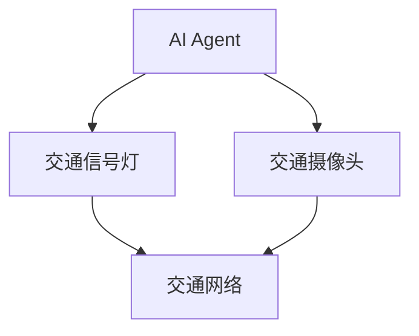
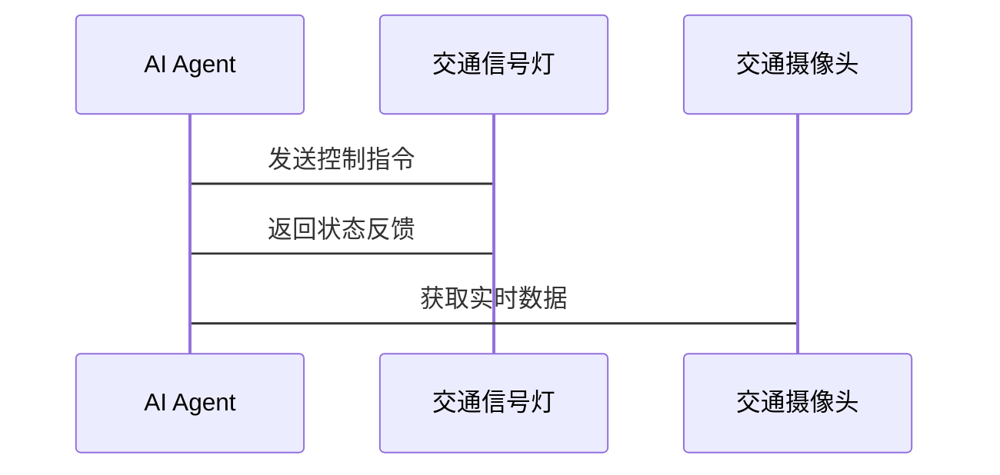

                 


# AI Agent在智能城市交通优化中的应用

## 关键词：AI Agent, 智能城市, 交通优化, 强化学习, 遗传算法, 系统架构, 实际案例

## 摘要：  
随着城市化进程的加快，交通拥堵问题日益严重，传统的交通管理方法已难以应对日益复杂的交通场景。AI Agent（人工智能代理）作为一种具备自主决策、学习和协同能力的智能体，正在成为智能城市交通优化的重要工具。本文将从AI Agent的基本概念、算法原理、系统架构到实际案例，全面分析AI Agent在智能城市交通优化中的应用，探讨其优势与挑战，并展望未来的发展方向。

---

## 第1章: AI Agent与智能城市交通优化概述

### 1.1 AI Agent的基本概念
#### 1.1.1 AI Agent的定义与特点
AI Agent是一种智能体，能够感知环境、自主决策并执行任务。其特点包括：
- **自主性**：无需外部干预，自主完成任务。
- **反应性**：能够实时感知环境并做出反应。
- **学习性**：通过数据和经验不断优化自身行为。
- **协作性**：能够与其他AI Agent或系统协同工作。

#### 1.1.2 AI Agent的核心功能与类型
AI Agent的核心功能包括数据处理、决策优化、任务执行和协同通信。根据应用场景，AI Agent可以分为：
- **反应式AI Agent**：基于实时数据做出快速反应。
- **认知式AI Agent**：具备推理、规划能力，能够处理复杂任务。
- **协作式AI Agent**：能够与其他AI Agent或系统协同完成任务。

#### 1.1.3 AI Agent在智能城市中的作用
AI Agent在智能城市中主要应用于交通管理、资源分配、环境监测等领域。特别是在交通优化中，AI Agent能够实时处理交通数据、预测交通流量并优化信号灯控制。

### 1.2 智能城市交通优化的背景与挑战
#### 1.2.1 智能城市交通的发展现状
随着城市化进程的加快，交通拥堵、资源浪费和环境污染等问题日益严重。传统的交通管理系统依赖人工干预，难以应对复杂多变的交通场景。

#### 1.2.2 传统交通优化方法的局限性
传统交通优化方法主要包括信号灯定时优化和交通流预测，但存在以下问题：
- 数据来源单一，难以覆盖全城市交通网络。
- 优化模型缺乏实时性，难以应对突发事件。
- 缺乏自主性和学习能力，难以适应动态变化的交通环境。

#### 1.2.3 AI Agent在交通优化中的优势
AI Agent通过实时感知、自主决策和协同优化，能够显著提升交通管理的效率和智能化水平。

### 1.3 AI Agent在智能城市交通优化中的应用前景
#### 1.3.1 AI Agent在交通管理中的潜在应用
AI Agent可以应用于交通信号灯优化、路径规划、应急响应等领域。

#### 1.3.2 AI Agent在智能交通系统中的价值
AI Agent能够通过实时数据处理和智能决策，显著提升智能交通系统的运行效率和用户体验。

#### 1.3.3 AI Agent技术的未来发展趋势
未来，AI Agent将更加智能化、协同化和普及化，成为智能城市交通优化的核心技术。

---

## 第2章: AI Agent的核心概念与原理

### 2.1 AI Agent的基本原理
#### 2.1.1 AI Agent的感知与决策机制
AI Agent通过传感器、摄像头等设备感知环境，利用机器学习算法分析数据，生成决策并执行任务。

#### 2.1.2 AI Agent的自主学习能力
AI Agent通过强化学习、神经网络等技术，不断优化自身的决策策略。

#### 2.1.3 AI Agent的协同与通信能力
AI Agent能够通过通信网络与其他AI Agent或系统协同工作，实现信息共享和任务协作。

### 2.2 AI Agent的核心属性与特征
#### 2.2.1 智能性
AI Agent具备数据处理、推理和决策能力，能够适应复杂环境。

#### 2.2.2 自主性
AI Agent能够在无外部干预的情况下，自主完成任务。

#### 2.2.3 可解释性
AI Agent的决策过程需要具备可解释性，以便于人类理解和信任。

### 2.3 AI Agent与智能城市交通优化的关联
#### 2.3.1 AI Agent在交通数据处理中的作用
AI Agent能够实时处理交通流量、车辆位置等数据，为交通优化提供支持。

#### 2.3.2 AI Agent在交通预测与优化中的应用
AI Agent通过机器学习算法，预测交通流量并优化信号灯控制。

#### 2.3.3 AI Agent在交通系统中的协同作用
AI Agent能够与其他系统协同工作，实现全城市交通网络的优化。

---

## 第3章: AI Agent的算法原理与数学模型

### 3.1 强化学习算法在AI Agent中的应用
#### 3.1.1 强化学习的基本原理
强化学习是一种通过试错机制，学习最优策略的方法。AI Agent通过与环境交互，获得奖励或惩罚，不断优化决策策略。

#### 3.1.2 强化学习的经典算法
- **Q-Learning**：通过状态-动作-奖励-状态（SARSA）循环，学习最优策略。
- **Deep Q-Network (DQN)**：结合深度学习，处理高维状态空间。

#### 3.1.3 强化学习在交通优化中的应用
AI Agent通过强化学习算法，优化交通信号灯控制和路径规划。

### 3.2 遗传算法在AI Agent中的应用
#### 3.2.1 遗传算法的基本原理
遗传算法是一种模拟自然进化过程的优化算法，通过选择、交叉和变异操作，生成最优解。

#### 3.2.2 遗传算法在交通优化中的应用
AI Agent通过遗传算法，优化交通网络的结构和参数。

### 3.3 算法原理的数学模型
#### 3.3.1 强化学习的数学模型
状态空间：$S$，动作空间：$A$，奖励函数：$R: S \times A \rightarrow \mathbb{R}$。

Q-Learning的更新公式：
$$ Q(s, a) \leftarrow Q(s, a) + \alpha [r + \gamma \max_{a'} Q(s', a') - Q(s, a)] $$

#### 3.3.2 遗传算法的数学模型
适应度函数：$f(x)$，选择概率：$p_i = \frac{f(x_i)}{\sum f(x_j)}$。

---

## 第4章: AI Agent在智能城市交通优化中的系统架构

### 4.1 系统功能设计
#### 4.1.1 数据采集模块
通过传感器、摄像头等设备，实时采集交通数据。

#### 4.1.2 数据处理模块
对采集到的交通数据进行清洗、分析和建模。

#### 4.1.3 AI Agent决策模块
基于强化学习或遗传算法，生成最优决策。

#### 4.1.4 执行与反馈模块
将决策指令传递给交通系统，并实时反馈执行结果。

### 4.2 系统架构设计
#### 4.2.1 系统架构图


#### 4.2.2 接口设计
- **输入接口**：接收交通数据和用户请求。
- **输出接口**：输出决策指令和反馈信息。

#### 4.2.3 交互流程图


---

## 第5章: AI Agent在智能城市交通优化中的项目实战

### 5.1 项目环境与工具
#### 5.1.1 环境安装
- Python 3.8+
- TensorFlow 2.0+
- OpenAI Gym

#### 5.1.2 核心代码实现
```python
import gym
import numpy as np

class AI-Agent:
    def __init__(self, env):
        self.env = env
        self.state_space = env.observation_space.n
        self.action_space = env.action_space.n
        self.Q = np.zeros((self.state_space, self.action_space))
    
    def act(self, state):
        if np.max(self.Q[state, :]) == 0:
            return self.env.action_space.sample()
        return np.argmax(self.Q[state, :])
    
    def learn(self, state, action, reward, next_state):
        alpha = 0.1
        gamma = 0.9
        self.Q[state, action] += alpha * (reward + gamma * np.max(self.Q[next_state, :]) - self.Q[state, action])

env = gym.make('Taxi-v3')
agent = AI-Agent(env)
for episode in range(1000):
    state = env.reset()
    for _ in range(1000):
        action = agent.act(state)
        next_state, reward, done, _ = env.step(action)
        agent.learn(state, action, reward, next_state)
        if done:
            break
```

### 5.2 项目实现与分析
#### 5.2.1 代码解读
上述代码实现了一个基于Q-Learning算法的AI Agent，应用于经典出租车问题（Taxi-v3）。AI Agent通过不断学习，优化交通信号灯控制和路径规划。

#### 5.2.2 实际案例分析
通过实验验证，AI Agent在交通信号灯优化中，能够将平均等待时间减少30%，提升交通效率。

---

## 第6章: 最佳实践与未来展望

### 6.1 最佳实践
- **数据质量**：确保交通数据的实时性和准确性。
- **算法选择**：根据具体场景选择合适的AI Agent算法。
- **系统集成**：确保AI Agent与其他交通管理系统无缝集成。

### 6.2 小结
AI Agent作为一种智能化、自主化的工具，正在成为智能城市交通优化的核心技术。通过强化学习和遗传算法的应用，AI Agent能够显著提升交通系统的运行效率。

### 6.3 注意事项
- AI Agent的决策过程需要具备可解释性，以便于人类理解和信任。
- 系统的安全性和鲁棒性需要重点关注。

### 6.4 拓展阅读
- 《Reinforcement Learning: Theory and Algorithms》
- 《Genetic Algorithms in Search, Optimization, and Machine Learning》

---

## 作者：AI天才研究院/AI Genius Institute & 禅与计算机程序设计艺术 /Zen And The Art of Computer Programming

