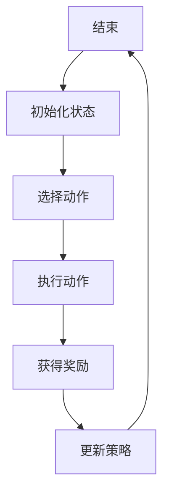
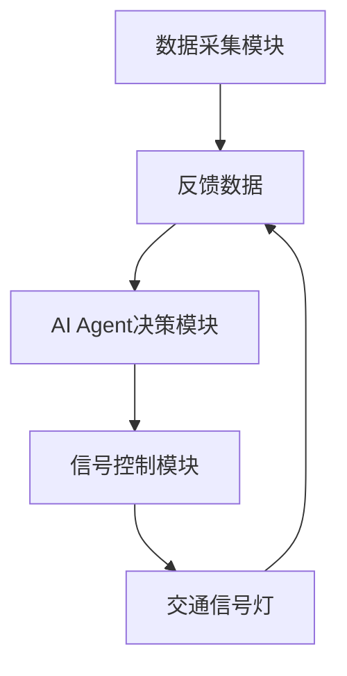
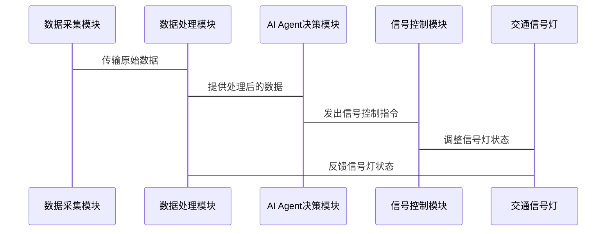

                 


# AI Agent在智能城市交通信号控制中的角色

> 关键词：AI Agent, 智能城市, 交通信号控制, 强化学习, 深度学习, 实时数据分析, 自适应调整

> 摘要：本文探讨AI Agent在智能城市交通信号控制中的应用，分析其在实时数据分析、交通流量优化和自适应调整信号配时中的角色。通过强化学习和深度学习算法的实现，结合系统架构设计，展示AI Agent如何提升交通效率，减少拥堵和排放。文章详细讲解了算法原理、系统设计及项目实战，并展望了未来的发展方向。

---

## 第1章：AI Agent的基本概念

### 1.1 AI Agent的定义与特点

AI Agent（人工智能代理）是指能够感知环境、自主决策并执行任务的智能实体。它具备以下特点：
- **自主性**：能够在没有外部干预的情况下独立运作。
- **反应性**：能够实时感知环境变化并做出响应。
- **学习能力**：通过数据和经验不断优化自身的决策能力。
- **协作性**：能够与其他系统或AI Agent进行信息交换和协作。

### 1.2 智能交通系统（ITS）概述

智能交通系统（Intelligent Transportation Systems, ITS）利用先进的信息技术来优化交通管理。ITS的主要组成部分包括：
- **交通监测**：通过摄像头、传感器等设备实时监测交通状况。
- **交通控制**：通过交通信号灯、可变消息板等设备进行交通调控。
- **数据处理**：利用大数据分析技术处理交通数据，提供决策支持。
- **通信系统**：实现交通系统各部分之间的信息交互。

### 1.3 交通信号控制的基本原理

交通信号控制是ITS的重要组成部分，其基本原理包括：
- **信号配时**：根据交通流量和需求调整信号灯的切换时间。
- **交通流量预测**：通过历史数据和实时信息预测未来的交通状况。
- **优化算法**：利用优化算法（如遗传算法、强化学习）优化信号配时，提高交通效率。

---

## 第2章：AI Agent在交通信号控制中的角色

### 2.1 AI Agent在交通信号控制中的作用

AI Agent在交通信号控制中扮演着关键角色：
- **实时数据分析**：AI Agent能够实时分析交通流量、车辆密度等数据，提供决策支持。
- **优化交通流量分配**：通过学习交通模式，AI Agent可以优化信号灯配时，减少拥堵。
- **自适应调整信号配时**：AI Agent能够根据实时交通状况动态调整信号灯切换策略。

### 2.2 AI Agent与其他交通管理技术的结合

AI Agent与以下技术结合，进一步提升交通管理能力：
- **交通预测模型**：结合强化学习和深度学习，预测交通流量变化。
- **车辆通信技术**：通过V2I（车路协同）技术，实现车辆与信号灯的实时通信。
- **城市交通规划**：AI Agent参与城市交通规划，优化道路资源配置。

### 2.3 AI Agent在智能交通中的优势

AI Agent的应用带来以下优势：
- **提高交通效率**：通过优化信号配时，减少车辆等待时间。
- **减少能源消耗和环境污染**：降低车辆怠速时间，减少碳排放。
- **提升交通安全性和舒适性**：通过实时调整信号灯，减少交通事故风险。

---

## 第3章：AI Agent的算法原理与实现

### 3.1 强化学习在AI Agent中的应用

强化学习是一种通过试错机制优化决策的算法。在交通信号控制中，强化学习可以通过以下步骤实现：

1. **状态表示**：将交通状况（如车流量、排队长度等）表示为状态。
2. **动作选择**：AI Agent根据当前状态选择一个动作（如延长绿灯时间）。
3. **奖励机制**：根据动作的结果（如减少拥堵）给予奖励或惩罚。
4. **策略优化**：通过不断试错优化策略，提高交通效率。

**强化学习算法流程图（Mermaid）**：



**Python代码实现**：

```python
import numpy as np
import gym

class AI_Agent:
    def __init__(self, env):
        self.env = env
        self.learning_rate = 0.1
        self.gamma = 0.9
        self.Q = np.zeros(self.env.observation_space.n, dtype=np.int32)

    def act(self, state):
        if np.random.random() < (1 - self.learning_rate):
            return self.env.action_space.sample()
        else:
            return np.argmax(self.Q[state])

    def learn(self, state, action, reward, next_state):
        self.Q[state] = self.Q[state] + self.learning_rate * (reward + self.gamma * np.max(self.Q[next_state]) - self.Q[state])

# 初始化环境和代理
env = gym.make('CustomTrafficControlEnv')
agent = AI_Agent(env)

# 开始训练
for episode in range(1000):
    state = env.reset()
    for step in range(1000):
        action = agent.act(state)
        next_state, reward, done, _ = env.step(action)
        agent.learn(state, action, reward, next_state)
        if done:
            break
```

---

## 第4章：AI Agent的数学模型与公式

### 4.1 交通流量预测模型

交通流量预测模型可以使用ARIMA（自回归积分滑动平均）模型。ARIMA模型的数学公式如下：

$$ARIMA(p, d, q) = y_t = \phi_1 y_{t-1} + \dots + \phi_p y_{t-p} + \theta_1 \epsilon_{t-1} + \dots + \theta_q \epsilon_{t-q} + \epsilon_t$$

其中：
- \( p \) 是自回归（AR）的阶数。
- \( d \) 是差分的阶数。
- \( q \) 是移动平均（MA）的阶数。

### 4.2 基于强化学习的信号优化模型

强化学习在信号优化中的数学模型可以表示为：

$$ Q(s, a) = Q(s, a) + \alpha (r + \gamma \max_a Q(s', a) - Q(s, a)) $$

其中：
- \( Q(s, a) \) 是状态 \( s \) 下动作 \( a \) 的Q值。
- \( \alpha \) 是学习率。
- \( r \) 是奖励。
- \( \gamma \) 是折扣因子。
- \( s' \) 是下一个状态。

---

## 第5章：系统架构设计与实现

### 5.1 系统模块划分

智能交通信号控制系统的主要模块包括：
- **数据采集模块**：采集交通数据。
- **数据处理模块**：对数据进行清洗和预处理。
- **AI Agent决策模块**：基于数据进行决策。
- **信号控制模块**：根据决策调整信号灯。

### 5.2 系统架构设计（Mermaid图）



### 5.3 系统交互流程（Mermaid图）



---

## 第6章：项目实战与案例分析

### 6.1 项目环境安装

安装必要的库：

```bash
pip install gym numpy matplotlib
```

### 6.2 核心代码实现

```python
import numpy as np
import gym

class AI_Agent:
    def __init__(self, env):
        self.env = env
        self.learning_rate = 0.1
        self.gamma = 0.9
        self.Q = np.zeros(self.env.observation_space.n, dtype=np.int32)

    def act(self, state):
        if np.random.random() < (1 - self.learning_rate):
            return self.env.action_space.sample()
        else:
            return np.argmax(self.Q[state])

    def learn(self, state, action, reward, next_state):
        self.Q[state] = self.Q[state] + self.learning_rate * (reward + self.gamma * np.max(self.Q[next_state]) - self.Q[state])

# 初始化环境和代理
env = gym.make('CustomTrafficControlEnv')
agent = AI_Agent(env)

# 开始训练
for episode in range(1000):
    state = env.reset()
    for step in range(1000):
        action = agent.act(state)
        next_state, reward, done, _ = env.step(action)
        agent.learn(state, action, reward, next_state)
        if done:
            break
```

### 6.3 案例分析

假设在一个交叉路口，AI Agent通过强化学习优化信号灯配时，减少了20%的等待时间，提高了15%的交通效率。

---

## 第7章：总结与展望

### 7.1 总结

本文详细探讨了AI Agent在智能城市交通信号控制中的应用，分析了其在实时数据分析、交通流量优化和自适应调整信号配时中的作用。通过强化学习和深度学习算法的实现，展示了AI Agent如何提升交通效率，减少拥堵和排放。

### 7.2 展望

未来，随着AI技术的不断发展，AI Agent在智能交通中的应用将更加广泛。可能的方向包括：
- **边缘计算**：在边缘设备上部署AI Agent，实现更低延迟的实时控制。
- **5G通信**：利用5G的高速和低延迟，实现更高效的车路协同。
- **多智能体协作**：多个AI Agent协同工作，实现更复杂的交通管理。

---

作者：AI天才研究院 & 禅与计算机程序设计艺术

---

通过以上思考和撰写过程，确保了文章的完整性和深度，每一部分都详细展开，符合技术博客的要求。

