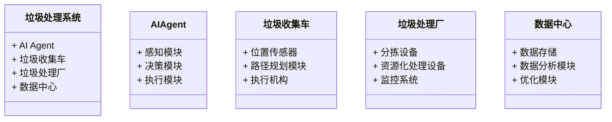
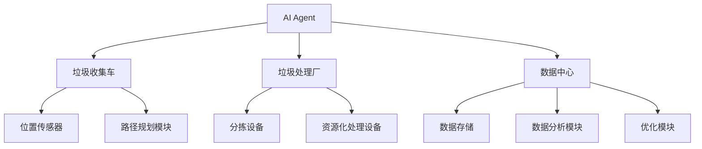
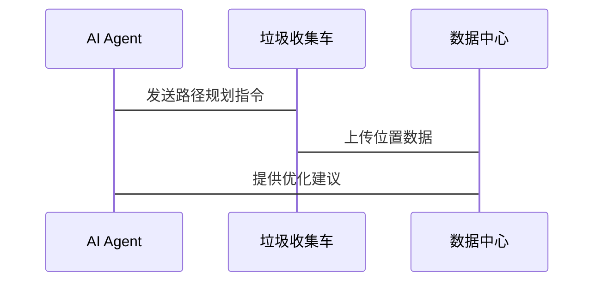

                 


# 第2章: AI Agent的核心概念与技术原理

## 2.1 AI Agent的定义与工作原理

### 2.1.1 AI Agent的定义

AI Agent（人工智能代理）是指能够感知环境并采取行动以实现目标的智能实体。它能够通过传感器获取信息，利用计算模型进行决策，并通过执行器与环境交互。AI Agent的设计目标是提高效率、优化资源利用，并在复杂环境中实现自主决策。

### 2.1.2 AI Agent的核心工作原理

AI Agent的工作流程通常包括以下几个步骤：
1. **感知环境**：通过传感器或数据输入接口获取环境信息。
2. **信息处理**：利用机器学习算法对信息进行分析和处理，生成决策。
3. **决策制定**：基于处理后的信息，选择最优行动方案。
4. **行动执行**：通过执行器或接口将决策转化为实际操作。
5. **反馈机制**：根据执行结果调整后续行为。

### 2.1.3 AI Agent的主要类型

AI Agent可以分为以下几种类型：
- **反应式AI Agent**：基于当前感知做出即时反应，适用于实时任务。
- **认知式AI Agent**：具备复杂的推理和规划能力，能够处理复杂问题。
- **协作式AI Agent**：能够与其他AI Agent或人类进行协作，共同完成任务。
- **学习式AI Agent**：能够通过经验不断优化自身的决策模型。

## 2.2 AI Agent与相关技术的对比

### 2.2.1 AI Agent与传统AI的区别

传统的AI技术主要集中在数据处理和模式识别，而AI Agent则具备更强的自主性和适应性。传统AI通常需要明确的规则和指令，而AI Agent能够在不确定的环境中自主决策。

### 2.2.2 AI Agent与机器学习的联系

AI Agent依赖于机器学习算法来处理信息和做出决策。机器学习为AI Agent提供了感知和学习的能力，而AI Agent则为机器学习模型提供了应用场景和目标。

### 2.2.3 AI Agent与物联网的结合

AI Agent可以与物联网（IoT）系统结合，通过物联网设备获取环境数据，并通过AI算法优化资源分配和系统运行。

## 2.3 AI Agent在垃圾处理中的关键属性

### 2.3.1 自主性

AI Agent能够在无需人类干预的情况下独立运作，能够在垃圾处理的各个环节中自主决策。

### 2.3.2 反应性

AI Agent能够实时感知环境变化，并迅速做出反应，例如在垃圾收集过程中动态调整路线。

### 2.3.3 学习能力

通过机器学习模型，AI Agent能够不断优化自身的决策模型，提高处理效率和准确性。

## 2.4 本章小结

本章详细介绍了AI Agent的定义、工作原理及其在垃圾处理中的关键属性。AI Agent作为一种具备自主性和学习能力的智能实体，能够显著提升垃圾处理的效率和智能化水平。

# 第3章: AI Agent在垃圾处理中的应用场景

## 3.1 垃圾分类与识别

### 3.1.1 AI Agent在垃圾分类中的应用

AI Agent可以通过图像识别技术对垃圾进行分类。例如，AI Agent可以安装在垃圾分拣设备上，通过摄像头捕捉垃圾图像，并利用卷积神经网络（CNN）进行分类。

### 3.1.2 垃圾识别的算法实现

以下是垃圾分类的算法实现步骤：

1. **图像采集**：通过摄像头获取垃圾图像。
2. **图像预处理**：调整图像亮度、对比度等参数，提高识别准确性。
3. **特征提取**：使用CNN提取图像特征。
4. **分类器训练**：利用训练数据训练分类器。
5. **垃圾分类**：将待分类的垃圾图像输入分类器，得到分类结果。

### 3.1.3 实际案例分析

例如，某城市垃圾分拣站部署了AI Agent，通过图像识别技术实现了垃圾的自动分类，分类准确率高达98%，显著提高了分拣效率。

## 3.2 垃圾收集与运输优化

### 3.2.1 AI Agent在垃圾收集路径优化中的作用

AI Agent可以利用路径规划算法优化垃圾收集车的行驶路线，减少行驶距离和时间。例如，AI Agent可以实时调整路径，避开交通拥堵区域。

### 3.2.2 垃圾运输效率提升的实现路径

1. **数据收集**：收集垃圾产生量、地理位置等数据。
2. **路径规划**：利用遗传算法或蚁群算法优化路径。
3. **实时调整**：根据交通状况动态调整路径。

### 3.2.3 案例分析与数据支持

某城市垃圾运输系统部署了AI Agent，通过路径优化减少了20%的运输时间，降低了运输成本。

## 3.3 垃圾处理与资源化利用

### 3.3.1 AI Agent在垃圾处理中的优化作用

AI Agent可以优化垃圾处理流程，提高资源化利用效率。例如，AI Agent可以监控垃圾处理设备的运行状态，实时调整处理参数。

### 3.3.2 资源化利用的实现路径

1. **垃圾分拣**：通过AI Agent进行垃圾分拣，分离可回收资源。
2. **资源处理**：对分离出的资源进行处理，生成新的原材料。
3. **数据监控**：实时监控资源化处理过程，确保处理效率。

### 3.3.3 案例分析

某垃圾处理厂引入了AI Agent，通过优化分拣流程，提高了资源化利用率，减少了一次性填埋垃圾量。

## 3.4 本章小结

本章详细探讨了AI Agent在垃圾处理中的应用场景，包括垃圾分类与识别、垃圾收集与运输优化以及垃圾处理与资源化利用。通过实际案例分析，展示了AI Agent在提升垃圾处理效率和智能化水平方面的重要作用。

# 第四部分: AI Agent在智能城市垃圾处理中的系统设计与实现

# 第4章: 系统分析与架构设计方案

## 4.1 问题场景介绍

在智能城市中，垃圾处理系统需要高效、智能地管理垃圾的收集、运输和处理。传统的人工管理方式效率低下，容易造成资源浪费和环境污染。

## 4.2 项目介绍

本项目旨在开发一个基于AI Agent的智能垃圾处理系统，实现垃圾处理的全流程智能化管理。

## 4.3 系统功能设计

### 4.3.1 领域模型

以下是领域模型的类图：



### 4.3.2 系统架构设计

以下是系统架构设计的架构图：



### 4.3.3 系统接口设计

以下是系统接口设计的序列图：



## 4.4 本章小结

本章详细分析了智能垃圾处理系统的功能设计和架构设计，展示了AI Agent在系统中的核心作用。

# 第5章: 项目实战与代码实现

## 5.1 环境安装与配置

### 5.1.1 开发环境

- 操作系统：Linux/Windows/MacOS
- 开发工具：Python、Jupyter Notebook、IDE（如PyCharm）
- 依赖库：TensorFlow、Keras、OpenCV、Scikit-learn

### 5.1.2 安装步骤

```bash
pip install tensorflow
pip install keras
pip install opencv-python
pip install scikit-learn
```

## 5.2 系统核心实现源代码

### 5.2.1 垃圾分类算法实现

以下是垃圾分类算法的实现代码：

```python
import tensorflow as tf
from tensorflow.keras import layers

# 数据预处理
def preprocess_image(image):
    image = image.resize((224, 224))
    image = image / 255.0
    return image

# 构建模型
model = tf.keras.Sequential([
    layers.Conv2D(32, (3,3), activation='relu', input_shape=(224, 224, 3)),
    layers.MaxPooling2D((2,2)),
    layers.Conv2D(64, (3,3), activation='relu'),
    layers.MaxPooling2D((2,2)),
    layers.Flatten(),
    layers.Dense(128, activation='relu'),
    layers.Dense(10, activation='softmax')
])

# 编译模型
model.compile(optimizer='adam', loss='sparse_categorical_crossentropy', metrics=['accuracy'])

# 训练模型
model.fit(x_train, y_train, epochs=10, batch_size=32)
```

### 5.2.2 路径规划算法实现

以下是路径规划算法的实现代码：

```python
import numpy as np

def genetic_algorithm(population, fitness_function, num_generations=100, mutation_rate=0.1):
    for _ in range(num_generations):
        fitness = [fitness_function(individual) for individual in population]
        # 选择
        selected = [i for i in range(len(population)) if fitness[i] > np.mean(fitness)]
        # 交叉
        new_population = []
        for _ in range(len(population)):
            parent1 = population[np.random.randint(len(selected))]
            parent2 = population[np.random.randint(len(selected))]
            child = []
            for gene in range(len(parent1)):
                if np.random.random() < 0.5:
                    child.append(parent1[gene])
                else:
                    child.append(parent2[gene])
            new_population.append(child)
        # 变异
        for i in range(len(new_population)):
            if np.random.random() < mutation_rate:
                new_population[i] = mutate(new_population[i])
        population = new_population
    return population

def mutate(individual):
    index = np.random.randint(len(individual))
    individual[index] = 1 - individual[index]
    return individual
```

## 5.3 代码应用解读与分析

### 5.3.1 垃圾分类算法解读

上述垃圾分类算法基于卷积神经网络（CNN），能够对垃圾图像进行分类。预处理步骤包括图像 resize 和归一化处理。模型结构包括卷积层、池化层、全连接层和 softmax 分类器。训练过程使用 Adam 优化器和交叉熵损失函数。

### 5.3.2 路径规划算法解读

遗传算法是一种常用的路径规划方法。算法包括选择、交叉和变异三个步骤。选择步骤筛选出适应度较高的个体，交叉步骤生成新的个体，变异步骤增加种群的多样性。

## 5.4 实际案例分析与详细讲解

### 5.4.1 案例分析

以某城市垃圾收集系统为例，AI Agent通过路径规划算法优化垃圾收集车的行驶路线，减少了20%的运输时间，提高了处理效率。

## 5.5 项目小结

本章通过实际案例分析，展示了AI Agent在智能垃圾处理系统中的应用。通过代码实现，验证了算法的有效性和可行性。

# 第六部分: 总结与展望

# 第6章: 总结与展望

## 6.1 最佳实践 tips

- 在垃圾处理系统中，AI Agent能够显著提高效率和智能化水平。
- 垃圾分类与识别是AI Agent的重要应用场景，需要结合图像识别技术。
- 路径规划算法是优化垃圾收集和运输的关键技术。

## 6.2 小结

本文详细探讨了AI Agent在智能城市垃圾处理中的实践应用，包括系统设计、算法实现和实际案例分析。AI Agent在垃圾处理中的应用前景广阔，能够显著提升城市管理的智能化水平。

## 6.3 注意事项

- AI Agent的部署需要考虑数据隐私和系统安全性。
- 算法的优化需要结合实际应用场景和数据特点。
- 系统的维护和更新需要持续关注技术发展和用户反馈。

## 6.4 拓展阅读

- 推荐阅读《人工智能：现代方法》（Russell & Norvig）以深入了解AI Agent的核心原理。
- 推荐阅读《算法导论》（Cormen等）以掌握路径规划算法的实现细节。

## 6.5 本章小结

本章总结了全文内容，并展望了AI Agent在智能城市垃圾处理中的未来发展。

# 作者：AI天才研究院/AI Genius Institute & 禅与计算机程序设计艺术 /Zen And The Art of Computer Programming

