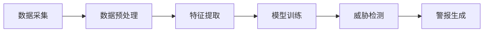
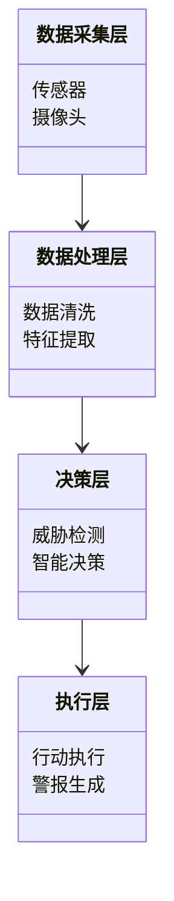

                 


# AI Agent在智能城市安全管理中的角色

> 关键词：AI Agent, 智能城市, 安全管理, 数据融合, 威胁检测, 系统架构

> 摘要：本文探讨了AI Agent在智能城市安全管理中的核心角色，详细分析了AI Agent的基本概念、算法原理、系统架构以及实际应用案例。通过结合理论与实践，本文展示了AI Agent如何通过数据融合、威胁检测和智能决策等技术手段，提升智能城市的安全管理水平，为未来的智能城市建设提供了重要的参考和启示。

---

## 第1章: AI Agent与智能城市安全管理概述

### 1.1 AI Agent的基本概念

#### 1.1.1 什么是AI Agent
AI Agent（人工智能代理）是一种能够感知环境、自主决策并执行任务的智能实体。它结合了人工智能、机器学习和自动化技术，能够通过数据驱动的方式实现智能化决策和行动。

#### 1.1.2 AI Agent的核心特征
AI Agent具有以下核心特征：
1. **自主性**：能够在没有外部干预的情况下独立运行。
2. **反应性**：能够实时感知环境变化并做出响应。
3. **学习能力**：通过机器学习算法不断优化自身的决策能力。
4. **协作性**：能够与其他AI Agent或系统协同工作。

#### 1.1.3 AI Agent在智能城市中的应用前景
智能城市是一个高度复杂和动态的系统，涉及交通、安防、能源等多个领域。AI Agent通过其智能化特性，能够有效解决智能城市安全管理中的复杂问题，如实时威胁检测、资源优化配置和应急响应等。

---

### 1.2 智能城市安全管理的背景

#### 1.2.1 智能城市的概念与发展
智能城市是指通过广泛应用信息技术，将城市中的各个系统有机整合，以实现资源优化配置和高效管理的城市形态。随着物联网、大数据和人工智能技术的快速发展，智能城市已经成为未来城市发展的主要方向。

#### 1.2.2 城市安全管理的挑战与需求
城市安全管理面临以下主要挑战：
1. **复杂性**：城市系统高度复杂，涉及多个子系统和利益相关方。
2. **动态性**：城市环境不断变化，安全威胁也随之演变。
3. **资源限制**：城市安全管理需要大量资源，包括人力、物力和财力。

#### 1.2.3 AI Agent在城市安全管理中的角色
AI Agent在城市安全管理中的角色可以概括为：
1. **实时监控**：通过传感器和数据采集系统，实时感知城市环境。
2. **威胁检测**：利用机器学习算法，识别潜在的安全威胁。
3. **智能决策**：基于多源数据和决策模型，生成最优的安全管理策略。
4. **应急响应**：在发生安全事件时，快速启动应急响应机制。

---

## 第2章: AI Agent的核心概念与原理

### 2.1 AI Agent的核心概念

#### 2.1.1 AI Agent的定义与分类
AI Agent可以根据功能和应用场景进行分类，常见的分类方式包括：
1. **按智能水平**：分为弱AI Agent和强AI Agent。
2. **按应用场景**：分为服务型AI Agent、监控型AI Agent和决策型AI Agent。

#### 2.1.2 AI Agent与传统安全系统的区别
以下是AI Agent与传统安全系统的对比：

| **特性**       | **AI Agent**                | **传统安全系统**              |
|----------------|-----------------------------|-----------------------------|
| **自主性**     | 高                           | 低                           |
| **学习能力**   | 高                           | 低                           |
| **响应速度**   | 快                           | 较慢                         |
| **适应性**     | 强                           | 较弱                         |

#### 2.1.3 AI Agent的工作原理
AI Agent的工作原理可以分为以下几个步骤：
1. **数据采集**：通过传感器、摄像头等设备采集城市环境中的数据。
2. **数据处理**：对采集到的数据进行清洗、融合和分析。
3. **威胁检测**：利用机器学习算法识别潜在的安全威胁。
4. **决策制定**：基于分析结果生成安全管理策略。
5. **行动执行**：根据决策结果执行相应的行动，如发出警报或启动应急机制。

---

### 2.2 AI Agent的核心算法

#### 2.2.1 基于机器学习的威胁检测
机器学习是一种常用的技术，用于训练AI Agent识别潜在威胁。以下是基于机器学习的威胁检测流程：



#### 2.2.2 基于深度学习的威胁预测
深度学习是一种更高级的机器学习技术，能够处理更复杂的数据模式。以下是基于深度学习的威胁预测流程：


---

## 第3章: AI Agent在智能城市安全管理中的应用

### 3.1 智能交通安全管理

#### 3.1.1 AI Agent在交通监控中的应用
AI Agent可以通过实时监控交通流量和识别异常行为，帮助城市管理部门优化交通流量和减少交通事故。

#### 3.1.2 AI Agent在交通事故预测中的应用
通过分析历史数据和实时数据，AI Agent可以预测潜在的交通事故，并提前采取预防措施。

#### 3.1.3 AI Agent在交通流量优化中的应用
AI Agent可以根据实时数据优化交通信号灯的控制，从而减少拥堵和提高通行效率。

---

### 3.2 智能安防管理

#### 3.2.1 AI Agent在视频监控中的应用
AI Agent可以通过视频分析技术实时监控城市中的重点区域，识别潜在的安全威胁。

#### 3.2.2 AI Agent在入侵检测中的应用
通过分析传感器数据和视频数据，AI Agent可以实时检测入侵行为并发出警报。

---

## 第4章: AI Agent的系统架构与设计

### 4.1 系统架构设计

#### 4.1.1 分层架构设计
AI Agent的系统架构通常采用分层设计，包括数据采集层、数据处理层、决策层和执行层。



#### 4.1.2 模块化设计
AI Agent的系统架构可以分为多个模块，包括数据采集模块、数据处理模块、决策模块和执行模块。

---

## 第5章: AI Agent的项目实战

### 5.1 智能交通安全管理案例

#### 5.1.1 环境配置
项目环境包括交通传感器、摄像头和交通信号灯等设备。

#### 5.1.2 代码实现
以下是基于机器学习的交通流量优化算法的Python实现：

```python
import numpy as np
from sklearn import linear_model

# 数据准备
X = np.array([[1, 2], [2, 3], [3, 4], [4, 5]])
y = np.array([5, 6, 7, 8])

# 模型训练
model = linear_model.LinearRegression()
model.fit(X, y)

# 预测交通流量
new_X = np.array([[5, 6]])
print(model.predict(new_X))  # 输出预测结果
```

---

## 第6章: 总结与展望

### 6.1 总结
本文详细探讨了AI Agent在智能城市安全管理中的核心角色，分析了其基本概念、算法原理和系统架构，并通过实际案例展示了其在智能交通和安防管理中的应用。

### 6.2 展望
未来，随着人工智能技术的不断发展，AI Agent在智能城市安全管理中的应用将更加广泛和深入。我们需要进一步优化算法、提升系统的可扩展性和可维护性，以应对更加复杂的安全挑战。

---

作者：AI天才研究院/AI Genius Institute & 禅与计算机程序设计艺术 /Zen And The Art of Computer Programming

