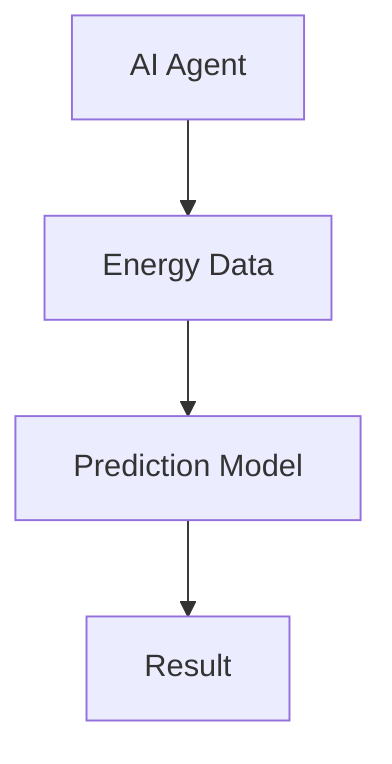
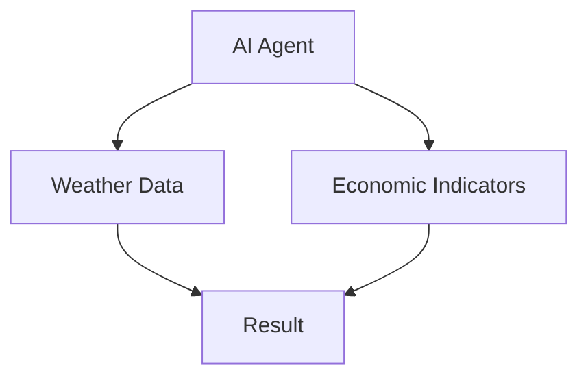
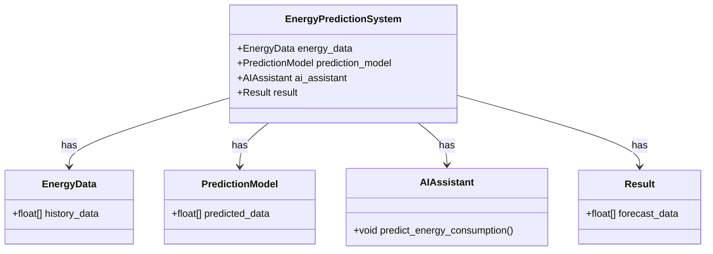
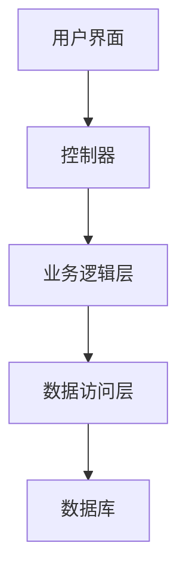
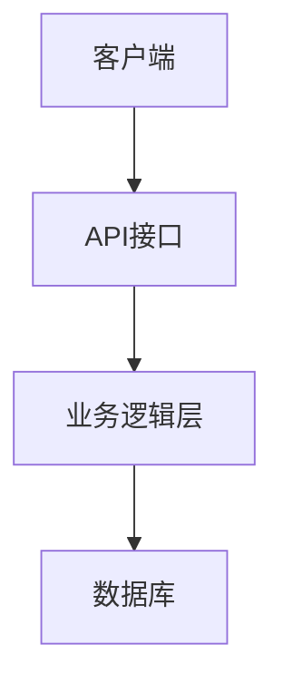
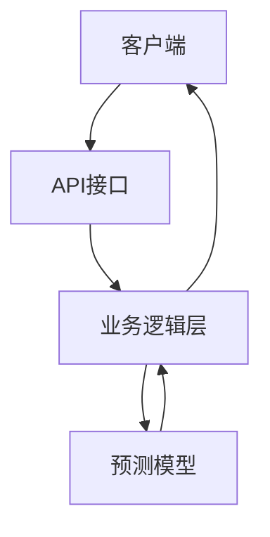

                 


# AI Agent在智能城市能源消耗预测中的实践

> 关键词：AI Agent, 智能城市, 能源消耗预测, 时间序列分析, 机器学习, 深度学习, 系统架构设计

> 摘要：本文详细探讨了AI Agent在智能城市能源消耗预测中的应用。首先介绍了AI Agent和智能城市的背景，然后分析了能源消耗预测的核心概念和技术基础，接着详细讲解了常用的算法原理和系统架构设计，最后通过一个实际项目展示了如何应用这些技术进行能源消耗预测。本文还总结了AI Agent在能源消耗预测中的优势和挑战，并提出了未来的研究方向。

---

## 第一部分: AI Agent与智能城市能源消耗预测的背景

### 第1章: AI Agent与智能城市概述

#### 1.1 AI Agent的基本概念

##### 1.1.1 AI Agent的定义
AI Agent（人工智能代理）是指能够感知环境、自主决策并执行任务的智能实体。它可以是一个软件程序、机器人或其他智能系统，通过与环境交互，实现特定目标。

##### 1.1.2 AI Agent的核心特征
- **自主性**：能够在没有外部干预的情况下独立运作。
- **反应性**：能够感知环境并实时做出反应。
- **目标导向**：具有明确的目标，并能够采取行动以实现这些目标。
- **学习能力**：能够通过经验改进自身的性能。

##### 1.1.3 AI Agent与传统自动化的区别
传统的自动化系统通常是基于固定的规则和程序运行，而AI Agent具备学习和适应能力，能够根据环境变化调整行为。

#### 1.2 智能城市的基本概念

##### 1.2.1 智能城市的定义
智能城市是指通过广泛应用信息技术，优化城市资源配置、提升城市管理水平、改善市民生活质量的城市发展模式。

##### 1.2.2 智能城市的主要特征
- **数据驱动**：依赖大量传感器和数据进行决策。
- **智能化管理**：利用AI、大数据等技术实现城市管理的智能化。
- **可持续发展**：注重资源节约和环境保护。

##### 1.2.3 智能城市的发展现状
目前，全球许多城市已经开始智能化转型，例如智能交通、智能能源管理等领域已经取得了显著进展。

#### 1.3 能源消耗预测的重要性

##### 1.3.1 能源消耗预测的定义
能源消耗预测是指通过历史数据和相关信息，预测未来某一时间段内的能源需求量。

##### 1.3.2 能源消耗预测的意义
- **优化能源分配**：通过准确预测能源需求，避免能源浪费和短缺。
- **降低运营成本**：合理规划能源使用，减少不必要的开支。
- **支持政策制定**：为政府制定能源政策提供科学依据。

##### 1.3.3 能源消耗预测的挑战
- **数据复杂性**：能源消耗受多种因素影响，如天气、经济活动等。
- **模型准确性**：需要高精度的预测模型才能满足实际需求。
- **实时性要求**：能源消耗预测需要实时更新，以应对突发情况。

#### 1.4 AI Agent在能源消耗预测中的作用

##### 1.4.1 AI Agent如何辅助能源消耗预测
AI Agent可以通过收集实时数据、分析历史趋势、识别模式，并根据当前情况做出预测。

##### 1.4.2 AI Agent的优势与局限性
- **优势**：能够处理大量数据，快速做出决策，适应环境变化。
- **局限性**：依赖于数据质量和模型准确性，存在一定的不确定性。

##### 1.4.3 AI Agent在智能城市中的应用前景
随着AI技术的不断发展，AI Agent在智能城市中的应用将更加广泛，尤其是在能源管理、交通控制等领域。

### 第2章: AI Agent在智能城市能源消耗预测中的问题背景

#### 2.1 问题背景介绍

##### 2.1.1 智能城市能源消耗的复杂性
能源消耗受到多种因素的影响，如天气、经济活动、人口分布等，使得预测变得复杂。

##### 2.1.2 能源消耗预测的难点
- **数据噪声**：数据中可能存在大量噪声，影响预测精度。
- **时间依赖性**：能源消耗往往具有很强的时间依赖性，需要考虑历史数据。
- **多因素影响**：能源消耗受多种因素影响，需要综合考虑。

##### 2.1.3 AI Agent如何解决这些问题
AI Agent能够通过机器学习算法，自动识别数据中的模式，并做出准确的预测。

#### 2.2 问题描述

##### 2.2.1 能源消耗预测的目标
准确预测未来某一时间段内的能源需求量，为能源管理和调度提供支持。

##### 2.2.2 能源消耗预测的输入与输出
- **输入**：历史能源消耗数据、天气数据、经济指标等。
- **输出**：未来能源需求的预测值。

##### 2.2.3 能源消耗预测的约束条件
- **数据可用性**：需要足够的历史数据支持预测。
- **计算资源**：需要高性能计算资源来训练和运行模型。
- **实时性要求**：需要在规定时间内完成预测。

#### 2.3 问题解决的思路

##### 2.3.1 数据驱动的预测方法
通过收集和分析大量数据，利用机器学习算法进行预测。

##### 2.3.2 AI Agent的自主决策能力
AI Agent能够根据实时数据自主调整预测模型，提高预测精度。

##### 2.3.3 多模型协同预测的策略
通过集成多种预测模型，结合各自的优势，提高整体预测的准确性。

#### 2.4 问题的边界与外延

##### 2.4.1 能源消耗预测的边界
- **预测范围**：通常限于特定区域或城市。
- **预测时间跨度**：可以是短期预测（数小时或数天）或长期预测（数月或数年）。

##### 2.4.2 相关问题的外延
- **能源来源**：需要考虑可再生能源的比例。
- **政策变化**：政策的变化可能影响能源消耗。

##### 2.4.3 与其他智能城市问题的关联
能源消耗预测与智能交通、智能建筑等领域密切相关，是智能城市的重要组成部分。

### 第3章: AI Agent与能源消耗预测的核心概念

#### 3.1 核心概念的定义与特征

##### 3.1.1 AI Agent的核心概念
- **感知**：通过传感器或其他数据源获取环境信息。
- **决策**：基于感知信息，做出最优决策。
- **执行**：根据决策结果，执行相应的动作。

##### 3.1.2 能源消耗预测的核心概念
- **时间序列分析**：研究数据随时间的变化规律。
- **预测模型**：用于生成未来能源需求的模型。
- **误差分析**：评估预测结果的准确性。

##### 3.1.3 AI Agent在能源预测中的角色
AI Agent作为预测系统的主体，负责数据处理、模型选择和预测结果的输出。

#### 3.2 核心概念之间的联系

##### 3.2.1 AI Agent与数据源的关系
AI Agent通过数据源获取能源消耗数据，并进行分析和预测。

##### 3.2.2 预测模型与实际应用的结合
预测模型需要结合实际情况，考虑各种因素的影响，提高预测的准确性。

##### 3.2.3 多目标优化与协同预测
通过多目标优化，提高预测模型的泛化能力和预测精度。

#### 3.3 核心概念的ER实体关系图

```mermaid
er
    %% ER图
    %% 作者：AI天才研究院
    %% 日期：2023-10-26
    %% 版权声明：禁止任何形式的商业用途，仅限学习交流
    %% ER图用于展示AI Agent在能源消耗预测中的核心概念关系

    矩形 {
        id: EnergyPrediction
        name: 能源消耗预测系统
    }

    矩形 {
        id: AIAssistant
        name: AI Agent
    }

    矩形 {
        id: EnergyData
        name: 能源数据
    }

    矩形 {
        id: PredictionModel
        name: 预测模型
    }

    矩形 {
        id: WeatherData
        name: 天气数据
    }

    矩形 {
        id: EconomicIndicators
        name: 经济指标
    }

    矩形 {
        id: Result
        name: 预测结果
    }

    关系线 {
        从 EnergyPrediction 到 AIAssistant
        标注: 包含
    }

    关系线 {
        从 EnergyPrediction 到 EnergyData
        标注: 包含
    }

    关系线 {
        从 EnergyPrediction 到 PredictionModel
        标注: 包含
    }

    关系线 {
        从 EnergyPrediction 到 WeatherData
        标注: 关联
    }

    关系线 {
        从 EnergyPrediction 到 EconomicIndicators
        标注: 关联
    }

    关系线 {
        从 EnergyPrediction 到 Result
        标注: 包含
    }

    关系线 {
        从 AIAssistant 到 EnergyData
        标注: 使用
    }

    关系线 {
        从 AIAssistant 到 WeatherData
        标注: 使用
    }

    关系线 {
        从 AIAssistant 到 EconomicIndicators
        标注: 使用
    }

    关系线 {
        从 AIAssistant 到 PredictionModel
        标注: 使用
    }
```

---

## 第4章: AI Agent与能源消耗预测的核心概念

#### 4.1 AI Agent与能源消耗预测的核心概念对比

| 概念         | AI Agent                   | 能源消耗预测                 |
|--------------|----------------------------|------------------------------|
| 定义         | 智能代理，能够自主决策     | 预测未来能源需求             |
| 目标         | 实现特定目标               | 提供准确的能源需求预测         |
| 输入         | 环境数据、历史数据         | 历史能源数据、天气数据、经济指标 |
| 输出         | 行动、决策                 | 预测结果                     |
| 技术基础     | 机器学习、自然语言处理     | 时间序列分析、回归分析       |

#### 4.2 核心概念之间的关系

##### 4.2.1 数据流关系


##### 4.2.2 交互关系


---

## 第5章: 算法原理

### 5.1 时间序列分析

#### 5.1.1 ARIMA模型

##### 5.1.1.1 ARIMA模型的定义
ARIMA（自回归积分滑动平均模型）是一种常用的时间序列预测模型，适用于线性、平稳的时间序列数据。

##### 5.1.1.2 ARIMA模型的数学公式
$$ ARIMA(p, d, q) = y_t = \phi_1 y_{t-1} + \dots + \phi_p y_{t-p} + \theta_1 \epsilon_{t-1} + \dots + \theta_q \epsilon_{t-q} + \epsilon_t $$

##### 5.1.1.3 ARIMA模型的实现步骤
1. 数据预处理：检查数据是否平稳，如果不平稳，进行差分处理。
2. 模型参数选择：通过AIC或BIC准则选择最佳的p和q值。
3. 模型训练：使用训练数据训练ARIMA模型。
4. 模型预测：利用训练好的模型进行未来能源消耗的预测。

##### 5.1.1.4 ARIMA模型的Python代码示例
```python
from statsmodels.tsa.arima.model import ARIMA

# 假设data是能源消耗的历史数据
model = ARIMA(data, order=(5, 1, 0))
model_fit = model.fit()

# 预测未来5天的能源消耗
forecast = model_fit.forecast(steps=5)
print(forecast)
```

#### 5.1.2 LSTM模型

##### 5.1.2.1 LSTM模型的定义
LSTM（长短期记忆网络）是一种基于RNN的变体，能够有效处理时间序列数据中的长期依赖关系。

##### 5.1.2.2 LSTM模型的数学公式
$$ f_t = \sigma(W_f \cdot [h_{t-1}, x_t] + b_f) $$
$$ i_t = \sigma(W_i \cdot [h_{t-1}, x_t] + b_i) $$
$$ o_t = \sigma(W_o \cdot [h_{t-1}, x_t] + b_o) $$
$$ c_t = f_t \cdot c_{t-1} + i_t \cdot tanh(W_c \cdot [h_{t-1}, x_t] + b_c) $$
$$ h_t = o_t \cdot tanh(c_t) $$

##### 5.1.2.3 LSTM模型的实现步骤
1. 数据预处理：将时间序列数据转换为适合LSTM输入的格式。
2. 模型构建：定义LSTM模型的结构，包括输入层、LSTM层和输出层。
3. 模型训练：使用训练数据训练LSTM模型。
4. 模型预测：利用训练好的模型进行未来能源消耗的预测。

##### 5.1.2.4 LSTM模型的Python代码示例
```python
import numpy as np
from keras.models import Sequential
from keras.layers import LSTM, Dense

# 假设data是能源消耗的历史数据，形状为 (timesteps, features)
model = Sequential()
model.add(LSTM(50, input_shape=(timesteps, features)))
model.add(Dense(1))
model.compile(optimizer='adam', loss='mean_squared_error')

# 训练模型
model.fit(X_train, y_train, epochs=100, batch_size=32)

# 预测未来5天的能源消耗
X_forecast = ...  # 准备预测数据
y_forecast = model.predict(X_forecast)
print(y_forecast)
```

#### 5.1.3 Prophet模型

##### 5.1.3.1 Prophet模型的定义
Prophet是由Facebook开源的时间序列预测模型，适用于非平稳的时间序列数据。

##### 5.1.3.2 Prophet模型的数学公式
Prophet模型基于时间序列分解和非参数回归，其数学公式较为复杂，主要包括以下几个部分：
- 周期性部分：捕捉数据中的周期性模式。
- 趋势部分：捕捉数据中的长期趋势。
- 季节性部分：捕捉数据中的季节性变化。

##### 5.1.3.3 Prophet模型的实现步骤
1. 数据预处理：将时间序列数据转换为适合Prophet输入的格式。
2. 模型构建：使用Prophet库构建预测模型。
3. 模型训练：使用训练数据训练Prophet模型。
4. 模型预测：利用训练好的模型进行未来能源消耗的预测。

##### 5.1.3.4 Prophet模型的Python代码示例
```python
from fbprophet import Prophet

# 假设data是能源消耗的历史数据，包含'date'和'y'两列
model = Prophet()
model.fit(data)

# 预测未来5天的能源消耗
future = model.make_future_dataframe(periods=5, include_history=False)
forecast = model.predict(future)
print(forecast)
```

---

## 第6章: 系统架构设计

### 6.1 问题场景介绍

#### 6.1.1 项目背景
本项目旨在利用AI Agent技术，构建一个智能城市能源消耗预测系统，帮助城市管理者优化能源资源配置。

#### 6.1.2 项目目标
通过AI Agent技术，实现对城市能源消耗的实时预测，提高能源利用效率。

### 6.2 系统功能设计

#### 6.2.1 领域模型设计

##### 6.2.1.1 领域模型的类图



#### 6.2.2 系统架构设计

##### 6.2.2.1 系统架构的分层



##### 6.2.2.2 系统架构的详细描述
- **用户界面**：提供友好的操作界面，供用户查看预测结果。
- **控制器**：接收用户的请求，并调用业务逻辑层的方法。
- **业务逻辑层**：处理具体的预测逻辑，调用数据访问层的方法。
- **数据访问层**：与数据库交互，获取历史数据和预测结果。
- **数据库**：存储历史能源消耗数据和预测结果。

#### 6.2.3 接口设计

##### 6.2.3.1 API接口



##### 6.2.3.2 API接口的详细描述
- **输入**：客户端发送预测请求，包含预测的时间范围和相关参数。
- **处理**：业务逻辑层调用预测模型进行计算。
- **输出**：返回预测结果给客户端。

#### 6.2.4 系统交互流程

##### 6.2.4.1 交互流程图



---

## 第7章: 项目实战

### 7.1 环境配置

#### 7.1.1 安装Python和相关库
- **Python版本**：3.8及以上
- **安装依赖**：
  ```bash
  pip install numpy pandas scikit-learn keras fbprophet
  ```

### 7.2 数据收集与预处理

#### 7.2.1 数据收集

##### 7.2.1.1 数据来源
- **历史能源消耗数据**：从能源管理部门获取。
- **天气数据**：从气象局获取。
- **经济指标**：从统计局获取。

##### 7.2.1.2 数据格式
```csv
date,energy_consumption,temperature,economic_indicator
2023-01-01,1000,20,1.5
2023-01-02,1200,18,1.6
...
```

#### 7.2.2 数据预处理

##### 7.2.2.1 数据清洗
- **处理缺失值**：使用均值或插值法填充缺失数据。
- **异常值处理**：识别并处理异常值。

##### 7.2.2.2 数据归一化
- **归一化方法**：使用最小-最大归一化。

##### 7.2.2.3 数据分割
- **训练集**：80%的数据用于训练。
- **测试集**：20%的数据用于测试。

### 7.3 模型训练与优化

#### 7.3.1 模型训练

##### 7.3.1.1 训练数据准备
- **特征工程**：提取有用的特征，如时间、温度、经济指标等。

##### 7.3.1.2 训练过程
- **选择模型**：根据数据特点选择合适的模型（ARIMA、LSTM、Prophet）。
- **模型训练**：使用训练数据训练模型。

#### 7.3.2 模型优化

##### 7.3.2.1 超参数调优
- **网格搜索**：通过网格搜索找到最佳的模型参数。

##### 7.3.2.2 模型评估
- **评估指标**：均方误差（MSE）、平均绝对误差（MAE）、R平方值（R²）。

#### 7.3.3 模型保存与加载

##### 7.3.3.1 模型保存
- **保存文件**：将训练好的模型保存为.pkl文件。

##### 7.3.3.2 模型加载
- **加载文件**：在后续使用中加载已保存的模型。

### 7.4 模型预测与结果分析

#### 7.4.1 模型预测

##### 7.4.1.1 预测数据准备
- **输入数据**：准备未来一段时间内的预测数据。

##### 7.4.1.2 预测过程
- **调用模型**：使用训练好的模型进行预测。

#### 7.4.2 结果分析

##### 7.4.2.1 结果可视化
- **折线图**：将实际值和预测值绘制在同一张图上，进行对比分析。

##### 7.4.2.2 结果评估
- **评估指标**：计算预测结果与实际值之间的误差，评估模型的准确性。

##### 7.4.2.3 模型优化
- **反馈机制**：根据预测结果和实际值的差异，调整模型参数，提高预测精度。

---

## 第8章: 总结与展望

### 8.1 总结

#### 8.1.1 核心内容回顾
- AI Agent在智能城市能源消耗预测中的应用。
- 时间序列分析的常用算法（ARIMA、LSTM、Prophet）。
- 系统架构设计与实现。

#### 8.1.2 经验与教训
- 数据预处理的重要性。
- 模型选择与调优的关键性。
- 系统架构设计的合理性。

### 8.2 展望

#### 8.2.1 未来的研究方向
- **多模型集成**：研究如何将多种预测模型集成，提高预测精度。
- **实时预测**：优化模型的计算效率，实现实时预测。
- **可解释性**：提高模型的可解释性，方便用户理解和使用。

#### 8.2.2 改进建议
- **数据源的扩展**：引入更多相关数据，如交通流量、人口流动等，提高预测的准确性。
- **模型的优化**：研究更先进的机器学习算法，如Transformer等，提高预测精度。
- **系统的扩展性**：设计更具扩展性的系统架构，方便后续功能的添加和升级。

### 8.3 最佳实践 Tips

#### 8.3.1 数据预处理
- 数据清洗是预测模型成功的关键，必须认真对待。
- 数据归一化有助于提高模型的训练效率和预测精度。

#### 8.3.2 模型选择
- 根据数据特点选择合适的模型，不要盲目追求复杂的模型。
- 对模型进行充分的调优，找到最佳的参数组合。

#### 8.3.3 系统架构设计
- 系统架构设计要充分考虑扩展性和可维护性。
- 接口设计要清晰，方便后续的功能扩展和模块替换。

#### 8.3.4 项目管理
- 在项目实施过程中，要注重团队协作和项目进度的管理。
- 定期进行项目评审和总结，及时发现问题并进行调整。

---

## 作者信息

**作者：AI天才研究院/AI Genius Institute & 禅与计算机程序设计艺术 /Zen And The Art of Computer Programming**

---

以上是《AI Agent在智能城市能源消耗预测中的实践》的完整目录和内容概述。文章详细介绍了AI Agent在智能城市能源消耗预测中的应用，从背景、核心概念、算法原理到系统架构设计和项目实战，内容丰富，结构清晰，适合技术从业者和研究人员阅读和参考。

