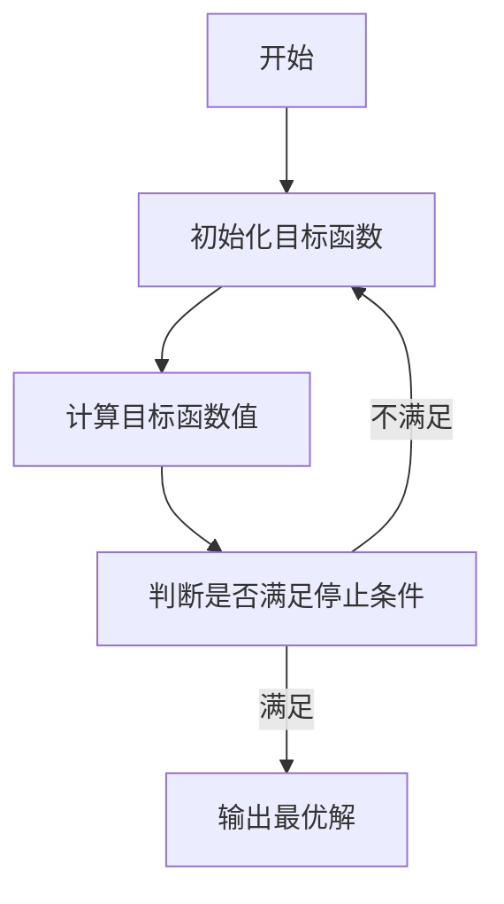
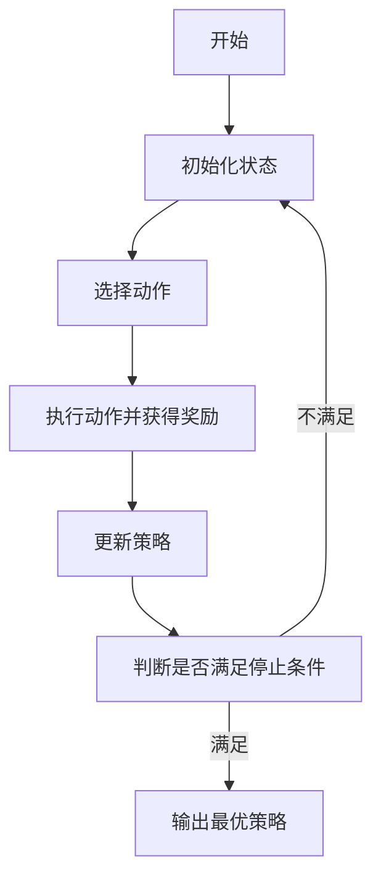

                 


# AI Agent在智能城市能源管理优化中的应用

> 关键词：AI Agent, 智能城市, 能源管理, 优化算法, 多智能体系统

> 摘要：  
本文详细探讨了AI Agent在智能城市能源管理优化中的应用，从背景、概念、算法、系统设计到项目实战，全面分析了AI Agent如何提升能源管理的效率和智能化水平。文章首先介绍了智能城市能源管理的现状与挑战，然后深入解析了AI Agent的核心概念与工作原理，接着重点分析了多目标优化算法和强化学习在能源管理中的应用，最后通过实际案例展示了AI Agent在智能电网、智能建筑和智能交通中的具体应用，并提出了系统的架构设计与优化建议。本文旨在为智能城市能源管理的优化提供理论依据和实践指导。

---

## 第一部分: AI Agent在智能城市能源管理优化中的应用概述

### 第1章: 背景介绍

#### 1.1 问题背景
智能城市的发展离不开能源的高效管理和优化。随着城市化进程的加快，能源消耗量急剧增加，能源浪费、能源分配不均以及能源管理的实时性与准确性等问题日益突出。传统的能源管理模式依赖人工干预，效率低下，难以应对复杂多变的能源需求。

AI Agent作为一种智能体，能够通过感知环境、自主决策并采取行动，为能源管理提供了一种全新的解决方案。AI Agent不仅可以实时优化能源分配，还可以通过数据驱动的方式预测能源需求，从而实现能源的高效利用。

#### 1.2 核心概念与问题描述
AI Agent（Artificial Intelligence Agent）是指在计算机系统中模拟人类或其他智能体行为的实体，具备感知、决策、执行和学习能力。在智能城市能源管理中，AI Agent可以通过收集能源消耗数据、分析需求模式，并根据实时情况优化能源分配策略。

能源管理的目标是通过优化能源的生成、传输和使用，减少能源浪费，提高能源利用效率。AI Agent在能源管理中的应用，可以实现能源的智能化调配，从而解决传统能源管理中的诸多问题。

#### 1.3 问题的边界与外延
AI Agent在能源管理中的应用范围广泛，包括智能电网、智能建筑、智能交通等领域。然而，AI Agent的应用也面临一些挑战，例如能源数据的实时性、算法的复杂性以及系统的安全性等。本文将重点探讨AI Agent在智能城市能源管理中的具体应用及其优化策略。

---

### 第2章: AI Agent的核心概念与原理

#### 2.1 AI Agent的基本原理
AI Agent的核心原理是通过感知环境、分析数据并采取行动来实现目标。在能源管理中，AI Agent可以通过以下步骤实现优化：

1. **感知环境**：AI Agent通过传感器或数据接口获取能源消耗数据、天气信息等。
2. **分析数据**：AI Agent利用机器学习算法对数据进行分析，识别能源消耗模式和需求预测。
3. **制定策略**：AI Agent根据分析结果制定能源分配策略，例如优先使用可再生能源或调整能源消耗高峰期的负载。
4. **执行行动**：AI Agent通过与能源管理系统接口，执行优化策略，例如调整电网负载或启动备用电源。

#### 2.2 AI Agent与传统能源管理的区别
传统的能源管理模式依赖人工干预，效率低下且难以应对复杂的能源需求。而AI Agent通过智能化的感知和决策，能够实时优化能源分配，显著提高能源利用效率。

| 对比维度 | 传统能源管理 | AI Agent能源管理 |
|----------|--------------|-----------------|
| **数据处理** | 依赖人工分析 | 数据驱动自动分析 |
| **决策效率** | 低效，依赖人工 | 高效，实时决策 |
| **适应性** | 稳定，难以调整 | 灵活，快速响应变化 |

#### 2.3 AI Agent的核心算法与实现
AI Agent的核心算法包括多目标优化算法和强化学习算法。以下是一个多目标优化算法的数学模型示例：

$$
\text{目标函数：} \quad f(x) = \min \{ f_1(x), f_2(x), \ldots, f_n(x) \}
$$

其中，$f_i(x)$ 表示不同的优化目标，例如能源消耗最小化和成本最小化。

通过多目标优化算法，AI Agent可以在多个目标之间找到平衡点，从而实现能源的最优分配。

---

### 第3章: 智能城市能源管理的现状与挑战

#### 3.1 智能城市能源管理的现状
智能城市能源管理的现状主要包括以下几个方面：

1. **数据采集**：通过传感器和物联网技术，实时采集能源消耗数据。
2. **数据分析**：利用大数据技术对能源消耗数据进行分析，识别需求模式。
3. **能源分配**：根据分析结果，优化能源分配策略。

#### 3.2 智能城市能源管理中的主要问题
智能城市能源管理面临的主要问题包括：

1. **能源浪费**：由于能源分配不合理，导致能源浪费。
2. **能源分配不均**：能源需求高峰期的负载分配不均，可能导致电力不足或浪费。
3. **实时性与准确性**：传统能源管理模式难以实现实时优化，且准确性较低。

---

### 第4章: AI Agent在智能城市能源管理中的应用前景

#### 4.1 AI Agent在智能城市能源管理中的优势
AI Agent在智能城市能源管理中的优势主要包括：

1. **提高能源利用效率**：通过智能化的优化算法，实现能源的高效利用。
2. **实现能源的智能分配**：根据实时需求，优化能源分配策略。
3. **提升能源管理的实时性与准确性**：通过数据驱动的方式，实时优化能源管理。

#### 4.2 AI Agent在智能城市能源管理中的具体应用
AI Agent在智能城市能源管理中的具体应用包括：

1. **智能电网**：通过AI Agent优化电力分配，减少电力浪费。
2. **智能建筑**：通过AI Agent实现建筑内部能源的智能化管理。
3. **智能交通**：通过AI Agent优化交通能源消耗，例如智能调度电动汽车充电。

---

## 第二部分: AI Agent在智能城市能源管理优化中的算法与系统设计

### 第5章: AI Agent在智能城市能源管理中的算法原理

#### 5.1 多目标优化算法
多目标优化算法是一种在多个目标之间寻找平衡点的优化方法。以下是一个简单的多目标优化算法的流程图：



#### 5.2 强化学习算法
强化学习算法是一种通过试错方式优化决策的算法。以下是一个强化学习算法的流程图：



---

### 第6章: 智能城市能源管理系统的架构设计

#### 6.1 系统功能设计
智能城市能源管理系统的功能设计包括以下几个方面：

1. **数据采集**：通过传感器和物联网技术，实时采集能源消耗数据。
2. **数据分析**：利用机器学习算法对数据进行分析，识别能源消耗模式。
3. **能源分配**：根据分析结果，优化能源分配策略。
4. **系统监控**：实时监控能源分配情况，调整优化策略。

#### 6.2 系统架构设计
智能城市能源管理系统的架构设计如下：


---

### 第7章: 智能城市能源管理系统的项目实战

#### 7.1 项目环境搭建
项目环境搭建包括以下几个步骤：

1. **安装Python环境**：安装Python 3.8及以上版本。
2. **安装相关库**：安装NumPy、Pandas、Scikit-learn等库。
3. **数据采集**：通过传感器或API获取能源消耗数据。

#### 7.2 核心代码实现
以下是一个多目标优化算法的Python代码示例：

```python
import numpy as np
from sklearn import linear_model

# 数据准备
X = np.array([[1, 2], [3, 4], [5, 6]])
y = np.array([7, 8, 9])

# 模型训练
model = linear_model.LinearRegression()
model.fit(X, y)

# 预测结果
print(model.predict([[7, 8]]))
```

#### 7.3 案例分析
以智能电网为例，通过AI Agent优化电力分配，减少电力浪费。具体步骤包括：

1. **数据采集**：采集各个区域的电力消耗数据。
2. **数据分析**：利用机器学习算法分析电力消耗模式。
3. **优化策略**：根据分析结果，优化电力分配策略。
4. **系统实现**：通过AI Agent实现电力分配的智能化管理。

---

### 第8章: 总结与展望

#### 8.1 总结
本文详细探讨了AI Agent在智能城市能源管理优化中的应用，从背景、概念、算法到系统设计，全面分析了AI Agent如何提升能源管理的效率和智能化水平。

#### 8.2 应用前景
AI Agent在智能城市能源管理中的应用前景广阔，未来可以通过进一步优化算法和提升系统的实时性与准确性，实现能源的更高效利用。

#### 8.3 最佳实践 tips
1. 在实际应用中，建议结合具体场景选择合适的算法。
2. 数据质量对AI Agent的性能影响较大，需要确保数据的准确性和完整性。
3. 系统的安全性也需要重点关注，防止数据泄露和系统攻击。

#### 8.4 拓展阅读
建议进一步阅读相关领域的文献，例如《强化学习入门》和《多目标优化算法研究》。

---

## 作者：AI天才研究院 & 禅与计算机程序设计艺术

---

希望这篇博客能够为读者提供关于AI Agent在智能城市能源管理优化中的应用的全面了解，感谢您的阅读！

