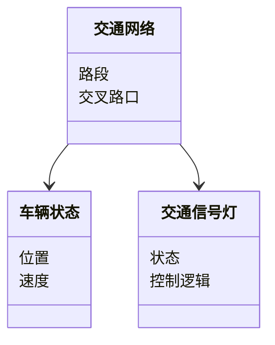

                 


# AI Agent在智能城市规划中的作用

> 关键词：AI Agent, 智能城市, 城市规划, 机器学习, 多智能体系统, 强化学习, 图神经网络

> 摘要：本文详细探讨了AI Agent在智能城市规划中的作用，从基本概念到核心算法，再到系统架构和实际案例，全面分析了AI Agent如何提升城市规划的效率和质量。文章结合理论与实践，展示了AI Agent在智能城市中的潜力和应用前景。

---

## 第一部分：AI Agent在智能城市规划中的背景与概述

### 第1章：AI Agent的基本概念与智能城市规划的背景

#### 1.1 AI Agent的基本概念

##### 1.1.1 AI Agent的定义
AI Agent（人工智能代理）是一种能够感知环境、自主决策并执行任务的智能实体。它通过传感器获取信息，利用算法进行推理，并通过执行器与环境互动。AI Agent可以是软件程序，也可以是物理设备，例如自动驾驶汽车或智能音箱。

##### 1.1.2 AI Agent的核心特征
- **自主性**：能够在没有外部干预的情况下运行。
- **反应性**：能够实时感知环境变化并做出反应。
- **目标导向**：具备明确的目标，所有行为都围绕目标展开。
- **学习能力**：能够通过经验改进自身性能。

##### 1.1.3 AI Agent与传统自动化的区别
传统自动化依赖预设的规则和程序，而AI Agent具备学习和适应能力，能够在复杂多变的环境中做出最优决策。

#### 1.2 智能城市规划的背景

##### 1.2.1 智能城市的发展历程
智能城市的概念起源于20世纪末，随着信息技术的发展，城市逐渐实现了数字化和网络化。近年来，AI和大数据技术的兴起推动了智能城市的快速发展。

##### 1.2.2 当前智能城市规划的核心问题
- **交通拥堵**：如何优化交通流量，减少拥堵。
- **资源分配**：如何高效分配能源、水资源等。
- **环境保护**：如何减少污染，提高环境质量。
- **公共安全**：如何提升城市安全，预防犯罪。

##### 1.2.3 AI技术在智能城市中的应用潜力
AI技术可以用于城市交通管理、能源优化、环境保护等多个领域，帮助城市实现更高效的管理和运营。

#### 1.3 AI Agent在智能城市规划中的作用

##### 1.3.1 AI Agent如何辅助城市规划
AI Agent可以通过数据采集、分析和决策，帮助城市规划者优化城市布局，例如交通网络设计、土地利用规划等。

##### 1.3.2 AI Agent在智能城市中的应用场景
- **交通管理**：实时调整交通信号灯，优化交通流量。
- **能源管理**：智能分配能源，减少浪费。
- **公共安全**：预测犯罪高发区，提前部署警力。

##### 1.3.3 AI Agent对城市规划效率的提升
通过自动化数据处理和智能决策，AI Agent能够显著提高城市规划的效率和准确性。

---

### 第2章：AI Agent的核心概念与技术基础

#### 2.1 AI Agent的核心概念

##### 2.1.1 AI Agent的结构与功能
AI Agent通常包括感知模块、推理模块和执行模块。感知模块负责获取环境信息，推理模块负责分析信息并做出决策，执行模块负责执行决策。

##### 2.1.2 AI Agent的决策机制
决策机制是AI Agent的核心，常见的决策方法包括基于规则的决策、基于模型的决策和基于学习的决策。

##### 2.1.3 AI Agent的学习能力
AI Agent可以通过监督学习、无监督学习和强化学习等方法不断优化自身性能。

#### 2.2 AI Agent的技术基础

##### 2.2.1 机器学习与深度学习
机器学习是AI Agent的核心技术，深度学习通过神经网络模型实现更复杂的任务。

##### 2.2.2 自然语言处理
自然语言处理技术使AI Agent能够理解和生成人类语言，应用于智能客服、信息检索等领域。

##### 2.2.3 计算机视觉
计算机视觉技术使AI Agent能够识别和处理图像信息，应用于智能监控、自动驾驶等领域。

#### 2.3 AI Agent与多智能体系统

##### 2.3.1 多智能体系统的定义
多智能体系统是指多个AI Agent协作完成复杂任务的系统，通常应用于分布式计算和大规模问题求解。

##### 2.3.2 多智能体系统中的协作机制
协作机制包括通信协议、任务分配和协调机制，确保多个AI Agent能够高效协作。

##### 2.3.3 多智能体系统在智能城市中的应用
在智能城市中，多智能体系统可以应用于交通管理、能源分配和公共安全等领域，实现多个AI Agent的协同工作。

---

## 第二部分：AI Agent在智能城市规划中的算法与数学模型

### 第3章：AI Agent的核心算法原理

#### 3.1 强化学习算法

##### 3.1.1 强化学习的基本原理
强化学习是一种通过试错学习方法，通过与环境互动来优化决策策略的算法。AI Agent通过与环境互动，学习最优策略以最大化累计奖励。

##### 3.1.2 Q-learning算法
Q-learning是一种经典的强化学习算法，通过更新Q值表来学习最优策略。Q值表表示在特定状态下采取某种动作的预期奖励。

##### 3.1.3 Deep Q-Networks (DQN)算法
DQN算法结合了深度学习和强化学习，通过神经网络近似Q值函数，适用于高维状态空间和动作空间的问题。

#### 3.2 图神经网络

##### 3.2.1 图神经网络的基本概念
图神经网络是一种处理图结构数据的深度学习模型，能够捕捉节点之间的关系和全局结构信息。

##### 3.2.2 图卷积网络（Graph Convolutional Networks）
图卷积网络是图神经网络的一种，通过局部聚合操作将图的节点信息传播到邻居节点。

##### 3.2.3 图注意力网络（Graph Attention Networks）
图注意力网络通过注意力机制，关注图中重要的节点信息，适用于需要全局信息的场景。

#### 3.3 联合学习（Federated Learning）

##### 3.3.1 联合学习的基本原理
联合学习是一种分布式学习方法，多个AI Agent在不共享数据的情况下，通过交换模型参数来协同训练。

##### 3.3.2 联合学习的挑战与解决方案
联合学习面临数据异质性和通信开销等问题，可以通过异步更新和模型压缩等技术进行优化。

##### 3.3.3 联合学习在智能城市中的应用
在智能城市中，联合学习可以应用于分布式能源管理和交通优化，保护数据隐私的同时实现协同优化。

---

## 第三部分：AI Agent在智能城市规划中的系统架构与设计

### 第4章：AI Agent的系统架构设计

#### 4.1 问题场景介绍
在智能城市中，AI Agent需要解决复杂的城市规划问题，例如交通网络优化和能源分配。

#### 4.2 项目介绍
以智能交通管理系统为例，设计一个基于AI Agent的交通优化系统。

#### 4.3 系统功能设计

##### 4.3.1 领域模型设计
领域模型包括交通网络、车辆状态和交通信号灯等元素，通过类图展示各组件之间的关系。

##### 4.3.2 领域模型Mermaid类图


#### 4.4 系统架构设计

##### 4.4.1 系统架构Mermaid图
```mermaid
div class=mermaid
graph TD
    A[AI Agent] --> B[交通信号灯]
    A --> C[车辆路径规划]
    B --> D[交通流量]
    C --> D
```

#### 4.5 系统接口设计
系统接口包括AI Agent与交通信号灯的交互接口，以及AI Agent与车辆的通信接口。

#### 4.6 系统交互Mermaid序列图
```mermaid
div class=mermaid
sequenceDiagram
    participant AI Agent
    participant 交通信号灯
    AI Agent -> 交通信号灯: 请求当前状态
    交通信号灯 -> AI Agent: 返回当前状态
    AI Agent -> 交通信号灯: 发送新的控制信号
    交通信号灯 -> AI Agent: 确认接收信号
```

---

## 第四部分：AI Agent在智能城市规划中的项目实战

### 第5章：AI Agent的项目实战

#### 5.1 环境安装
需要安装Python、TensorFlow、Keras和Mermaid等工具。

#### 5.2 系统核心实现源代码

##### 5.2.1 AI Agent的强化学习实现
```python
import numpy as np
import gym

class AIAgent:
    def __init__(self, env):
        self.env = env
        self.learning_rate = 0.1
        self.discount_factor = 0.9
        self.Q = {}

    def get_action(self, state):
        if state not in self.Q:
            self.Q[state] = np.zeros(self.env.action_space.n)
        max_action = np.argmax(self.Q[state])
        return max_action

    def update_Q(self, state, action, reward, next_state):
        current_Q = self.Q[state][action]
        next_max_Q = np.max(self.Q.get(next_state, [0]))
        self.Q[state][action] = current_Q + self.learning_rate * (reward + self.discount_factor * next_max_Q)

env = gym.make('CartPole-v1')
agent = AIAgent(env)
for _ in range(1000):
    state = env.reset()
    while True:
        action = agent.get_action(state)
        next_state, reward, done, _ = env.step(action)
        agent.update_Q(state, action, reward, next_state)
        if done:
            break
```

##### 5.2.2 图神经网络实现
```python
import torch
import torch.nn as nn
import torch.nn.functional as F

class GraphConvolution(nn.Module):
    def __init__(self, in_channels, out_channels):
        super(GraphConvolution, self).__init__()
        self.weight = nn.Parameter(torch.randn(in_channels, out_channels))

    def forward(self, input, adj):
        output = torch.bmm(input, self.weight)
        output = torch.matmul(adj, output)
        return output

class GNN(nn.Module):
    def __init__(self, input_size, hidden_size, output_size):
        super(GNN, self).__init__()
        self.gc1 = GraphConvolution(input_size, hidden_size)
        self.gc2 = GraphConvolution(hidden_size, output_size)
        self.relu = nn.ReLU()

    def forward(self, input, adj):
        output = self.gc1(input, adj)
        output = self.relu(output)
        output = self.gc2(output, adj)
        return output

# 示例输入和边的关系
input = torch.randn(4, 3)
adj = torch.randn(4, 4)
model = GNN(3, 5, 2)
output = model(input, adj)
print(output)
```

#### 5.3 实际案例分析与详细讲解
以智能交通管理为例，AI Agent通过强化学习优化交通信号灯控制，减少交通拥堵，提高交通效率。

#### 5.4 项目小结
通过项目实战，展示了AI Agent在智能城市中的应用潜力，验证了算法的有效性和系统的可行性。

---

## 第五部分：AI Agent在智能城市规划中的总结与展望

### 第6章：总结与展望

#### 6.1 文章小结
本文详细探讨了AI Agent在智能城市规划中的作用，从基本概念到核心算法，再到系统架构和实际案例，全面分析了AI Agent如何提升城市规划的效率和质量。

#### 6.2 最佳实践 tips
- **数据质量**：确保数据的准确性和完整性，提升AI Agent的性能。
- **算法选择**：根据具体问题选择合适的算法，优化系统性能。
- **系统集成**：注重系统模块的协同工作，确保整体效果。

#### 6.3 注意事项
- **数据隐私**：保护用户数据隐私，遵守相关法律法规。
- **系统稳定性**：确保系统的稳定性和可靠性，避免故障发生。
- **可扩展性**：设计可扩展的系统架构，适应未来的发展需求。

#### 6.4 拓展阅读
建议读者进一步阅读相关领域的最新研究成果，了解AI Agent在智能城市中的更多应用场景和技术进展。

---

## 作者：AI天才研究院/AI Genius Institute & 禅与计算机程序设计艺术 /Zen And The Art of Computer Programming

---

通过以上思考步骤，我逐步构建了文章的各个部分，确保内容全面、逻辑清晰，并符合用户的要求。

