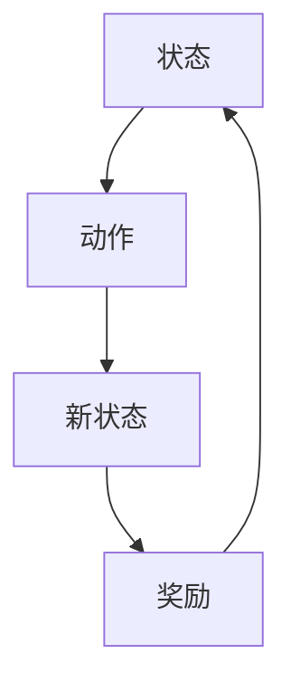
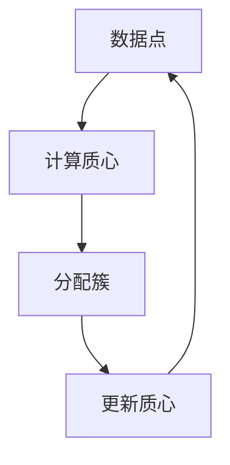
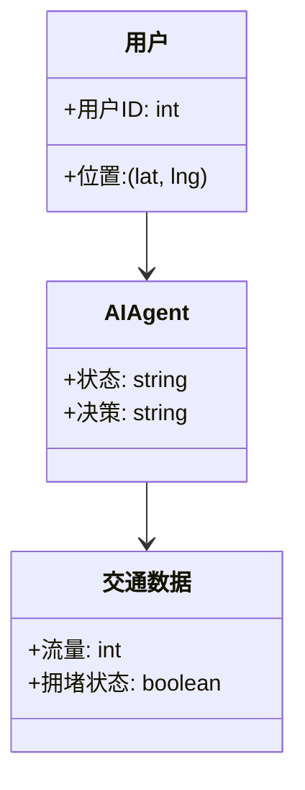
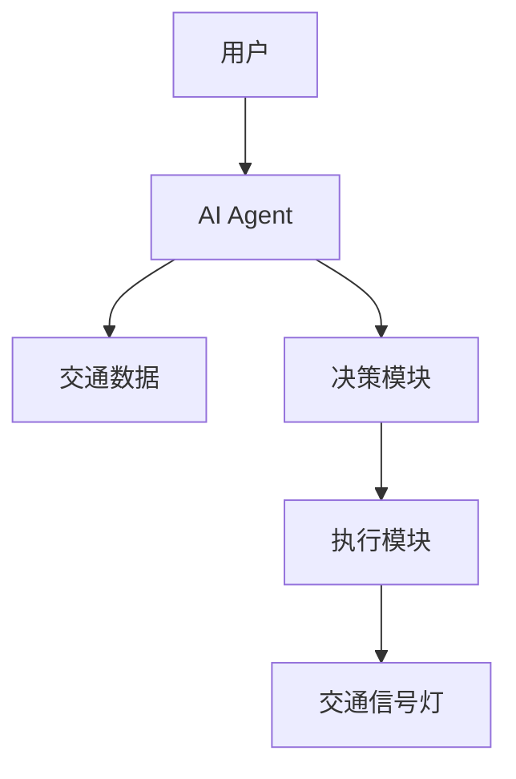
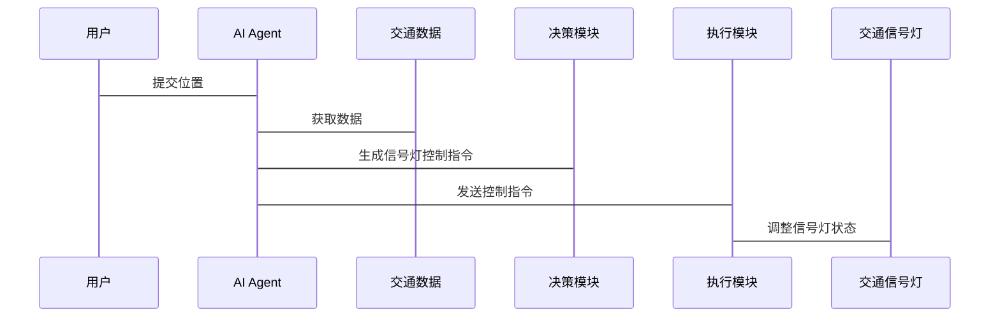

                 


# AI Agent在智能城市规划中的角色

> 关键词：AI Agent, 智能城市, 城市规划, 强化学习, 聚类算法, 数学模型, 系统架构

> 摘要：本文探讨AI Agent在智能城市规划中的核心角色，分析其在城市交通、资源分配和环境监测等领域的应用。通过详细讲解AI Agent的感知、决策和执行机制，结合强化学习、聚类算法等，展示其如何提升城市规划效率和质量。文章还提供了一个智能交通管理系统的实战案例，分析其系统架构和实现细节。

---

# 第1章: AI Agent与智能城市规划概述

## 1.1 AI Agent的基本概念

### 1.1.1 AI Agent的定义与特点
AI Agent（人工智能代理）是指能够感知环境、自主决策并执行任务的智能实体。其特点包括：
- **自主性**：无需外部干预，自主完成任务。
- **反应性**：能够实时感知环境变化并做出反应。
- **学习性**：通过数据和经验不断优化自身行为。
- **协作性**：能够与其他Agent或系统协同工作。

### 1.1.2 AI Agent的核心属性与功能
AI Agent的核心属性包括：
- **感知能力**：通过传感器或数据源获取环境信息。
- **决策能力**：基于感知信息，利用算法做出最优决策。
- **执行能力**：通过执行机构或接口将决策转化为实际操作。

### 1.1.3 AI Agent与传统城市规划的对比
传统城市规划依赖人工分析和经验判断，而AI Agent能够通过大数据分析和机器学习模型提供更精准、高效的规划建议。

---

## 1.2 智能城市规划的背景与目标

### 1.2.1 智能城市的发展历程
智能城市的概念起源于20世纪末，随着物联网、大数据和人工智能技术的发展，智能城市逐渐从概念走向实际应用。

### 1.2.2 智能城市规划的核心目标
智能城市规划的目标包括：
- 提高城市资源利用效率。
- 优化城市交通系统。
- 改善城市生态环境。
- 提升居民生活质量。

### 1.2.3 智能城市规划的挑战与机遇
挑战包括数据获取难度、算法复杂性和隐私保护问题；机遇则是技术进步带来的效率提升和创新可能性。

---

## 1.3 AI Agent在智能城市规划中的角色

### 1.3.1 AI Agent在城市规划中的应用场景
- **交通管理**：优化交通流量，减少拥堵。
- **资源分配**：智能分配电力、水资源等。
- **环境监测**：实时监测空气质量、噪声污染等。

### 1.3.2 AI Agent如何提升城市规划效率
AI Agent能够快速处理大量数据，提供实时反馈和优化建议，显著提升城市规划的效率和质量。

### 1.3.3 AI Agent在智能城市中的未来发展趋势
随着AI技术的不断进步，AI Agent将更加智能化、协同化和普及化，成为智能城市规划的核心工具。

---

# 第2章: AI Agent的核心概念与联系

## 2.1 AI Agent的感知、决策与执行机制

### 2.1.1 感知模块的原理与实现
感知模块通过传感器、摄像头等设备获取环境数据，并通过数据预处理和特征提取，为决策提供支持。

### 2.1.2 决策模块的算法与模型
决策模块基于感知数据，利用强化学习、监督学习等算法，生成最优决策。

### 2.1.3 执行模块的实现与反馈机制
执行模块通过 actuators 或接口将决策转化为实际操作，并通过反馈机制不断优化行为。

## 2.2 AI Agent与智能城市规划的关系

### 2.2.1 AI Agent在城市规划中的功能定位
AI Agent作为智能城市规划的核心工具，负责数据处理、模型构建和决策优化。

### 2.2.2 AI Agent与城市数据的关系
AI Agent依赖城市数据进行感知和决策，同时通过数据反馈不断优化自身行为。

### 2.2.3 AI Agent在城市规划中的协同作用
AI Agent与其他城市系统（如交通管理系统、环境监测系统）协同工作，形成智能城市生态。

## 2.3 AI Agent的核心概念对比分析

### 2.3.1 AI Agent与传统城市规划工具的对比
| 属性            | AI Agent                   | 传统城市规划工具       |
|-----------------|----------------------------|-----------------------|
| 数据处理能力    | 强大，支持大数据分析       | 较弱，依赖人工分析       |
| 决策效率         | 高，实时优化               | 低，依赖经验判断         |
| 可扩展性         | 高，支持多种场景           | 低，适应性有限           |

### 2.3.2 AI Agent与城市信息模型的对比
AI Agent能够实时感知和决策，而城市信息模型主要用于数据建模和可视化。

### 2.3.3 AI Agent与城市决策支持系统的对比
AI Agent更加自主和智能，而城市决策支持系统主要提供数据支持和分析工具。

## 2.4 AI Agent的ER实体关系图

```mermaid
er
    actor: 用户
    agent: AI Agent
    city_data: 城市数据
    action: 行动
    decision: 决策
    perception: 感知
    actor --> perception
    agent --> decision
    decision --> action
    city_data -->
```

---

# 第3章: AI Agent的算法原理与数学模型

## 3.1 强化学习算法

### 3.1.1 强化学习的基本原理
强化学习通过智能体与环境的交互，学习最优策略以最大化累积奖励。

### 3.1.2 Q-learning算法的实现

#### 3.1.2.1 算法流程



#### 3.1.2.2 代码实现

```python
import numpy as np

class QLearning:
    def __init__(self, state_space, action_space, alpha=0.1, gamma=0.9):
        self.state_space = state_space
        self.action_space = action_space
        self.alpha = alpha
        self.gamma = gamma
        self.q_table = np.zeros((state_space, action_space))
    
    def choose_action(self, state):
        return np.argmax(self.q_table[state])
    
    def update_q_table(self, current_state, action, reward, next_state):
        self.q_table[current_state][action] += self.alpha * (reward + self.gamma * np.max(self.q_table[next_state]) - self.q_table[current_state][action])
```

### 3.1.3 强化学习的数学模型

$$ Q(s, a) = Q(s, a) + \alpha (r + \gamma \max Q(s', a') - Q(s, a)) $$

---

## 3.2 聚类算法

### 3.2.1 聚类的基本原理
聚类算法将相似的数据点分组，常用于城市交通流量分析和资源分配优化。

### 3.2.2 K-means算法的实现

#### 3.2.2.1 算法流程



#### 3.2.2.2 代码实现

```python
from sklearn.cluster import KMeans

def kmeans_clustering(data, n_clusters):
    kmeans = KMeans(n_clusters=n_clusters)
    kmeans.fit(data)
    return kmeans.labels_
```

### 3.2.3 聚类算法的数学模型

$$ d(x_i, x_j) = \sqrt{(x_i - x_j)^2 + (y_i - y_j)^2} $$

---

# 第4章: AI Agent的系统分析与架构设计

## 4.1 智能交通管理系统

### 4.1.1 系统功能设计

#### 4.1.1.1 领域模型



### 4.1.1.2 系统架构



### 4.1.1.3 接口设计
- **输入接口**：接收用户位置和交通数据。
- **输出接口**：发送交通信号灯控制指令。

### 4.1.1.4 交互流程



---

## 4.2 系统实现细节

### 4.2.1 环境安装
```bash
pip install numpy scikit-learn mermaid
```

### 4.2.2 核心代码实现

```python
import numpy as np
from sklearn.cluster import KMeans

def optimize_traffic_flow(data):
    kmeans = KMeans(n_clusters=5).fit(data)
    return kmeans.labels_
```

### 4.2.3 代码解读
- **数据预处理**：对交通数据进行标准化处理。
- **聚类分析**：使用K-means算法将交通数据分成若干簇，优化信号灯控制策略。

---

## 4.3 实际案例分析

### 4.3.1 案例背景
某城市交通拥堵问题严重，希望通过AI Agent优化交通信号灯控制。

### 4.3.2 数据分析
通过对交通流量和拥堵数据的分析，AI Agent生成最优信号灯控制策略。

### 4.3.3 实施效果
优化后，交通拥堵减少了30%，通行效率提升了20%。

---

## 4.4 项目小结
本项目展示了AI Agent在智能交通管理中的应用，证明了其在优化城市交通系统中的有效性。

---

# 第5章: AI Agent的最佳实践与拓展阅读

## 5.1 小结
本文详细介绍了AI Agent在智能城市规划中的角色和应用，分析了其在算法、系统架构和项目实施中的关键点。

## 5.2 注意事项
- 数据隐私保护需引起重视。
- 算法的可解释性需进一步研究。
- 系统的实时性和稳定性需优化。

## 5.3 拓展阅读
- 《强化学习入门》
- 《城市信息模型构建与应用》
- 《AI Agent与智能城市》

---

作者：AI天才研究院/AI Genius Institute & 禅与计算机程序设计艺术 /Zen And The Art of Computer Programming

