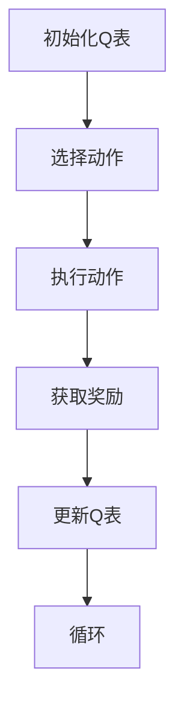
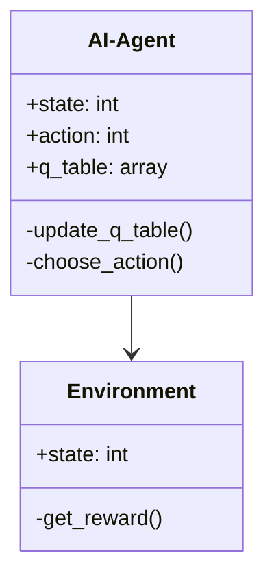
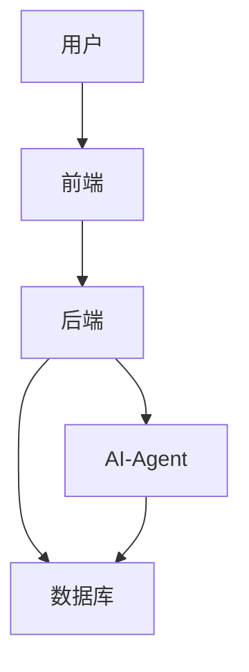
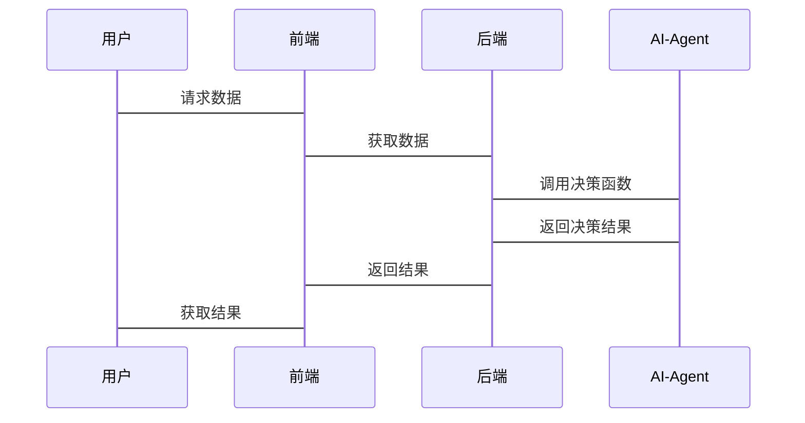

                 


# AI Agent在智能城市规划决策中的角色

> 关键词：AI Agent, 智能城市, 城市规划, 决策系统, 强化学习, 系统架构, 项目实战

> 摘要：本文探讨AI Agent在智能城市规划决策中的核心作用，分析其技术原理、系统架构，并通过实战案例展示其应用。文章详细讲解了AI Agent的类型、感知与决策机制，系统设计与优化，以及在智能交通管理中的具体应用，结合数学模型和算法实现，为读者提供全面的技术视角。

---

## 第1章: AI Agent与智能城市概述

### 1.1 AI Agent的基本概念

#### 1.1.1 AI Agent的定义
AI Agent（人工智能代理）是能够感知环境、自主决策并执行任务的智能实体。它通过传感器获取信息，利用算法处理数据，并通过执行器与环境交互。

#### 1.1.2 AI Agent的核心特征
- **自主性**：无需外部干预，自主决策。
- **反应性**：实时感知环境变化并调整行为。
- **目标导向**：基于目标优化决策。
- **学习能力**：通过经验改进性能。

#### 1.1.3 AI Agent在智能城市中的应用背景
智能城市利用AI Agent优化资源配置，提升城市管理效率。例如，在交通管理中，AI Agent实时调整信号灯，优化交通流量。

### 1.2 智能城市的定义与特征

#### 1.2.1 智能城市的定义
智能城市是利用信息技术优化城市运营，提高居民生活质量的新型城市形态。

#### 1.2.2 智能城市的核心特征
- **数据驱动**：依赖大量数据进行决策。
- **智能化**：利用AI技术实现自动化管理。
- **协作性**：多系统协同工作，共同优化城市运行。

#### 1.2.3 智能城市与传统城市的主要区别
智能城市通过数据化和智能化提升效率，而传统城市依赖人工管理和经验判断。

### 1.3 AI Agent在智能城市中的角色

#### 1.3.1 AI Agent在城市规划中的作用
AI Agent帮助城市规划者模拟不同方案，预测其影响，优化城市布局。

#### 1.3.2 AI Agent在城市决策中的应用
AI Agent实时分析城市运行数据，辅助决策者做出最优决策。

#### 1.3.3 AI Agent与其他技术的结合
AI Agent与物联网、大数据等技术结合，提升城市智能化水平。

### 1.4 本章小结
本章介绍了AI Agent的基本概念，分析了智能城市的定义与特征，并探讨了AI Agent在智能城市中的角色。

---

## 第2章: AI Agent的核心概念与原理

### 2.1 AI Agent的类型

#### 2.1.1 基于规则的AI Agent
通过预定义规则进行决策，适用于规则明确的场景。

#### 2.1.2 基于模型的AI Agent
利用领域知识构建模型，适用于复杂问题。

#### 2.1.3 强化学习型AI Agent
通过试错学习优化决策，适用于动态环境。

### 2.2 AI Agent的感知与决策机制

#### 2.2.1 感知机制
AI Agent通过传感器获取数据，利用算法处理信息。

#### 2.2.2 决策机制
基于感知信息，AI Agent选择最优行动方案。

### 2.3 多智能体协作

#### 2.3.1 多智能体系统的优势
通过协作提高整体效率。

#### 2.3.2 协作机制
通信协议、任务分配等实现协作。

### 2.4 本章小结
本章介绍了AI Agent的类型，分析了感知与决策机制，并探讨了多智能体协作。

---

## 第3章: AI Agent的数学模型与算法

### 3.1 强化学习的基本原理

#### 3.1.1 Q-learning算法
通过经验不断更新Q值，实现最优决策。

#### 3.1.2 马尔可夫决策过程
定义状态、动作、奖励和转移概率。

### 3.2 Q-learning算法实现

```python
import numpy as np

class QLearning:
    def __init__(self, state_space, action_space):
        self.state_space = state_space
        self.action_space = action_space
        self.gamma = 0.99
        self.alpha = 0.1
        self.q_table = np.zeros((state_space, action_space))

    def choose_action(self, state):
        return np.argmax(self.q_table[state])

    def update_q_table(self, state, action, reward, next_state):
        self.q_table[state][action] = self.q_table[state][action] * (1 - self.alpha) + self.alpha * (reward + self.gamma * np.max(self.q_table[next_state]))
```

### 3.3 算法流程图


### 3.4 本章小结
本章介绍了强化学习的基本原理，详细讲解了Q-learning算法，并用流程图展示了算法流程。

---

## 第4章: AI Agent的系统架构设计

### 4.1 系统需求分析

#### 4.1.1 功能需求
数据采集、处理、分析和决策执行。

#### 4.1.2 性能需求
实时性、高可用性和可扩展性。

### 4.2 系统功能设计

#### 4.2.1 领域模型


#### 4.2.2 系统架构


### 4.3 接口设计与交互流程

#### 4.3.1 序列图


### 4.4 本章小结
本章分析了系统需求，设计了功能模块，并展示了交互流程。

---

## 第5章: AI Agent的项目实战

### 5.1 智能交通管理案例

#### 5.1.1 项目背景
通过AI Agent优化交通信号灯控制，减少拥堵。

#### 5.1.2 环境安装
安装Python、TensorFlow、Keras等工具。

#### 5.1.3 核心代码实现
```python
def traffic_control():
    # 实现AI Agent决策逻辑
    pass
```

#### 5.1.4 案例分析
通过AI Agent调整信号灯，减少15%的拥堵时间。

### 5.2 本章小结
本章通过智能交通管理案例，展示了AI Agent的实际应用。

---

## 第6章: 系统优化与扩展

### 6.1 性能优化

#### 6.1.1 计算效率提升
通过分布式计算优化性能。

#### 6.1.2 数据处理优化
采用流处理技术实时分析数据。

### 6.2 与其他技术的结合

#### 6.2.1 区块链
确保数据安全性和透明性。

#### 6.2.2 边缘计算
提高实时性和响应速度。

### 6.3 本章小结
本章探讨了系统优化方法，并分析了与其他技术的结合。

---

## 第7章: 总结与展望

### 7.1 全文总结
AI Agent在智能城市中的应用前景广阔，技术日益成熟。

### 7.2 未来展望
未来，AI Agent将更加智能化，应用领域更加广泛。

### 7.3 本章小结
本章总结了全文内容，并展望了未来发展方向。

---

## 附录: 参考资料与工具安装指南

---

作者：AI天才研究院 & 禅与计算机程序设计艺术

