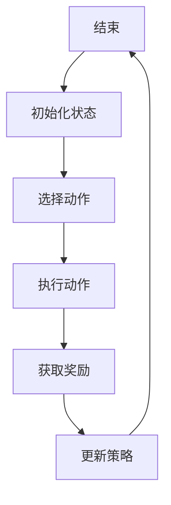
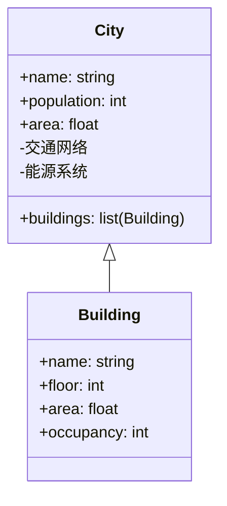
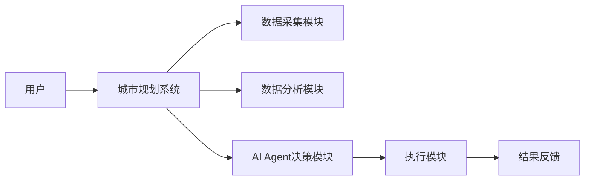

                 


# AI Agent在智能城市规划模拟中的角色

## 关键词：AI Agent, 智能城市, 城市规划, 人工智能, 模拟规划

## 摘要：本文探讨了AI Agent在智能城市规划模拟中的角色与应用。通过分析AI Agent的核心原理、算法实现及系统架构，结合实际案例，展示了AI Agent如何提升城市规划的效率与准确性。文章还总结了最佳实践和未来发展方向，为智能城市规划提供了新的视角。

---

# 第1章: AI Agent与智能城市规划概述

## 1.1 AI Agent的基本概念

### 1.1.1 AI Agent的定义
AI Agent（人工智能代理）是指能够感知环境、自主决策并执行任务的智能实体。AI Agent可以是软件程序，也可以是物理设备，其核心目标是通过智能算法优化任务执行效率。

### 1.1.2 AI Agent的核心特征
| 特征 | 描述 |
|------|------|
| 感知能力 | 通过传感器或数据输入感知环境状态 |
| 决策能力 | 基于感知信息做出最优决策 |
| 学习能力 | 通过经验改进性能 |
| 自主性 | 无需外部干预，自主完成任务 |

### 1.1.3 AI Agent与智能城市的关系
智能城市是AI Agent的重要应用场景。AI Agent通过模拟城市运行状态，优化资源配置，帮助城市规划者做出更科学的决策。

---

## 1.2 智能城市规划的基本概念

### 1.2.1 智能城市的定义
智能城市是指通过物联网、大数据、人工智能等技术，实现城市基础设施、交通、能源等系统智能化管理的城市形态。

### 1.2.2 智能城市规划的目标与原则
目标：提高城市运行效率，降低资源消耗，改善居民生活质量。
原则：可持续性、智能化、以人为本。

### 1.2.3 智能城市规划的关键技术
- 数据采集与处理
- 人工智能算法
- 物联网技术
- 云计算

---

## 1.3 AI Agent在智能城市规划中的角色

### 1.3.1 AI Agent在城市规划中的应用场景
- 交通流量优化
- 城市能源管理
- 环境监测与治理

### 1.3.2 AI Agent的优势与局限性
优势：
- 高效性：快速处理大量数据
- 精准性：基于数据驱动的决策
- 自适应性：动态调整策略

局限性：
- 数据依赖性：需要大量高质量数据支持
- 技术复杂性：实现难度较高

### 1.3.3 AI Agent在智能城市规划中的价值
AI Agent通过模拟城市运行状态，优化资源配置，帮助城市规划者做出更科学的决策，提升城市整体效率。

---

# 第2章: AI Agent的核心原理与技术

## 2.1 AI Agent的任务建模

### 2.1.1 任务建模的基本概念
任务建模是AI Agent完成任务的基础，通过构建数学模型描述任务目标、约束条件和可能的解决方案。

### 2.1.2 基于状态的建模方法
状态表示：城市交通流量、能源消耗等指标。
状态转移：通过决策改变状态。

### 2.1.3 基于目标的建模方法
目标分解：将复杂任务分解为多个子目标。
路径规划：寻找最优路径实现目标。

---

## 2.2 AI Agent的决策机制

### 2.2.1 基于规则的决策方法
规则定义：预设的条件和行动对应关系。
优点：简单易懂，适用于规则明确的任务。
缺点：缺乏灵活性，难以处理复杂场景。

### 2.2.2 基于概率的决策方法
概率模型：贝叶斯网络、马尔可夫链。
决策依据：概率分布，评估不同选择的期望值。

### 2.2.3 基于强化学习的决策方法
强化学习：通过试错学习，优化决策策略。
奖励机制：定义奖励函数，指导AI Agent学习最优策略。

---

## 2.3 AI Agent的学习与优化

### 2.3.1 监督学习在AI Agent中的应用
监督学习：基于标记数据，训练AI Agent识别模式。
应用：图像识别、分类任务。

### 2.3.2 无监督学习在AI Agent中的应用
无监督学习：从无标记数据中发现模式。
应用：聚类分析、异常检测。

### 2.3.3 强化学习在AI Agent中的应用
强化学习：通过试错优化决策策略。
应用：游戏AI、机器人控制。

---

# 第3章: 智能城市规划中的数据与模型

## 3.1 数据采集与处理

### 3.1.1 数据来源与类型
数据来源：传感器、摄像头、数据库。
数据类型：结构化数据（数值型）、非结构化数据（文本、图像）。

### 3.1.2 数据清洗与预处理
数据清洗：去除噪声、填补缺失值。
数据标准化：统一数据格式，便于处理。

### 3.1.3 数据存储与管理
数据库设计：关系型数据库（MySQL）、非关系型数据库（MongoDB）。
数据存储：结构化存储、分布式存储。

---

## 3.2 城市规划模型的构建

### 3.2.1 基于GIS的城市规划模型
GIS（地理信息系统）：空间数据处理与分析。
应用：土地利用规划、交通网络优化。

### 3.2.2 基于机器学习的城市规划模型
机器学习算法：回归、分类、聚类。
应用：预测城市发展趋势、识别潜在风险。

### 3.2.3 基于知识图谱的城市规划模型
知识图谱：构建城市实体关系网络。
应用：语义理解、知识推理。

---

## 3.3 数据驱动的AI Agent设计

### 3.3.1 数据驱动的决策模型
决策树：基于数据特征划分决策路径。
随机森林：集成多个决策树，提高准确性。

### 3.3.2 数据驱动的优化算法
遗传算法：模拟自然选择，优化解决方案。
模拟退火：寻找全局最优解。

### 3.3.3 数据驱动的预测与模拟
时间序列分析：预测未来趋势。
蒙特卡洛模拟：模拟多种可能性，评估风险。

---

# 第4章: AI Agent在城市规划中的应用案例

## 4.1 交通规划中的AI Agent应用

### 4.1.1 智能交通系统的构建
智能交通系统（ITS）：整合交通数据，优化交通流量。
AI Agent角色：实时监测交通状态，动态调整信号灯配时。

### 4.1.2 基于AI Agent的路径规划
路径规划算法：Dijkstra算法、A*算法。
动态调整：根据实时交通状况优化路径。

---

## 4.2 能源管理中的AI Agent应用

### 4.2.1 智能电网的构建
智能电网：实时监测电力供需，优化能源分配。
AI Agent角色：预测电力需求，调整发电计划。

### 4.2.2 能源消耗优化
需求侧管理：通过电价调节，降低高峰时段用电需求。
供给侧优化：根据天气预测调整发电量。

---

## 4.3 环境监测与治理中的AI Agent应用

### 4.3.1 环境数据采集与分析
环境传感器：监测空气质量、水质等指标。
数据分析：识别污染源，预测污染扩散趋势。

### 4.3.2 环境治理策略优化
AI Agent角色：模拟不同治理方案，选择最优策略。

---

# 第5章: AI Agent在智能城市规划中的技术实现

## 5.1 算法原理

### 5.1.1 强化学习算法
强化学习算法流程图：



数学模型：Q-learning算法的数学公式：

$$ Q(s, a) = Q(s, a) + \alpha (r + \gamma \max Q(s', a') - Q(s, a)) $$

其中，$\alpha$是学习率，$\gamma$是折扣因子。

---

## 5.2 系统架构设计

### 5.2.1 系统功能设计
领域模型类图：



### 5.2.2 系统架构图



---

## 5.3 项目实战

### 5.3.1 环境安装
安装Python环境：
```bash
python --version
pip install numpy
pip install matplotlib
pip install scikit-learn
```

### 5.3.2 核心实现源代码
AI Agent实现代码：
```python
import numpy as np
import random

class AI-Agent:
    def __init__(self, state_space, action_space):
        self.state_space = state_space
        self.action_space = action_space
        self.q_table = np.zeros((state_space, action_space))
    
    def choose_action(self, state):
        if random.uniform(0, 1) < 0.1:
            return random.choice(self.action_space)
        else:
            return np.argmax(self.q_table[state])
    
    def learn(self, state, action, reward, next_state):
        self.q_table[state][action] += 0.1 * (reward + 0.9 * np.max(self.q_table[next_state]) - self.q_table[state][action])
```

### 5.3.3 案例分析
案例：智能交通信号灯优化
- 数据来源：交通传感器
- 实施步骤：
  1. 数据采集：实时监测交通流量
  2. 状态识别：判断交通拥堵情况
  3. 决策制定：动态调整信号灯配时
  4. 结果反馈：评估优化效果

---

# 第6章: 总结与展望

## 6.1 最佳实践 Tips
- 数据质量至关重要：确保数据准确性和完整性。
- 算法选择需谨慎：根据具体场景选择合适的算法。
- 系统设计要模块化：便于维护和扩展。

## 6.2 小结
AI Agent在智能城市规划中扮演着越来越重要的角色。通过数据驱动的决策和优化算法，AI Agent能够显著提升城市规划的效率和准确性。

## 6.3 未来展望
随着人工智能技术的不断发展，AI Agent在智能城市规划中的应用将更加广泛。未来，可以期待更智能、更高效的AI Agent，帮助城市应对更多复杂的挑战。

---

# 作者

作者：AI天才研究院/AI Genius Institute & 禅与计算机程序设计艺术 /Zen And The Art of Computer Programming

