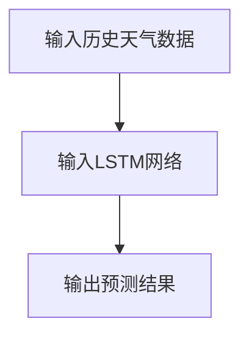
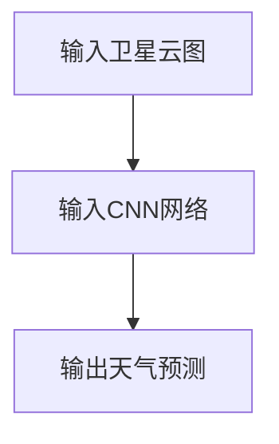
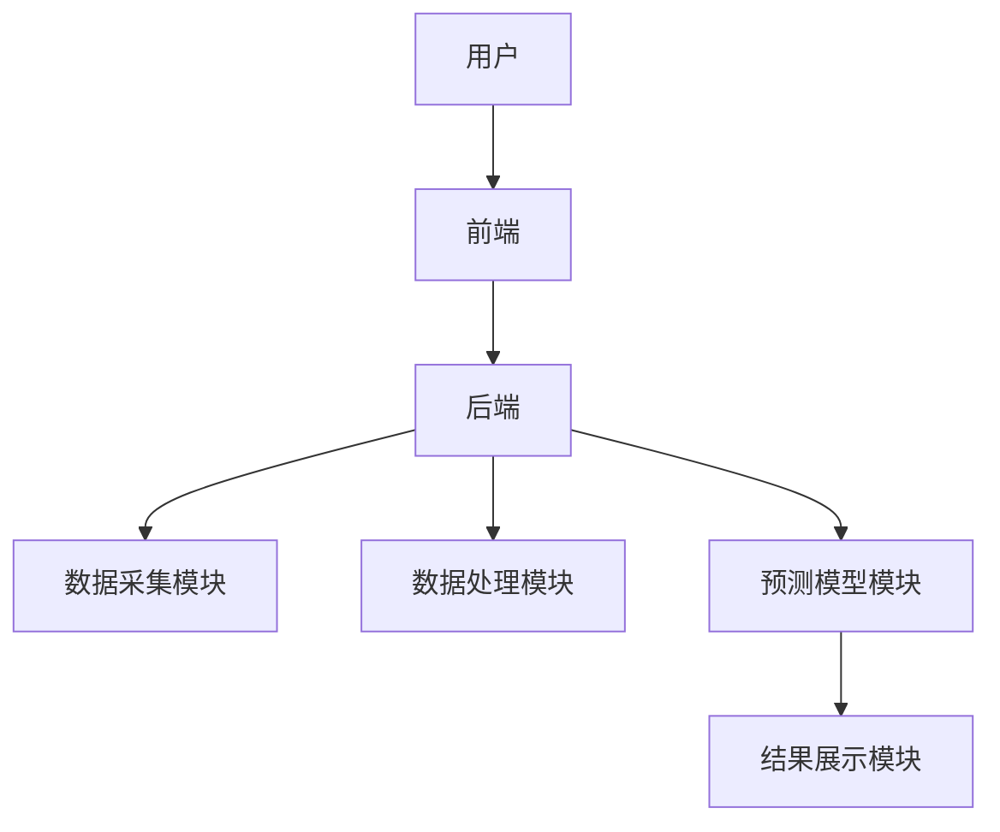
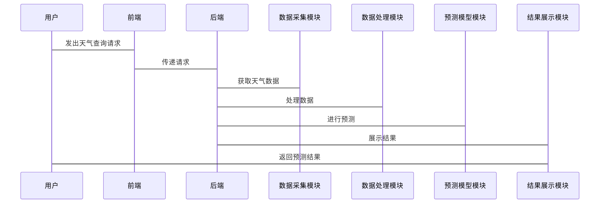

                 


# AI Agent在智能天气预报中的实践

> 关键词：AI Agent, 天气预报, 智能预测, 机器学习, 大气科学

> 摘要：本文详细探讨了AI Agent在智能天气预报中的应用，从AI Agent的基本概念到其在天气预报中的具体实现，结合数学模型和算法，系统地分析了AI Agent如何提升天气预报的准确性和实时性。通过实际案例和系统架构设计，展示了AI Agent在智能天气预报中的巨大潜力和实际价值。

---

## 第一章: AI Agent与智能天气预报概述

### 1.1 AI Agent的基本概念

#### 1.1.1 什么是AI Agent
AI Agent（人工智能代理）是指能够感知环境、自主决策并执行任务的智能实体。它通过传感器获取信息，利用算法处理数据，并通过执行器与环境交互。

#### 1.1.2 AI Agent的核心特征
| 特征 | 描述 |
|------|------|
| 感知能力 | 能够通过传感器或数据源获取环境信息 |
| 决策能力 | 能够基于获取的信息做出决策 |
| 执行能力 | 能够通过执行器将决策转化为行动 |
| 学习能力 | 能够通过经验改进自身性能 |

#### 1.1.3 AI Agent与传统天气预报的区别
| 对比维度 | 传统天气预报 | AI Agent驱动的天气预报 |
|----------|----------------|--------------------------|
| 数据来源 | 单一数据源，如气象站 | 多源数据融合，包括卫星、雷达等 |
| 预测精度 | 受模型限制，精度有限 | 基于机器学习，精度更高 |
| 实时性 | 更新周期较长 | 实时更新，快速响应 |

### 1.2 智能天气预报的背景与需求

#### 1.2.1 天气预报的发展历程
从早期的手动预测到数值天气预报，再到如今的AI驱动预测，天气预报技术经历了三次重大变革。

#### 1.2.2 当前天气预报的局限性
- 数据量不足
- 模型复杂性高
- 预测精度受限制

#### 1.2.3 AI Agent在天气预报中的应用价值
- 提高预测精度
- 实现实时更新
- 提供个性化服务

### 1.3 AI Agent在智能天气预报中的作用

#### 1.3.1 数据处理与分析
AI Agent能够从多种数据源（如卫星、气象站、雷达）获取数据，并通过数据融合技术提高数据质量。

#### 1.3.2 天气预测与决策支持
AI Agent能够基于历史数据和实时数据，利用机器学习模型进行预测，并为决策提供支持。

#### 1.3.3 实时反馈与优化
AI Agent能够根据反馈不断优化预测模型，提高预测精度。

### 1.4 本章小结
本章介绍了AI Agent的基本概念及其在智能天气预报中的作用，为后续章节的深入分析奠定了基础。

---

## 第二章: AI Agent的核心原理与技术

### 2.1 AI Agent的基本架构

#### 2.1.1 感知层
感知层通过传感器获取环境信息，并将信息传递给决策层。

#### 2.1.2 决策层
决策层利用算法对感知层提供的信息进行分析，并做出决策。

#### 2.1.3 执行层
执行层将决策层的决策转化为具体的动作，如调整气象模型参数。

### 2.2 AI Agent的感知机制

#### 2.2.1 数据采集与处理
AI Agent通过多种传感器采集数据，并对数据进行清洗、融合和预处理。

#### 2.2.2 感知模型的构建
感知模型通过深度学习算法（如CNN、RNN）对数据进行特征提取。

#### 2.2.3 多源数据融合
通过多源数据融合技术，AI Agent能够综合多种数据源的信息，提高预测精度。

### 2.3 AI Agent的决策机制

#### 2.3.1 基于规则的决策
基于预定义的规则进行决策，适用于简单场景。

#### 2.3.2 基于机器学习的决策
利用监督学习、无监督学习或强化学习算法进行决策，适用于复杂场景。

#### 2.3.3 基于强化学习的决策
通过与环境的交互，不断优化决策策略。

### 2.4 AI Agent的执行机制

#### 2.4.1 行为规划
根据决策结果，制定具体的执行计划。

#### 2.4.2 动作执行
通过执行器将决策转化为具体动作。

#### 2.4.3 反馈机制
通过反馈机制，不断优化决策和执行过程。

### 2.5 本章小结
本章详细介绍了AI Agent的核心原理与技术，包括感知、决策和执行三个层面。

---

## 第三章: AI Agent在天气预报中的数学模型与算法

### 3.1 天气预报的基本模型

#### 3.1.1 大气动力学模型
基于物理学方程，模拟大气运动。

#### 3.1.2 统计预测模型
通过统计分析，预测天气趋势。

#### 3.1.3 神经网络模型
利用神经网络进行天气预测。

### 3.2 AI Agent的预测模型

#### 3.2.1 基于LSTM的序列预测
LSTM（长短期记忆网络）适用于时间序列预测。

#### 3.2.2 基于CNN的图像识别
CNN（卷积神经网络）适用于图像处理，可用于卫星云图分析。

#### 3.2.3 基于Transformer的天气分析
Transformer模型适用于全局天气模式分析。

### 3.3 算法原理与流程图

#### 3.3.1 LSTM预测流程图


#### 3.3.2 CNN预测流程图


### 3.4 数学公式与模型解读

#### 3.4.1 LSTM公式
$$
f_t = \tanh(gate * W_f \cdot x_t + b_f)
$$

#### 3.4.2 Transformer公式
$$
\text{Attention}(Q, K, V) = \text{softmax}(\frac{QK^T}{\sqrt{d_k}})V
$$

### 3.5 本章小结
本章介绍了AI Agent在天气预报中的数学模型与算法，包括LSTM、CNN和Transformer等。

---

## 第四章: 系统架构与设计

### 4.1 智能天气预报系统架构

#### 4.1.1 系统功能设计
- 数据采集模块：从多种数据源获取天气数据。
- 数据处理模块：清洗、融合和预处理数据。
- 预测模型模块：利用AI算法进行天气预测。
- 结果展示模块：以可视化形式展示预测结果。

#### 4.1.2 系统架构设计


### 4.2 系统交互设计

#### 4.2.1 用户与系统交互流程


### 4.3 本章小结
本章详细介绍了智能天气预报系统的架构与设计，包括功能设计、系统架构和交互设计。

---

## 第五章: 项目实战与案例分析

### 5.1 项目环境配置

#### 5.1.1 环境要求
- 操作系统：Linux/Windows/MacOS
- Python版本：3.6+
- 依赖库：TensorFlow、Keras、PyTorch、Scikit-learn

### 5.2 核心代码实现

#### 5.2.1 数据采集模块
```python
import requests

def fetch_weather_data(api_key):
    response = requests.get(f'http://api.openweathermap.org/data/2.5/weather?'
                           f'lat=40.7128&lon=-74.0064&appid={api_key}')
    return response.json()
```

#### 5.2.2 数据处理模块
```python
import numpy as np

def preprocess_data(data):
    # 提取特征
    features = data['main']['temp'], data['wind']['speed']
    return np.array(features).reshape(1, -1)
```

#### 5.2.3 预测模型模块
```python
from tensorflow.keras.models import Sequential
from tensorflow.keras.layers import LSTM, Dense

model = Sequential()
model.add(LSTM(64, input_shape=(1, 2)))
model.add(Dense(1))
model.compile(loss='mean_squared_error', optimizer='adam')
model.fit(X_train, y_train, epochs=50, batch_size=32)
```

### 5.3 案例分析

#### 5.3.1 案例背景
假设我们要预测纽约市的天气，数据来源包括天气站、卫星和雷达数据。

#### 5.3.2 模型训练
利用历史天气数据训练LSTM模型，预测未来24小时的天气情况。

#### 5.3.3 结果展示
将预测结果以图表形式展示，包括温度、风速和降水概率。

### 5.4 本章小结
本章通过实际案例展示了AI Agent在智能天气预报中的应用，详细讲解了环境配置、代码实现和案例分析。

---

## 第六章: 最佳实践与注意事项

### 6.1 最佳实践

#### 6.1.1 数据质量管理
确保数据的准确性和完整性。

#### 6.1.2 模型优化
通过交叉验证和超参数调优提高模型性能。

#### 6.1.3 系统维护
定期更新模型和数据，确保系统的稳定性和准确性。

### 6.2 注意事项

#### 6.2.1 数据隐私
注意保护用户数据隐私，遵守相关法律法规。

#### 6.2.2 系统稳定性
确保系统的高可用性和容错性，避免因故障导致预测错误。

#### 6.2.3 模型解释性
提高模型的解释性，便于用户理解和使用。

### 6.3 本章小结
本章总结了AI Agent在智能天气预报中的最佳实践和注意事项，为实际应用提供了指导。

---

## 第七章: 结论与展望

### 7.1 结论
AI Agent在智能天气预报中的应用显著提高了预测的准确性和实时性，为天气预报带来了革命性的变化。

### 7.2 展望
未来，随着AI技术的不断发展，AI Agent在天气预报中的应用将更加广泛和深入，预测精度将进一步提高。

### 7.3 本章小结
本章总结了全文的主要内容，并展望了AI Agent在智能天气预报中的未来发展。

---

## 作者：AI天才研究院 & 禅与计算机程序设计艺术

