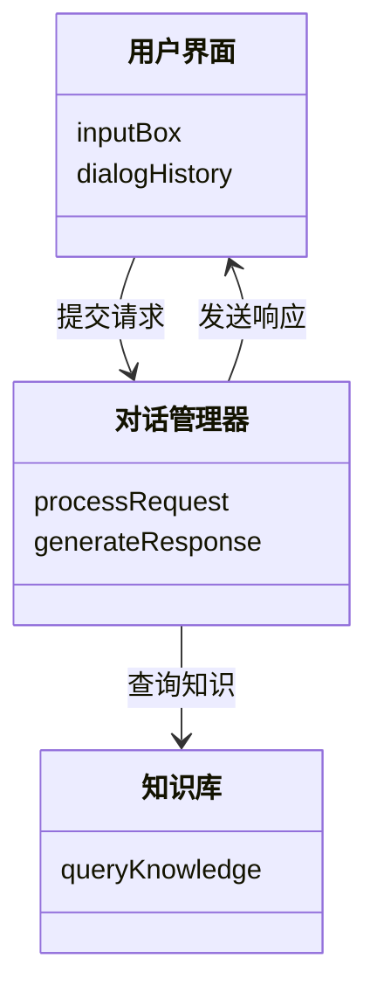
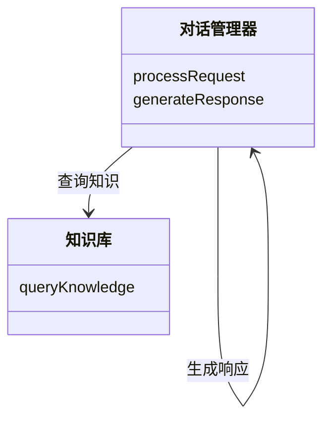
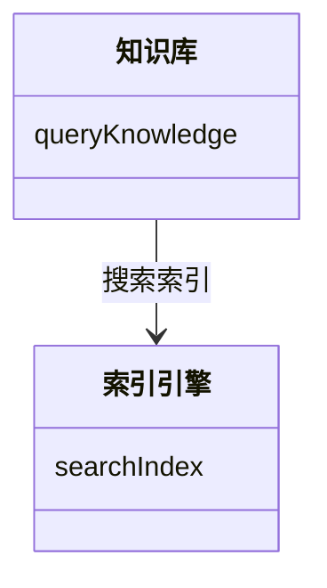
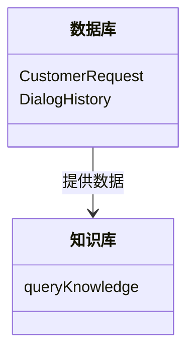

                 


# AI Agent在智能客户服务中的角色

> 关键词：AI Agent, 智能客户服务, 自然语言处理, 强化学习, 系统架构设计, 项目实战

> 摘要：AI Agent作为人工智能技术在智能客户服务中的核心应用，通过自然语言处理、强化学习等算法，实现了高效、智能的客户交互与服务。本文从AI Agent的背景、核心概念、算法原理、系统架构设计、项目实战等方面，详细探讨了AI Agent在智能客户服务中的角色，并通过具体案例分析，总结了其实现过程中的关键技术和实际应用价值。

---

## 第1章: AI Agent的定义与核心概念

### 1.1 AI Agent的基本定义

AI Agent（人工智能代理）是一种能够感知环境、自主决策并执行任务的智能实体。在智能客户服务场景中，AI Agent通常以聊天机器人或虚拟助手的形式出现，通过自然语言处理（NLP）技术与客户进行交互，提供诸如问题解答、信息查询、订单处理等服务。

#### 1.1.1 什么是AI Agent

AI Agent是一种能够模拟人类智能的计算机系统，具备以下核心能力：

- **感知能力**：通过传感器或输入数据，感知外部环境的状态。
- **推理能力**：基于感知的信息，进行逻辑推理或模式识别。
- **决策能力**：根据推理结果，做出最优决策。
- **执行能力**：通过执行器或输出模块，将决策转化为具体行动。

#### 1.1.2 AI Agent的核心特点

与传统计算机程序相比，AI Agent具有以下显著特点：

- **自主性**：能够在没有人工干预的情况下独立运行。
- **反应性**：能够实时感知环境变化并做出响应。
- **学习能力**：通过机器学习技术不断优化自身的性能。
- **社交能力**：能够与人类或其他智能体进行自然交互。

#### 1.1.3 AI Agent与传统客服的区别

传统的客服系统通常依赖于预设的规则和脚本，难以应对复杂多变的客户需求。而AI Agent通过自然语言处理和机器学习技术，能够理解客户的意图，并根据上下文提供个性化的服务。此外，AI Agent还能够7x24小时不间断工作，显著提升了服务效率。

### 1.2 智能客户服务的背景与挑战

#### 1.2.1 客户服务的传统模式

传统客户服务模式主要依赖于人工客服，通过电话、邮件等方式为客户提供支持。这种方式存在以下问题：

- **效率低下**：人工客服的工作效率有限，无法同时处理大量请求。
- **成本高昂**：需要大量人工客服人员，增加了企业的运营成本。
- **服务质量不稳定**：人工客服的疲劳、情绪等因素可能影响服务质量。

#### 1.2.2 智能客户服务的兴起

随着人工智能技术的快速发展，智能客户服务逐渐兴起。智能客服通过AI Agent、自然语言处理（NLP）、机器学习等技术，实现了自动化、智能化的客户服务。

#### 1.2.3 当前智能客户服务的主要挑战

尽管智能客户服务具有诸多优势，但在实际应用中仍然面临以下挑战：

- **技术局限性**：AI Agent的自然语言理解能力仍需进一步提升，难以应对复杂的语义理解和情感分析。
- **数据隐私问题**：客户数据的收集和处理可能涉及隐私问题，需要严格遵守相关法律法规。
- **用户体验优化**：如何在自动化服务中保持人性化的用户体验，是一个亟待解决的问题。

### 1.3 AI Agent在智能客户服务中的角色定位

#### 1.3.1 AI Agent作为智能客服的核心

AI Agent是智能客服系统的核心组件，负责处理客户请求、理解客户意图，并提供相应的服务。通过自然语言处理技术，AI Agent能够将客户的文字或语音输入转化为计算机可理解的结构化数据，并根据预设的规则或机器学习模型生成响应。

#### 1.3.2 AI Agent与人类客服的协同工作

在实际应用中，AI Agent通常与人类客服协同工作。对于简单、标准化的客户需求，AI Agent可以独立完成服务；而对于复杂、非标准化的问题，则由人类客服接手处理。这种分工协作的模式能够显著提升服务效率，同时保证服务质量。

#### 1.3.3 AI Agent在客户体验中的作用

AI Agent通过智能化的交互方式，能够为客户提供更加高效、个性化的服务体验。例如，通过分析客户的历史行为数据，AI Agent可以预测客户的需求，并主动提供相关建议。此外，AI Agent还能够通过情绪识别技术，感知客户的情绪变化，并相应调整服务策略。

---

## 第2章: AI Agent的核心概念与原理

### 2.1 AI Agent的核心概念

AI Agent的核心概念包括感知、决策和执行三个主要部分。

#### 2.1.1 感知层

感知层是AI Agent与外部环境交互的第一步，主要负责接收和解析客户输入的信息。在智能客户服务场景中，感知层通常包括以下功能：

- **输入解析**：将客户的文本或语音输入转化为结构化的数据。
- **意图识别**：通过自然语言处理技术，识别客户的意图和需求。
- **上下文理解**：基于历史对话记录，理解当前对话的上下文信息。

#### 2.1.2 决策层

决策层是AI Agent的核心部分，负责根据感知层获取的信息，生成相应的服务响应。决策层通常包括以下功能：

- **知识库查询**：从知识库中检索与客户请求相关的信息。
- **规则推理**：根据预设的业务规则，生成标准化的响应。
- **机器学习模型推理**：基于训练好的机器学习模型，生成个性化响应。

#### 2.1.3 执行层

执行层是AI Agent的输出部分，负责将决策层生成的响应传递给客户。在智能客户服务场景中，执行层通常包括以下功能：

- **生成响应**：将决策层的输出转化为自然语言文本。
- **输出响应**：通过聊天界面或语音合成技术，将响应传递给客户。
- **记录日志**：将整个对话过程记录下来，供后续分析和优化。

### 2.2 AI Agent的工作原理

AI Agent的工作原理可以分为感知、决策和执行三个主要阶段。

#### 2.2.1 感知过程

感知过程包括接收客户输入、解析输入数据并理解客户意图。

- **接收输入**：客户通过文本或语音形式向AI Agent提出请求。
- **解析输入**：AI Agent通过自然语言处理技术，将客户的输入转化为结构化的数据。
- **理解意图**：基于意图识别模型，AI Agent确定客户的需求和意图。

#### 2.2.2 决策过程

决策过程包括基于客户意图生成相应的服务响应。

- **知识库查询**：AI Agent从知识库中检索与客户请求相关的信息。
- **规则推理**：根据预设的业务规则，生成标准化的响应。
- **机器学习模型推理**：基于训练好的机器学习模型，生成个性化响应。

#### 2.2.3 执行过程

执行过程包括将生成的响应传递给客户，并记录整个过程。

- **生成响应**：AI Agent将决策层的输出转化为自然语言文本。
- **输出响应**：通过聊天界面或语音合成技术，将响应传递给客户。
- **记录日志**：将整个对话过程记录下来，供后续分析和优化。

### 2.3 AI Agent的实体关系图

以下是一个简单的实体关系图，展示了AI Agent在智能客户服务中的主要实体及其关系。

```mermaid
er
  actor: 客户
  agent: AI Agent
  request: 服务请求
  response: 服务响应
  actor --> request: 提交请求
  agent --> request: 处理请求
  agent --> response: 生成响应
  request --> response: 映射关系
```

---

## 第3章: AI Agent的算法原理

### 3.1 自然语言处理（NLP）算法

自然语言处理是AI Agent实现智能交互的核心技术之一。

#### 3.1.1 NLP的核心算法

NLP的核心算法包括文本分词、句法分析、语义理解等。

- **文本分词**：将连续的文本分割成有意义的词汇或短语。
- **句法分析**：分析文本的语法结构，确定句子中的主语、谓语等成分。
- **语义理解**：理解文本的语义含义，识别意图和实体。

#### 3.1.2 基于Transformer的模型

基于Transformer的模型（如BERT、GPT）是当前NLP领域的主流模型。

- **模型结构**：Transformer模型由编码器和解码器组成，通过自注意力机制捕获文本中的长距离依赖关系。
- **训练目标**：通过大量的语料库进行预训练，模型能够理解上下文关系并生成连贯的文本。

#### 3.1.3 案例分析：GPT模型在客服中的应用

GPT模型可以应用于智能客服的对话生成。

- **对话生成**：GPT模型可以根据客户的输入生成自然的回复。
- **上下文理解**：GPT模型能够理解对话的上下文，保持对话的连贯性。

### 3.2 强化学习（Reinforcement Learning）算法

强化学习是一种通过试错机制优化决策策略的技术。

#### 3.2.1 强化学习的核心概念

强化学习的核心概念包括状态、动作和奖励。

- **状态**：环境当前所处的状态。
- **动作**：智能体在状态中采取的行动。
- **奖励**：环境对智能体动作的反馈，用于指导智能体的决策。

#### 3.2.2 Q-learning算法

Q-learning是一种经典的强化学习算法。

- **Q值更新**：通过贝尔曼方程更新Q值，$Q(s, a) = r + \gamma \max Q(s', a')$，其中$r$是奖励，$\gamma$是折扣因子，$s'$是下一个状态。
- **策略选择**：根据Q值选择最优动作。

#### 3.2.3 案例分析：强化学习在客服优化中的应用

强化学习可以应用于客服系统的优化。

- **状态定义**：客户情绪、对话轮数等。
- **动作选择**：回复内容、转移客户到人工客服等。
- **奖励机制**：客户满意度提升、问题解决效率提高等。

---

## 第4章: AI Agent的系统分析与架构设计

### 4.1 问题场景介绍

在智能客户服务场景中，AI Agent需要处理大量的客户请求，包括问题解答、信息查询、订单处理等。

### 4.2 项目介绍

本项目旨在设计和实现一个基于AI Agent的智能客服系统。

### 4.3 系统功能设计

系统功能设计包括用户界面、对话管理、知识库管理等。

#### 4.3.1 用户界面设计

用户界面包括输入框、对话历史显示等。



#### 4.3.2 对话管理器设计

对话管理器负责处理客户请求并生成响应。



#### 4.3.3 知识库设计

知识库用于存储与客户请求相关的信息。



### 4.4 系统架构设计

系统架构设计包括前端、后端和数据库。

#### 4.4.1 前端架构设计

前端包括用户界面和API调用。

#### 4.4.2 后端架构设计

后端包括对话管理器和知识库。

#### 4.4.3 数据库设计

数据库用于存储客户请求和对话历史。



---

## 第5章: AI Agent的项目实战

### 5.1 环境安装

项目实战部分包括环境安装、代码实现和案例分析。

#### 5.1.1 环境安装

需要安装Python、TensorFlow、Keras等依赖库。

```bash
pip install python
pip install tensorflow
pip install keras
```

#### 5.1.2 代码实现

代码实现包括对话管理器和知识库的实现。

```python
class DialogManager:
    def __init__(self, knowledge_base):
        self.knowledge_base = knowledge_base

    def process_request(self, request):
        response = self.knowledge_base.query(request)
        return response

class KnowledgeBase:
    def __init__(self, data):
        self.data = data

    def query(self, request):
        # 简单的关键词匹配
        for key in self.data.keys():
            if key in request:
                return self.data[key]
        return "抱歉，我无法回答您的问题。"
```

#### 5.1.3 代码应用解读与分析

代码实现了一个简单的对话管理器和知识库，能够处理客户的简单请求。

### 5.2 实际案例分析

案例分析包括问题描述、解决过程和结果分析。

#### 5.2.1 问题描述

客户提出一个问题，AI Agent需要理解问题并生成响应。

#### 5.2.2 解决过程

AI Agent通过知识库查询相关知识，并生成响应。

#### 5.2.3 结果分析

分析生成的响应是否符合客户期望。

### 5.3 项目小结

项目小结包括项目实现的关键技术、成功经验、不足之处和未来改进方向。

---

## 第6章: 最佳实践与总结

### 6.1 最佳实践

#### 6.1.1 小结

总结项目中的关键技术和实现经验。

#### 6.1.2 注意事项

注意事项包括数据隐私、模型优化、用户体验等方面。

#### 6.1.3 拓展阅读

建议读者阅读相关的技术文献和最佳实践文档。

### 6.2 未来展望

未来AI Agent在智能客户服务中的应用前景广阔，包括更复杂的自然语言处理技术、更智能的强化学习算法、更人性化的交互方式等。

---

## 作者

作者：AI天才研究院/AI Genius Institute & 禅与计算机程序设计艺术 /Zen And The Art of Computer Programming

---

通过以上目录大纲和文章内容，您可以逐步撰写完整的博客文章。每部分内容都需要详细展开，并确保每个章节都涵盖必要的技术细节和实际案例。

