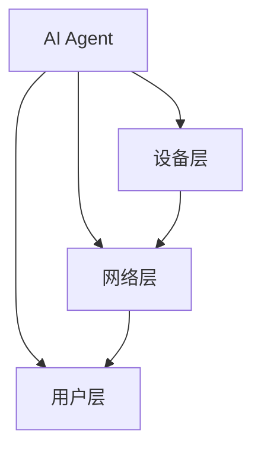
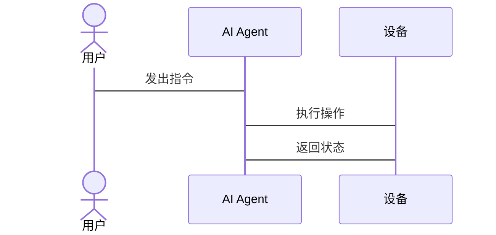
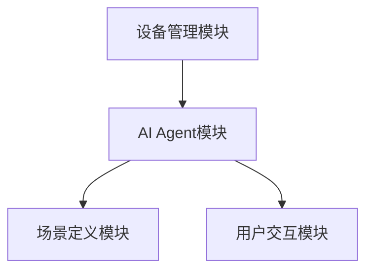

                 


# AI Agent在智能家居中的应用：设备协调与场景自动化

## 关键词：AI Agent, 智能家居, 设备协调, 场景自动化, 人工智能, 智能设备

## 摘要：
AI Agent（人工智能代理）在智能家居中的应用，主要体现在设备协调与场景自动化方面。通过AI Agent，智能家居能够实现设备间的智能协同，自动响应用户的多样化需求，提升居住体验。本文从AI Agent的基本原理出发，分析其在智能家居中的具体应用场景，探讨其算法实现与系统架构，并通过实际案例展示AI Agent在智能家居中的实践价值。

---

# 第1章: AI Agent与智能家居的背景介绍

## 1.1 智能家居的发展现状
### 1.1.1 智能家居的定义与特点
智能家居是指通过物联网、人工智能等技术，将家中的设备（如灯光、空调、安防系统等）连接起来，实现智能化管理和自动化控制的居住环境。其特点包括：
- **互联互通**：设备间通过网络通信实现数据交互。
- **自动化**：能够根据用户需求或环境变化自动执行操作。
- **智能化**：具备学习和适应能力，能够优化用户体验。

### 1.1.2 智能家居的典型应用场景
智能家居的应用场景涵盖家庭安防、能源管理、环境控制、娱乐系统等多个方面。例如：
- 自动开关灯光以节省能源。
- 根据室内外温湿度调节空调。
- 在用户离家时自动启动安防系统。

### 1.1.3 智能家居的市场发展与趋势
随着物联网和人工智能技术的快速发展，智能家居市场呈现快速增长态势。用户对智能化、便捷化的需求推动了智能家居产品的普及。

---

## 1.2 AI Agent的基本概念
### 1.2.1 AI Agent的定义与分类
AI Agent是指能够感知环境、自主决策并执行任务的智能实体。根据应用场景的不同，AI Agent可以分为：
- **简单反射型Agent**：基于当前输入做出反应，不涉及复杂决策。
- **基于模型的反射型Agent**：通过内部模型分析环境并做出决策。
- **目标驱动型Agent**：基于明确的目标进行规划和执行。

### 1.2.2 AI Agent的核心功能与特点
AI Agent的核心功能包括：
- **感知环境**：通过传感器或API获取设备状态和用户需求。
- **决策与规划**：根据感知信息生成最优解决方案。
- **执行操作**：通过API或控制接口执行操作。

AI Agent的特点是：
- **自主性**：能够独立运行，无需人工干预。
- **反应性**：能够实时响应环境变化。
- **学习能力**：通过机器学习不断优化性能。

### 1.2.3 AI Agent与智能家居的结合
AI Agent在智能家居中的作用是协调设备，实现场景自动化。例如：
- 当检测到用户离家时，自动关闭灯光并启动安防系统。
- 根据用户的作息时间自动调节室内温湿度。

---

## 1.3 本章小结
本章介绍了智能家居的发展现状、AI Agent的基本概念及其在智能家居中的应用价值。通过AI Agent，智能家居能够实现设备间的高效协同，满足用户的多样化需求。

---

# 第2章: AI Agent在智能家居中的问题背景

## 2.1 智能家居设备协调的挑战
### 2.1.1 多设备协同的复杂性
智能家居环境中通常包含多种设备，设备间的协同需要解决通信协议不统一、数据格式多样等问题。

### 2.1.2 设备间的通信与数据孤岛问题
不同设备可能来自不同的品牌，导致设备间的数据难以共享，形成“数据孤岛”。

### 2.1.3 用户需求的多样性与动态变化
用户的偏好和需求会随着时间和场景的变化而变化，设备需要能够快速响应这些变化。

## 2.2 场景自动化的痛点
### 2.2.1 场景切换的延迟与不智能
传统智能家居系统通常需要手动设置场景，且切换过程中可能会存在延迟。

### 2.2.2 用户操作的繁琐性
用户需要通过手机APP或语音助手手动触发场景切换，操作不够便捷。

### 2.2.3 场景覆盖的不全面性
由于设备间的协作不足，智能家居系统往往难以覆盖所有可能的场景需求。

## 2.3 AI Agent的解决方案
### 2.3.1 AI Agent在设备协调中的作用
AI Agent能够统一协调设备间的通信，消除数据孤岛，实现设备间的高效协作。

### 2.3.2 AI Agent在场景自动化中的优势
AI Agent能够根据用户的行为模式和环境变化，自动触发场景切换，提供智能化服务。

### 2.3.3 解决方案的可行性与前景
通过AI Agent实现智能家居的设备协调与场景自动化是技术上可行且具有广阔前景的解决方案。

## 2.4 本章小结
本章分析了智能家居设备协调和场景自动化中存在的主要问题，并提出了AI Agent作为解决方案的核心作用。

---

# 第3章: AI Agent与智能家居的核心概念与联系

## 3.1 AI Agent的核心原理
### 3.1.1 状态空间与动作空间的定义
- **状态空间**：AI Agent所处环境的所有可能状态的集合。
- **动作空间**：AI Agent在给定状态下可以执行的所有动作的集合。

### 3.1.2 奖励函数与目标函数的作用
- **奖励函数**：定义AI Agent在执行某个动作后所获得的奖励或惩罚。
- **目标函数**：定义AI Agent的优化目标，例如最大化奖励函数的值。

### 3.1.3 AI Agent的决策机制与学习过程
AI Agent通过感知环境状态，基于当前状态选择最优动作，以实现目标函数的最大化。学习过程通常采用强化学习算法（如Q-learning）。

---

## 3.2 智能家居设备的实体关系分析
### 3.2.1 设备实体的ER图设计
以下是智能家居设备的实体关系图：

```mermaid
er
    %% 智能家居设备的实体关系图
    %% 用户、设备、场景之间的关系
    actor 用户
    class 设备 {
        设备ID : string
        类型 : string
        状态 : boolean
    }
    class 场景 {
        场景ID : string
        名称 : string
        设备列表 : 设备[]
    }
    用户 --> 场景 : 创建或修改场景
    设备 --> 场景 : 属于场景
```

### 3.2.2 设备间的关系与依赖
设备间的关系可以通过依赖图表示，例如灯光依赖于开关设备的状态。

### 3.2.3 用户与设备的交互关系
用户通过语音指令或APP控制设备，设备通过AI Agent实现协同。

---

## 3.3 AI Agent与智能家居的系统架构
### 3.3.1 系统整体架构图
以下是系统整体架构图：



### 3.3.2 设备层、网络层与应用层的分工
- **设备层**：负责设备的物理操作，如开关灯。
- **网络层**：负责设备间的通信和数据传输。
- **应用层**：负责与用户的交互和场景的管理。

### 3.3.3 系统的交互流程图
以下是系统的交互流程图：



---

## 3.4 本章小结
本章详细介绍了AI Agent的核心原理、智能家居设备的实体关系以及系统的整体架构，为后续的算法实现和系统设计奠定了基础。

---

# 第4章: AI Agent的算法原理与实现

## 4.1 Q-learning算法原理
### 4.1.1 算法描述
Q-learning是一种经典的强化学习算法，通过更新Q值表来学习最优策略。其数学公式如下：

$$ Q(s, a) = Q(s, a) + \alpha \left( r + \gamma \max_{a'} Q(s', a') - Q(s, a) \right) $$

其中：
- \( Q(s, a) \)：当前状态下执行动作 \( a \) 的Q值。
- \( \alpha \)：学习率。
- \( r \)：奖励值。
- \( \gamma \)：折扣因子。
- \( s' \)：下一状态。

### 4.1.2 算法实现
以下是Q-learning算法的Python实现示例：

```python
class QLearning:
    def __init__(self, state_space_size, action_space_size, learning_rate=0.1, gamma=0.9):
        self.Q = np.zeros((state_space_size, action_space_size))
        self.alpha = learning_rate
        self.gamma = gamma

    def update(self, state, action, reward, next_state):
        self.Q[state, action] = self.Q[state, action] + self.alpha * (reward + self.gamma * np.max(self.Q[next_state, :]) - self.Q[state, action])
```

---

## 4.2 算法在智能家居中的应用
### 4.2.1 状态空间与动作空间的定义
- **状态空间**：设备状态、用户需求、环境参数。
- **动作空间**：设备控制动作，如“打开灯光”、“调节空调温度”。

### 4.2.2 奖励函数的设计
奖励函数的设计需要根据具体场景定义。例如，当AI Agent成功协调设备完成任务时，奖励值为1；否则，奖励值为-1。

---

## 4.3 算法实现与优化
### 4.3.1 算法实现
通过Q-learning算法实现设备协调的伪代码如下：

```python
初始化Q表
while True:
    观察当前状态s
    选择动作a（基于Q表）
    执行动作a，观察奖励r和下一个状态s'
    更新Q表：Q(s, a) = Q(s, a) + α(r + γ * max(Q(s', a')))
```

### 4.3.2 算法优化
- **学习率调整**：动态调整α以加快收敛速度。
- **经验回放**：通过存储历史经验来提高算法的稳定性。

---

## 4.4 本章小结
本章详细讲解了Q-learning算法的原理及其在智能家居中的应用，为后续的系统实现提供了理论基础。

---

# 第5章: 智能家居系统的分析与架构设计

## 5.1 系统分析与设计
### 5.1.1 问题场景介绍
智能家居系统需要协调多个设备完成场景切换，例如“离家模式”和“回家模式”。

### 5.1.2 系统功能设计
系统的功能模块包括：
- 设备管理模块：负责设备的注册与管理。
- 场景定义模块：定义场景及其对应的设备动作。
- AI Agent模块：负责设备协调与场景自动切换。

### 5.1.3 系统架构设计
以下是系统的架构图：



### 5.1.4 接口设计
- 设备管理模块提供API用于设备注册与状态查询。
- AI Agent模块提供API用于设备控制和场景切换。

---

## 5.2 系统实现
### 5.2.1 系统实现步骤
1. 安装必要的库（如Python的requests库用于HTTP通信）。
2. 配置设备与网络环境。
3. 编写AI Agent模块的代码。
4. 测试系统功能。

### 5.2.2 核心代码实现
以下是AI Agent模块的核心代码：

```python
import requests

class AI-Agent:
    def __init__(self, devices):
        self.devices = devices

    def act(self, state):
        # 根据状态选择最优动作
        pass

    def receive_feedback(self, reward):
        # 更新Q表
        pass
```

---

## 5.3 本章小结
本章分析了智能家居系统的功能需求，并设计了系统的架构和接口，为后续的实现奠定了基础。

---

# 第6章: 项目实战与案例分析

## 6.1 项目环境安装与配置
### 6.1.1 安装必要的库
安装Python的依赖库，如`numpy`、`pandas`、`requests`等。

### 6.1.2 配置智能家居环境
配置设备与网络环境，确保设备能够通过网络通信。

## 6.2 核心代码实现
### 6.2.1 设备管理模块
以下是设备管理模块的代码示例：

```python
class DeviceManager:
    def __init__(self):
        self.devices = {}

    def register_device(self, device_id, device_info):
        self.devices[device_id] = device_info

    def get_device_state(self, device_id):
        return self.devices[device_id]['state']
```

### 6.2.2 AI Agent模块
以下是AI Agent模块的代码示例：

```python
class AI-Agent:
    def __init__(self, devices):
        self.devices = devices

    def decide_action(self, current_state):
        # 根据当前状态选择动作
        pass

    def update_Q_table(self, reward):
        # 更新Q表
        pass
```

## 6.3 案例分析与实现
### 6.3.1 案例分析
以“离家模式”为例，AI Agent需要协调灯光、空调、安防系统等设备的动作。

### 6.3.2 代码实现
以下是“离家模式”场景的实现代码：

```python
def execute_goodbye_mode():
    # 获取当前状态
    current_state = get_current_state()
    # 决策动作
    action = agent.decide_action(current_state)
    # 执行动作
    execute_action(action)
```

---

## 6.4 本章小结
本章通过实际案例展示了AI Agent在智能家居中的应用，并详细讲解了核心代码的实现。

---

# 第7章: 最佳实践与注意事项

## 7.1 最佳实践
### 7.1.1 系统设计
- 确保设备间的通信协议一致。
- 定期更新AI Agent的模型以优化性能。

### 7.1.2 代码实现
- 使用模块化设计，便于后续扩展。
- 加强异常处理，确保系统健壮性。

## 7.2 小结
通过实践可以发现，AI Agent在智能家居中的应用能够显著提升用户体验。

## 7.3 注意事项
- 注意设备间的兼容性问题。
- 确保系统的安全性，防止数据泄露。

## 7.4 拓展阅读
建议阅读相关领域的书籍和论文，深入了解AI Agent和智能家居的最新研究成果。

---

# 作者：AI天才研究院/AI Genius Institute & 禅与计算机程序设计艺术 /Zen And The Art of Computer Programming

---

以上是《AI Agent在智能家居中的应用：设备协调与场景自动化》的技术博客文章的完整内容，涵盖了从背景介绍到系统实现的各个方面。希望本文能够为读者提供清晰的思路和实践指导。

