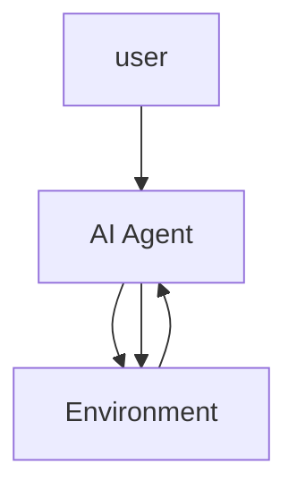
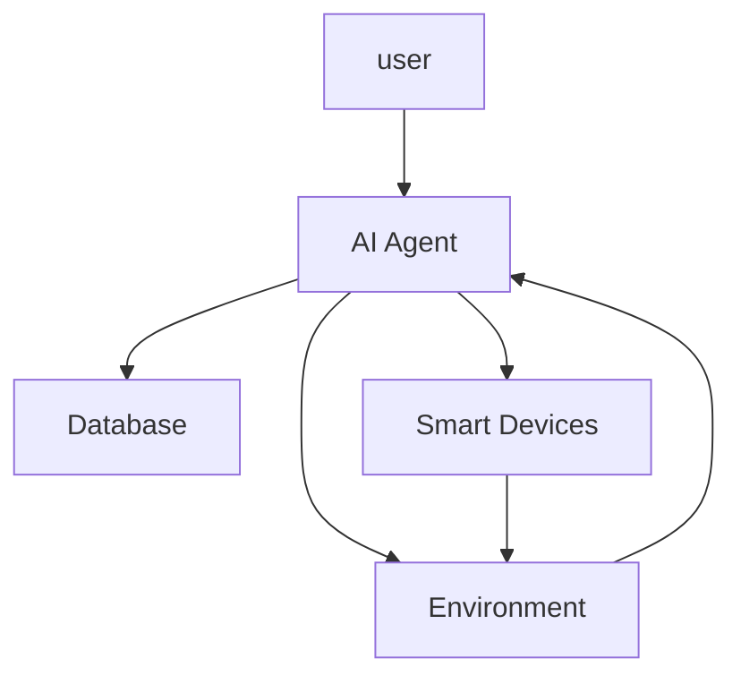

                 


# AI Agent在智能家居自动化中的应用

> 关键词：AI Agent, 智能家居, 自动化, AI算法, 系统架构, 物联网

> 摘要：随着人工智能技术的快速发展，AI Agent（智能体）在智能家居自动化中的应用日益广泛。本文将深入探讨AI Agent的核心概念、其在智能家居中的应用背景、算法原理、系统架构设计、项目实战以及最佳实践。通过详细的技术分析和实际案例，本文旨在帮助读者全面理解AI Agent在智能家居自动化中的重要性及其实际应用场景。

---

## 第1章: AI Agent与智能家居自动化背景

### 1.1 AI Agent的基本概念

#### 1.1.1 什么是AI Agent
AI Agent（智能体）是指在计算机系统中，能够感知环境、做出决策并采取行动以实现特定目标的实体。它具备自主性、反应性、目标导向性和社会性等核心特征。AI Agent可以是软件程序、机器人或其他智能设备。

#### 1.1.2 AI Agent的核心特点
- **自主性**：AI Agent能够独立运作，无需外部干预。
- **反应性**：能够感知环境变化并实时做出响应。
- **目标导向性**：通过优化目标函数来实现特定任务。
- **社会性**：能够与其他AI Agent或人类进行交互和协作。

#### 1.1.3 AI Agent与传统自动化系统的区别
| 特性 | AI Agent | 传统自动化系统 |
|------|----------|----------------|
| 感知能力 | 强 | 弱或无 |
| 决策能力 | 强 | 依赖预设规则 |
| 学习能力 | 强 | 无或有限 |
| 灵活性 | 高 | 低 |

### 1.2 智能家居自动化的基本概念

#### 1.2.1 智能家居的定义
智能家居是指通过物联网技术、人工智能和自动化设备，将家中的设备（如灯光、空调、安防系统等）连接在一起，实现智能化管理的居住环境。

#### 1.2.2 智能家居的主要组成部分
智能家居系统通常包括以下几个组成部分：
1. **感知层**：通过传感器收集环境数据。
2. **决策层**：通过AI Agent进行数据处理和决策。
3. **执行层**：通过执行设备（如智能灯泡、智能插座）实现操作。
4. **通信层**：通过Wi-Fi、蓝牙等技术实现设备间的通信。

#### 1.2.3 智能家居的发展历程
智能家居的概念可以追溯到20世纪90年代，随着物联网和人工智能技术的发展，智能家居逐渐从单一设备的自动化向整体系统的智能化方向发展。

### 1.3 AI Agent在智能家居中的应用背景

#### 1.3.1 智能家居自动化的需求
智能家居自动化的需求主要体现在以下几个方面：
1. **便捷性**：用户可以通过手机APP或语音助手远程控制家居设备。
2. **舒适性**：根据用户的习惯和环境条件自动调节设备。
3. **安全性**：通过智能安防系统实现家庭安全防护。

#### 1.3.2 AI Agent在智能家居中的优势
- **智能决策**：AI Agent能够根据环境数据和用户需求做出最优决策。
- **自适应性**：能够根据用户的习惯和环境变化进行自我优化。
- **多设备协作**：能够协调多个设备协同工作，实现复杂的任务。

#### 1.3.3 当前智能家居自动化中的问题与挑战
1. **设备兼容性**：不同品牌和类型的设备之间可能存在兼容性问题。
2. **数据隐私**：用户数据的安全性和隐私保护是一个重要挑战。
3. **算法优化**：需要不断提高AI Agent的算法性能以应对复杂的环境。

---

## 第2章: AI Agent的核心概念与原理

### 2.1 AI Agent的核心概念

#### 2.1.1 AI Agent的类型
AI Agent可以分为以下几种类型：
1. **反应式AI Agent**：基于当前感知做出实时反应。
2. **认知式AI Agent**：具备复杂推理和规划能力。
3. **协作式AI Agent**：能够与其他智能体协作完成任务。

#### 2.1.2 AI Agent的决策过程
AI Agent的决策过程通常包括以下几个步骤：
1. **感知环境**：通过传感器或其他数据源获取环境信息。
2. **状态表示**：将感知到的信息转化为内部状态表示。
3. **目标设定**：根据当前状态和目标函数确定行动目标。
4. **决策制定**：基于当前状态和目标，选择最优行动。
5. **执行行动**：通过执行设备或接口实现决策。

### 2.2 智能家居中的AI Agent架构

#### 2.2.1 智能家居AI Agent的实体关系图
```mermaid
erDiagram
    user {
        +userId : string
        +userName : string
        +userPreferences : map<string, string>
    }
    environment {
        +temperature : float
        +lightLevel : int
        +occupancy : bool
    }
    agent {
        +state : map<string, string>
        +goal : string
        +action : string
    }
    user --> agent : 发出指令
    environment --> agent : 提供环境数据
    agent --> environment : 执行操作
```

#### 2.2.2 AI Agent在智能家居中的工作流程


---

## 第3章: AI Agent的算法原理与实现

### 3.1 AI Agent的核心算法

#### 3.1.1 强化学习算法
强化学习是一种通过试错机制来优化决策策略的算法。AI Agent通过与环境交互，不断尝试不同的行动，以获得最大的累积奖励。

##### Q-learning算法公式
$$ Q(s, a) = Q(s, a) + \alpha [r + \max_{a'} Q(s', a') - Q(s, a)] $$

##### 实例分析
假设AI Agent需要在智能家居中调节室内温度。当室温低于目标温度时，AI Agent会选择开启空调，并根据室温变化调整运行时间。

#### 3.1.2 监督学习算法
监督学习是一种基于标注数据进行模型训练的算法。AI Agent通过学习大量的标注数据，来预测未来的环境状态。

#### 3.1.3 无监督学习算法
无监督学习是一种基于无标注数据进行模式识别的算法。AI Agent可以通过聚类分析来识别用户的使用习惯。

---

## 第4章: 智能家居AI Agent系统设计与实现

### 4.1 项目背景与需求分析

#### 4.1.1 项目背景
智能家居系统需要实现设备的自动化控制和智能化管理，以提高用户的使用体验。

#### 4.1.2 需求分析
- **功能需求**：设备控制、状态监测、场景切换。
- **性能需求**：实时性、可靠性、可扩展性。
- **用户需求**：易用性、安全性、个性化。

### 4.2 系统架构设计

#### 4.2.1 系统功能设计
智能家居AI Agent系统的主要功能包括：
1. **设备管理**：管理智能家居设备的连接和状态。
2. **用户交互**：提供用户界面或API接口供用户控制设备。
3. **环境感知**：通过传感器获取环境数据。
4. **决策控制**：基于环境数据和用户需求做出决策并执行。

#### 4.2.2 系统架构设计


#### 4.2.3 系统接口设计
智能家居AI Agent系统需要实现以下接口：
1. **用户接口**：提供REST API或语音控制接口。
2. **设备接口**：与智能家居设备进行通信的协议接口。
3. **数据接口**：与数据库或其他系统进行数据交互的接口。

---

## 第5章: 项目实战与案例分析

### 5.1 项目实战

#### 5.1.1 环境安装
安装Python、TensorFlow、智能家居设备SDK等必要的软件和库。

#### 5.1.2 核心代码实现
```python
class AI-Agent:
    def __init__(self):
        self.state = {}
        self.goal = None
        self.environment = Environment()

    def感知环境(self):
        return self.environment.获取状态()

    def 设定目标(self, goal):
        self.goal = goal

    def 决策(self):
        状态 = self.感知环境()
        动作 = self.选择最优动作(状态)
        return 动作

    def 执行(self, 动作):
        self.environment.执行动作(动作)
```

#### 5.1.3 代码解读与分析
- **AI-Agent类**：封装AI Agent的核心功能，包括感知环境、设定目标、决策和执行。
- **环境类**：提供智能家居环境的数据和接口。

### 5.2 案例分析

#### 5.2.1 案例背景
用户希望在晚上睡觉时自动关闭灯光并开启空调。

#### 5.2.2 实施方案
AI Agent通过感知环境（如光照强度和室温）自动调整灯光和空调的状态。

#### 5.2.3 实施结果
通过AI Agent的优化，用户实现了自动化控制，提高了睡眠质量。

---

## 第6章: 最佳实践与总结

### 6.1 最佳实践

#### 6.1.1 算法选择
根据具体应用场景选择合适的算法，强化学习适用于动态环境，监督学习适用于有标注数据的场景。

#### 6.1.2 系统架构
设计灵活的系统架构，确保系统的可扩展性和可维护性。

#### 6.1.3 数据安全
重视用户数据的安全性，采用加密技术和访问控制。

### 6.2 小结

#### 6.2.1 全文总结
本文详细探讨了AI Agent在智能家居自动化中的应用，从核心概念到算法实现，再到系统设计和项目实战，全面分析了AI Agent在智能家居中的重要作用。

#### 6.2.2 展望
随着人工智能技术的不断进步，AI Agent在智能家居中的应用将更加广泛和深入，未来的智能家居系统将更加智能化和个性化。

### 6.3 注意事项

#### 6.3.1 开发注意事项
- 确保系统的稳定性和可靠性。
- 定期更新算法模型以适应环境变化。
- 提供良好的用户界面和用户体验。

#### 6.3.2 安全注意事项
- 加强用户数据的保护。
- 定期进行安全漏洞扫描和修复。

### 6.4 拓展阅读

#### 6.4.1 推荐书籍
- 《人工智能：一种现代的方法》
- 《机器学习实战》

#### 6.4.2 推荐博客
- [AI Genius Institute](https://example.com)
- [Zen And The Art of Computer Programming](https://example.com)

---

## 作者：AI天才研究院/AI Genius Institute & 禅与计算机程序设计艺术/Zen And The Art of Computer Programming

---

以上是《AI Agent在智能家居自动化中的应用》的完整目录大纲和文章内容，涵盖了从背景介绍到项目实战的各个方面，确保读者能够全面理解AI Agent在智能家居自动化中的应用和实现。

