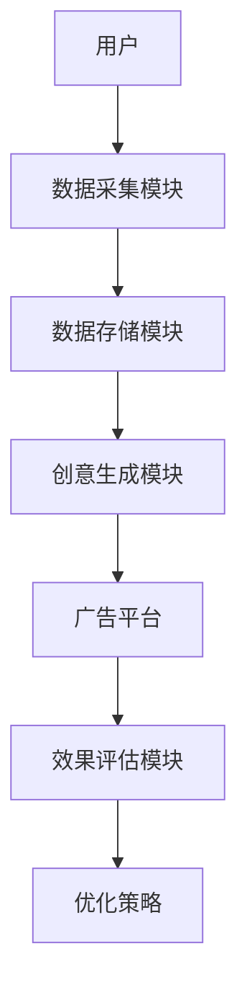

                 


# AI Agent在智能广告创意生成中的应用

## 关键词：AI Agent, 智能广告, 创意生成, 生成式AI, 广告创意

## 摘要：  
本文探讨了AI Agent在智能广告创意生成中的应用，详细分析了其背景、核心概念、算法原理、系统架构以及实际项目中的应用。通过对比传统广告创意生成方法，展示了AI Agent在提高效率和精准度方面的优势，并通过具体案例分析，说明了其在广告创意生成中的实际效果。

---

## 第1部分: AI Agent与智能广告创意生成的背景与基础

### 1.1 AI Agent的基本概念与广告创意生成的背景

#### 1.1.1 AI Agent的定义与核心特征
AI Agent（人工智能代理）是指能够感知环境、执行任务并做出决策的智能实体。其核心特征包括：
- **自主性**：能够在没有外部干预的情况下自主运行。
- **反应性**：能够根据环境反馈实时调整行为。
- **目标导向**：基于预设目标执行任务。
- **学习能力**：通过数据和经验不断优化性能。

#### 1.1.2 AI Agent与广告创意生成的结合
广告创意生成的传统方法依赖于人工经验，效率低且成本高。AI Agent通过自动化学习和生成，能够快速提供多样化的创意方案，显著提高广告制作效率。

---

### 1.2 智能广告创意生成的背景

#### 1.2.1 广告创意生成的传统方法
传统广告创意生成主要依赖人工设计和经验，存在以下问题：
- **效率低**：创意生成周期长，成本高。
- **多样性有限**：受人工经验限制，创意多样性不足。
- **难以个性化**：难以快速适应不同目标受众的需求。

#### 1.2.2 数字广告行业的现状与挑战
随着数字广告行业的快速发展，广告创意生成需要满足以下需求：
- **快速迭代**：广告内容需要频繁更新以适应市场变化。
- **精准定位**：广告需要针对特定目标受众进行个性化定制。
- **高效生成**：广告创意需要快速生成以应对市场竞争。

#### 1.2.3 AI技术在广告创意生成中的应用价值
AI技术的应用为广告创意生成带来了革命性的变化，主要体现在：
- **提高效率**：AI能够快速生成大量创意方案，缩短广告制作周期。
- **增强多样性**：通过算法优化，AI能够生成多样化的内容，满足不同需求。
- **精准定位**：AI能够分析用户行为数据，生成个性化广告内容。

---

### 1.3 AI Agent与智能广告创意生成的结合

#### 1.3.1 AI Agent在广告创意生成中的优势
AI Agent在广告创意生成中的优势包括：
- **自动化**：能够自动分析数据、生成创意并优化结果。
- **实时反馈**：能够根据实时数据调整创意策略。
- **高效性**：能够在短时间内生成大量高质量的广告创意。

#### 1.3.2 智能广告创意生成的核心问题
智能广告创意生成的核心问题包括：
- **数据获取与分析**：如何高效获取和分析用户数据。
- **创意生成与优化**：如何生成多样化且高效的广告创意。
- **效果评估与反馈**：如何准确评估广告效果并进行反馈优化。

#### 1.3.3 AI Agent在广告创意生成中的应用场景
AI Agent在广告创意生成中的应用场景包括：
- **个性化广告推荐**：根据用户行为数据推荐个性化广告内容。
- **创意内容生成**：通过自然语言处理技术生成广告文案。
- **效果预测与优化**：预测广告效果并优化广告内容。

---

## 第2部分: AI Agent与智能广告创意生成的核心概念

### 2.1 AI Agent的核心概念

#### 2.1.1 AI Agent的定义与分类
AI Agent可以根据功能和应用场景进行分类，主要包括：
- **基于规则的AI Agent**：通过预设规则执行任务。
- **基于学习的AI Agent**：通过机器学习算法进行自主学习和决策。
- **基于推理的AI Agent**：通过逻辑推理进行决策和行动。

#### 2.1.2 AI Agent的基本架构
AI Agent的基本架构包括：
- **感知层**：负责获取环境数据。
- **决策层**：负责根据数据做出决策。
- **执行层**：负责执行决策并输出结果。

#### 2.1.3 AI Agent的核心算法
AI Agent的核心算法包括：
- **机器学习算法**：如支持向量机（SVM）、随机森林（Random Forest）等。
- **深度学习算法**：如卷积神经网络（CNN）、循环神经网络（RNN）等。
- **强化学习算法**：如Q-learning、Deep Q-Network等。

---

### 2.2 智能广告创意生成的核心概念

#### 2.2.1 广告创意生成的基本流程
广告创意生成的基本流程包括：
- **数据收集**：收集用户行为数据和市场趋势数据。
- **创意生成**：通过AI算法生成广告创意。
- **效果评估**：评估广告效果并优化创意。

#### 2.2.2 智能广告创意生成的关键技术
智能广告创意生成的关键技术包括：
- **自然语言处理（NLP）**：用于生成广告文案。
- **计算机视觉（CV）**：用于生成广告图像和视频。
- **机器学习**：用于预测广告效果并优化创意。

#### 2.2.3 智能广告创意生成的评价指标
智能广告创意生成的评价指标包括：
- **点击率（CTR）**：广告被点击的比例。
- **转化率（CVR）**：广告点击后转化为实际销售的比例。
- **用户满意度**：用户对广告内容的满意度。

---

### 2.3 AI Agent与智能广告创意生成的联系

#### 2.3.1 AI Agent在广告创意生成中的角色
AI Agent在广告创意生成中的角色包括：
- **数据分析师**：分析用户行为数据和市场趋势数据。
- **创意生成器**：生成多样化的广告创意。
- **效果优化器**：根据效果反馈优化广告内容。

#### 2.3.2 AI Agent与广告创意生成的结合方式
AI Agent与广告创意生成的结合方式包括：
- **数据驱动的创意生成**：通过分析用户数据生成个性化广告。
- **自动化创意优化**：通过机器学习算法自动优化广告内容。
- **实时效果反馈**：实时监控广告效果并进行动态调整。

#### 2.3.3 AI Agent在智能广告创意生成中的优势
AI Agent在智能广告创意生成中的优势包括：
- **高效性**：能够在短时间内生成大量创意方案。
- **精准性**：能够根据用户数据生成个性化广告内容。
- **适应性**：能够根据市场变化动态调整广告策略。

---

## 第3部分: AI Agent与智能广告创意生成的核心概念对比

### 3.1 AI Agent的核心概念对比

#### 3.1.1 AI Agent与传统广告创意生成的对比
传统广告创意生成与AI Agent的对比：
| 对比维度 | 传统广告创意生成 | AI Agent广告创意生成 |
|----------|-------------------|------------------------|
| 效率     | 低                | 高                    |
| 多样性   | 有限              | 丰富                  |
| 个性化   | 难               | 易                    |
| 反馈优化 | 延迟              | 实时                  |

#### 3.1.2 AI Agent与机器学习模型的对比
AI Agent与机器学习模型的对比：
| 对比维度 | AI Agent           | 机器学习模型           |
|----------|--------------------|-----------------------|
| 智能性   | 高                | 中                   |
| 反应性   | 高                | 低                   |
| 自主性   | 高                | 低                   |

---

### 3.2 AI Agent与智能广告创意生成的对比

#### 3.2.1 AI Agent在广告创意生成中的核心要素
AI Agent在广告创意生成中的核心要素包括：
- **数据驱动**：依赖于大量的用户数据和市场数据。
- **算法优化**：通过机器学习算法不断优化创意生成策略。
- **实时反馈**：能够实时监控广告效果并进行动态调整。

#### 3.2.2 AI Agent与广告创意生成的对比
AI Agent与广告创意生成的对比：
| 对比维度 | AI Agent           | 广告创意生成           |
|----------|--------------------|-----------------------|
| 智能性   | 高                | 低                   |
| 适应性   | 高                | 低                   |
| 可扩展性 | 高                | 低                   |

---

## 第4部分: AI Agent与智能广告创意生成的算法原理

### 4.1 AI Agent的核心算法

#### 4.1.1 生成式AI的数学模型
生成式AI的核心数学模型包括：
- **大语言模型（LLM）**：如GPT系列模型，通过编码器和解码器结构生成文本内容。
- **变分自编码器（VAE）**：通过编码器将数据映射到 latent space，解码器将 latent space 数据映射回原始数据空间。

#### 4.1.2 生成式AI的训练过程
生成式AI的训练过程包括：
1. **数据预处理**：对原始数据进行清洗和归一化处理。
2. **模型训练**：使用优化算法（如Adam）训练模型参数。
3. **模型评估**：通过验证集评估模型的生成效果。
4. **模型优化**：根据评估结果调整模型参数。

#### 4.1.3 生成式AI的实现代码
以下是生成式AI的Python实现代码示例：

```python
import torch
import torch.nn as nn

class Generator(nn.Module):
    def __init__(self, latent_dim, hidden_dim):
        super(Generator, self).__init__()
        self.latent_dim = latent_dim
        self.hidden_dim = hidden_dim
        self.fc = nn.Linear(latent_dim, hidden_dim)
        self.output = nn.Linear(hidden_dim, 256*256)

    def forward(self, z):
        x = self.fc(z)
        x = torch.relu(x)
        x = self.output(x)
        x = torch.sigmoid(x)
        return x.view(-1, 256, 256)

# 定义损失函数
criterion = nn.BCELoss()

# 定义优化器
optimizer = torch.optim.Adam(generator.parameters(), lr=0.001)

# 训练过程
for epoch in range(num_epochs):
    for i, (real_images, _) in enumerate(dataloader):
        # 生成随机噪声
        z = torch.randn(batch_size, latent_dim)
        # 前向传播
        fake_images = generator(z)
        # 计算损失
        loss = criterion(fake_images, torch.ones_like(fake_images))
        # 反向传播和优化
        optimizer.zero_grad()
        loss.backward()
        optimizer.step()

print("训练完成！")
```

---

## 第5部分: AI Agent与智能广告创意生成的系统架构与设计

### 5.1 系统架构设计

#### 5.1.1 系统功能模块
智能广告创意生成系统的功能模块包括：
- **数据采集模块**：负责收集用户行为数据和市场趋势数据。
- **创意生成模块**：通过AI算法生成广告创意。
- **效果评估模块**：评估广告效果并优化创意。

#### 5.1.2 系统架构图
以下是系统的架构图：



---

## 第6部分: AI Agent与智能广告创意生成的项目实战

### 6.1 环境安装与配置

#### 6.1.1 安装依赖
安装所需的Python库：
```bash
pip install numpy matplotlib torch
```

#### 6.1.2 配置环境
配置Python环境：
```bash
conda create -n ai_agent python=3.8
conda activate ai_agent
```

---

### 6.2 核心代码实现

#### 6.2.1 数据预处理代码
以下是数据预处理的Python代码：

```python
import pandas as pd

# 读取数据
data = pd.read_csv('advertising.csv')

# 数据清洗
data = data.dropna()
data = data.drop_duplicates()

# 数据归一化
from sklearn.preprocessing import StandardScaler
scaler = StandardScaler()
scaled_data = scaler.fit_transform(data)
```

#### 6.2.2 生成式AI模型实现
以下是生成式AI模型的Python代码：

```python
import torch
import torch.nn as nn

class Generator(nn.Module):
    def __init__(self, latent_dim, hidden_dim):
        super(Generator, self).__init__()
        self.latent_dim = latent_dim
        self.hidden_dim = hidden_dim
        self.fc = nn.Linear(latent_dim, hidden_dim)
        self.output = nn.Linear(hidden_dim, 256*256)

    def forward(self, z):
        x = self.fc(z)
        x = torch.relu(x)
        x = self.output(x)
        x = torch.sigmoid(x)
        return x.view(-1, 256, 256)

# 定义损失函数
criterion = nn.BCELoss()

# 定义优化器
optimizer = torch.optim.Adam(generator.parameters(), lr=0.001)

# 训练过程
for epoch in range(num_epochs):
    for i, (real_images, _) in enumerate(dataloader):
        # 生成随机噪声
        z = torch.randn(batch_size, latent_dim)
        # 前向传播
        fake_images = generator(z)
        # 计算损失
        loss = criterion(fake_images, torch.ones_like(fake_images))
        # 反向传播和优化
        optimizer.zero_grad()
        loss.backward()
        optimizer.step()

print("训练完成！")
```

---

## 第7部分: 总结与展望

### 7.1 总结
本文详细探讨了AI Agent在智能广告创意生成中的应用，分析了其背景、核心概念、算法原理、系统架构以及实际项目中的应用。通过对比传统广告创意生成方法，展示了AI Agent在提高效率和精准度方面的优势。

### 7.2 展望
未来，随着AI技术的不断发展，AI Agent在智能广告创意生成中的应用将更加广泛和深入。通过结合更多的数据源和更复杂的算法，AI Agent将能够生成更加个性化和高效的广告创意，进一步提升广告的效果和用户体验。

---

## 作者：AI天才研究院 & 禅与计算机程序设计艺术

---

感谢您的阅读！希望这篇文章对您理解AI Agent在智能广告创意生成中的应用有所帮助。

