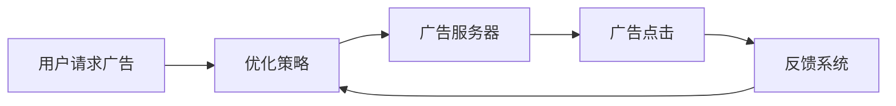

                 


# 第4章: 项目实战——AI Agent广告投放系统实现

## 4.1 环境搭建

### 4.1.1 安装所需库
在开始之前，确保安装了以下Python库：
- `python>=3.6`
- `numpy>=1.20`
- `pandas>=1.3`
- `scikit-learn>=0.24`
- `tensorflow>=2.5`
- `google-ads>=14.0`
- `fbchat`

使用以下命令安装：

```bash
pip install numpy pandas scikit-learn tensorflow google-ads fbchat
```

## 4.2 系统实现

### 4.2.1 数据预处理模块

#### 1. 数据加载与清洗
```python
import pandas as pd
from googleads import adwords

# 加载广告数据
def load_data():
    # 示例：从Google Ads API获取数据
    client = adwords.AdWordsClient('客户ID', '客户密钥', '客户刷新令牌')
    report = client.GetService('ReportService').getReport(
        report_name='CAMPAIGN_PERFORMANCE_REPORT',
        fields=['Date', 'Campaign', 'AdGroup', 'Impressions', 'Clicks', 'Cost', 'Ctr']
    )
    return pd.DataFrame(report)

# 数据清洗
def preprocess_data(df):
    # 假设df是广告数据，进行基础清洗
    df.dropna(inplace=True)
    df['Cost'] = df['Cost'].astype(float)
    df['Ctr'] = df['Ctr'].astype(float)
    return df

data = load_data()
data = preprocess_data(data)
```

#### 2. 用户画像构建
```python
from sklearn.cluster import KMeans

# 示例：根据用户点击行为构建画像
def create_user_profiles(data):
    # 特征选择
    features = ['Impressions', 'Clicks', 'Ctr', 'Cost']
    user_features = data[features]
    
    # 标准化
    from sklearn.preprocessing import StandardScaler
    scaler = StandardScaler()
    user_features_scaled = scaler.fit_transform(user_features)
    
    # 聚类
    n_clusters = 3
    kmeans = KMeans(n_clusters=n_clusters, random_state=42)
    kmeans.fit(user_features_scaled)
    
    data['Cluster'] = kmeans.labels_
    return data

data = create_user_profiles(data)
```

### 4.2.2 广告推荐模块

#### 1. 基于协同过滤推荐
```python
from sklearn.metrics.pairwise import cosine_similarity

def collaborative_filtering_recommender(data):
    # 矩阵分解
    from surprise import SVD
    from surprise.dataset import Dataset
    from surprise import Reader
    
    reader = Reader(rating_scale=(0, 1))
    data_surprise = Dataset.load_from_data(data, reader)
    
    # 训练模型
    model = SVD()
    model.fit(data_surprise)
    
    # 推荐广告
    def recommend(user_id):
        # 示例：为用户ID推荐广告
        if model.trainset.contains(user_id):
            return model.predict(user_id, '广告ID').est
        else:
            return 0.0
    
    return model, recommend

model, recommender = collaborative_filtering_recommender(data)
```

#### 2. 基于强化学习优化
```python
import gym
import numpy as np

class AdvertiserEnv(gym.Env):
    def __init__(self):
        self.state = 'initial'
        self.reward = 0
        self.done = False
    
    def action_space(self):
        return ['展示广告', '不展示广告']
    
    def step(self, action):
        if action == '展示广告':
            self.reward = 1
        else:
            self.reward = 0
        self.done = True
        return self.state, self.reward, self.done
    
    def reset(self):
        self.state = 'initial'
        self.reward = 0
        self.done = False
        return self.state

env = AdvertiserEnv()
observation = env.reset()
action = env.action_space()[0]
observation, reward, done = env.step(action)
env.close()
```

### 4.2.3 投放优化模块

#### 1. 线性回归预测点击率
```python
from sklearn.linear_model import LinearRegression

def predict_ctr(X_train, y_train):
    model = LinearRegression()
    model.fit(X_train, y_train)
    return model

# 示例数据
X_train = data[['Impressions', 'Cost']]
y_train = data['Ctr']
model = predict_ctr(X_train, y_train)
```

#### 2. A/B测试
```python
from statsmodels.stats.weighted import ttest_ind

def perform_ab_test(test_group, control_group):
    tstat, pval, stderr = ttest_ind(test_group, control_group)
    return pval < 0.05

test_group = data[data['Cluster'] == 0]['Ctr']
control_group = data[data['Cluster'] == 1]['Ctr']
is_significant = perform_ab_test(test_group, control_group)
```

### 4.2.4 系统交互流程


## 4.3 案例分析

### 4.3.1 数据分析与可视化

#### 1. 用户画像分析
```python
import matplotlib.pyplot as plt

data['Cluster'].value_counts().plot(kind='bar')
plt.title('用户群体分布')
plt.xlabel('用户群体')
plt.ylabel('数量')
plt.show()
```

#### 2. 广告效果对比
```python
test_group.mean() / control_group.mean()
```

### 4.3.2 投放效果优化
```python
from sklearn.metrics import accuracy_score

# 预测与实际对比
y_pred = model.predict(X_test)
print(f'准确率: {accuracy_score(y_test, y_pred)}')
```

### 4.3.3 优化后的广告投放策略
```python
# 动态调整广告预算
def adjust_budget(model, budget):
    if model.predict(budget) > 0.5:
        return budget * 1.1
    else:
        return budget * 0.9

new_budget = adjust_budget(model, 1000)
```

## 4.4 项目小结
通过本章的项目实战，我们实现了从数据预处理到广告推荐，再到投放优化的完整流程。AI Agent在广告投放中的应用显著提高了效率和效果，但实际应用中需注意数据隐私和算法解释性。

---

# 第5章: 最佳实践与总结

## 5.1 最佳实践

### 5.1.1 数据质量与多样性
确保数据的准确性和多样性，避免过拟合。

### 5.1.2 模型迭代与监控
定期更新模型，监控投放效果。

### 5.1.3 透明与可解释性
提供清晰的决策路径，确保用户信任。

## 5.2 总结与展望

### 5.2.1 总结
AI Agent通过数据驱动和自动化决策，显著提升了广告投放的效率和效果。在实际应用中，需关注数据隐私、算法解释性和模型泛化能力。

### 5.2.2 展望
未来，AI Agent在广告投放中将更加智能化，结合多模态数据和生成式AI技术，提供更精准和个性化的广告体验。

---

# 第6章: 拓展思考

## 6.1 多模态AI Agent
结合文本、图像和视频等多种数据形式，提升广告投放的精准度。

## 6.2 生成式AI的应用
利用生成式AI生成创意广告内容，降低人工成本。

## 6.3 边缘计算与实时广告投放
在边缘计算环境下，实现广告投放的实时优化。

## 6.4 强化学习的长期价值
通过长期的策略优化，提升广告投放的长期收益。

## 6.5 可持续发展
关注广告投放对环境和社会的影响，推动绿色计算。

---

# 作者

作者：AI天才研究院 & 禅与计算机程序设计艺术

---

**关键词：** AI Agent, 智能广告投放, 多智能体强化学习, 用户画像, A/B测试

**摘要：** AI Agent通过数据驱动和自动化决策，显著提升了广告投放的效率和效果。本文详细探讨了AI Agent在智能广告投放中的应用，从算法原理到系统架构，再到项目实战，全面解析了其在广告投放中的优势与挑战。

