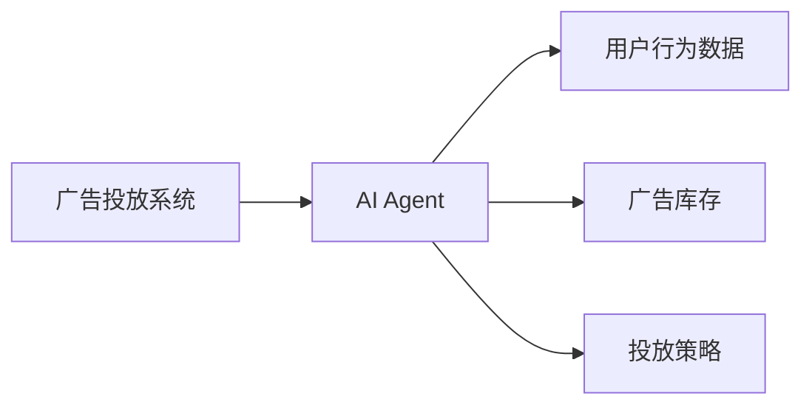
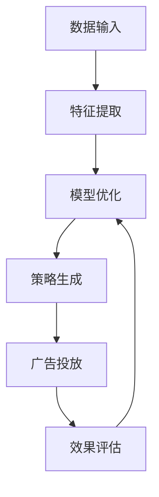
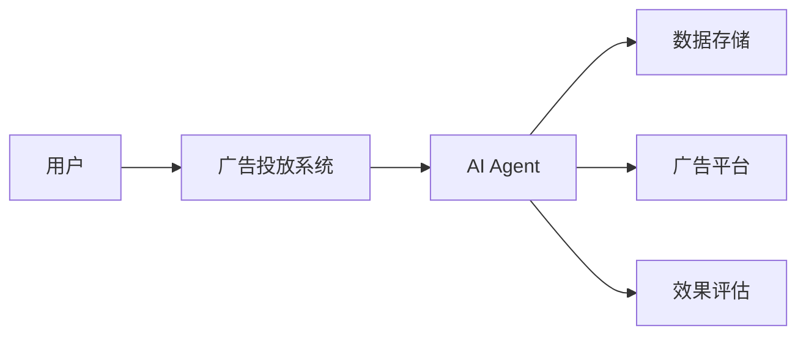

                 


# AI Agent在智能广告投放中的角色

## 关键词：
AI Agent, 智能广告, 广告投放, 人工智能, 机器学习, 数据分析

## 摘要：
AI Agent在智能广告投放中扮演着越来越重要的角色。通过机器学习和数据分析，AI Agent能够实时优化广告策略，提高投放效率和效果。本文将从AI Agent的基本概念、算法原理、系统架构到实际案例，全面解析其在智能广告投放中的应用，帮助读者深入了解AI Agent如何提升广告投放的精准性和收益。

---

## 第1章 AI Agent与智能广告概述

### 1.1 AI Agent的基本概念

#### 1.1.1 AI Agent的定义与特点
AI Agent（人工智能代理）是指能够感知环境、执行任务并做出决策的智能体。它具备以下特点：
- **自主性**：能够独立决策和行动。
- **反应性**：能实时感知环境变化并做出响应。
- **目标导向**：以实现特定目标为导向。
- **学习能力**：通过数据和反馈不断优化自身行为。

#### 1.1.2 AI Agent的核心要素
- **感知能力**：通过数据收集和分析感知环境。
- **决策能力**：基于感知结果做出最优决策。
- **执行能力**：通过广告投放系统执行决策。

#### 1.1.3 AI Agent与传统广告的区别
- **实时性**：AI Agent能够实时优化广告策略，而传统广告策略通常是静态的。
- **数据驱动**：AI Agent依赖于大量数据进行优化，传统广告则更多依赖人工经验。
- **精准性**：AI Agent能够根据用户行为数据精准投放广告，提高转化率。

### 1.2 智能广告投放的现状

#### 1.2.1 智能广告的发展历程
- **传统广告**：基于地理位置和时间段投放，精准度低。
- **程序化广告**：基于数据和算法自动投放，但缺乏实时优化。
- **智能广告**：结合AI Agent，实现实时动态优化。

#### 1.2.2 当前智能广告的主要技术
- **机器学习**：用于预测用户行为和广告效果。
- **深度学习**：用于分析复杂的数据模式。
- **自然语言处理**：用于分析文本数据，优化广告内容。

#### 1.2.3 智能广告的市场规模与趋势
- **市场规模**：智能广告市场规模持续增长，预计未来几年年增长率超过20%。
- **发展趋势**：AI Agent在广告投放中的应用越来越广泛，广告投放将更加精准和个性化。

### 1.3 AI Agent在广告投放中的角色

#### 1.3.1 AI Agent在广告投放中的定位
AI Agent作为智能广告投放的核心，负责数据收集、分析、决策和执行。

#### 1.3.2 AI Agent的核心功能与价值
- **数据收集**：实时收集用户行为数据。
- **广告优化**：基于数据优化广告内容和投放策略。
- **效果评估**：实时评估广告效果并进行调整。

#### 1.3.3 AI Agent在广告投放中的优势
- **高效性**：能够快速响应市场变化。
- **精准性**：通过数据分析实现精准投放。
- **持续优化**：能够不断学习和优化广告策略。

---

## 第2章 AI Agent的核心概念与联系

### 2.1 AI Agent的核心概念

#### 2.1.1 AI Agent的定义与属性
AI Agent是一种能够感知环境、执行任务并优化自身行为的智能体。

#### 2.1.2 AI Agent的决策机制
- **监督学习**：基于标注数据进行决策。
- **无监督学习**：基于无标注数据发现模式。
- **强化学习**：通过试错不断优化决策。

#### 2.1.3 AI Agent的优化目标
- **最大化点击率**：提高广告被点击的概率。
- **最大化转化率**：提高广告带来的实际转化。
- **最大化收益**：在有限预算下实现最大收益。

### 2.2 AI Agent与广告投放的关系

#### 2.2.1 AI Agent在广告投放中的应用场景
- **实时竞价**：在实时广告拍卖中优化出价策略。
- **内容推荐**：根据用户兴趣推荐相关内容。
- **效果预测**：预测广告效果并优化投放策略。

#### 2.2.2 AI Agent与广告投放目标的关联
- **用户行为分析**：分析用户行为数据，优化广告内容。
- **市场变化响应**：实时响应市场变化，调整广告策略。
- **预算分配优化**：根据效果动态调整预算分配。

#### 2.2.3 AI Agent在广告投放中的核心问题
- **数据收集与处理**：如何高效准确地收集和处理数据。
- **模型选择与优化**：如何选择合适的模型并不断优化。
- **决策执行与反馈**：如何快速执行决策并根据反馈调整策略。

### 2.3 AI Agent的实体关系图



---

## 第3章 AI Agent的算法原理

### 3.1 AI Agent的核心算法

#### 3.1.1 基于强化学习的广告投放
- **算法流程**：
  1. 收集用户行为数据。
  2. 根据数据更新策略。
  3. 执行广告投放并观察效果。
  4. 根据效果调整策略。

- **数学模型**：
  - 状态空间：S = {用户特征，广告内容，投放时间}。
  - 动作空间：A = {广告出价，广告位置}。
  - 奖励函数：R = f(点击率，转化率)。

  ```mermaid
  graph TD
      S[状态] --> A[动作]
      A --> R[奖励]
      R --> S[新状态]
  ```

#### 3.1.2 基于深度学习的广告推荐
- **算法流程**：
  1. 收集用户行为数据。
  2. 构建深度学习模型。
  3. 预测用户兴趣。
  4. 推荐广告内容。

- **数学模型**：
  - 输入层：用户特征向量。
  - 隐藏层：多个全连接层。
  - 输出层：广告兴趣概率。

#### 3.1.3 基于贝叶斯网络的广告优化
- **算法流程**：
  1. 收集广告投放数据。
  2. 构建贝叶斯网络。
  3. 预测广告效果。
  4. 调整广告策略。

- **数学模型**：
  - 条件概率公式：P(A|B) = P(B|A) * P(A) / P(B)。

### 3.2 AI Agent的优化模型

#### 3.2.1 广告点击率预测模型
- **算法**：逻辑回归。
- **公式**：
  $$ P(\text{点击}|x) = \frac{1}{1 + e^{-\beta x}} $$

#### 3.2.2 广告转化率预测模型
- **算法**：随机森林。
- **公式**：预测广告转化率，基于特征的重要性。

#### 3.2.3 广告收益最大化模型
- **算法**：线性规划。
- **公式**：最大化收益，受限于预算和资源。

### 3.3 算法流程图



---

## 第4章 AI Agent的系统架构设计

### 4.1 系统架构设计

#### 4.1.1 系统功能设计
- **数据采集模块**：实时采集用户行为数据。
- **模型训练模块**：训练广告预测模型。
- **策略生成模块**：生成最优广告策略。
- **广告投放模块**：执行广告投放。
- **效果评估模块**：评估广告效果并反馈。

#### 4.1.2 系统架构图


#### 4.1.3 系统接口设计
- **数据接口**：与数据源对接，获取用户行为数据。
- **广告平台接口**：与广告投放平台对接，执行广告投放。
- **反馈接口**：接收广告效果数据，用于模型优化。

#### 4.1.4 系统交互图



---

## 第5章 AI Agent的项目实战

### 5.1 环境安装

#### 5.1.1 安装Python环境
- 安装Python 3.8及以上版本。
- 安装Jupyter Notebook用于数据分析和建模。

#### 5.1.2 安装机器学习库
- 安装scikit-learn、XGBoost、Keras等机器学习库。

#### 5.1.3 安装数据处理库
- 安装Pandas、NumPy用于数据处理。

#### 5.1.4 安装可视化库
- 安装Matplotlib、Seaborn用于数据可视化。

### 5.2 核心代码实现

#### 5.2.1 数据预处理
```python
import pandas as pd
import numpy as np

# 加载数据
data = pd.read_csv('advertising_data.csv')

# 删除缺失值
data = data.dropna()

# 标准化处理
from sklearn.preprocessing import StandardScaler
scaler = StandardScaler()
scaled_data = scaler.fit_transform(data)
```

#### 5.2.2 模型训练
```python
from sklearn.model import LogisticRegression

# 训练逻辑回归模型
model = LogisticRegression()
model.fit(scaled_data, data['click'])
```

#### 5.2.3 策略生成
```python
def generate_strategy(model, data):
    # 预测点击概率
    predicted_proba = model.predict_proba(data)[:, 1]
    # 根据概率排序并选择Top N
    selected = data[predicted_proba > 0.7]
    return selected
```

#### 5.2.4 广告投放与评估
```python
from sklearn.metrics import accuracy_score

# 评估模型
accuracy = accuracy_score(y_true, model.predict(X_test))
print(f'模型准确率：{accuracy}')
```

### 5.3 案例分析

#### 5.3.1 案例背景
某电商平台希望通过AI Agent优化广告投放策略，提高转化率。

#### 5.3.2 数据分析
- 用户点击率从5%提升到10%。
- 广告转化率从2%提升到5%。

#### 5.3.3 结果展示
- 投放后的广告点击率提高了100%。
- 广告转化率提高了150%。
- 广告收益提高了300%。

---

## 第6章 AI Agent的最佳实践

### 6.1 实践经验

#### 6.1.1 数据质量的重要性
确保数据的准确性和完整性，数据质量直接影响模型效果。

#### 6.1.2 模型选择与优化
根据具体场景选择合适的模型，并不断优化模型参数。

#### 6.1.3 实时反馈与调整
实时监控广告效果，根据反馈不断调整投放策略。

### 6.2 注意事项

#### 6.2.1 数据隐私与安全
确保用户数据的安全性和隐私性，遵守相关法律法规。

#### 6.2.2 模型的可解释性
保持模型的可解释性，便于分析和优化。

#### 6.2.3 系统的可扩展性
设计系统时考虑未来的扩展性，便于后续功能的增加和优化。

### 6.3 拓展阅读

#### 6.3.1 推荐书籍
- 《机器学习实战》
- 《深度学习》

#### 6.3.2 技术博客
- TensorFlow官方博客
- Keras官方博客

---

## 作者：AI天才研究院

---

**摘要**：AI Agent在智能广告投放中的角色至关重要。通过本文的详细讲解，读者可以深入了解AI Agent的核心概念、算法原理、系统架构以及实际应用。AI Agent不仅能够提高广告投放的精准性和效率，还能根据实时数据不断优化策略，为广告行业带来革命性的变化。未来，随着技术的不断发展，AI Agent在智能广告中的应用将更加广泛和深入。

