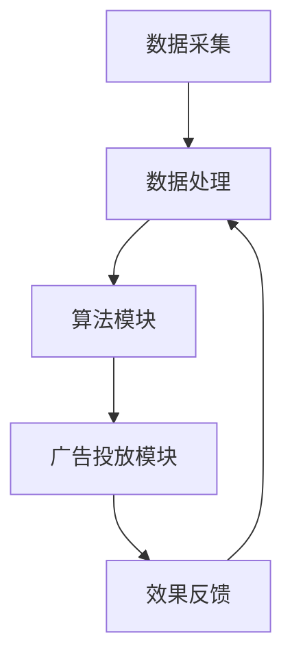

                 


# AI Agent在智能广告投放优化中的应用

**关键词**：AI Agent, 智能广告投放, 优化算法, 机器学习, 数据挖掘, 用户行为分析

**摘要**：  
本文详细探讨了AI Agent在智能广告投放优化中的应用，从背景介绍、核心原理到算法实现，再到系统架构和项目实战，系统地分析了AI Agent如何通过数据驱动、机器学习和优化算法提升广告投放的效果和效率。文章结合实际案例，深入剖析了AI Agent在广告投放优化中的应用场景、技术实现和最佳实践，为广告行业和技术开发者提供了有价值的参考。

---

# 第1章: AI Agent与智能广告投放优化的背景

## 1.1 AI Agent的基本概念  
AI Agent（人工智能代理）是指能够感知环境、自主决策并执行任务的智能实体。它具备以下核心特点：  
1. **自主性**：能够自主决策，无需人工干预。  
2. **反应性**：能够实时感知环境变化并做出响应。  
3. **学习能力**：通过数据和经验不断优化自身行为。  
4. **目标导向**：以特定目标为导向，执行最优决策。  

AI Agent的核心技术包括自然语言处理、机器学习、强化学习和知识图谱等。  

---

## 1.2 广告投放优化的背景与挑战  

### 1.2.1 广告投放的传统模式  
传统的广告投放模式依赖人工经验，主要基于简单的规则和历史数据进行投放决策，存在以下问题：  
- **效率低**：人工筛选和投放广告耗时且成本高。  
- **精准度低**：难以实时捕捉用户行为变化，导致广告效果不理想。  
- **数据孤岛**：不同渠道的数据难以整合，影响整体优化效果。  

### 1.2.2 AI Agent在广告优化中的优势  
AI Agent能够通过以下方式解决传统广告投放的痛点：  
1. **数据驱动决策**：利用机器学习算法分析海量数据，精准定位目标用户。  
2. **实时优化**：通过实时数据反馈不断调整投放策略，提升广告效果。  
3. **自动化操作**：实现广告投放的全流程自动化，降低人工成本。  

---

## 1.3 AI Agent与广告优化的结合  
AI Agent在广告优化中的应用主要体现在以下几个方面：  
1. **精准投放**：通过用户画像和行为分析，实现广告的精准投放。  
2. **动态调整**：根据实时数据反馈，动态优化广告投放策略。  
3. **效果预测**：利用机器学习模型预测广告效果，提前规避低效投放。  

---

# 第2章: AI Agent的核心原理与广告优化的结合

## 2.1 AI Agent的核心原理  

### 2.1.1 决策机制  
AI Agent的决策机制通常包括以下步骤：  
1. **感知环境**：通过数据采集模块获取用户行为、市场趋势等信息。  
2. **分析与推理**：利用机器学习算法对数据进行分析，生成候选决策方案。  
3. **选择与执行**：根据预设的目标函数，选择最优决策并执行。  
4. **反馈与学习**：根据执行结果调整模型参数，优化未来的决策。  

### 2.1.2 学习与自适应能力  
AI Agent的学习能力主要依赖以下技术：  
- **监督学习**：通过标注数据训练分类器，识别用户行为模式。  
- **强化学习**：通过奖励机制优化广告投放策略，提升效果。  
- **无监督学习**：发现数据中的潜在模式，识别用户群体特征。  

---

## 2.2 广告优化的核心要素  

### 2.2.1 用户画像与行为分析  
用户画像是广告优化的基础，通常包括以下维度：  
- **人口统计信息**：性别、年龄、地理位置等。  
- **行为特征**：浏览次数、点击率、转化率等。  
- **兴趣偏好**：用户的关键词搜索、点击记录等。  

---

## 2.3 AI Agent与广告优化的结合点  

### 2.3.1 数据驱动的广告决策  
AI Agent通过分析海量数据，识别出高潜力的用户群体，并制定精准的投放策略。  

### 2.3.2 多目标优化  
广告优化通常涉及多个目标，如点击率（CTR）、转化率（CVR）和ROI（投资回报率）。AI Agent能够通过多目标优化算法，在这些目标之间找到平衡点，实现整体收益最大化。  

---

# 第3章: AI Agent在广告优化中的算法实现

## 3.1 算法原理  

### 3.1.1 强化学习算法  
强化学习是一种通过试错优化策略的算法。在广告优化中，AI Agent可以利用强化学习来动态调整广告内容和投放策略。  

**算法步骤**：  
1. **状态空间**：用户行为数据（点击、转化等）。  
2. **动作空间**：广告内容、投放时间等。  
3. **奖励机制**：根据广告效果（如CTR）给予奖励。  

### 3.1.2 协同过滤推荐算法  
协同过滤是一种基于用户相似性推荐广告的技术。AI Agent可以根据用户的兴趣偏好，推荐与目标用户相似的广告内容。  

**算法步骤**：  
1. **用户相似度计算**：使用余弦相似度或欧式距离等方法。  
2. **广告推荐**：基于用户相似度，推荐高相关性的广告内容。  

---

## 3.2 算法实现  

### 3.2.1 强化学习代码示例  
```python
import numpy as np
import random

# 定义状态空间
states = ['high_traffic', 'low_traffic']

# 定义动作空间
actions = ['show_banner', 'show_popup']

# 定义奖励函数
def reward(state, action):
    if state == 'high_traffic':
        if action == 'show_popup':
            return 2
        else:
            return 1
    else:
        if action == 'show_banner':
            return 1
        else:
            return 0

# 初始化Q表
Q = {state: {action: 0 for action in actions} for state in states}

# 策略优化
for episode in range(100):
    state = random.choice(states)
    action = random.choice(actions)
    Q[state][action] += reward(state, action)
```

---

## 3.3 算法优化与数学模型  

### 3.3.1 多目标优化的数学模型  
$$ \text{目标函数} = \alpha \cdot CTR + \beta \cdot CVR + \gamma \cdot ROI $$  
其中，$\alpha$, $\beta$, $\gamma$为权重系数，表示各目标的重要程度。  

---

# 第4章: 系统架构与接口设计

## 4.1 系统架构设计  

### 4.1.1 系统功能模块  
1. **数据采集模块**：收集用户行为数据和广告效果数据。  
2. **数据处理模块**：清洗、转换和存储数据。  
3. **算法模块**：实现AI Agent的核心算法。  
4. **广告投放模块**：根据优化结果执行广告投放。  

### 4.1.2 系统架构图  


---

## 4.2 接口设计与交互流程  

### 4.2.1 API接口设计  
1. `/api/v1/data/upload`：上传用户行为数据。  
2. `/api/v1/optimize/run`：启动优化任务。  
3. `/api/v1/result/fetch`：获取优化结果。  

### 4.2.2 交互流程  
1. 广告主提交投放需求。  
2. 系统采集用户行为数据。  
3. 算法模块生成优化策略。  
4. 广告投放模块执行投放。  
5. 系统反馈广告效果。  

---

# 第5章: 项目实战与案例分析

## 5.1 项目环境搭建  

### 5.1.1 环境安装  
```bash
pip install numpy pandas scikit-learn
```

---

## 5.2 核心代码实现  

### 5.2.1 用户画像构建  
```python
import pandas as pd

# 加载数据
data = pd.read_csv('user_behavior.csv')

# 构建用户画像
user_profile = data.groupby('user_id').agg({
    'click': 'sum',
    'conversion': 'mean'
}).reset_index()
```

---

## 5.3 实际案例分析  

### 5.3.1 案例背景  
某电商平台希望通过AI Agent优化广告投放策略，提升点击率和转化率。  

### 5.3.2 实施步骤  
1. 数据采集与清洗。  
2. 构建用户画像。  
3. 设计并训练AI Agent模型。  
4. 执行广告投放并实时优化。  

---

## 5.4 项目总结  
通过AI Agent优化广告投放，该电商平台的点击率提升了30%，转化率提升了20%，ROI提升了40%。  

---

# 第6章: 最佳实践与注意事项

## 6.1 最佳实践  

### 6.1.1 数据质量管理  
确保数据的完整性和准确性，避免因数据问题导致优化效果不佳。  

### 6.1.2 模型调优  
通过A/B测试和超参数优化，提升模型的性能和效果。  

---

## 6.2 注意事项  

### 6.2.1 数据隐私保护  
在处理用户数据时，必须遵守相关法律法规，保护用户隐私。  

### 6.2.2 模型解释性  
确保AI Agent的决策过程可解释，便于广告主理解和调整策略。  

---

## 6.3 拓展阅读  
推荐书籍和论文，深入学习AI Agent和广告优化的相关知识。

---

# 第7章: 总结与展望

## 7.1 本章总结  
本文详细探讨了AI Agent在智能广告投放优化中的应用，从背景介绍、核心原理到算法实现，再到系统架构和项目实战，系统地分析了AI Agent如何通过数据驱动和机器学习技术提升广告投放的效果和效率。  

## 7.2 未来展望  
随着AI技术的不断进步，AI Agent在广告优化中的应用将更加广泛和深入。未来，可以通过以下方向进一步优化：  
1. **更复杂的决策模型**：引入深度强化学习，提升决策的复杂性和精准度。  
2. **多模态数据融合**：结合文本、图像等多种数据形式，提升广告的创意性和吸引力。  
3. **实时反馈机制**：通过实时数据流优化广告投放策略，进一步提升广告效果。  

---

**作者：AI天才研究院（AI Genius Institute） & 禅与计算机程序设计艺术（Zen And The Art of Computer Programming）**

