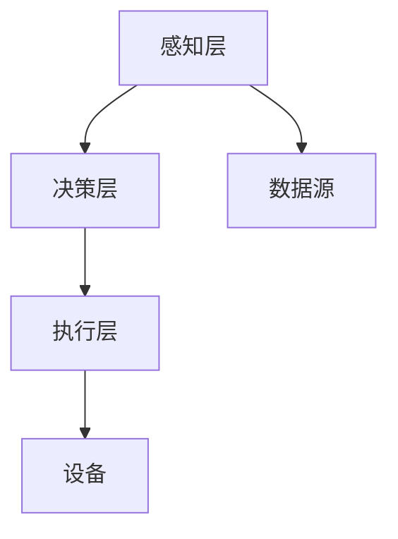

                 


# AI Agent在智能废水处理中的实践

> 关键词：AI Agent，智能废水处理，机器学习，环境监测，废水处理系统

> 摘要：本文探讨了AI Agent在智能废水处理中的应用，分析了其在废水处理系统中的核心作用，结合具体案例和系统设计，详细介绍了AI Agent在废水处理中的应用场景、系统架构设计、算法实现及优化策略。

---

# 第1章: AI Agent与智能废水处理概述

## 1.1 AI Agent的基本概念

### 1.1.1 AI Agent的定义与特点
AI Agent（人工智能代理）是指能够感知环境、自主决策并执行任务的智能实体。其特点包括：
- **自主性**：能够独立完成任务，无需外部干预。
- **反应性**：能够实时感知环境变化并做出响应。
- **学习能力**：能够通过数据学习和优化自身行为。
- **协作性**：能够与其他系统或Agent协同工作。

### 1.1.2 AI Agent的核心功能与优势
AI Agent的核心功能包括：
- **感知环境**：通过传感器或数据源获取环境信息。
- **决策与推理**：基于感知信息进行分析和决策。
- **执行任务**：根据决策结果执行具体操作。

其优势在于能够提高系统的智能化水平，降低人工干预成本，实现高效、精准的处理。

### 1.1.3 AI Agent在废水处理中的应用背景
随着工业化进程的加快，废水处理成为环境保护的重要任务。传统废水处理系统依赖人工操作，效率低且难以应对复杂工况。AI Agent的引入为废水处理提供了智能化解决方案，能够实时监测、优化控制和异常处理。

---

## 1.2 智能废水处理的基本概念

### 1.2.1 废水处理的基本原理
废水处理通常包括物理处理、化学处理和生物处理三个阶段：
1. **物理处理**：通过过滤、沉淀等方法去除固体废物。
2. **化学处理**：利用化学反应去除溶解性污染物。
3. **生物处理**：利用微生物分解有机污染物。

### 1.2.2 智能废水处理的定义与目标
智能废水处理是指通过智能化技术（如AI、物联网等）实现废水处理的自动化和优化。其目标是提高处理效率、降低能耗、减少污染。

### 1.2.3 智能废水处理与传统废水处理的区别
智能废水处理与传统处理的主要区别在于：
- **自动化**：智能系统能够自动完成监测和控制。
- **优化**：通过AI算法优化处理过程，提高效率。
- **实时性**：能够实时响应环境变化。

---

## 1.3 AI Agent在智能废水处理中的结合

### 1.3.1 AI Agent与废水处理的结合方式
AI Agent通过以下方式与废水处理结合：
- **实时监测**：通过传感器采集水质数据。
- **异常检测**：识别处理过程中的异常情况。
- **优化控制**：根据数据优化处理参数。

### 1.3.2 AI Agent在废水处理中的应用场景
1. **实时监测**：监测水质参数（如COD、pH值等）。
2. **异常检测**：识别处理过程中的异常情况并报警。
3. **优化控制**：根据数据优化处理流程和参数。

### 1.3.3 AI Agent在废水处理中的优势与挑战
优势：
- 提高处理效率。
- 降低人工干预。
- 实现精准控制。

挑战：
- 数据采集的准确性。
- 算法的实时性和稳定性。

---

## 1.4 本章小结
本章介绍了AI Agent的基本概念及其在废水处理中的应用背景，阐述了智能废水处理的定义和目标，并分析了AI Agent在废水处理中的应用场景和优势。

---

# 第2章: AI Agent的核心原理

## 2.1 AI Agent的基本架构

### 2.1.1 感知层
感知层通过传感器采集环境数据，如：
- **pH传感器**：监测水质酸碱度。
- **COD传感器**：监测化学需氧量。

### 2.1.2 决策层
决策层基于感知数据进行分析和决策，通常采用以下算法：
1. **机器学习算法**：如支持向量机（SVM）和随机森林（Random Forest）。
2. **强化学习算法**：如Q-learning和Deep Q-Network（DQN）。

### 2.1.3 执行层
执行层根据决策结果执行操作，如：
- 调节曝气量。
- 控制阀门开关。

---

## 2.2 AI Agent的核心算法

### 2.2.1 机器学习算法
机器学习算法用于分类和回归任务，如预测水质参数。

### 2.2.2 自然语言处理算法
自然语言处理用于分析文本数据，如处理异常报告。

### 2.2.3 强化学习算法
强化学习用于优化控制策略，如动态调整处理参数。

---

## 2.3 AI Agent与废水处理系统的结合

### 2.3.1 废水处理系统的感知模块
感知模块通过传感器采集数据，如：
- 水温、pH值、COD值。

### 2.3.2 废水处理系统的决策模块
决策模块基于感知数据进行分析，如：
- 使用SVM分类器预测水质状态。

### 2.3.3 废水处理系统的执行模块
执行模块根据决策结果执行操作，如：
- 调节曝气机转速。

---

## 2.4 本章小结
本章详细介绍了AI Agent的基本架构及其在废水处理中的核心算法，并分析了AI Agent与废水处理系统的结合方式。

---

# 第3章: 智能废水处理系统的设计原理

## 3.1 废水处理系统的功能模块划分

### 3.1.1 数据采集模块
数据采集模块负责采集水质数据，如：
- pH值传感器。
- COD传感器。

### 3.1.2 数据分析模块
数据分析模块负责处理数据，如：
- 清洗数据。
- 特征提取。

### 3.1.3 智能决策模块
智能决策模块负责分析数据并生成决策，如：
- 使用机器学习模型预测水质。

### 3.1.4 系统控制模块
系统控制模块负责根据决策结果控制设备，如：
- 调节曝气机转速。

---

## 3.2 废水处理系统的数据流设计

### 3.2.1 数据采集流程
1. 传感器采集数据。
2. 数据传输到数据采集模块。

### 3.2.2 数据分析流程
1. 数据清洗。
2. 数据分析模块处理数据。
3. 生成决策。

### 3.2.3 智能决策流程
1. 分析数据。
2. 生成决策。

### 3.2.4 系统控制流程
1. 执行决策。
2. 调节设备。

---

## 3.3 废水处理系统的接口设计

### 3.3.1 数据采集接口
数据采集接口用于连接传感器和数据采集模块。

### 3.3.2 数据分析接口
数据分析接口用于连接数据采集模块和数据分析模块。

### 3.3.3 智能决策接口
智能决策接口用于连接数据分析模块和智能决策模块。

### 3.3.4 系统控制接口
系统控制接口用于连接智能决策模块和系统控制模块。

---

## 3.4 废水处理系统的通信机制

### 3.4.1 系统内部通信
系统内部通过内部接口进行通信。

### 3.4.2 系统外部通信
系统外部通过API与外部系统进行通信。

### 3.4.3 数据同步机制
数据同步机制用于确保系统内部数据一致性。

---

## 3.5 本章小结
本章详细介绍了智能废水处理系统的功能模块划分、数据流设计、接口设计和通信机制。

---

# 第4章: AI Agent在废水处理中的应用场景

## 4.1 废水处理系统的实时监测

### 4.1.1 实时监测的必要性
实时监测能够及时发现异常情况，避免污染扩散。

### 4.1.2 实时监测的具体实现
1. 传感器采集数据。
2. 数据分析模块处理数据。
3. 显示实时数据。

---

## 4.2 废水处理系统的异常检测

### 4.2.1 异常检测的重要性
异常检测能够及时发现系统故障，避免处理失败。

### 4.2.2 异常检测的具体实现
1. 数据分析模块分析数据。
2. 识别异常情况。
3. 报警并记录异常信息。

---

## 4.3 废水处理系统的优化控制

### 4.3.1 优化控制的必要性
优化控制能够提高处理效率，降低能耗。

### 4.3.2 优化控制的具体实现
1. 数据分析模块分析数据。
2. 生成优化策略。
3. 执行优化控制。

---

## 4.4 本章小结
本章详细介绍了AI Agent在废水处理中的应用场景，包括实时监测、异常检测和优化控制。

---

# 第5章: AI Agent在废水处理中的系统架构设计

## 5.1 废水处理系统的架构设计

### 5.1.1 系统架构图


### 5.1.2 系统模块划分
1. 感知层：负责数据采集。
2. 决策层：负责数据分析和决策。
3. 执行层：负责设备控制。

---

## 5.2 废水处理系统的接口设计

### 5.2.1 接口设计
1. 数据采集接口。
2. 数据分析接口。
3. 系统控制接口。

---

## 5.3 废水处理系统的交互设计

### 5.3.1 交互流程
1. 传感器采集数据。
2. 数据传输到数据采集模块。
3. 数据分析模块处理数据。
4. 生成决策。
5. 执行决策。

---

## 5.4 本章小结
本章详细介绍了AI Agent在废水处理中的系统架构设计，包括系统架构图、模块划分和接口设计。

---

# 第6章: AI Agent在废水处理中的项目实战

## 6.1 项目介绍

### 6.1.1 项目背景
本项目旨在通过AI Agent优化废水处理过程。

### 6.1.2 项目目标
实现废水处理的实时监测、异常检测和优化控制。

---

## 6.2 环境配置

### 6.2.1 系统环境
- 操作系统：Linux
- 开发工具：Python、Jupyter Notebook

### 6.2.2 数据集
- 数据来源：传感器数据。
- 数据格式：CSV格式。

---

## 6.3 核心代码实现

### 6.3.1 数据采集代码
```python
import serial

# 初始化串口
ser = serial.Serial('COM1', 9600)

# 读取数据
data = ser.readline().decode()
print(data)
```

### 6.3.2 数据分析代码
```python
import pandas as pd
from sklearn.

