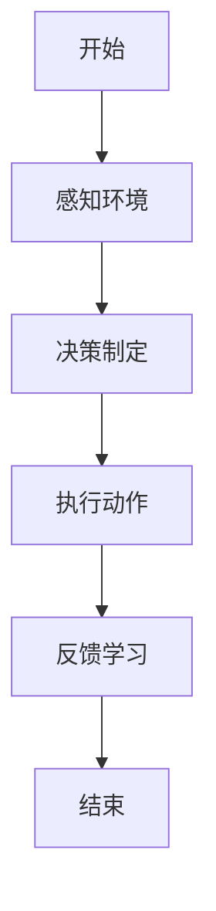

                 


# AI Agent在智能建筑管理中的应用

> 关键词：AI Agent, 智能建筑管理, 人工智能, 算法原理, 系统架构

> 摘要：本文详细探讨了AI Agent在智能建筑管理中的应用，从背景介绍到算法原理，再到系统架构设计和项目实战，全面分析了AI Agent如何提升智能建筑管理的效率和智能化水平。文章结合理论与实践，为读者提供了丰富的技术细节和实际案例，帮助读者深入了解AI Agent在智能建筑管理中的核心作用。

---

## 第一部分: AI Agent与智能建筑管理的背景介绍

### 第1章: AI Agent与智能建筑管理概述

#### 1.1 AI Agent的基本概念

- **1.1.1 AI Agent的定义**
  AI Agent（人工智能代理）是一种能够感知环境、自主决策并执行任务的智能实体。它能够根据环境信息做出决策，并通过执行动作影响环境。

- **1.1.2 AI Agent的核心特征**
  - **自主性**：能够在没有外部干预的情况下自主运行。
  - **反应性**：能够实时感知环境并做出响应。
  - **学习性**：能够通过经验不断优化自身的决策能力。
  - **协作性**：能够与其他Agent或系统进行协作。

- **1.1.3 AI Agent与传统自动化的区别**
  AI Agent不仅仅是简单的自动化工具，它具备学习和适应能力，能够处理复杂多变的环境。

#### 1.2 智能建筑管理的背景与需求

- **1.2.1 智能建筑的定义与发展趋势**
  智能建筑是指通过智能化技术实现建筑内部设施和设备的高效管理，提升建筑的舒适性、安全性和能效。随着物联网和人工智能技术的发展，智能建筑管理正朝着更加智能化、自动化和可持续化的方向发展。

- **1.2.2 智能建筑管理的核心问题**
  - **复杂性**：建筑内部设施种类繁多，管理复杂。
  - **实时性**：需要实时监控和响应各种动态变化。
  - **高效性**：需要通过智能化手段提升管理效率。

- **1.2.3 AI Agent在智能建筑管理中的应用价值**
  AI Agent能够通过实时感知建筑环境、优化资源配置、协调设备运行，显著提升智能建筑管理的效率和智能化水平。

#### 1.3 AI Agent在智能建筑管理中的问题背景

- **1.3.1 智能建筑管理中的复杂性挑战**
  建筑内部设备众多，且设备之间的协作和管理需要考虑多种因素，如能源消耗、设备状态、用户需求等。

- **1.3.2 传统管理方法的局限性**
  传统管理方法依赖人工操作，效率低，响应慢，难以应对复杂多变的管理需求。

- **1.3.3 引入AI Agent的必要性**
  AI Agent能够通过智能化手段，实现建筑管理的自动化、智能化和高效化，是解决传统管理方法局限性的有效手段。

### 1.4 本章小结
本章介绍了AI Agent的基本概念和核心特征，分析了智能建筑管理的背景与需求，并探讨了AI Agent在智能建筑管理中的应用价值和必要性。

---

## 第二部分: AI Agent的核心概念与原理

### 第2章: AI Agent的核心概念与联系

#### 2.1 AI Agent的核心原理

- **2.1.1 AI Agent的感知与决策机制**
  AI Agent通过感知环境信息，利用决策算法制定最优动作，并通过执行动作影响环境。

- **2.1.2 AI Agent的学习与自适应能力**
  AI Agent能够通过强化学习、监督学习等方法，不断优化自身的决策模型，提升适应能力。

- **2.1.3 AI Agent的通信与协作能力**
  AI Agent能够与其他Agent或系统进行通信，协同完成复杂的管理任务。

#### 2.2 AI Agent与相关概念的对比

- **2.2.1 AI Agent与传统软件代理的对比**
  | 特性           | AI Agent                | 传统软件代理          |
  |----------------|-------------------------|-----------------------|
  | 自主性         | 高                     | 低                   |
  | 学习能力       | 强                     | 无                   |
  | 决策能力       | 强                     | 无                   |

- **2.2.2 AI Agent与机器学习模型的对比**
  AI Agent不仅能够进行数据处理和模式识别，还能够根据决策结果影响环境，具备更强的交互性和主动性。

- **2.2.3 AI Agent与物联网设备的对比**
  AI Agent能够协调多个物联网设备，实现复杂任务的协作管理，而物联网设备主要负责数据采集和执行动作。

#### 2.3 AI Agent的ER实体关系图

```mermaid
er
actor(AI Agent) --> entity(智能建筑系统)
actor(AI Agent) --> entity(建筑设备)
actor(AI Agent) --> entity(用户需求)
```

---

### 第3章: AI Agent的算法原理

#### 3.1 AI Agent的算法流程



#### 3.2 AI Agent的数学模型

- **3.2.1 状态空间模型**
  $$ S = \{s_1, s_2, ..., s_n\} $$
  
- **3.2.2 动作空间模型**
  $$ A = \{a_1, a_2, ..., a_m\} $$
  
- **3.2.3 奖励函数模型**
  $$ R(s, a) = r $$
  
- **3.2.4 状态转移概率模型**
  $$ P(s'|s, a) = p $$

#### 3.3 AI Agent的算法实现

- **3.3.1 基于强化学习的AI Agent实现**
  ```python
  def ai_agent_policy(state):
      # 算法实现代码
      return action
  ```

#### 3.4 本章小结
本章详细讲解了AI Agent的核心原理和算法流程，并通过数学模型和代码示例，深入分析了AI Agent的实现方法。

---

## 第三部分: 智能建筑管理系统的分析与设计

### 第4章: 智能建筑管理系统分析

#### 4.1 智能建筑管理系统的应用场景

- **4.1.1 设备监控与管理**
  AI Agent能够实时监控建筑设备的运行状态，及时发现并解决问题。

- **4.1.2 能源管理与优化**
  AI Agent能够根据能源消耗数据，优化设备运行策略，降低能源浪费。

- **4.1.3 用户需求响应**
  AI Agent能够根据用户需求，动态调整建筑环境参数，提升用户体验。

#### 4.2 智能建筑管理系统的功能设计

- **4.2.1 系统功能模块**
  - 设备监控模块
  - 能源管理模块
  - 用户需求响应模块

- **4.2.2 系统功能流程**
  ```mermaid
  graph TD
  A[用户需求输入] --> B[AI Agent决策]
  B --> C[设备控制]
  C --> D[反馈结果]
  ```

#### 4.3 智能建筑管理系统的架构设计

- **4.3.1 系统架构图**
  ```mermaid
  architecture
  AI Agent --> [通信模块]
  AI Agent --> [决策模块]
  AI Agent --> [执行模块]
  ```

- **4.3.2 系统接口设计**
  - 输入接口：用户需求输入、环境数据采集
  - 输出接口：设备控制指令、反馈信息

#### 4.4 系统交互设计

- **4.4.1 系统交互流程**
  ```mermaid
  sequenceDiagram
  participant 用户
  participant AI Agent
  participant 设备
  用户->AI Agent: 发出需求
  AI Agent->设备: 发出指令
  设备->AI Agent: 返回状态
  AI Agent->用户: 反馈结果
  ```

#### 4.5 本章小结
本章分析了智能建筑管理系统的应用场景，设计了系统功能模块和架构，并通过交互设计展示了AI Agent在系统中的作用。

---

## 第四部分: 项目实战

### 第5章: 项目实战

#### 5.1 环境安装与配置

- **5.1.1 开发环境**
  - Python 3.8+
  - numpy, matplotlib, scikit-learn 等库

#### 5.2 核心代码实现

- **5.2.1 AI Agent算法实现**
  ```python
  import numpy as np

  class AI_Agent:
      def __init__(self, state_space, action_space):
          self.state_space = state_space
          self.action_space = action_space
          # 初始化决策模型

      def perceive_environment(self, state):
          # 根据当前状态，返回环境信息
          return state

      def decide_action(self, state):
          # 根据状态，选择动作
          action = np.random.choice(self.action_space)
          return action

      def execute_action(self, action):
          # 执行动作
          return action

      def learn(self, reward):
          # 更新决策模型
          pass
  ```

- **5.2.2 系统实现**
  ```python
  def main():
      state_space = [0, 1, 2]  # 状态空间示例
      action_space = [0, 1, 2]  # 动作空间示例
      agent = AI_Agent(state_space, action_space)
      state = 1
      action = agent.decide_action(state)
      print(f"执行动作：{action}")
  ```

#### 5.3 案例分析与实现解读

- **5.3.1 案例分析**
  以能源管理为例，AI Agent能够根据实时能源消耗数据，优化设备运行策略，降低能源浪费。

- **5.3.2 实现解读**
  通过代码实现，展示了AI Agent如何感知环境、决策动作并执行动作。

#### 5.4 项目总结

- **5.4.1 项目成果**
  成功实现了AI Agent在智能建筑管理中的应用，提升了系统的智能化水平。

- **5.4.2 经验总结**
  AI Agent的应用需要结合具体场景，充分考虑系统复杂性和实际需求。

---

## 第五部分: 最佳实践与未来展望

### 第6章: 最佳实践与未来展望

#### 6.1 最佳实践

- **6.1.1 系统设计**
  在设计智能建筑管理系统时，需要充分考虑系统的扩展性和可维护性。

- **6.1.2 算法选择**
  根据具体场景选择合适的AI算法，如强化学习适用于动态环境。

- **6.1.3 数据安全**
  需要重视系统数据的安全性，防止数据泄露和恶意攻击。

#### 6.2 未来展望

- **6.2.1 技术发展趋势**
  随着AI技术的不断发展，AI Agent在智能建筑管理中的应用将更加广泛和深入。

- **6.2.2 新兴技术融合**
  结合边缘计算、区块链等新兴技术，进一步提升系统的智能化和安全性。

---

## 作者

作者：AI天才研究院 & 禅与计算机程序设计艺术

---

这篇文章系统地介绍了AI Agent在智能建筑管理中的应用，从背景介绍到算法实现，再到系统设计和项目实战，为读者提供了全面的技术细节和实际案例。通过本文，读者可以深入了解AI Agent在智能建筑管理中的核心作用，并掌握相关技术的实现方法。

