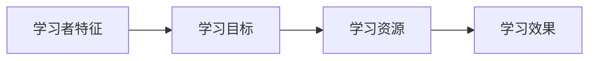
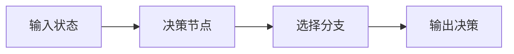
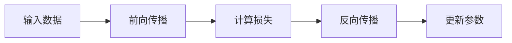
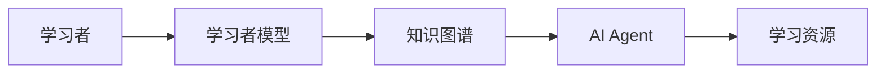
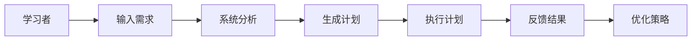

                 


```markdown
# AI Agent在智能教育系统中的应用

## 关键词：AI Agent, 智能教育系统, 教育技术, 人工智能, 个性化学习

## 摘要：
本文探讨AI Agent在智能教育系统中的应用，分析其在教育领域的核心作用，从感知、推理、学习到决策的全链条技术实现，结合实际案例和系统设计，深入剖析其在个性化学习、智能辅导和教育管理中的应用场景，并提出系统设计与优化方案。

---

# 第1章: AI Agent与智能教育系统概述

## 1.1 AI Agent的基本概念
### 1.1.1 AI Agent的定义
- 定义：AI Agent（人工智能代理）是能够感知环境、自主决策并执行任务的智能实体。
- 核心特征：自主性、反应性、目标导向、社会性。

### 1.1.2 AI Agent的核心特征对比
| 特征 | 描述 |
|------|------|
| 自主性 | 能够独立决策和行动 |
| 反应性 | 能够实时感知并响应环境变化 |
| 目标导向 | 以特定目标为导向执行任务 |
| 社会性 | 能够与其他系统或用户交互协作 |

### 1.1.3 AI Agent在教育领域的潜力
- 提供个性化学习支持
- 智能化教学管理
- 实时互动反馈

## 1.2 智能教育系统的定义与特点
### 1.2.1 智能教育系统的概念
- 定义：利用AI、大数据和云计算等技术构建的智能化教育平台。
- 核心模块：学习者模型、知识图谱、智能推荐系统。

### 1.2.2 智能教育系统的组成模块
- 学习者模型：分析学习者的知识水平、学习风格和能力。
- 知识图谱：构建领域知识的结构化表示。
- 智能推荐系统：基于学习者特征推荐学习资源。

### 1.2.3 智能教育系统的应用场景
- 个性化学习路径规划
- 智能化教学内容生成
- 实时学习效果评估

## 1.3 AI Agent在智能教育中的作用
### 1.3.1 AI Agent作为教育辅助工具的角色
- 智能辅导系统：提供实时问题解答和学习建议。
- 学习进度监控：跟踪学习者的学习状态并提供反馈。
- 资源推荐系统：基于学习者特征推荐学习资源。

### 1.3.2 AI Agent在个性化学习中的应用
- 自适应学习路径设计
- 个性化教学策略制定
- 学习效果预测与优化

### 1.3.3 AI Agent在教育管理中的价值
- 教学资源管理：优化教学资源分配和利用。
- 教学效果评估：提供多维度学习效果分析。
- 教学决策支持：基于数据驱动的教育决策。

## 1.4 本章小结
- 介绍了AI Agent的基本概念和核心特征。
- 阐述了智能教育系统的定义、组成模块及其应用场景。
- 分析了AI Agent在智能教育中的重要角色和应用价值。

---

# 第2章: AI Agent的核心原理

## 2.1 AI Agent的感知与理解
### 2.1.1 感知模型的数学表达
- 概率推理模型：
$$ P(x|y) = \frac{P(y|x)P(x)}{P(y)} $$
- 贝叶斯网络示意图：


### 2.1.2 感知模型的实现流程
1. 数据采集：获取学习者的行为数据、知识掌握情况等。
2. 特征提取：将原始数据转化为可分析的特征向量。
3. 模型训练：基于历史数据训练感知模型。
4. 模型推理：根据当前输入生成预测结果。

## 2.2 AI Agent的推理与决策
### 2.2.1 推理算法的数学模型
- Q-Learning算法：
$$ Q(s, a) = r + \gamma \max_{a'} Q(s', a') $$
- 决策树推理流程：


### 2.2.2 推理算法的实现步骤
1. 状态识别：分析当前学习者的知识水平和学习需求。
2. 动作选择：基于推理模型生成推荐的学习策略。
3. 动作执行：输出具体的教学建议或学习资源。

## 2.3 AI Agent的学习与优化
### 2.3.1 学习算法的数学公式
- 线性回归模型：
$$ y = \theta x + b $$
- 神经网络训练过程：


### 2.3.2 学习算法的优化策略
1. 参数优化：通过梯度下降优化模型参数。
2. 模型评估：基于验证集评估模型性能。
3. 模型部署：将优化后的模型部署到实际应用中。

## 2.4 本章小结
- 介绍了AI Agent的核心原理，包括感知、推理和学习的数学模型与实现流程。
- 使用Mermaid图展示了感知模型、推理算法和学习算法的具体实现步骤。

---

# 第3章: AI Agent在教育中的具体应用

## 3.1 个性化学习中的AI Agent应用
### 3.1.1 个性化学习路径设计
- 基于学习者特征的自适应学习路径生成。
- 示例：针对不同学习者的学习风格和知识水平，生成个性化的学习计划。

### 3.1.2 学习效果预测与优化
- 使用机器学习模型预测学习效果并优化学习策略。
- 示例：通过历史数据预测学习者的掌握程度，并动态调整学习内容。

## 3.2 智能辅导系统中的AI Agent应用
### 3.2.1 智能辅导系统的实现流程
1. 学习者问题识别：识别学习者提出的问题。
2. 问题解答生成：基于知识图谱生成解答。
3. 解答反馈：根据学习者反馈优化解答内容。

### 3.2.2 智能辅导系统的案例分析
- 案例：某智能辅导系统如何基于知识图谱为学习者提供个性化解答。

## 3.3 教育管理中的AI Agent应用
### 3.3.1 教学资源管理
- 基于AI Agent的资源分配与优化。
- 示例：根据学习者需求动态分配教学资源。

### 3.3.2 教学效果评估
- 基于AI Agent的多维度学习效果评估。
- 示例：通过分析学习者的行为数据和考试成绩，生成全面的学习效果报告。

## 3.4 本章小结
- 详细探讨了AI Agent在个性化学习、智能辅导和教育管理中的具体应用。
- 通过实际案例分析展示了AI Agent在智能教育系统中的实际价值。

---

# 第4章: AI Agent驱动的智能教育系统设计

## 4.1 系统需求分析
### 4.1.1 学习者需求分析
- 学习目标：个性化学习需求。
- 学习风格：视觉、听觉或动觉学习者。
- 学习能力：知识水平和学习能力评估。

### 4.1.2 系统功能需求
- 个性化学习推荐。
- 智能辅导支持。
- 实时学习反馈。

## 4.2 系统架构设计
### 4.2.1 系统架构的模块划分
- 学习者模型模块：分析学习者特征。
- 知识图谱模块：构建领域知识图谱。
- AI Agent模块：实现感知、推理和学习功能。

### 4.2.2 系统架构的交互流程


## 4.3 系统接口设计
### 4.3.1 API接口设计
- 输入接口：接收学习者的行为数据。
- 输出接口：输出个性化学习建议。

### 4.3.2 接口实现
- 示例：通过RESTful API实现学习者特征的输入和学习资源的输出。

## 4.4 系统交互设计
### 4.4.1 学习者与系统交互流程
1. 学习者输入学习需求。
2. 系统分析学习者特征。
3. 系统生成个性化学习计划。
4. 学习者执行学习计划并反馈结果。
5. 系统根据反馈优化学习策略。

### 4.4.2 交互流程图


## 4.5 本章小结
- 详细分析了AI Agent驱动的智能教育系统的架构设计和交互流程。
- 使用Mermaid图展示了系统的模块划分和交互流程。

---

# 第5章: AI Agent在智能教育系统中的项目实战

## 5.1 环境配置与安装
### 5.1.1 开发环境配置
- 安装Python、Jupyter Notebook和相关库（如TensorFlow、Scikit-learn）。

### 5.1.2 项目依赖管理
- 使用pip安装所需依赖包：
  ```bash
  pip install numpy pandas scikit-learn
  ```

## 5.2 系统核心功能实现
### 5.2.1 学习者模型实现
- 基于机器学习算法实现学习者特征分析。
- 示例代码：
  ```python
  from sklearn.linear_model import LinearRegression
  model = LinearRegression()
  model.fit(X_train, y_train)
  ```

### 5.2.2 知识图谱构建
- 使用图数据库构建领域知识图谱。
- 示例代码：
  ```python
  from networkx import Graph
  graph = Graph()
  graph.add_edge("知识点1", "知识点2")
  ```

### 5.2.3 AI Agent实现
- 基于强化学习算法实现AI Agent的推理与决策。
- 示例代码：
  ```python
  import numpy as np
  def q_learning(state, action):
      return np.random.rand()
  ```

## 5.3 项目实战案例分析
### 5.3.1 案例背景介绍
- 某教育平台的个性化学习推荐系统。

### 5.3.2 系统实现与解读
- 代码实现：从数据预处理到模型训练的完整流程。
- 系统解读：详细分析每个模块的功能与实现细节。

## 5.4 本章小结
- 通过实际项目案例展示了AI Agent在智能教育系统中的具体实现。
- 详细解读了系统核心功能的代码实现与系统架构设计。

---

# 第6章: AI Agent在智能教育系统中的优化与挑战

## 6.1 系统优化方案
### 6.1.1 性能优化
- 模型优化：使用超参数调优提升模型性能。
- 算法优化：采用分布式计算加速训练过程。

### 6.1.2 数据隐私保护
- 数据加密：对学习者数据进行加密处理。
- 访问控制：基于角色的访问控制机制。

## 6.2 应用挑战与解决方案
### 6.2.1 数据质量问题
- 数据清洗：处理缺失值和异常值。
- 数据增强：通过数据增强提升模型鲁棒性。

### 6.2.2 系统可解释性问题
- 可解释性增强：通过可视化工具展示模型决策过程。
- 解释性算法：使用SHAP值解释模型预测结果。

## 6.3 未来发展趋势
### 6.3.1 技术趋势
- 多模态AI Agent：结合视觉、听觉和语言的多模态交互。
- 自适应学习：基于实时数据的动态调整学习策略。

### 6.3.2 应用场景扩展
- 跨学科应用：AI Agent在多个学科领域的广泛应用。
- 教育公平：通过AI Agent推动教育资源的均衡分配。

## 6.4 本章小结
- 分析了AI Agent在智能教育系统中的优化方案和应用挑战。
- 展望了未来的技术发展趋势和应用场景。

---

# 第7章: 总结与展望

## 7.1 全文总结
- AI Agent在智能教育系统中的核心作用。
- 从感知、推理到学习的全链条技术实现。

## 7.2 未来展望
- AI Agent的智能化升级：更高级的推理和决策能力。
- 教育技术的融合创新：与AR/VR等新技术的结合。

## 7.3 最佳实践Tips
- 系统设计：模块化设计便于功能扩展。
- 数据处理：重视数据质量和隐私保护。
- 系统优化：持续监控和优化模型性能。

## 7.4 作者简介
作者：AI天才研究院/AI Genius Institute & 禅与计算机程序设计艺术 /Zen And The Art of Computer Programming

---

# 附录: 参考文献

- [1] Russell S, Norvig P. 人工智能:一种现代的方法[M]. 清华大学出版社, 2013.
- [2] 周志华. 机器学习[M]. 清华大学出版社, 2016.
- [3] Goodfellow I, Bengio Y, Courville A. 机器学习与深度学习入门[M]. 人民邮电出版社, 2017.
```

---

* 本文是《AI Agent在智能教育系统中的应用》一书的目录大纲，后续将根据需求逐步展开每一章的具体内容。

