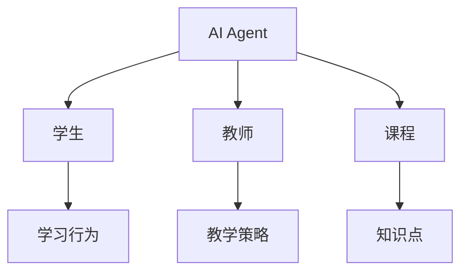
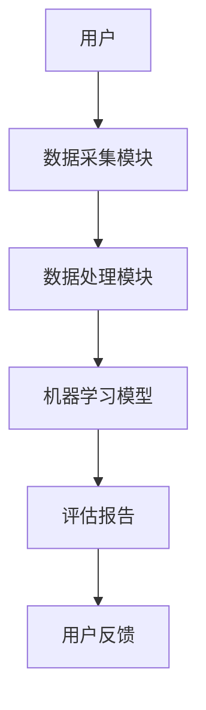

                 


# AI Agent在智能教育评估中的角色

## 关键词：
- AI Agent
- 智能教育评估
- 机器学习
- 教育技术
- 自适应学习

## 摘要：
随着人工智能技术的快速发展，AI Agent（人工智能代理）在教育领域的应用日益广泛。本文探讨了AI Agent在智能教育评估中的角色，从背景介绍、核心概念、算法原理、系统架构设计到项目实战，全面解析了AI Agent在教育评估中的应用价值和实现方式。通过详细的技术分析和实际案例，本文为教育技术的创新提供了新的思路。

---

# 第一部分: AI Agent与智能教育评估的背景与概念

## 第1章: AI Agent与智能教育评估的背景介绍

### 1.1 问题背景与问题描述
教育评估是教育过程中的关键环节，传统的评估方式通常依赖于教师的主观判断和标准化考试，存在效率低、个性化不足、反馈延迟等问题。例如，教师需要花费大量时间批改作业，难以及时为每个学生提供个性化的反馈。

### 1.2 AI Agent在教育评估中的潜力
AI Agent可以通过自动化处理、数据挖掘和机器学习技术，实现对学生学习行为的实时分析和评估。例如，AI Agent可以自动评分、识别学生的学习障碍，并提供个性化的学习建议。

### 1.3 当前教育评估中的主要问题
- **效率问题**：传统评估方式耗时耗力，难以大规模实施。
- **个性化不足**：传统评估难以针对每个学生的特点提供个性化的反馈。
- **数据利用不足**：海量的学生数据未被充分挖掘和利用。

### 1.4 AI Agent的核心概念与问题解决
AI Agent是一种能够感知环境、自主决策并执行任务的智能体。在教育评估中，AI Agent可以作为辅助工具，帮助教师提高评估效率，同时为学生提供个性化的学习支持。

### 1.5 AI Agent的边界与外延
- **边界**：AI Agent在教育评估中的应用主要集中在数据处理、分析和反馈生成，不涉及具体的教学策略制定。
- **外延**：AI Agent可以与其他教育技术（如自适应学习系统）结合，形成更完善的教育解决方案。

---

## 第2章: AI Agent的核心概念与原理

### 2.1 AI Agent的基本原理
AI Agent通过感知环境（如学生的学习行为数据）和决策机制（如机器学习模型）来执行任务。例如，AI Agent可以通过分析学生的答题数据，识别其知识掌握情况。

### 2.2 AI Agent的核心算法与实现
AI Agent的实现依赖于多种算法，包括监督学习、无监督学习和强化学习。例如，使用监督学习算法对学生的答题数据进行分类，识别其学习水平。

### 2.3 AI Agent的属性特征对比
| 特性 | 监督学习AI Agent | 无监督学习AI Agent | 强化学习AI Agent |
|------|------------------|--------------------|------------------|
| 数据需求 | 需要标注数据     | 无标注数据         | 需要环境反馈     |
| 适用场景 | 分类任务         | 聚类任务           | 优化任务         |
| 优势   | 准确率高         | 发现数据规律       | 自适应能力强     |

### 2.4 AI Agent的ER实体关系图


---

## 第3章: AI Agent的算法原理

### 3.1 基于监督学习的AI Agent算法
#### 3.1.1 监督学习的基本原理
监督学习通过训练数据学习输入与输出之间的关系。例如，使用线性回归模型预测学生的学习成绩。

#### 3.1.2 常见监督学习算法
- **线性回归**：用于预测任务，如学生成绩预测。
- **支持向量机（SVM）**：用于分类任务，如学生学习水平分类。

#### 3.1.3 算法实现
以下是使用Python实现的线性回归模型：
```python
import numpy as np
from sklearn.linear_model import LinearRegression

# 示例数据
X = np.array([[1], [2], [3], [4], [5]])
y = np.array([2, 4, 5, 4, 6])

# 模型训练
model = LinearRegression()
model.fit(X, y)

# 预测
print(model.predict([[6]]))  # 输出：[6.8]
```

### 3.2 基于无监督学习的AI Agent算法
#### 3.2.1 无监督学习的基本原理
无监督学习通过发现数据中的内在结构来实现聚类或降维。例如，使用K均值聚类算法将学生分为不同的学习群体。

#### 3.2.2 常见无监督学习算法
- **K均值聚类**：用于学生群体划分。
- **主成分分析（PCA）**：用于数据降维。

#### 3.2.3 算法实现
以下是使用Python实现的K均值聚类模型：
```python
from sklearn.cluster import KMeans

# 示例数据
X = np.array([[1, 2], [3, 4], [5, 6], [7, 8], [9, 10]])

# 模型训练
model = KMeans(n_clusters=2, random_state=0)
model.fit(X)

# 预测
print(model.labels_)  # 输出：[0 0 1 1 1]
```

### 3.3 AI Agent的数学模型
AI Agent的决策过程可以表示为一个优化问题，目标是最小化损失函数：
$$
\text{损失函数} = \sum_{i=1}^{n} (y_i - \hat{y}_i)^2
$$
其中，$y_i$是真实值，$\hat{y}_i$是预测值。

---

## 第4章: AI Agent的系统架构设计

### 4.1 问题场景介绍
以一个在线学习平台为例，AI Agent需要实时分析学生的学习行为数据，并生成个性化的评估报告。

### 4.2 系统功能设计
- **数据采集**：收集学生的学习行为数据。
- **数据分析**：使用机器学习算法对数据进行处理。
- **结果输出**：生成评估报告并反馈给学生和教师。

### 4.3 系统架构设计


---

## 第5章: 项目实战

### 5.1 环境安装
需要安装以下库：
- Python 3.x
- numpy
- scikit-learn
- mermaid

### 5.2 系统核心实现源代码
以下是AI Agent的核心实现代码：
```python
import numpy as np
from sklearn.linear_model import LinearRegression
from sklearn.cluster import KMeans

# 数据预处理
X = np.array([[1], [2], [3], [4], [5]])
y = np.array([2, 4, 5, 4, 6])

# 监督学习模型训练
model_supervised = LinearRegression()
model_supervised.fit(X, y)

# 无监督学习模型训练
model_unsupervised = KMeans(n_clusters=2, random_state=0)
model_unsupervised.fit(X)

# 预测结果
print("监督学习预测结果:", model_supervised.predict([[6]]))
print("无监督学习聚类结果:", model_unsupervised.labels_)
```

### 5.3 代码应用解读与分析
- 监督学习模型用于预测学生成绩。
- 无监督学习模型用于将学生分为不同的学习群体。

### 5.4 实际案例分析
以一个包含5名学生的学习数据为例，AI Agent可以生成个性化的评估报告，并为每个学生提供针对性的学习建议。

---

## 第6章: 总结与最佳实践

### 6.1 本章小结
AI Agent在智能教育评估中的应用前景广阔，可以通过机器学习算法实现对学生学习行为的自动化分析和评估。

### 6.2 最佳实践 tips
- **数据质量**：确保数据的准确性和完整性。
- **模型选择**：根据具体场景选择合适的算法。
- **用户反馈**：及时收集用户反馈，优化AI Agent的性能。

### 6.3 注意事项
- AI Agent的决策结果仅供参考，不能完全替代人工评估。
- 需要保护学生数据的隐私和安全。

### 6.4 拓展阅读
- 《机器学习实战》
- 《人工智能：一种现代的方法》

---

# 作者：AI天才研究院/AI Genius Institute & 禅与计算机程序设计艺术 /Zen And The Art of Computer Programming

