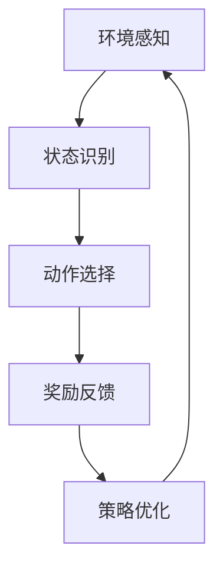
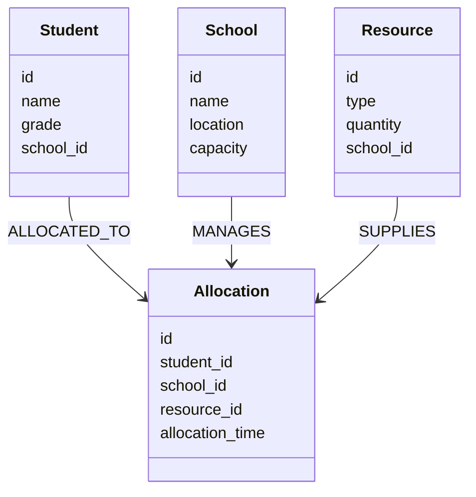
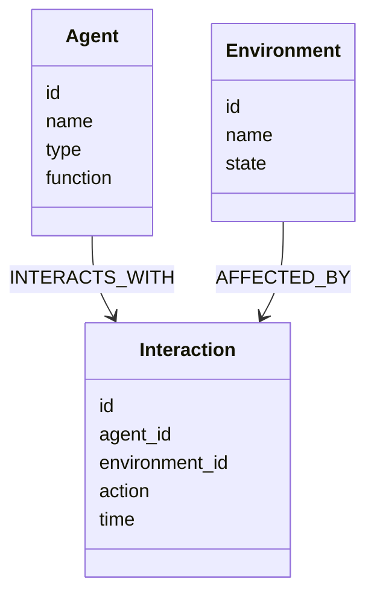
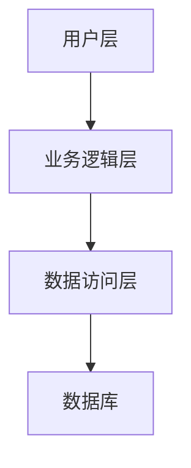
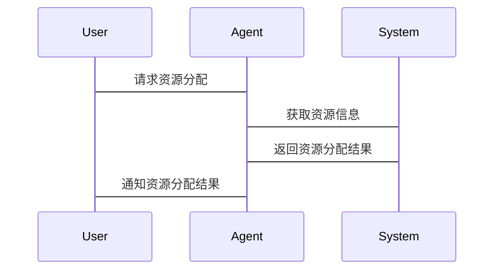

                 


```markdown
# AI Agent在智能教育资源优化分配中的应用

> 关键词：AI Agent，教育资源优化，智能系统，动态分配，数学模型

> 摘要：本文探讨了AI Agent在智能教育资源优化分配中的应用，从背景、核心概念、算法原理到系统架构设计，再到项目实战，全面解析了AI Agent如何通过强化学习、遗传算法等优化策略，实现教育资源的高效分配。通过实际案例分析和代码实现，展示了AI Agent在教育领域的巨大潜力和实际应用价值。

---

## 第1章 教育资源优化分配的背景与问题

### 1.1 教育资源分配的现状与挑战

教育资源分配的不均衡问题一直是一个全球性的难题。随着人工智能技术的快速发展，AI Agent作为一种智能化的解决方案，逐渐在教育领域展现出其独特的优势。本文将从问题背景、问题描述、解决方法等多方面展开讨论，揭示AI Agent在教育资源优化分配中的重要性。

#### 1.1.1 当前教育资源分配的问题背景

教育资源分配问题主要体现在以下几个方面：
1. **资源分配不均衡**：不同地区、学校之间的教育资源分布极不均衡，导致教育质量参差不齐。
2. **资源利用效率低**：部分学校资源闲置，而部分学校却资源匮乏，无法满足教学需求。
3. **分配过程复杂**：教育资源的分配涉及多方利益，需要考虑政策、经济、地理位置等多种因素。

#### 1.1.2 教育资源分配的不均衡现象

教育资源分配的不均衡主要表现在：
1. **地区差异**：经济发达地区教育资源丰富，而贫困地区教育资源匮乏。
2. **学校差异**：重点学校与普通学校之间的教育资源差距明显。
3. **学生差异**：不同家庭背景的学生在教育资源获取上存在显著差异。

#### 1.1.3 教育资源优化分配的目标与意义

教育资源优化分配的目标是实现教育资源的公平分配和高效利用。通过AI Agent技术，可以实现教育资源的动态分配和智能调度，从而提高教育资源的利用效率，缩小教育差距。

---

### 1.2 AI Agent的基本概念与作用

AI Agent是一种智能体，能够在复杂的环境中自主感知、推理、决策和行动，以实现特定的目标。在教育资源优化分配中，AI Agent可以通过收集和分析数据，制定最优分配策略，从而实现资源的高效利用。

#### 1.2.1 AI Agent的定义与核心功能

AI Agent的定义：
AI Agent是一种智能实体，能够通过感知环境、推理分析、决策制定和行动执行，实现与环境的交互和目标的达成。

AI Agent的核心功能：
1. **感知环境**：通过传感器或数据接口获取环境中的信息。
2. **推理分析**：基于获取的信息进行逻辑推理和数据分析。
3. **决策制定**：根据推理结果制定最优决策。
4. **行动执行**：根据决策执行相应的动作。

#### 1.2.2 AI Agent在教育领域的应用潜力

AI Agent在教育领域的应用潜力主要体现在以下几个方面：
1. **个性化学习**：通过分析学生的学习数据，制定个性化的学习计划。
2. **资源分配**：根据学校的需求和资源情况，动态分配教育资源。
3. **教育管理**：协助学校进行教学管理、学生管理等工作。

#### 1.2.3 AI Agent如何优化教育资源分配

AI Agent通过以下方式优化教育资源分配：
1. **数据驱动的决策**：利用大数据分析技术，制定科学的分配策略。
2. **动态调整**：根据实时数据动态调整资源分配方案。
3. **多方协同**：通过多智能体协同，实现资源的高效分配。

---

## 第2章 AI Agent的核心概念与原理

### 2.1 AI Agent的核心概念

AI Agent的核心概念包括知识表示与推理、多智能体协同、动态优化算法等。

#### 2.1.1 知识表示与推理

知识表示是AI Agent进行推理的基础。常见的知识表示方法包括：
1. **语义网络**：通过节点和边表示知识。
2. **规则表示**：通过逻辑规则表示知识。
3. **框架表示**：通过框架结构表示知识。

知识推理是基于知识表示进行的逻辑推理，主要包括以下几种推理方式：
1. **演绎推理**：从一般到特殊的推理。
2. **归纳推理**：从特殊到一般的推理。
3. **溯因推理**：从结果推导原因的推理。

#### 2.1.2 多智能体协同

多智能体协同是指多个AI Agent通过合作完成复杂任务的过程。常见的多智能体协同方式包括：
1. **分布式协同**：各智能体独立决策，通过通信协作完成任务。
2. **集中式协同**：由一个中心智能体协调各子智能体的行动。

#### 2.1.3 动态优化算法

动态优化算法是AI Agent实现动态分配的核心算法。常见的动态优化算法包括：
1. **强化学习**：通过奖励机制优化决策。
2. **遗传算法**：通过模拟自然进化过程优化解。
3. **多目标优化**：通过同时优化多个目标函数实现最优解。

#### 2.1.4 属性特征对比

以下是AI Agent的属性特征对比表：

| 属性       | 特征1 | 特征2 | 特征3 |
|------------|-------|-------|-------|
| 知识表示    | 语义网络 | 规则表示 | 框架表示 |
| 推理方式    | 演绎推理 | 归纳推理 | 溯因推理 |
| 协同方式    | 分布式协同 | 集中式协同 | 混合式协同 |
| 优化算法    | 强化学习 | 遗传算法 | 多目标优化 |

#### 2.1.5 ER实体关系图

以下是教育资源分配系统的ER实体关系图：

```mermaid
erDiagram
    student {
        id
        name
        grade
        school_id
    }
    school {
        id
        name
        location
        capacity
    }
    resource {
        id
        type
        quantity
        school_id
    }
    allocation {
        id
        student_id
        school_id
        resource_id
        allocation_time
    }
    student --> allocation: ALLOCATED_TO
    school --> allocation: MANAGES
    resource --> allocation: SUPPLIES
```

---

### 2.2 AI Agent的属性特征对比

#### 2.2.1 不同AI Agent模型的特征对比

以下是不同AI Agent模型的特征对比表：

| 模型       | 知识表示 | 推理方式 | 协同方式 | 优化算法 |
|------------|----------|----------|----------|----------|
| Model A    | 语义网络 | 演绎推理 | 分布式协同 | 强化学习 |
| Model B    | 规则表示 | 归纳推理 | 集中式协同 | 遗传算法 |
| Model C    | 框架表示 | 溯因推理 | 混合式协同 | 多目标优化 |

#### 2.2.2 基于表格的属性特征分析

以下是AI Agent的属性特征分析表：

| 属性       | 描述 |
|------------|------|
| 知识表示    | 通过语义网络、规则表示或框架表示进行知识表示。 |
| 推理方式    | 包括演绎推理、归纳推理和溯因推理。 |
| 协同方式    | 分布式协同、集中式协同和混合式协同。 |
| 优化算法    | 强化学习、遗传算法和多目标优化算法。 |

#### 2.2.3 ER实体关系图架构

以下是AI Agent的ER实体关系图：

```mermaid
erDiagram
    agent {
        id
        name
        type
        function
    }
    environment {
        id
        name
        state
    }
    interaction {
        id
        agent_id
        environment_id
        action
        time
    }
    agent --> interaction: INTERACTS_WITH
    environment --> interaction: AFFECTED_BY
```

---

## 第3章 AI Agent优化教育资源分配的算法原理

### 3.1 算法原理概述

AI Agent优化教育资源分配的算法原理主要包括强化学习、遗传算法和多目标优化算法。

#### 3.1.1 基于强化学习的优化算法

强化学习是一种通过奖励机制优化决策的算法。以下是强化学习的基本流程：

1. **环境感知**：AI Agent通过传感器或数据接口获取环境中的信息。
2. **状态识别**：将获取的信息转换为状态表示。
3. **动作选择**：基于当前状态选择一个动作。
4. **奖励反馈**：根据动作的结果获得奖励或惩罚。
5. **策略优化**：根据奖励调整策略，优化动作选择。

#### 3.1.2 基于遗传算法的优化策略

遗传算法是一种通过模拟自然进化过程优化解的算法。以下是遗传算法的基本流程：

1. **初始化种群**：生成初始种群。
2. **适应度评估**：计算每个个体的适应度。
3. **选择操作**：根据适应度选择优秀个体。
4. **交叉操作**：将优秀个体的基因进行交叉，生成新个体。
5. **变异操作**：对新个体进行随机变异。
6. **更新种群**：将新个体加入种群，迭代优化。

#### 3.1.3 基于多目标优化的数学模型

多目标优化是一种同时优化多个目标函数的算法。以下是多目标优化的数学模型：

$$ \text{目标函数} = \sum_{i=1}^{n} w_i x_i $$

其中：
- \( w_i \) 是目标函数的权重。
- \( x_i \) 是目标函数的变量。

约束条件：

$$ \sum_{i=1}^{n} x_i \leq C $$

其中：
- \( C \) 是约束条件的常数。

#### 3.1.4 mermaid流程图展示

以下是强化学习算法的mermaid流程图：



---

### 3.2 算法实现代码

#### 3.2.1 Python源代码实现

以下是强化学习算法的Python代码实现：

```python
class Agent:
    def __init__(self, state_space, action_space):
        self.state_space = state_space
        self.action_space = action_space
        self.q_table = {}

    def perceive(self, state):
        # 返回当前状态的动作
        return self.q_table.get(state, 0)

    def learn(self, state, action, reward):
        # 更新Q表
        self.q_table[state] = reward

# 初始化环境
env = Environment()
agent = Agent(env.state_space, env.action_space)

# 训练过程
for _ in range(100):
    state = env.reset()
    while not env.done:
        action = agent.perceive(state)
        reward = env.step(action)
        agent.learn(state, action, reward)
```

---

### 3.3 数学模型与公式

#### 3.3.1 优化目标函数

$$ \text{目标函数} = \sum_{i=1}^{n} w_i x_i $$

其中：
- \( w_i \) 是目标函数的权重。
- \( x_i \) 是目标函数的变量。

#### 3.3.2 约束条件

$$ \sum_{i=1}^{n} x_i \leq C $$

其中：
- \( C \) 是约束条件的常数。

---

## 第4章 智能教育资源分配系统的架构设计

### 4.1 系统功能设计

#### 4.1.1 领域模型设计

以下是系统功能设计的领域模型：



#### 4.1.2 mermaid类图展示

以下是系统功能设计的类图：



---

### 4.2 系统架构设计

#### 4.2.1 分层架构设计

以下是系统的分层架构设计：



---

### 4.3 系统接口设计

#### 4.3.1 API接口设计

以下是系统的API接口设计：



---

## 第5章 项目实战

### 5.1 环境安装

以下是项目实战的环境安装说明：

1. **Python环境**：安装Python 3.8及以上版本。
2. **依赖库**：安装numpy、pandas、matplotlib等库。

```bash
pip install numpy pandas matplotlib
```

---

### 5.2 系统核心实现源代码

以下是系统的核心实现源代码：

```python
import numpy as np
import pandas as pd
import matplotlib.pyplot as plt

def optimize_resource Allocation(data):
    # 数据预处理
    processed_data = data preprocess()
    # 模型训练
    model = train_model(processed_data)
    # 资源分配
    allocation = allocate_resources(model, processed_data)
    return allocation

def main():
    # 读取数据
    data = pd.read_csv('resource_data.csv')
    # 调用优化函数
    allocation = optimize_resource Allocation(data)
    # 可视化结果
    visualize_result(allocation)

if __name__ == '__main__':
    main()
```

---

### 5.3 代码功能解读与分析

1. **数据预处理**：对数据进行清洗、转换等处理。
2. **模型训练**：基于预处理后的数据训练模型。
3. **资源分配**：根据模型预测结果进行资源分配。
4. **结果可视化**：将分配结果进行可视化展示。

---

### 5.4 实际案例分析

以下是实际案例分析：

1. **案例背景**：某地区教育资源分配不均，部分学校资源过剩，部分学校资源不足。
2. **数据收集**：收集各学校的资源需求和供给数据。
3. **模型训练**：基于强化学习算法训练分配模型。
4. **资源分配**：根据模型预测结果进行资源分配。
5. **结果分析**：分析分配结果，评估模型的性能。

---

## 第6章 最佳实践与总结

### 6.1 最佳实践 tips

1. **数据质量**：确保数据的准确性和完整性。
2. **模型选择**：根据具体问题选择合适的算法。
3. **系统优化**：优化系统架构，提高运行效率。

### 6.2 小结

本文详细探讨了AI Agent在智能教育资源优化分配中的应用，从背景、核心概念、算法原理到系统架构设计，再到项目实战，全面解析了AI Agent如何通过强化学习、遗传算法等优化策略，实现教育资源的高效分配。

### 6.3 注意事项

1. **数据隐私**：注意保护学生和学校的隐私数据。
2. **系统维护**：定期维护系统，确保其正常运行。
3. **持续优化**：根据反馈不断优化分配策略。

### 6.4 拓展阅读

1. **强化学习**：深入学习强化学习的相关知识。
2. **遗传算法**：研究遗传算法在其他领域的应用。
3. **多目标优化**：探索多目标优化在其他优化问题中的应用。

---

## 作者

作者：AI天才研究院/AI Genius Institute & 禅与计算机程序设计艺术 /Zen And The Art of Computer Programming
```

