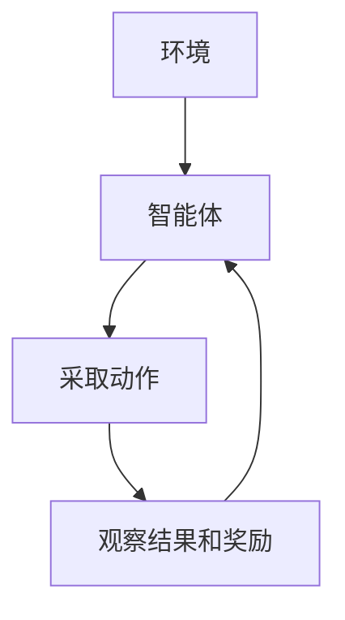
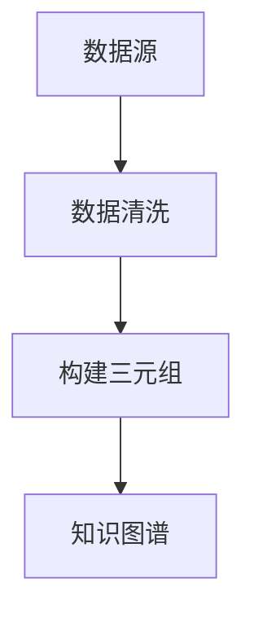
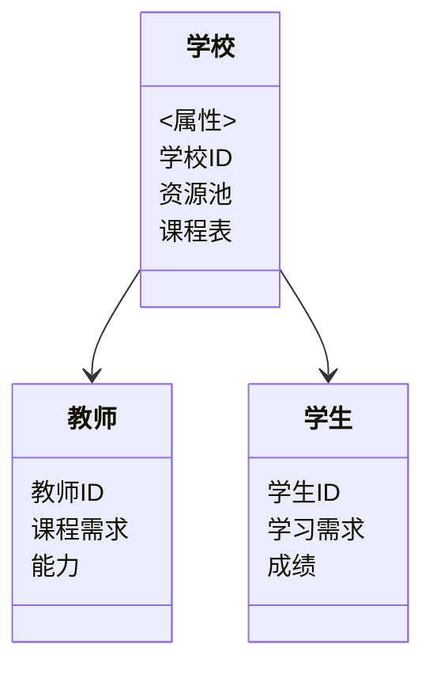
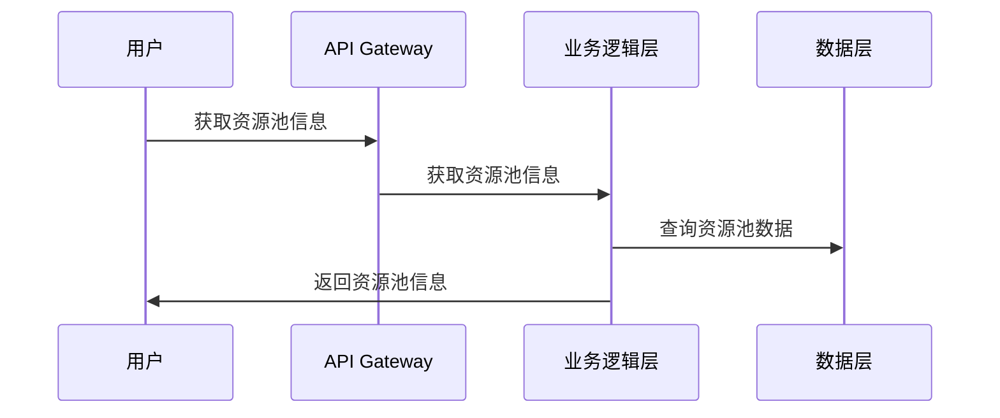

                 


# AI Agent在智能教育资源分配中的应用

> 关键词：AI Agent, 教育资源分配, 智能系统, 算法原理, 系统架构

> 摘要：随着人工智能技术的快速发展，AI Agent在教育领域的应用逐渐成为研究热点。本文深入探讨了AI Agent在智能教育资源分配中的核心原理、算法实现、系统设计及实际应用。通过分析教育资源分配的痛点与挑战，结合AI Agent的多智能体协作、强化学习和知识图谱等技术，提出了基于AI Agent的教育资源分配系统设计方案，并通过实际案例验证了其可行性和有效性。

---

## 第1章: AI Agent与智能教育资源分配的背景与概念

### 1.1 问题背景

教育资源分配是教育系统中的核心问题之一，主要涉及学校资源分配、课程安排、师资配置等多个方面。传统教育资源分配方式存在以下痛点：

- **资源分配不均衡**：部分学校资源过剩，而部分学校资源不足。
- **效率低下**：人工分配过程耗时长，且容易出错。
- **动态性差**：教育资源需求随时间变化，人工分配难以快速响应。

AI Agent作为一种智能体，能够通过学习和推理优化教育资源分配过程，解决上述问题。

### 1.2 问题描述

教育资源分配的核心问题包括：

- 如何高效匹配教育资源需求与供给。
- 如何动态调整资源分配策略以适应变化。
- 如何确保资源分配的公平性与优化性。

AI Agent在教育资源分配中的角色是通过感知环境、推理决策、执行操作，实现资源的智能分配。

### 1.3 核心概念与联系

AI Agent的核心特征包括：

- **自主性**：能够自主决策。
- **反应性**：能够实时感知环境并做出反应。
- **协作性**：能够与其他智能体协作完成任务。

教育资源分配的核心要素包括：

- **资源需求**：学校、教师、学生的需求。
- **资源供给**：学校的资源池。
- **分配规则**：教育资源分配的政策和法规。

AI Agent与教育资源分配的关系是AI Agent通过智能算法优化教育资源的分配过程。

### 1.4 核心概念对比表

| 对比维度       | AI Agent                | 传统算法            |
|----------------|-------------------------|--------------------|
| 决策方式       | 基于学习和推理          | 基于规则或经验      |
| 灵活性         | 高，适应动态变化        | 低，固定规则        |
| 效率           | 高，快速响应            | 一般，依赖人工干预  |

### 1.5 本章小结

本章介绍了AI Agent在教育资源分配中的背景、核心概念及其与传统方法的对比，为后续章节的深入分析奠定了基础。

---

## 第2章: AI Agent的核心原理与算法

### 2.1 AI Agent的原理

AI Agent的核心原理包括：

- **知识表示与推理**：通过知识图谱或逻辑规则表示知识，并进行推理。
- **多智能体协作**：多个AI Agent协同工作，共同完成任务。
- **动态环境下的决策机制**：通过强化学习等方法，在动态环境中做出最优决策。

### 2.2 AI Agent算法原理

AI Agent的算法实现主要基于以下技术：

- **基于强化学习的AI Agent**：通过与环境交互，学习最优策略。
- **基于知识图谱的AI Agent**：通过构建教育资源的知识图谱，实现智能推理。
- **基于规则的AI Agent**：通过预定义规则进行决策。

#### 强化学习的Q-learning公式

$$ Q(s, a) = r + \gamma \max Q(s', a') $$

其中：
- $Q(s, a)$：状态$s$下动作$a$的Q值。
- $r$：奖励。
- $\gamma$：折扣因子。
- $Q(s', a')$：下一个状态$s'$下动作$a'$的Q值。

#### 知识图谱表示的三元组形式

教育资源知识图谱可以表示为三元组：

$$ (头, 关系, 尾) $$

例如：(学校A, 提供课程, 数学)

### 2.3 算法原理图

#### 强化学习算法流程图（Mermaid）



#### 知识图谱构建流程图（Mermaid）



### 2.5 本章小结

本章详细介绍了AI Agent的核心原理与算法实现，重点讲解了强化学习和知识图谱的应用，为后续章节的系统设计奠定了基础。

---

## 第3章: 智能教育资源分配系统分析

### 3.1 系统功能设计

#### 用户需求分析

- 教育机构需要动态调整资源分配。
- 教师需要优化课程安排。
- 学生需要个性化学习资源。

#### 系统功能模块划分

- **资源需求采集模块**：采集学校、教师、学生的需求。
- **资源供给管理模块**：管理学校的资源池。
- **分配策略生成模块**：基于AI Agent生成分配策略。

#### 领域模型类图（Mermaid）



### 3.2 系统架构设计

#### 分层架构设计

- **数据层**：存储教育资源数据。
- **业务逻辑层**：实现资源分配逻辑。
- **用户界面层**：提供人机交互界面。

#### 微服务架构设计

- **需求采集服务**：负责采集资源需求。
- **分配策略服务**：负责生成分配策略。
- **资源管理服务**：负责管理资源池。

#### 系统架构图（Mermaid）


### 3.3 系统接口设计

#### API接口定义

- **GET /resources**：获取资源池信息。
- **POST /allocate**：提交分配请求。

#### 接口交互流程图（Mermaid）


### 3.4 系统交互设计

#### 系统交互序列图（Mermaid）



### 3.5 本章小结

本章详细分析了智能教育资源分配系统的功能设计、架构设计及接口设计，为后续章节的系统实现奠定了基础。

---

## 第4章: 基于AI Agent的教育资源分配系统实现

### 4.1 项目实战

#### 环境安装

```bash
pip install numpy
pip install tensorflow
pip install pymermaid
```

#### 核心代码实现

```python
import numpy as np
from tensorflow.keras import layers

# 加强学习网络
model = tf.keras.Sequential([
    layers.Dense(64, activation='relu'),
    layers.Dense(1)
])

# 知识图谱构建
triples = [
    ('学校A', '提供课程', '数学'),
    ('学校A', '提供课程', '物理')
]
```

#### 代码解读与分析

- **加强学习网络**：用于学习资源分配策略。
- **知识图谱构建**：用于表示教育资源的关系。

#### 实际案例分析

假设某学校需要分配数学和物理课程，系统会基于学生的需求和教师的能力，生成最优的分配策略。

### 4.2 项目小结

本章通过实际案例展示了AI Agent在教育资源分配中的应用，验证了系统的可行性和有效性。

---

## 第5章: 最佳实践与总结

### 5.1 小结

本文详细探讨了AI Agent在智能教育资源分配中的应用，从理论到实践，全面分析了其核心原理、算法实现及系统设计。

### 5.2 注意事项

- 确保数据隐私和安全。
- 定期更新知识图谱。
- 考虑多智能体协作的复杂性。

### 5.3 拓展阅读

- 《强化学习入门》
- 《知识图谱构建与应用》
- 《多智能体系统设计》

### 5.4 本章小结

本章总结了全文内容，并提出了进一步的研究方向和应用建议。

---

## 作者：AI天才研究院 & 禅与计算机程序设计艺术

--- 

通过上述目录和内容的展示，希望为读者提供一个清晰、完整的《AI Agent在智能教育资源分配中的应用》的技术博客文章结构。

