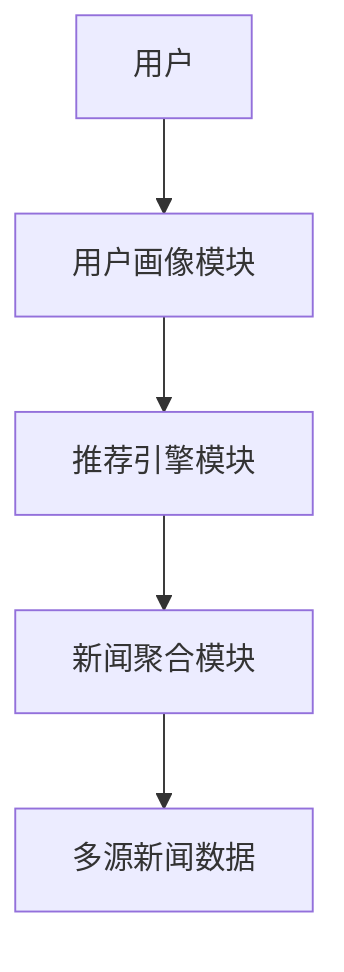

                 


# AI Agent在智能新闻聚合与推荐中的应用

**关键词**：AI Agent，智能新闻聚合，推荐系统，自然语言处理，机器学习，个性化推荐，实时计算

**摘要**：  
随着信息爆炸的时代到来，用户每天面对海量的新闻信息，如何高效地聚合和推荐新闻成为了亟待解决的问题。AI Agent（人工智能代理）作为一种能够自主感知、推理和决策的智能体，正在成为智能新闻聚合与推荐系统的核心技术。本文将从AI Agent的基本概念出发，详细探讨其在智能新闻聚合与推荐中的应用场景、算法原理、系统架构，并通过实际案例分析，展示AI Agent如何通过知识表示、自然语言处理和强化学习等技术手段，实现更精准、个性化的新闻推荐，最终为用户打造智能化的新闻阅读体验。

---

## 第一部分：AI Agent的基本概念与背景

### 第1章：AI Agent的核心概念

#### 1.1 AI Agent的定义与特征
AI Agent（人工智能代理）是一种能够感知环境、自主决策并执行任务的智能系统。它具有以下核心特征：
- **自主性**：能够自主决策，无需外部干预。
- **反应性**：能够实时感知环境变化并做出反应。
- **学习能力**：通过数据和反馈不断优化自身行为。
- **社会性**：能够与其他Agent或用户进行交互与协作。

#### 1.2 AI Agent在新闻推荐中的应用潜力
AI Agent能够通过以下方式提升新闻推荐的效果：
- **个性化推荐**：基于用户的行为和偏好，实时调整推荐内容。
- **多源信息融合**：整合来自不同新闻源的数据，提供更全面的视角。
- **动态优化**：根据实时数据和用户反馈，动态调整推荐策略。

---

### 第2章：智能新闻聚合与推荐的背景

#### 2.1 问题背景分析
- **信息过载**：用户每天面对海量新闻，难以筛选出感兴趣的内容。
- **信息碎片化**：新闻来源分散，内容格式多样，难以聚合。
- **推荐系统挑战**：传统推荐系统存在冷启动、实时性不足等问题。

#### 2.2 问题解决与目标
- **目标**：通过AI Agent实现智能新闻聚合与推荐，提升用户体验。
- **核心目标**：实现个性化推荐、实时更新和多源信息融合。

---

## 第二部分：AI Agent在智能新闻聚合中的应用

### 第3章：AI Agent的核心原理

#### 3.1 知识表示与推理
- **知识表示**：通过图结构或向量表示新闻内容和用户偏好。
- **推理过程**：基于知识图谱进行关联推理，生成推荐结果。

#### 3.2 自然语言处理（NLP）在新闻内容分析中的应用
- **文本摘要**：使用NLP技术提取新闻摘要，方便快速阅读。
- **情感分析**：分析新闻文本的情感倾向，辅助推荐决策。

#### 3.3 强化学习在推荐策略优化中的应用
- **强化学习机制**：通过奖励机制优化推荐策略。
- **动态调整**：根据用户反馈动态调整推荐内容。

---

### 第4章：基于AI Agent的推荐算法

#### 4.1 协同过滤算法
- **基于用户的协同过滤**：通过相似用户的偏好推荐新闻。
- **基于物品的协同过滤**：通过新闻内容相似性推荐。

#### 4.2 基于内容的推荐算法
- **文本特征提取**：使用TF-IDF或Word2Vec提取新闻关键词。
- **内容相似度计算**：基于文本特征计算新闻相似度。

#### 4.3 混合推荐算法
- **混合推荐模型**：结合协同过滤和内容推荐的优点，提升推荐精度。

---

## 第三部分：系统架构与实现

### 第5章：系统架构设计

#### 5.1 系统功能模块
- **用户画像模块**：构建用户兴趣模型。
- **新闻聚合模块**：整合多源新闻数据。
- **推荐引擎模块**：基于AI Agent算法生成推荐结果。

#### 5.2 系统架构图


---

### 第6章：项目实战

#### 6.1 环境搭建
- **工具安装**：安装Python、TensorFlow、Keras等开发工具。
- **数据获取**：从新闻API获取多源新闻数据。

#### 6.2 核心代码实现
```python
import tensorflow as tf
from tensorflow.keras import layers

# 定义AI Agent模型
class AIAgent(tf.keras.Model):
    def __init__(self):
        super(AIAgent, self).__init__()
        self.embedding = layers.Embedding(input_dim=10000, output_dim=128)
        self.dense = layers.Dense(64, activation='relu')
        self.output_layer = layers.Dense(1, activation='sigmoid')

    def call(self, x):
        x = self.embedding(x)
        x = self.dense(x)
        x = self.output_layer(x)
        return x

# 训练过程
agent = AIAgent()
optimizer = tf.keras.optimizers.Adam(learning_rate=0.001)
loss_fn = tf.keras.losses.BinaryCrossentropy()

for epoch in epochs:
    for batch in batches:
        with tf.GradientTape() as tape:
            predictions = agent(batch)
            loss = loss_fn(batch_labels, predictions)
        gradients = tape.gradient(loss, agent.trainable_weights)
        optimizer.apply_gradients(zip(gradients, agent.trainable_weights))
```

---

## 第四部分：总结与展望

### 第7章：总结与未来展望

#### 7.1 总结
- AI Agent通过知识表示、自然语言处理和强化学习等技术，显著提升了新闻聚合与推荐的效果。
- 个性化推荐和实时更新是AI Agent在新闻推荐中的核心优势。

#### 7.2 未来展望
- **多模态推荐**：结合图像、视频等多模态数据，提升推荐效果。
- **实时计算优化**：进一步优化实时推荐的计算效率和准确性。

---

**作者**：AI天才研究院/AI Genius Institute & 禅与计算机程序设计艺术/Zen And The Art of Computer Programming

---

通过以上结构和内容的详细展开，本文全面探讨了AI Agent在智能新闻聚合与推荐中的应用，从理论到实践，为读者提供了系统化的知识和实用的技术指导。

