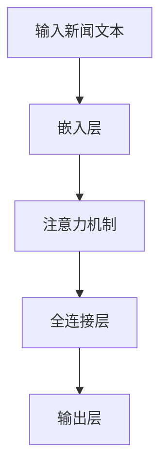
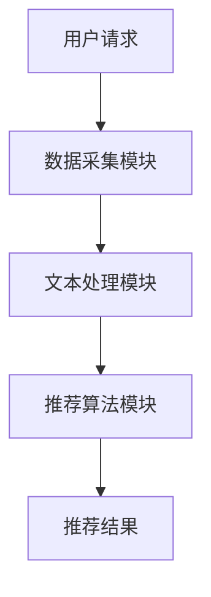

                 


# AI Agent在智能新闻聚合中的角色

> 关键词：AI Agent，智能新闻聚合，自然语言处理，文本相似度，推荐算法，系统架构

> 摘要：本文探讨AI Agent在智能新闻聚合中的角色，从背景、概念、算法到系统设计，详细分析AI Agent如何通过自然语言处理和推荐算法实现智能新闻聚合。文章结合理论与实践，深入剖析AI Agent在新闻聚合中的核心作用，并展示系统架构和项目实战案例。

---

## 第1章：AI Agent与智能新闻聚合的背景

### 1.1 问题背景与描述

#### 1.1.1 传统新闻聚合的局限性
传统的新闻聚合方式依赖人工编辑或简单的关键词匹配，存在以下问题：
- **信息冗余**：同一新闻事件可能被多次报道，但内容重复。
- **人工干预过多**：需要大量人工筛选和分类，效率低。
- **个性化不足**：无法根据用户偏好精准推荐新闻。

#### 1.1.2 智能新闻聚合的需求与目标
智能新闻聚合的目标是通过AI技术实现新闻的自动分类、推荐和聚合，满足用户个性化需求。具体需求包括：
- **个性化推荐**：根据用户兴趣推荐相关新闻。
- **内容去重**：自动识别重复内容，减少冗余信息。
- **实时更新**：快速响应新闻事件的动态变化。

#### 1.1.3 AI Agent在新闻聚合中的角色定位
AI Agent作为智能新闻聚合的核心，负责：
- **数据采集**：从多个来源收集新闻数据。
- **特征提取**：对新闻内容进行处理，提取关键词和语义特征。
- **智能推荐**：基于用户行为和内容特征，推荐个性化新闻。

### 1.2 问题解决与边界

#### 1.2.1 AI Agent如何解决新闻聚合问题
AI Agent通过自然语言处理和机器学习算法，实现新闻内容的自动分类和推荐，解决传统方法的效率和个性化问题。

#### 1.2.2 问题的边界与外延
新闻聚合的边界包括：
- **数据范围**：聚合的新闻来源和类型。
- **用户范围**：聚合的目标用户群体。
- **实时性**：聚合的实时更新频率。

#### 1.2.3 核心概念与要素组成
新闻聚合系统的核心要素包括：
- **数据源**：新闻网站、社交媒体等。
- **处理模块**：文本预处理、特征提取、相似度计算。
- **推荐算法**：基于内容的推荐、协同过滤等。

### 1.3 本章小结
本章介绍了AI Agent在新闻聚合中的背景和作用，明确了问题的边界和核心要素，为后续章节的分析奠定了基础。

---

## 第2章：AI Agent的核心概念与原理

### 2.1 AI Agent的定义与特征

#### 2.1.1 AI Agent的定义
AI Agent是一种智能代理，能够感知环境、执行任务并优化决策。在新闻聚合中，AI Agent负责数据处理、特征提取和推荐生成。

#### 2.1.2 AI Agent的核心特征对比表
| 特征         | AI Agent               | 传统方法               |
|--------------|------------------------|------------------------|
| 智能性       | 高                     | 低                     |
| 自适应性     | 强                     | 弱                     |
| 个性化推荐   | 支持                   | 不支持                 |

#### 2.1.3 AI Agent的实体关系图（ER图）
```mermaid
er
    actor: 用户
    entity: 新闻内容
    action: 数据处理
    entity: 特征向量
    action: 推荐生成
```

### 2.2 自然语言处理在新闻聚合中的应用

#### 2.2.1 文本预处理流程
1. 分词：将新闻文本分割成词语或短语。
2. 去停用词：移除无意义的词语（如“的”、“了”等）。
3. 词干提取：将词语还原为基本形式。

#### 2.2.2 文本特征提取方法
- **TF-IDF**：计算词语在文档中的重要性。
- **Word Embedding**：将词语映射为向量（如Word2Vec）。

#### 2.2.3 文本相似度计算模型
- **余弦相似度**：衡量两个向量的相似程度。

### 2.3 AI Agent与新闻聚合的关系

#### 2.3.1 AI Agent在新闻聚合中的作用
AI Agent通过处理新闻内容和用户行为数据，生成个性化推荐。

#### 2.3.2 新闻聚合系统的核心流程
1. 数据采集：从多个来源获取新闻数据。
2. 特征提取：对新闻内容进行处理，提取关键词和语义特征。
3. 推荐生成：基于用户偏好推荐新闻。

### 2.4 本章小结
本章详细介绍了AI Agent的核心概念和自然语言处理在新闻聚合中的应用，为后续算法设计奠定了基础。

---

## 第3章：AI Agent的算法原理与数学模型

### 3.1 文本相似度计算

#### 3.1.1 余弦相似度公式
$$
\text{余弦相似度} = \frac{\vec{A} \cdot \vec{B}}{|\vec{A}| |\vec{B}|}
$$

#### 3.1.2 BM25算法原理
BM25是一种基于概率的语言模型，用于计算文本相似度。

### 3.2 基于深度学习的新闻推荐

#### 3.2.1 预训练语言模型（如BERT）的应用
- 使用BERT对新闻文本进行编码，提取语义特征。

#### 3.2.2 深度学习模型结构图（Mermaid）


### 3.3 多目标优化算法

#### 3.3.1 损失函数设计
$$
\text{损失函数} = \alpha \cdot \text{分类损失} + \beta \cdot \text{排序损失}
$$

#### 3.3.2 优化方法
使用Adam优化器，调整学习率以优化模型性能。

### 3.4 本章小结
本章详细讲解了AI Agent在新闻聚合中的算法原理，包括文本相似度计算和深度学习模型的应用。

---

## 第4章：智能新闻聚合系统的架构设计

### 4.1 系统功能模块设计

#### 4.1.1 数据采集模块
- 从多个新闻网站获取新闻数据。

#### 4.1.2 文本处理模块
- 对新闻文本进行分词、去停用词和词干提取。

#### 4.1.3 推荐算法模块
- 使用余弦相似度或深度学习模型生成推荐列表。

### 4.2 系统架构设计（Mermaid图）


### 4.3 本章小结
本章设计了智能新闻聚合系统的架构，明确了各模块的功能和交互流程。

---

## 第5章：项目实战与案例分析

### 5.1 项目环境配置
- **工具**：Python、TensorFlow、自然语言处理库（如spaCy）。
- **数据集**：爬取新闻数据，清洗和预处理。

### 5.2 系统核心实现

#### 5.2.1 文本处理代码
```python
import spacy

nlp = spacy.load("en_core_web_sm")

def preprocess(text):
    doc = nlp(text)
    tokens = [token.text for token in doc if not token.is_stop]
    return " ".join(tokens)
```

#### 5.2.2 推荐算法实现
```python
from sklearn.feature_extraction.text import TfidfVectorizer
from sklearn.metrics.pairwise import cosine_similarity

vectorizer = TfidfVectorizer()
X = vectorizer.fit_transform(documents)
similarity_matrix = cosine_similarity(X)
```

### 5.3 案例分析与结果解读
- **输入**：用户查询“人工智能”。
- **输出**：推荐5篇相关新闻，按相似度排序。

### 5.4 本章小结
本章通过实际案例展示了AI Agent在新闻聚合中的应用，验证了系统设计的有效性。

---

## 第6章：AI Agent在智能新闻聚合中的应用与展望

### 6.1 应用场景

#### 6.1.1 个性化推荐
根据用户兴趣推荐新闻，提升用户体验。

#### 6.1.2 实时新闻聚合
快速响应新闻事件，提供实时聚合结果。

### 6.2 未来展望

#### 6.2.1 多模态融合
结合图像和视频信息，提升推荐精度。

#### 6.2.2 分布式架构
优化系统性能，支持更大规模的新闻聚合。

### 6.3 本章小结
本章总结了AI Agent在智能新闻聚合中的应用，并展望了未来的发展方向。

---

## 作者：AI天才研究院/AI Genius Institute & 禅与计算机程序设计艺术 /Zen And The Art of Computer Programming

---

本文通过系统化的分析和实践，详细探讨了AI Agent在智能新闻聚合中的角色和应用。从理论到实践，全面剖析了AI Agent的核心原理和系统架构，为读者提供了深入的技术解读和实践指导。

