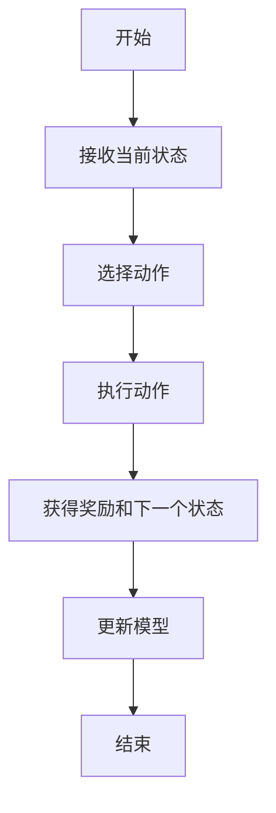
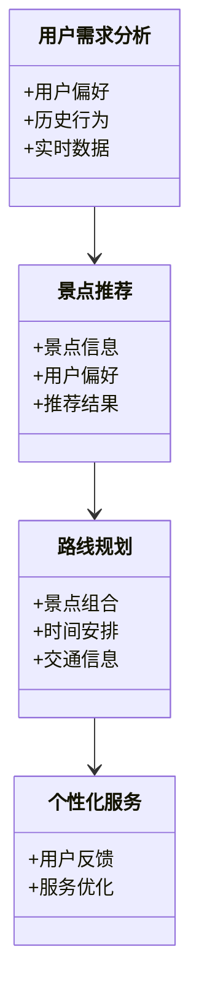
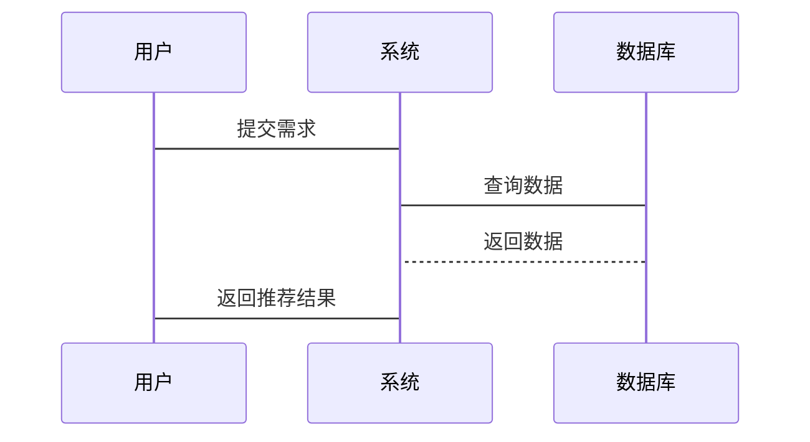

                 


# AI Agent在智能旅游规划中的应用

> 关键词：AI Agent, 智能旅游规划, 强化学习, 知识图谱, 图神经网络, 旅游路线规划

> 摘要：AI Agent在智能旅游规划中的应用是当前人工智能领域的重要研究方向。本文系统地探讨了AI Agent的核心概念、技术原理及其在旅游规划中的实际应用。通过分析基于知识图谱的推理、强化学习和图神经网络等技术，本文深入阐述了AI Agent在旅游路线规划、景点推荐和个性化服务中的作用。同时，本文结合实际案例，详细讲解了算法实现与系统设计，为读者提供了从理论到实践的全面指导。

---

# 第1章: AI Agent与智能旅游规划的背景

## 1.1 AI Agent的基本概念

### 1.1.1 AI Agent的定义与特点

AI Agent（人工智能代理）是一种能够感知环境、自主决策并执行任务的智能体。与传统的自动化系统不同，AI Agent具备以下特点：

1. **自主性**：能够在没有外部干预的情况下独立运行。
2. **反应性**：能够实时感知环境并做出相应的反应。
3. **目标导向**：基于目标驱动，优化决策过程。
4. **学习能力**：通过数据和经验不断优化自身的决策能力。

AI Agent在旅游规划中的应用主要体现在帮助用户完成复杂的决策过程，如旅游路线规划、景点推荐和个性化服务。

### 1.1.2 智能旅游规划的背景与意义

随着全球化的发展和人们生活水平的提高，旅游已成为许多人生活中不可或缺的一部分。传统的旅游规划依赖于人工经验，存在效率低、覆盖面窄、个性化不足等问题。AI Agent的出现，为解决这些问题提供了新的思路。通过AI Agent，用户可以快速获取个性化的旅游建议，优化行程安排，提升旅游体验。

### 1.1.3 AI Agent在旅游规划中的作用

AI Agent在旅游规划中的作用主要体现在以下几个方面：

1. **个性化推荐**：根据用户的偏好和历史行为，推荐最优的旅游路线和景点。
2. **实时优化**：根据实时数据（如天气、交通状况等），动态调整旅游计划。
3. **多目标优化**：在满足用户需求的同时，优化行程的成本（如时间、费用等）。

---

## 1.2 智能旅游规划的现状与挑战

### 1.2.1 当前旅游规划的主要问题

1. **信息过载**：用户面对海量的旅游信息，难以快速筛选出最优方案。
2. **个性化不足**：传统的旅游规划系统难以满足用户的个性化需求。
3. **实时性差**：在面对突发情况（如交通延误）时，系统难以快速响应。

### 1.2.2 AI技术在旅游规划中的应用现状

当前，AI技术在旅游规划中的应用主要集中在以下几个方面：

1. **个性化推荐**：基于用户的历史行为和偏好，推荐旅游景点和路线。
2. **智能客服**：通过自然语言处理技术，为用户提供实时的旅游咨询。
3. **动态规划**：根据实时数据（如天气、交通等），动态调整旅游计划。

### 1.2.3 智能旅游规划的未来发展方向

未来的智能旅游规划将朝着以下几个方向发展：

1. **更加个性化**：基于用户的实时行为和情感，提供更加个性化的服务。
2. **实时响应**：在面对突发事件时，能够快速调整旅游计划。
3. **多模态交互**：结合视觉、听觉等多种交互方式，提升用户体验。

---

## 1.3 本章小结

本章从AI Agent的基本概念出发，介绍了智能旅游规划的背景和意义，并重点分析了AI Agent在旅游规划中的作用。同时，本章还探讨了当前旅游规划的主要问题以及未来的发展方向。

---

# 第2章: AI Agent的核心概念与技术原理

## 2.1 基于知识图谱的AI Agent推理

### 2.1.1 知识图谱的构建与应用

知识图谱是一种将实体及其关系以图结构表示的知识库。在旅游规划中，知识图谱可以用来表示景点、酒店、交通等实体之间的关系。例如，可以通过知识图谱推理出景点A距离景点B的距离，或者景点A的最佳游览时间。

### 2.1.2 基于知识图谱的推理算法

基于知识图谱的推理算法主要包括以下几种：

1. **路径推理**：通过查找知识图谱中的路径，推断实体之间的关系。
2. **规则推理**：基于预定义的规则，进行推理。
3. **概率推理**：基于概率论，对实体关系进行推断。

### 2.1.3 知识图谱在旅游规划中的应用实例

例如，一个用户希望规划一个3天的旅游行程，涵盖自然风光和历史文化景点。AI Agent可以通过知识图谱推理出适合的景点组合，并推荐最优的游览顺序。

---

## 2.2 强化学习在AI Agent中的应用

### 2.2.1 强化学习的基本原理

强化学习是一种基于试错的学习方法。通过与环境的交互，AI Agent学习如何采取最优动作以达到目标。

### 2.2.2 基于强化学习的AI Agent设计

在旅游规划中，强化学习可以用于动态调整旅游计划。例如，当天气发生变化时，AI Agent可以根据新的信息，重新优化行程安排。

### 2.2.3 强化学习在旅游路线规划中的应用

例如，AI Agent可以通过强化学习算法，学习如何在有限的时间和预算内，规划出最优的旅游路线。

---

## 2.3 图神经网络在AI Agent中的应用

### 2.3.1 图神经网络的基本原理

图神经网络是一种处理图结构数据的深度学习模型。它可以用于处理景点之间的关系、用户之间的关系等。

### 2.3.2 图神经网络在旅游景点推荐中的应用

例如，AI Agent可以通过图神经网络，分析用户的历史行为和偏好，推荐相似景点。

### 2.3.3 图神经网络的优缺点分析

优点：能够处理复杂的非结构化数据，模型表达能力强。  
缺点：计算复杂度较高，需要大量的训练数据。

---

## 2.4 AI Agent的核心算法对比

### 2.4.1 基于规则的AI Agent与基于深度学习的AI Agent对比

| 对比维度 | 基于规则的AI Agent | 基于深度学习的AI Agent |
|----------|--------------------|--------------------------|
| 决策方式 | 预定义规则           | 数据驱动的决策           |
| 适应性   | 较低               | 较高                     |
| 实现复杂度 | 较低               | 较高                     |

### 2.4.2 基于知识图谱的推理与基于强化学习的对比

| 对比维度 | 基于知识图谱的推理 | 基于强化学习的推理 |
|----------|--------------------|----------------------|
| 数据依赖 | 高度依赖知识图谱     | 依赖环境反馈         |
| 计算复杂度 | 较低               | 较高                 |

### 2.4.3 不同算法在旅游规划中的适用场景

- **基于规则的AI Agent**：适用于规则明确的场景，如简单的景点推荐。
- **基于知识图谱的推理**：适用于需要复杂推理的场景，如旅游路线规划。
- **基于强化学习的推理**：适用于需要动态调整的场景，如实时旅游计划优化。

---

## 2.5 本章小结

本章详细介绍了AI Agent的核心概念与技术原理，重点分析了基于知识图谱的推理、强化学习和图神经网络等技术在旅游规划中的应用。通过对不同算法的对比，本文为读者提供了选择合适算法的指导。

---

# 第3章: 基于强化学习的AI Agent算法

## 3.1 强化学习的基本原理

### 3.1.1 强化学习的定义与核心要素

强化学习的核心要素包括：

1. **状态（State）**：环境的当前情况。
2. **动作（Action）**：AI Agent采取的行动。
3. **奖励（Reward）**：AI Agent采取动作后获得的反馈。
4. **策略（Policy）**：AI Agent采取动作的概率分布。

### 3.1.2 Q-learning算法的数学模型与公式

Q-learning算法的数学模型如下：

$$ Q(s, a) = Q(s, a) + \alpha \left( r + \max_{a'} Q(s', a') - Q(s, a) \right) $$

其中，$\alpha$ 是学习率，$r$ 是奖励，$s'$ 是下一个状态。

### 3.1.3 DQN算法的原理与流程

DQN（Deep Q-Network）算法的流程如下：

1. **环境感知**：AI Agent接收当前状态。
2. **动作选择**：基于当前状态，选择一个动作。
3. **环境反馈**：AI Agent采取动作后，获得奖励和下一个状态。
4. **更新模型**：更新神经网络的权重，以优化Q值。

---

## 3.2 基于强化学习的旅游路线规划算法

### 3.2.1 旅游路线规划的数学模型

旅游路线规划的数学模型如下：

$$ \text{目标} = \argmax_{\text{路线}} \left( \text{满意度} - \text{成本} \right) $$

其中，满意度和成本是需要优化的目标函数。

### 3.2.2 基于DQN的旅游路线规划算法设计

DQN算法在旅游路线规划中的设计如下：

1. **状态空间**：包括当前景点、剩余时间、预算等。
2. **动作空间**：包括前往下一个景点、结束行程等。
3. **奖励函数**：根据满意度和成本计算奖励。

### 3.2.3 算法流程图（Mermaid）



---

## 3.3 算法实现与案例分析

### 3.3.1 环境安装

为了实现基于强化学习的旅游路线规划，需要安装以下环境：

1. **Python**：3.6及以上版本。
2. **TensorFlow**：2.0及以上版本。
3. **OpenAI Gym**：用于模拟环境。

### 3.3.2 系统核心实现源代码

以下是基于DQN算法的Python代码示例：

```python
import gym
import numpy as np
import tensorflow as tf

class DQN:
    def __init__(self, state_space, action_space, lr=0.01, gamma=0.99):
        self.state_space = state_space
        self.action_space = action_space
        self.lr = lr
        self.gamma = gamma
        self.model = self.build_model()
        self.memory = []

    def build_model(self):
        model = tf.keras.Sequential([
            tf.keras.layers.Dense(64, activation='relu', input_dim=self.state_space),
            tf.keras.layers.Dense(32, activation='relu'),
            tf.keras.layers.Dense(self.action_space, activation='linear')
        ])
        model.compile(optimizer=tf.keras.optimizers.Adam(lr=self.lr), loss='mse')
        return model

    def remember(self, state, action, reward, next_state):
        self.memory.append((state, action, reward, next_state))

    def act(self, state):
        state = np.array([state])
        prediction = self.model.predict(state)[0]
        return np.argmax(prediction)

    def replay(self, batch_size):
        if len(self.memory) < batch_size:
            return
        batch = np.random.choice(self.memory, batch_size)
        for state, action, reward, next_state in batch:
            target = reward + self.gamma * np.max(self.model.predict(np.array([next_state]))[0])
            target = target * np.ones_like(self.model.predict(np.array([state]))[0])
            self.model.fit(np.array([state]), target, epochs=1, verbose=0)

# 初始化环境
env = gym.make('TravelPlanner-v0')
state_space = env.observation_space.shape[0]
action_space = env.action_space.n
dqn = DQN(state_space, action_space)

# 训练过程
episodes = 1000
for episode in range(episodes):
    state = env.reset()
    total_reward = 0
    while True:
        action = dqn.act(state)
        next_state, reward, done, info = env.step(action)
        dqn.remember(state, action, reward, next_state)
        dqn.replay(32)
        state = next_state
        total_reward += reward
        if done:
            break
    print(f"Episode {episode}: Total Reward = {total_reward}")
```

---

## 3.4 算法实现与案例分析

### 3.4.1 代码解读

上述代码实现了一个基于DQN算法的旅游路线规划系统。系统通过与环境交互，逐步学习如何规划最优路线。

### 3.4.2 算法应用实例

假设用户希望在一个城市中规划一个3天的行程，包括景点A、景点B和景点C。AI Agent通过强化学习算法，学习如何在有限的时间和预算内，规划出最优的行程安排。

### 3.4.3 项目小结

通过上述代码实现，我们可以看到，基于强化学习的AI Agent能够有效地规划旅游路线，并通过不断的学习优化行程安排。

---

## 3.5 本章小结

本章详细介绍了基于强化学习的AI Agent算法，重点分析了Q-learning和DQN算法的原理与实现。通过实际案例，展示了AI Agent在旅游路线规划中的应用。

---

# 第4章: 基于知识图谱的AI Agent算法

## 4.1 知识图谱的构建与应用

### 4.1.1 知识图谱的构建流程

知识图谱的构建流程如下：

1. **数据采集**：从多个数据源（如景点数据库、用户评价等）获取数据。
2. **数据清洗**：去除冗余和错误数据。
3. **实体识别**：识别数据中的实体（如景点、酒店等）。
4. **关系抽取**：抽取实体之间的关系。
5. **知识图谱构建**：将实体和关系组织成图结构。

### 4.1.2 知识图谱在旅游规划中的应用

知识图谱在旅游规划中的应用包括景点推荐、路线规划等。

---

## 4.2 基于知识图谱的推理算法

### 4.2.1 知识图谱的推理算法

基于知识图谱的推理算法包括路径推理、规则推理和概率推理。

### 4.2.2 知识图谱推理在旅游规划中的应用

例如，AI Agent可以通过知识图谱推理出景点A和景点B的最佳游览顺序。

---

## 4.3 基于图神经网络的推理算法

### 4.3.1 图神经网络在旅游规划中的应用

图神经网络可以用于景点推荐、路线规划等。

---

## 4.4 本章小结

本章详细介绍了基于知识图谱的AI Agent算法，重点分析了知识图谱的构建与应用，以及基于知识图谱的推理算法。

---

# 第5章: 智能旅游规划系统的设计与实现

## 5.1 系统功能设计

### 5.1.1 系统功能模块

系统功能模块包括用户需求分析、景点推荐、路线规划、个性化服务等。

### 5.1.2 系统功能设计的Mermaid类图



---

## 5.2 系统架构设计

### 5.2.1 系统架构设计的Mermaid架构图

```mermaid
rectangle 系统架构 {
    rectangle 数据层 {
        +知识图谱数据库
        +用户数据库
    }
    rectangle 服务层 {
        +景点推荐服务
        +路线规划服务
    }
    rectangle 接口层 {
        +API接口
    }
}
```

---

## 5.3 系统接口设计

### 5.3.1 系统接口设计的Mermaid序列图



---

## 5.4 本章小结

本章详细介绍了智能旅游规划系统的设计与实现，重点分析了系统功能设计、系统架构设计和系统接口设计。

---

# 第6章: 项目实战——基于AI Agent的智能旅游规划系统

## 6.1 项目背景与目标

### 6.1.1 项目背景

随着旅游业的快速发展，用户对个性化旅游服务的需求日益增加。

### 6.1.2 项目目标

本项目旨在开发一个基于AI Agent的智能旅游规划系统，为用户提供个性化的旅游服务。

---

## 6.2 项目实现

### 6.2.1 项目实现的环境安装

需要安装以下环境：

1. **Python**：3.6及以上版本。
2. **TensorFlow**：2.0及以上版本。
3. **Flask**：用于构建Web界面。

### 6.2.2 项目实现的核心代码

以下是基于AI Agent的智能旅游规划系统的Python代码示例：

```python
from flask import Flask, request, jsonify
import gym
import numpy as np
import tensorflow as tf

app = Flask(__name__)

class AI-Agent:
    def __init__(self, state_space, action_space, lr=0.01, gamma=0.99):
        self.state_space = state_space
        self.action_space = action_space
        self.lr = lr
        self.gamma = gamma
        self.model = self.build_model()
        self.memory = []

    def build_model(self):
        model = tf.keras.Sequential([
            tf.keras.layers.Dense(64, activation='relu', input_dim=self.state_space),
            tf.keras.layers.Dense(32, activation='relu'),
            tf.keras.layers.Dense(self.action_space, activation='linear')
        ])
        model.compile(optimizer=tf.keras.optimizers.Adam(lr=self.lr), loss='mse')
        return model

    def remember(self, state, action, reward, next_state):
        self.memory.append((state, action, reward, next_state))

    def act(self, state):
        state = np.array([state])
        prediction = self.model.predict(state)[0]
        return np.argmax(prediction)

    def replay(self, batch_size):
        if len(self.memory) < batch_size:
            return
        batch = np.random.choice(self.memory, batch_size)
        for state, action, reward, next_state in batch:
            target = reward + self.gamma * np.max(self.model.predict(np.array([next_state]))[0])
            target = target * np.ones_like(self.model.predict(np.array([state]))[0])
            self.model.fit(np.array([state]), target, epochs=1, verbose=0)

@app.route('/plan', methods=['POST'])
def plan():
    data = request.json
    state = data['state']
    action = agent.act(state)
    return jsonify({'action': action})

if __name__ == '__main__':
    env = gym.make('TravelPlanner-v0')
    state_space = env.observation_space.shape[0]
    action_space = env.action_space.n
    agent = AI-Agent(state_space, action_space)
    app.run()
```

---

## 6.3 项目实现与案例分析

### 6.3.1 系统功能实现

系统功能包括：

1. **用户需求提交**：用户提交旅游需求（如时间、预算、偏好等）。
2. **系统推理**：AI Agent基于用户需求，推理出最优的旅游计划。
3. **结果展示**：系统将推理结果以可视化的方式展示给用户。

### 6.3.2 项目小结

通过上述代码实现，我们可以看到，基于AI Agent的智能旅游规划系统能够有效地为用户提供个性化的旅游服务。

---

## 6.4 本章小结

本章通过一个实际项目，详细介绍了基于AI Agent的智能旅游规划系统的实现过程，包括项目背景、系统设计和代码实现。

---

# 第7章: 最佳实践与未来展望

## 7.1 项目小结

### 7.1.1 项目总结

本项目通过AI Agent技术，成功实现了智能旅游规划系统，为用户提供个性化的旅游服务。

### 7.1.2 项目经验总结

1. **算法选择**：根据具体场景选择合适的算法。
2. **数据质量**：数据质量对系统性能影响较大。
3. **系统优化**：需要不断优化系统，提升用户体验。

---

## 7.2 项目注意事项

1. **数据隐私**：需要注意用户数据的隐私保护。
2. **系统稳定性**：需要确保系统的稳定性和可靠性。
3. **用户体验**：需要注重用户体验设计。

---

## 7.3 未来展望

### 7.3.1 AI Agent技术的未来发展方向

1. **多模态交互**：结合视觉、听觉等多种交互方式。
2. **实时响应**：在面对突发事件时，能够快速调整计划。
3. **个性化服务**：提供更加个性化的服务。

### 7.3.2 AI Agent在旅游规划中的未来应用

1. **智能客服**：通过自然语言处理技术，为用户提供实时的旅游咨询。
2. **动态规划**：根据实时数据，动态调整旅游计划。

---

## 7.4 本章小结

本章总结了项目的实践经验，并对未来的发展方向进行了展望。

---

# 作者：AI天才研究院/AI Genius Institute & 禅与计算机程序设计艺术 /Zen And The Art of Computer Programming

