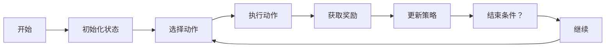
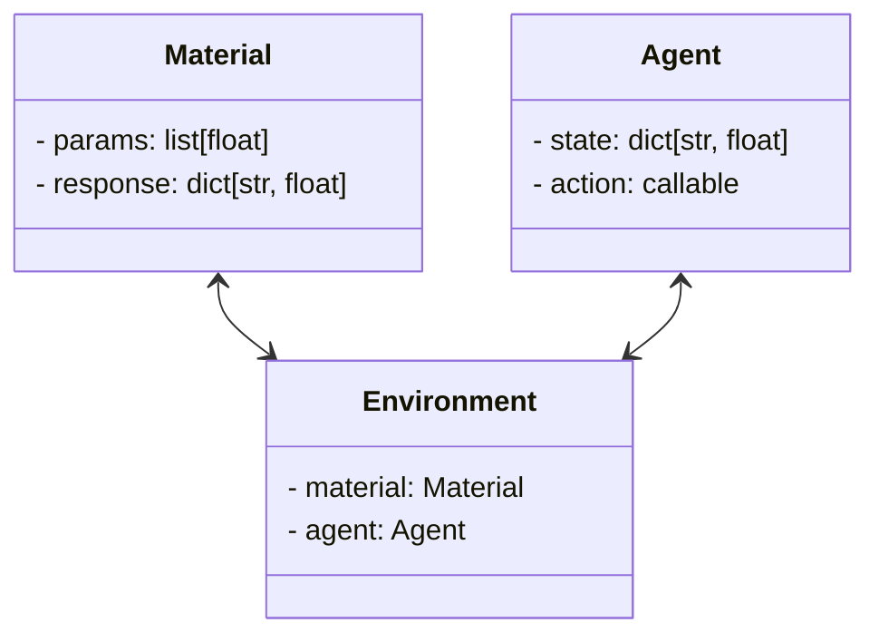
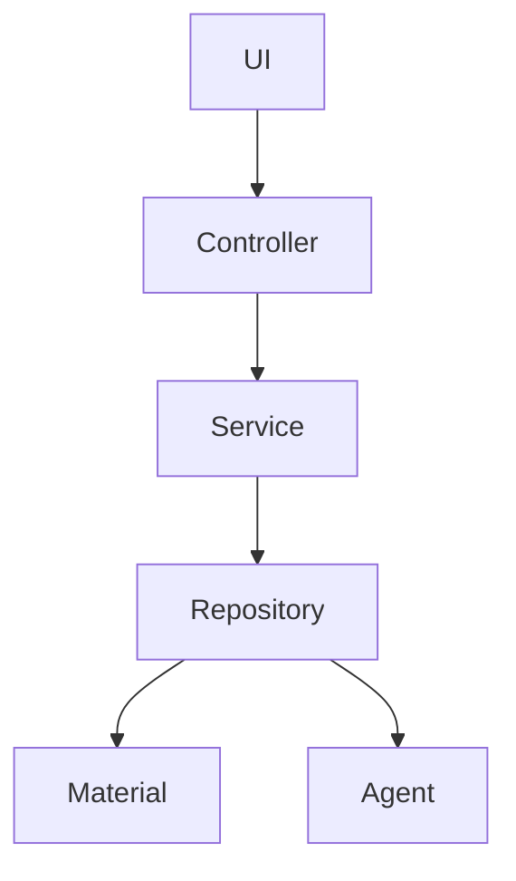
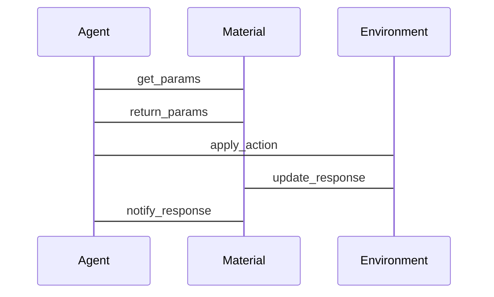

                 


# AI Agent在智能材料性能优化中的角色

> **关键词：** AI Agent，智能材料，性能优化，强化学习，遗传算法，系统架构

> **摘要：**  
> 本文深入探讨了AI Agent在智能材料性能优化中的核心作用，分析了其与传统优化方法的对比，详细讲解了算法原理、系统架构及实际应用案例。通过理论与实践结合，揭示了AI Agent在提升智能材料性能方面的巨大潜力。

---

# 第一部分: AI Agent与智能材料性能优化的背景介绍

## 第1章: AI Agent与智能材料的基本概念

### 1.1 AI Agent的基本概念

#### 1.1.1 AI Agent的定义
AI Agent（智能代理）是指能够感知环境、做出决策并执行动作的智能实体。它通过传感器获取信息，利用算法进行分析，最终输出决策或动作。AI Agent可以是软件程序，也可以是物理设备，其核心在于具备自主决策能力。

#### 1.1.2 AI Agent的核心特征
1. **自主性**：无需外部干预，自主完成任务。
2. **反应性**：能够实时感知环境变化并做出响应。
3. **目标导向性**：基于目标进行决策和优化。
4. **学习能力**：通过经验改进性能。

#### 1.1.3 AI Agent与传统算法的区别
- **传统算法**：基于固定规则，按部就班地解决问题。
- **AI Agent**：具备学习和适应能力，能够根据反馈优化行为。

### 1.2 智能材料的基本概念

#### 1.2.1 智能材料的定义
智能材料是指能够根据外界环境变化（如温度、压力、光照等）自动调整其物理、化学或机械性能的材料。它们能够感知环境并做出响应，具有自适应性和智能性。

#### 1.2.2 智能材料的分类
1. **形状记忆合金**：在外力作用下可恢复原始形状。
2. **智能聚合物**：响应环境变化改变形状或性能。
3. **压电材料**：将机械能转化为电能或反之。

#### 1.2.3 智能材料的应用领域
- **航空航天**：用于可变形机翼。
- **生物医学**：用于智能假肢或药物释放。
- **能源**：用于可变形电池或光伏材料。

### 1.3 智能材料性能优化的背景与意义

#### 1.3.1 智能材料性能优化的背景
随着科技的进步，智能材料在多个领域的应用日益广泛，但其性能仍有提升空间。优化目标包括提高响应速度、增强稳定性等。

#### 1.3.2 优化的必要性与挑战
- **必要性**：提升性能以满足更苛刻的应用需求。
- **挑战**：材料性能复杂，优化涉及多目标、多约束条件。

#### 1.3.3 优化的目标与价值
优化目标包括提高材料的响应精度、延长使用寿命等。其价值在于推动智能材料在更多领域的应用，提升产品性能。

---

## 第2章: AI Agent在智能材料性能优化中的角色

### 2.1 AI Agent在材料优化中的作用

#### 2.1.1 数据采集与处理
AI Agent通过传感器实时采集材料性能数据，分析并识别关键特征。

#### 2.1.2 性能预测与优化
基于历史数据，AI Agent预测材料在不同条件下的性能，并制定优化方案。

#### 2.1.3 实验设计与验证
AI Agent设计实验方案，指导实验并根据结果调整优化策略。

### 2.2 AI Agent与其他优化方法的对比

#### 2.2.1 基于传统算法的优化方法
- **优点**：简单易懂，适用于规则明确的问题。
- **缺点**：缺乏灵活性，难以应对复杂环境。

#### 2.2.2 基于机器学习的优化方法
- **优点**：能够处理复杂数据，发现非线性关系。
- **缺点**：需要大量数据，计算成本高。

#### 2.2.3 AI Agent的独特优势
- **自主性**：能够在动态环境中自主调整策略。
- **实时性**：能够实时响应环境变化，快速优化性能。

### 2.3 智能材料性能优化的边界与外延

#### 2.3.1 优化的边界条件
- **可优化参数**：材料的物理、化学参数。
- **优化范围**：限定在特定的应用场景内。

#### 2.3.2 优化的外延范围
- **宏观性能**：材料的整体性能提升。
- **微观结构**：优化材料微观结构以提高性能。

#### 2.3.3 优化与实际应用的结合
AI Agent通过模拟和实验验证，确保优化方案的实际可行性。

---

## 第3章: 智能材料性能优化的核心概念与联系

### 3.1 核心概念原理

#### 3.1.1 AI Agent的决策机制
AI Agent通过感知环境、分析数据，选择最优动作以实现目标。

#### 3.1.2 智能材料的响应特性
材料对外界刺激的敏感性和响应速度直接影响其性能。

#### 3.1.3 优化目标的数学表达
优化目标通常转化为数学问题，如最小化或最大化目标函数。

### 3.2 核心概念属性对比

| **属性**       | **AI Agent**              | **智能材料**               |
|-----------------|---------------------------|---------------------------|
| **目标导向性**   | 高                        | 无直接目标导向             |
| **学习能力**     | 强                        | 无学习能力                 |
| **实时性**       | 高                        | 较低                      |
| **适应性**       | 强                        | 依赖外界刺激               |

### 3.3 系统架构的ER实体关系图

```
erDiagram
    material [*-----* agent]
    agent [*-----* environment]
    material [*-----* response]
```

---

## 第4章: AI Agent优化智能材料的算法原理

### 4.1 算法概述

#### 4.1.1 强化学习
AI Agent通过与环境互动，学习最优策略以最大化奖励。

#### 4.1.2 遗传算法
通过模拟自然选择，优化材料参数。

### 4.2 强化学习的实现步骤

#### 4.2.1 状态空间
材料的当前状态，如温度、应力等。

#### 4.2.2 行动空间
AI Agent可执行的动作，如调整温度、施加压力等。

#### 4.2.3 奖励函数
定义奖励机制，指导AI Agent选择最优动作。

### 4.3 强化学习算法流程图



### 4.4 遗传算法实现代码示例

```python
import numpy as np

def fitness(material_param):
    # 计算适应度函数
    return np.sum(material_param)

def evolve_population(population, fitness_fn):
    # 计算适应度
    fitness_values = [fitness_fn(individual) for individual in population]
    # 选择
    selected = [individual for fitness, individual in sorted(zip(fitness_values, population))]
    # 交叉
    new_population = []
    for i in range(len(selected)//2):
        parent1 = selected[i]
        parent2 = selected[len(selected) - 1 - i]
        child1 = np.mean([parent1, parent2], axis=0)
        child2 = np.mean([parent2, parent1], axis=0)
        new_population.extend([child1, child2])
    return new_population

# 初始化种群
population = np.random.rand(10, 5)
# 进化
new_population = evolve_population(population, fitness)
```

---

## 第5章: 系统分析与架构设计

### 5.1 系统功能设计

#### 5.1.1 领域模型类图



### 5.2 系统架构设计

#### 5.2.1 分层架构



### 5.3 接口设计

#### 5.3.1 交互流程图



---

## 第6章: 项目实战

### 6.1 环境安装

#### 6.1.1 安装Python环境
使用Anaconda安装Python 3.8以上版本。

#### 6.1.2 安装依赖库
安装NumPy、Pandas、Matplotlib等库。

### 6.2 核心代码实现

#### 6.2.1 强化学习实现

```python
import numpy as np
import random

class Agent:
    def __init__(self, state_dim):
        self.state_dim = state_dim
        self.learning_rate = 0.01
        self.Q = np.zeros(state_dim)

    def act(self, state):
        return random.choice(range(self.Q.shape[0]))

    def learn(self, state, reward):
        self.Q[state] += self.learning_rate * reward

# 初始化环境
state_dim = 5
agent = Agent(state_dim)

# 执行优化
for _ in range(100):
    state = random.randint(0, state_dim-1)
    action = agent.act(state)
    reward = 1 if action == state else 0
    agent.learn(state, reward)
```

---

## 第7章: 总结与展望

### 7.1 总结

AI Agent通过其自主性和学习能力，在智能材料性能优化中展现出巨大潜力。本文从背景、算法、系统架构等多个方面详细探讨了其应用。

### 7.2 展望

未来，AI Agent将与更先进的材料科学结合，推动智能材料在更多领域的应用，优化算法也将更加高效和智能。

---

# 作者：AI天才研究院 & 禅与计算机程序设计艺术

---

通过以上目录和内容，我们可以看到，AI Agent在智能材料性能优化中的应用是一个复杂但充满潜力的领域。从算法原理到系统设计，再到实际应用，AI Agent展示了其强大的优化能力。未来，随着技术的不断进步，AI Agent将在这一领域发挥更大的作用。

