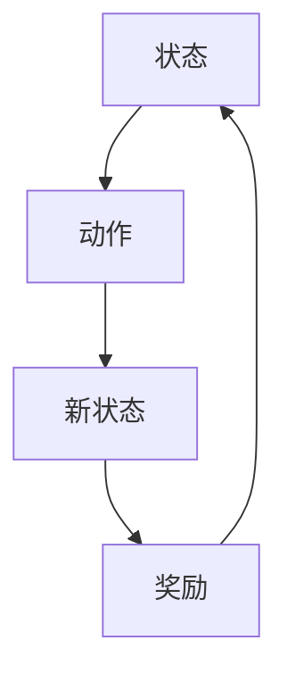
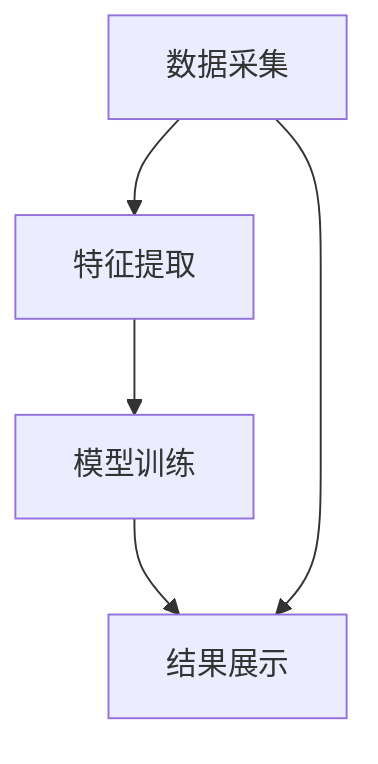

                 


# AI Agent在智能材料性能预测中的角色

**关键词：** AI Agent, 智能材料, 性能预测, 算法原理, 系统设计

**摘要：**  
本文探讨了AI Agent在智能材料性能预测中的关键作用。通过分析智能材料的基本特性、AI Agent的核心功能以及它们的结合方式，本文详细介绍了AI Agent在性能预测中的算法原理、系统架构和实际应用。结合具体案例和数学模型，文章展示了如何利用AI Agent优化智能材料的性能预测过程，并为未来的研究方向提供了展望。

---

## 第1章: 智能材料与AI Agent概述

### 1.1 智能材料的基本概念

智能材料是一种能够感知环境变化并做出相应响应的材料。它们具有以下特性：

1. **可响应性**：能够对外界刺激（如温度、压力、光照）做出反应。
2. **自适应性**：材料的性能会根据环境变化自动调整。
3. **可编程性**：可以通过外界输入或内部算法改变其行为模式。

智能材料广泛应用于传感器、能量存储设备、医疗设备等领域。

### 1.2 AI Agent的核心功能

AI Agent（智能体）是指能够感知环境、做出决策并采取行动的智能实体。其核心功能包括：

1. **感知环境**：通过传感器或数据输入获取信息。
2. **决策制定**：基于感知信息，利用算法进行分析和推理。
3. **执行行动**：根据决策结果采取具体行动。

### 1.3 AI Agent在智能材料性能预测中的作用

AI Agent通过以下方式在智能材料性能预测中发挥关键作用：

1. **数据采集与处理**：AI Agent能够从大量实验数据中提取有用信息，减少人工干预。
2. **模型优化**：通过机器学习算法，AI Agent可以训练出更精确的性能预测模型。
3. **实时反馈**：在预测过程中，AI Agent能够实时调整模型参数，提高预测准确性。

---

## 第2章: 智能材料性能预测的核心概念

### 2.1 性能预测的基本原理

智能材料的性能预测是指通过实验数据和数学模型，预测材料在特定条件下的表现。其基本步骤包括：

1. **数据采集**：收集材料在不同条件下的性能数据。
2. **特征提取**：从数据中提取关键特征，如弹性模量、导电性等。
3. **模型训练**：利用机器学习算法建立预测模型。
4. **结果验证**：通过实验验证模型的准确性。

### 2.2 AI Agent在性能预测中的应用

AI Agent通过以下步骤优化性能预测过程：

1. **数据预处理**：清洗数据，去除噪声，确保数据质量。
2. **特征选择**：利用算法自动选择影响性能的关键特征。
3. **模型优化**：通过强化学习不断优化预测模型的参数。
4. **实时调整**：根据新的实验数据，实时更新模型。

### 2.3 性能预测的数学模型

性能预测的核心是建立一个数学模型，常用的方法包括回归分析和分类算法。以下是一个简单的线性回归模型：

$$ y = \beta_0 + \beta_1x + \epsilon $$

其中，$y$ 是目标变量，$x$ 是自变量，$\beta_0$ 和 $\beta_1$ 是模型参数，$\epsilon$ 是误差项。

---

## 第3章: AI Agent的算法原理

### 3.1 机器学习算法

机器学习是AI Agent的核心技术之一。常用算法包括：

1. **监督学习**：通过标记数据训练模型，如支持向量机（SVM）和随机森林。
2. **无监督学习**：通过无标记数据发现数据内在结构，如聚类分析。
3. **深度学习**：通过多层神经网络提取高阶特征，如卷积神经网络（CNN）和循环神经网络（RNN）。

### 3.2 强化学习算法

强化学习是一种通过试错方式优化决策的算法。AI Agent通过与环境交互，学习最优策略。以下是一个简单的Q-learning算法流程：



### 3.3 算法实现示例

以下是一个简单的线性回归模型的Python实现：

```python
import numpy as np
from sklearn.linear_model import LinearRegression

# 生成数据
X = np.random.rand(100, 1)
y = 2 * X + 1 + np.random.randn(100, 1) * 0.1

# 训练模型
model = LinearRegression()
model.fit(X, y)

# 预测结果
y_pred = model.predict(X)
print("预测结果:", y_pred)
print("模型系数:", model.coef_)
```

---

## 第4章: 系统设计与架构

### 4.1 系统功能设计

智能材料性能预测系统的功能模块包括：

1. **数据采集模块**：负责收集实验数据。
2. **特征提取模块**：从数据中提取关键特征。
3. **模型训练模块**：利用机器学习算法训练预测模型。
4. **结果展示模块**：将预测结果以可视化形式呈现。

### 4.2 系统架构设计

以下是系统的架构设计图：



### 4.3 接口设计

系统接口设计需要考虑数据输入和输出的格式。例如，数据采集模块可能需要接收CSV格式的数据，并输出预处理后的数据到特征提取模块。

---

## 第5章: 项目实战

### 5.1 实验环境搭建

安装必要的库：

```bash
pip install numpy scikit-learn matplotlib
```

### 5.2 核心代码实现

以下是性能预测的Python代码：

```python
import numpy as np
from sklearn.model_selection import train_test_split
from sklearn.metrics import mean_squared_error

# 生成数据
X = np.random.rand(1000, 5)  # 5个特征
y = (X[:, 0] * 2 + X[:, 1] * 3 + 1).reshape(-1, 1)

# 划分训练集和测试集
X_train, X_test, y_train, y_test = train_test_split(X, y, test_size=0.2)

# 训练模型
from sklearn.linear_model import LinearRegression
model = LinearRegression()
model.fit(X_train, y_train)

# 预测结果
y_pred = model.predict(X_test)
print("均方误差:", mean_squared_error(y_test, y_pred))
```

### 5.3 结果分析

通过上述代码，我们可以得到模型的均方误差（MSE）。MSE越小，模型的预测能力越强。

---

## 第6章: 总结与展望

### 6.1 总结

本文详细介绍了AI Agent在智能材料性能预测中的角色，从理论基础到实际应用，展示了AI Agent在优化预测过程中的巨大潜力。

### 6.2 展望

未来的研究可以进一步探索更复杂的算法，如深度学习和强化学习，以提高预测模型的准确性和效率。

---

**作者：AI天才研究院/AI Genius Institute & 禅与计算机程序设计艺术 /Zen And The Art of Computer Programming**

