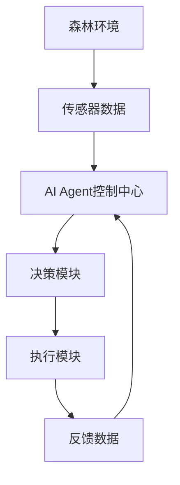
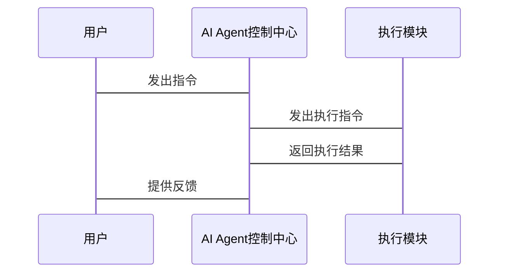

                 


# AI Agent在智能森林管理中的实践

## 关键词：AI Agent, 智能森林管理, 环境监测, 病虫害防治, 森林资源优化

## 摘要：  
随着全球气候变化和人类活动的加剧，森林资源的保护和管理变得越来越重要。AI Agent（人工智能代理）作为一种能够自主感知、决策和执行的智能实体，在智能森林管理中展现出巨大的潜力。本文将深入探讨AI Agent在智能森林管理中的核心概念、算法原理、系统架构设计以及实际应用场景，结合具体案例分析其在环境监测、病虫害防治和资源优化配置中的实践价值。

---

## 第1章: AI Agent在智能森林管理中的背景与挑战

### 1.1 森林管理的现状与问题  
#### 1.1.1 森林资源的重要性  
森林是地球上最重要的生态系统之一，提供氧气、水源、木材等多种资源，同时在调节气候、保护生物多样性方面起着关键作用。然而，随着人类活动的加剧，森林资源面临过度开发、砍伐、病虫害和火灾等多重威胁。  

#### 1.1.2 传统森林管理的局限性  
传统森林管理主要依赖人工巡查和经验判断，存在效率低、覆盖范围有限、实时性差等问题。例如，病虫害的早期发现和预防往往滞后，导致损失扩大；火灾预警和扑救也面临时间窗口狭窄的挑战。  

#### 1.1.3 智能化管理的需求  
为了提高森林管理的效率和精准度，智能化管理成为必然趋势。AI Agent作为一种能够自主感知、决策和执行的智能实体，能够实时监测森林环境、预测潜在风险并采取相应措施，为森林管理提供强有力的支撑。

---

### 1.2 AI Agent的基本概念  
#### 1.2.1 什么是AI Agent  
AI Agent是一种能够感知环境、自主决策并执行动作的智能系统。它具备以下核心特征：  
1. **自主性**：能够在没有外部干预的情况下独立运行。  
2. **反应性**：能够实时感知环境变化并做出响应。  
3. **目标导向**：通过设定目标来优化决策和行动。  

#### 1.2.2 AI Agent的核心特征  
- **感知能力**：通过传感器、摄像头等设备获取环境数据。  
- **决策能力**：基于感知数据，利用算法选择最优行动方案。  
- **执行能力**：通过执行机构（如无人机、机器人）落实决策。  

#### 1.2.3 AI Agent与传统自动化的区别  
AI Agent与传统自动化系统的区别在于其智能化和自主性。传统自动化系统依赖预设规则，而AI Agent能够通过学习和适应不断优化其行为，以应对复杂多变的环境。

---

### 1.3 AI Agent在森林管理中的应用前景  
#### 1.3.1 森林资源监测  
AI Agent可以通过无人机、卫星图像和地面传感器实时监测森林资源的动态变化，如树木生长情况、土壤湿度等。  

#### 1.3.2 病虫害防治  
通过AI Agent的早期预警系统，可以快速识别病虫害的爆发迹象，并制定防治方案，最大限度减少损失。  

#### 1.3.3 森林火灾预警  
AI Agent能够实时监测温度、湿度、风速等气象数据，并结合卫星图像分析火源位置，提前发出火灾预警，为扑救工作争取时间。

---

## 第2章: AI Agent在智能森林管理中的核心概念  

### 2.1 AI Agent的感知机制  
#### 2.1.1 感知数据来源  
AI Agent的感知数据来源包括：  
1. **传感器数据**：如温度、湿度、光照强度等环境参数。  
2. **图像数据**：通过无人机或卫星获取的森林图像。  
3. **历史数据**：包括以往的气象记录和病虫害案例。  

#### 2.1.2 数据处理与特征提取  
感知数据需要经过预处理（如去噪、归一化）和特征提取（如使用CNN提取图像特征）才能用于后续决策。  

#### 2.1.3 感知模型的构建  
感知模型通常基于机器学习算法（如随机森林、支持向量机）训练而成，用于分类、回归或聚类任务。  

---

### 2.2 AI Agent的决策机制  
#### 2.2.1 决策模型的选择  
根据具体任务选择合适的决策模型，如强化学习（Q-learning）用于动态环境中的决策，或者监督学习用于分类任务。  

#### 2.2.2 多目标优化  
在复杂的森林管理场景中，AI Agent需要在多个目标之间进行权衡，例如在火灾预警中，既要考虑扑救成本，也要确保预警的准确性。  

#### 2.2.3 决策的可解释性  
为了提高决策的透明度和信任度，AI Agent需要具备可解释性，即能够清晰地说明决策背后的原因和逻辑。

---

### 2.3 AI Agent的执行机制  
#### 2.3.1 执行策略  
执行策略包括：  
1. **预防性措施**：如提前喷洒农药防止病虫害。  
2. **应急措施**：如火灾发生时启动灭火设备。  

#### 2.3.2 反馈机制  
执行过程中，AI Agent需要实时接收反馈信息（如传感器数据的变化），并根据反馈调整执行策略。  

#### 2.3.3 执行结果的评估  
通过评估执行结果（如病虫害防治效果、火灾扑救效率）来优化AI Agent的决策模型和执行策略。

---

## 第3章: AI Agent的核心算法原理  

### 3.1 状态空间与动作空间  
#### 3.1.1 状态空间的定义  
状态空间是指AI Agent在某一时刻所处的所有可能状态的集合，例如森林中的温度、湿度、风速等参数。  

#### 3.1.2 动作空间的定义  
动作空间是指AI Agent在某一状态下可以采取的所有可能动作，例如“喷洒农药”、“启动灭火设备”等。  

#### 3.1.3 状态转移概率  
状态转移概率描述了从一个状态转移到另一个状态的可能性，通常通过马尔可夫链模型进行建模。

---

### 3.2 感知模型的构建  
#### 3.2.1 数据预处理  
数据预处理包括：  
1. **去噪**：去除传感器噪声。  
2. **归一化**：将数据标准化到统一范围。  

#### 3.2.2 特征提取方法  
常用的特征提取方法包括：  
1. **主成分分析（PCA）**：用于降维。  
2. **卷积神经网络（CNN）**：用于图像特征提取。  

#### 3.2.3 感知模型的训练  
感知模型通常采用监督学习算法进行训练，例如随机森林、支持向量机（SVM）或深度神经网络。

---

### 3.3 决策模型的构建  
#### 3.3.1 Q-learning算法  
Q-learning是一种常用的强化学习算法，通过维护Q表来记录状态-动作对的期望奖励值。  

#### 3.3.2 DQN算法  
深度Q网络（DQN）将Q-learning与深度神经网络结合，能够处理高维状态空间和动作空间。  

#### 3.3.3 策略网络  
策略网络直接输出最优动作，通常用于连续动作空间的问题。

---

## 第4章: AI Agent在森林管理中的系统架构设计  

### 4.1 系统功能设计  
#### 4.1.1 森林资源监测模块  
功能：实时监测森林环境参数，如温度、湿度、光照强度等。  

#### 4.1.2 病虫害防治模块  
功能：通过图像识别和传感器数据，识别病虫害迹象并制定防治方案。  

#### 4.1.3 火灾预警模块  
功能：结合气象数据和图像识别，预测火灾风险并发出预警。

---

### 4.2 系统架构图  


---

### 4.3 接口设计  
#### 4.3.1 传感器数据接口  
接口：提供温度、湿度、光照强度等传感器数据的读取功能。  

#### 4.3.2 决策模块接口  
接口：接收传感器数据，返回决策结果。  

#### 4.3.3 执行模块接口  
接口：接收决策指令，执行相应的动作。

---

### 4.4 系统交互流程图  


---

## 第5章: AI Agent的项目实战  

### 5.1 环境监测案例  
#### 5.1.1 环境安装  
安装传感器和摄像头，连接到AI Agent控制中心。  

#### 5.1.2 代码实现  
```python
import numpy as np
from sklearn.ensemble import RandomForestClassifier

# 示例：基于传感器数据的森林健康评估
def preprocess(data):
    # 数据预处理
    data = data.dropna()
    data = (data - data.mean()) / data.std()
    return data

def train_model(X, y):
    # 训练随机森林模型
    model = RandomForestClassifier()
    model.fit(X, y)
    return model

def predict_health(model, X_test):
    # 预测森林健康状态
    y_pred = model.predict(X_test)
    return y_pred
```

#### 5.1.3 应用解读  
通过传感器数据训练随机森林模型，实现对森林健康状态的分类，为后续的资源优化配置提供依据。

---

### 5.2 病虫害防治案例  
#### 5.2.1 环境安装  
部署无人机和图像识别系统，用于病虫害早期识别。  

#### 5.2.2 代码实现  
```python
import cv2
from tensorflow.keras.models import load_model

# 示例：基于图像识别的病虫害检测
def detect_disease(image_path):
    # 加载预训练模型
    model = load_model('disease_model.h5')
    # 加载图像
    image = cv2.imread(image_path)
    image = cv2.resize(image, (224, 224))
    image = image / 255.0
    image = np.expand_dims(image, axis=0)
    # 预测
    prediction = model.predict(image)
    return prediction[0][0]  # 返回预测概率
```

#### 5.2.3 应用解读  
通过图像识别技术，AI Agent能够快速识别病虫害症状，并结合传感器数据制定防治方案。

---

### 5.3 资源优化配置案例  
#### 5.3.1 环境安装  
部署资源监控系统，实时监测森林资源的动态变化。  

#### 5.3.2 代码实现  
```python
import numpy as np
from tensorflow.keras import layers

# 示例：基于强化学习的资源优化配置
def build_model(state_space):
    # 构建DQN模型
    model = keras.Sequential()
    model.add(layers.Dense(64, activation='relu', input_dim=state_space))
    model.add(layers.Dense(64, activation='relu'))
    model.add(layers.Dense(1, activation='linear'))
    return model
```

#### 5.3.3 应用解读  
通过强化学习算法，AI Agent能够优化资源分配，提高森林资源的利用效率。

---

## 第6章: AI Agent在智能森林管理中的最佳实践  

### 6.1 小结  
AI Agent在智能森林管理中的应用涵盖了环境监测、病虫害防治和资源优化配置等多个方面。通过感知、决策和执行的闭环流程，AI Agent能够显著提升森林管理的效率和精准度。

### 6.2 注意事项  
1. **数据隐私**：森林管理数据可能涉及敏感信息，需注意数据安全和隐私保护。  
2. **系统维护**：AI Agent系统需要定期维护和更新，以确保其稳定性和可靠性。  
3. **人机协同**：AI Agent应与人类专家协同工作，而非完全替代人类。

### 6.3 拓展阅读  
1. 《强化学习导论》  
2. 《机器学习在环境科学中的应用》  
3. 《智能系统设计与实现》

---

## 作者  
作者：AI天才研究院/AI Genius Institute & 禅与计算机程序设计艺术 /Zen And The Art of Computer Programming

