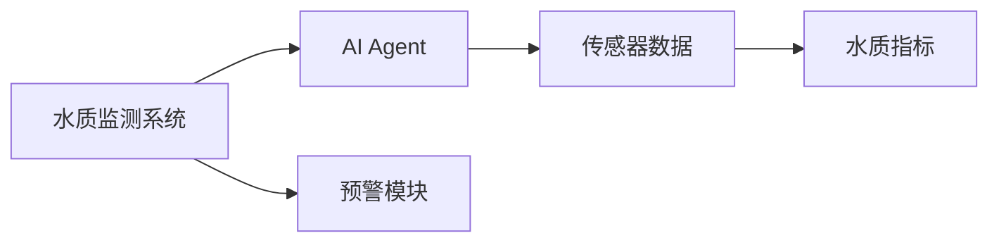
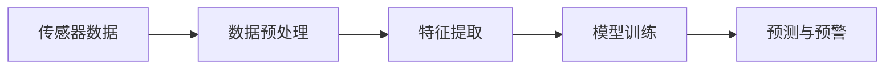
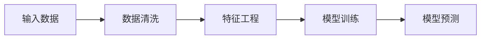
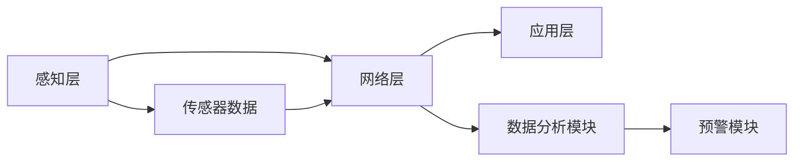

                 


# AI Agent在智能水质监测与预警中的角色

## 关键词：
- AI Agent, 智能水质监测, 预警系统, 传感器数据, 人工智能算法

## 摘要：
本文详细探讨了AI Agent在智能水质监测与预警系统中的核心作用。通过分析AI Agent的基本概念、算法原理、系统架构设计以及实际项目案例，本文揭示了如何利用AI Agent技术实现水质的实时监测、异常预警和自适应优化。文章内容涵盖了从理论到实践的各个方面，为读者提供了全面的技术解析和实践指导。

---

# 第1章 AI Agent与智能水质监测概述

## 1.1 AI Agent的基本概念
### 1.1.1 人工智能代理的定义
人工智能代理（AI Agent）是指能够感知环境、自主决策并执行任务的智能实体。它具备感知、推理、规划和执行能力，能够根据环境反馈不断优化自身的行为。

### 1.1.2 AI Agent的核心特征
- **自主性**：能够在没有外部干预的情况下独立运行。
- **反应性**：能够实时感知环境变化并做出反应。
- **学习性**：通过数据和经验不断优化自身的算法模型。
- **协作性**：能够与其他系统或代理协同工作。

### 1.1.3 AI Agent与传统自动化的区别
AI Agent不仅仅是执行预设程序的自动化工具，它具备学习和适应能力，能够根据环境动态调整策略，从而实现更智能的决策。

## 1.2 智能水质监测的背景与意义
### 1.2.1 水质监测的重要性
水质监测是保障饮用水安全、评估水体健康和环境保护的重要手段。传统的水质监测依赖人工采样和实验室分析，效率低且成本高。

### 1.2.2 智能化水质监测的必要性
随着传感器技术的进步和AI技术的发展，智能化水质监测能够实时采集数据、自动分析并发出预警，显著提高了监测效率和准确性。

### 1.2.3 AI Agent在水质监测中的作用
AI Agent能够整合多源传感器数据，利用机器学习算法进行智能分析，实现水质异常的早期预警，并提供优化的处理方案。

## 1.3 AI Agent在水质监测中的角色定位
### 1.3.1 数据采集与处理
AI Agent通过整合多种传感器（如pH传感器、溶解氧传感器、浊度传感器等）实时采集水质数据，并进行预处理和特征提取。

### 1.3.2 智能分析与预警
AI Agent利用机器学习模型对水质数据进行分析，识别异常情况并发出预警。例如，基于时间序列的异常检测模型可以预测水质变化趋势。

### 1.3.3 自适应优化与决策
AI Agent能够根据历史数据和实时反馈不断优化监测策略，例如动态调整传感器采样频率或选择最优的模型参数。

## 1.4 本章小结
本章介绍了AI Agent的基本概念及其在智能水质监测中的角色。AI Agent通过自主感知、智能分析和自适应优化，为水质监测提供了高效、可靠的解决方案。

---

# 第2章 AI Agent的核心概念与原理

## 2.1 AI Agent的核心原理
### 2.1.1 感知层：数据采集与特征提取
AI Agent通过传感器获取水质数据，并利用特征提取技术（如主成分分析）降低数据维度，提取关键特征。

### 2.1.2 决策层：模型训练与策略优化
AI Agent利用监督学习、无监督学习或强化学习算法训练模型，优化决策策略。例如，基于随机森林的分类模型可以识别水质异常状态。

### 2.1.3 执行层：行动与反馈
AI Agent根据决策结果执行相应的操作，例如触发警报或调整设备参数，并根据反馈进一步优化模型。

## 2.2 AI Agent与水质监测的实体关系


## 2.3 AI Agent的关键属性对比
| 属性       | 描述                                   |
|------------|----------------------------------------|
| 感知能力   | 数据采集与特征提取能力               |
| 决策能力   | 基于数据的分析与决策能力             |
| 执行能力   | 执行决策并反馈结果的能力             |

## 2.4 本章小结
本章详细介绍了AI Agent的核心原理及其在水质监测中的应用。通过感知、决策和执行三个层面的分析，展示了AI Agent在水质监测系统中的重要作用。

---

# 第3章 AI Agent的算法原理与数学模型

## 3.1 数据流处理流程


## 3.2 算法实现流程


## 3.3 数学模型与公式
### 3.3.1 数据融合公式
$$ y = \sum_{i=1}^{n} w_i x_i $$
其中，$w_i$ 是传感器权重，$x_i$ 是传感器数据，$y$ 是融合后的结果。

### 3.3.2 模型训练公式
$$ L = \sum_{i=1}^{m} (y_i - \hat{y}_i)^2 $$
其中，$L$ 是损失函数，$y_i$ 是真实值，$\hat{y}_i$ 是预测值。

---

# 第4章 智能水质监测系统的架构设计

## 4.1 系统功能设计
### 4.1.1 数据采集模块
负责实时采集水质传感器数据，并通过物联网（IoT）传输到云端。

### 4.1.2 数据分析模块
利用机器学习算法对数据进行分析，识别异常情况并生成预警信息。

### 4.1.3 预警模块
根据分析结果触发警报，并提供优化的处理建议。

## 4.2 系统架构设计


## 4.3 接口设计
系统需要提供标准的API接口，便于与其他系统（如物联网平台或数据库）进行集成。

## 4.4 本章小结
本章详细介绍了智能水质监测系统的架构设计，包括功能模块、系统分层和接口设计。

---

# 第5章 项目实战：AI Agent在水质监测中的应用

## 5.1 环境安装
- 安装Python、TensorFlow、Scikit-learn等工具包。
- 配置传感器数据采集接口。

## 5.2 核心代码实现
```python
import numpy as np
from sklearn.ensemble import RandomForestClassifier

# 数据预处理
data = np.array([...])  # 传感器数据
labels = np.array([...])  # 水质指标标签

# 特征工程
X = data[:, :5]  # 选择前5个特征
y = labels

# 模型训练
model = RandomForestClassifier(n_estimators=100)
model.fit(X, y)

# 预测与预警
new_data = np.array([...])  # 新的传感器数据
predicted_labels = model.predict(new_data[:, :5])
```

## 5.3 案例分析
以某水库水质监测为例，利用训练好的模型对实时数据进行分析，识别出潜在的水质异常情况并发出预警。

## 5.4 项目小结
本章通过实际案例展示了AI Agent在水质监测中的应用，验证了系统的有效性和实用性。

---

# 第6章 最佳实践与未来展望

## 6.1 最佳实践
- 数据质量是模型性能的关键，需确保数据的准确性和完整性。
- 模型调参是优化性能的重要步骤，可采用网格搜索等方法。
- 系统需具备可扩展性，便于未来新增传感器或算法升级。

## 6.2 未来展望
- 结合边缘计算技术，进一步提升系统的实时性和响应速度。
- 研究更先进的算法（如深度学习和强化学习），提高模型的泛化能力和自适应能力。
- 探索多源数据融合，例如结合气象数据和水质数据，实现更精准的预测。

---

# 结语

AI Agent在智能水质监测与预警中的应用前景广阔。通过不断的技术创新和实践积累，AI Agent将为水质监测提供更智能、更高效的解决方案，助力环境保护和人类健康。

---

# 作者：
AI天才研究院/AI Genius Institute  
禅与计算机程序设计艺术/Zen And The Art of Computer Programming

