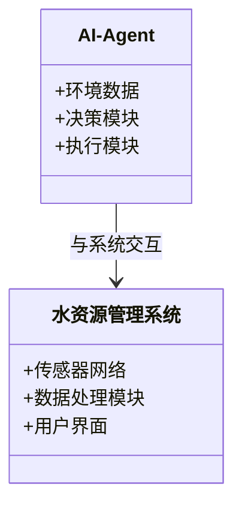
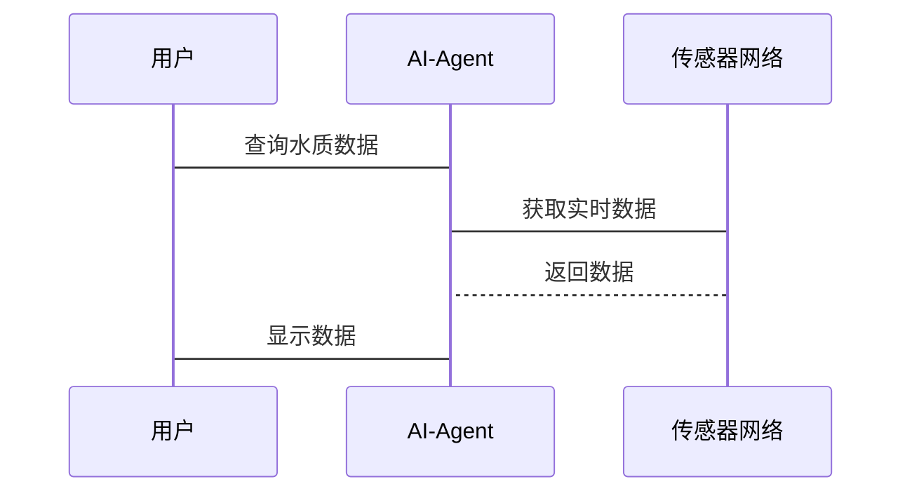

                 


# AI Agent在智能水资源管理中的角色

> 关键词：AI Agent, 智能水资源管理, 水资源监测, 优化调度, 人工智能算法

> 摘要：AI Agent在智能水资源管理中扮演着越来越重要的角色。通过AI Agent，我们可以实现对水资源的实时监测、优化调度和智能决策，从而提高水资源利用效率，解决水资源短缺和污染等问题。本文将从AI Agent的基本概念、算法原理、系统架构设计到实际应用案例，全面探讨AI Agent在智能水资源管理中的角色和作用。

---

# 第一部分: AI Agent与智能水资源管理的背景与基础

## 第1章: AI Agent的基本概念与原理

### 1.1 AI Agent的定义与核心特征

#### 1.1.1 什么是AI Agent
AI Agent（人工智能代理）是指能够感知环境、自主决策并执行任务的智能实体。与传统的自动化系统不同，AI Agent具有学习和适应能力，能够在动态环境中灵活应对各种挑战。

#### 1.1.2 AI Agent的核心特征
1. **自主性**：AI Agent能够在没有外部干预的情况下独立运行。
2. **反应性**：能够实时感知环境变化并做出反应。
3. **目标导向**：基于明确的目标进行决策和行动。
4. **学习能力**：通过数据和经验不断优化自身的性能。

#### 1.1.3 AI Agent与传统自动化的区别
| 特性         | AI Agent             | 传统自动化         |
|--------------|----------------------|-------------------|
| 决策能力     | 强大，基于数据学习   | 有限，基于固定规则 |
| 环境适应性   | 高，能处理动态变化   | 低，适应性有限     |
| 学习能力     | 具备，能优化性能     | 无，无法优化       |

### 1.2 AI Agent的分类与应用场景

#### 1.2.1 分割式AI Agent与集成式AI Agent
- **分割式AI Agent**：由多个独立的模块组成，每个模块负责不同的任务。
- **集成式AI Agent**：将各个功能模块整合到一个统一的系统中，提高整体效率。

#### 1.2.2 监督式AI Agent与无监督式AI Agent
- **监督式AI Agent**：基于标记数据进行训练，适用于已知问题场景。
- **无监督式AI Agent**：通过数据挖掘和模式识别发现潜在规律，适用于未知问题场景。

#### 1.2.3 AI Agent在不同领域的应用案例
1. **工业领域**：优化生产流程，提高效率。
2. **交通领域**：实现智能交通管理，减少拥堵。
3. **医疗领域**：辅助医生诊断，优化治疗方案。

### 1.3 AI Agent的基本工作原理

#### 1.3.1 感知层：数据采集与处理
AI Agent通过传感器、摄像头等设备采集环境数据，并对这些数据进行预处理和分析。

#### 1.3.2 决策层：算法与策略制定
基于感知层提供的数据，AI Agent利用机器学习算法（如强化学习、遗传算法）制定最优决策。

#### 1.3.3 执行层：动作输出与反馈
AI Agent根据决策层的指令执行具体动作，并通过反馈机制不断优化自身的性能。

---

## 第2章: 智能水资源管理的背景与挑战

### 2.1 水资源管理的基本概念

#### 2.1.1 水资源的定义与分类
水资源是指地球上所有可以利用的水，包括地表水、地下水和海水。根据用途可分为生活用水、工业用水和农业用水。

#### 2.1.2 水资源管理的目标与原则
- **目标**：合理分配水资源，确保可持续利用。
- **原则**：科学性、公平性、可持续性。

### 2.2 智能水资源管理的必要性

#### 2.2.1 传统水资源管理的局限性
1. **效率低下**：人工管理容易出错，效率低。
2. **信息滞后**：数据采集和处理速度慢，无法实时应对变化。

#### 2.2.2 智能化管理的潜力与优势
1. **提高效率**：通过AI技术实现快速决策和优化。
2. **实时监控**：能够实时采集和处理数据，及时发现问题。

### 2.3 当前水资源管理的主要挑战

#### 2.3.1 水资源短缺问题
全球范围内水资源短缺问题日益严重，尤其是在干旱地区。

#### 2.3.2 水污染与水质管理
工业废水、农业面源污染等导致水质下降，威胁人类健康。

#### 2.3.3 水资源分配与调度的复杂性
水资源分配涉及多个利益相关方，如何在不同需求之间找到平衡是难点。

---

# 第二部分: AI Agent在水资源管理中的核心应用

## 第3章: AI Agent在水资源监测中的应用

### 3.1 水资源监测的基本需求

#### 3.1.1 数据采集的准确性与实时性
水资源监测需要高精度的数据采集，同时要求数据能够实时传输。

#### 3.1.2 监测网络的构建与优化
通过布设传感器网络，构建覆盖广泛的监测系统，并通过AI优化传感器部署。

### 3.2 AI Agent在水质监测中的应用

#### 3.2.1 基于AI的水质预测模型
利用机器学习算法（如随机森林、神经网络）建立水质预测模型，实现水质的实时预测。

#### 3.2.2 异常检测与污染源识别
通过分析水质数据，识别异常变化，定位污染源，及时采取措施。

### 3.3 AI Agent在水位监测中的应用

#### 3.3.1 水位预测与预警系统
基于历史数据和天气预报，预测未来水位变化，提前发出预警。

#### 3.3.2 多源数据融合与分析
将气象数据、地形数据等多种数据源进行融合，提高水位预测的准确性。

## 第4章: AI Agent在水资源优化调度中的应用

### 4.1 水资源调度的基本原理

#### 4.1.1 水资源调度的目标与约束条件
- **目标**：在满足需求的前提下，最大化水资源利用效率。
- **约束条件**：水量限制、用水需求、环境影响等。

### 4.2 基于AI Agent的优化调度

#### 4.2.1 强化学习算法在调度中的应用
通过强化学习算法，AI Agent能够学习最优的调度策略，实现动态调整。

#### 4.2.2 遗传算法在调度中的应用
遗传算法用于优化调度方案，寻找最优解。

### 4.3 AI Agent优化调度的实际案例

#### 4.3.1 某城市水资源调度优化案例
通过AI Agent优化调度模型，提高水资源利用效率，减少浪费。

---

## 第5章: AI Agent在水资源管理中的系统架构设计

### 5.1 系统功能设计

#### 5.1.1 领域模型（Mermaid类图）


### 5.2 系统架构设计

#### 5.2.1 系统架构（Mermaid架构图）
```mermaid
container 水资源管理平台 {
    AI-Agent
    传感器网络
    数据存储
    用户界面
}
```

### 5.3 系统接口设计

#### 5.3.1 AI-Agent与传感器网络的接口
- 数据采集接口：从传感器获取实时数据。
- 控制接口：向传感器发送控制指令。

### 5.4 系统交互设计

#### 5.4.1 AI-Agent与用户的交互流程（Mermaid序列图）


---

## 第6章: 项目实战——基于AI Agent的智能灌溉系统

### 6.1 项目背景
随着水资源短缺问题的加剧，智能灌溉系统成为提高农业用水效率的重要手段。

### 6.2 环境配置
1. **硬件**：土壤湿度传感器、气象传感器、水泵等。
2. **软件**：Python编程语言，机器学习库（如Scikit-learn、TensorFlow）。

### 6.3 核心代码实现

#### 6.3.1 数据采集模块
```python
import serial

# 与传感器通信的代码
ser = serial.Serial('COM3', 9600)
data = ser.readline().decode().strip()
```

#### 6.3.2 模型训练模块
```python
from sklearn.tree import DecisionTreeRegressor

# 培训数据
X = [[温度, 湿度, 光照], ...]
y = [需水量, ...]

model = DecisionTreeRegressor()
model.fit(X, y)
```

#### 6.3.3 系统控制模块
```python
import RPi.GPIO as GPIO

# 控制水泵
GPIO.output(12, GPIO.HIGH)  # 开启水泵
GPIO.output(12, GPIO.LOW)   # 关闭水泵
```

### 6.4 数据处理与分析
对采集的数据进行清洗、特征提取和建模分析，为AI Agent提供决策依据。

### 6.5 模型训练与优化
通过历史数据训练模型，优化AI Agent的决策策略，提高预测准确性。

---

## 第7章: 最佳实践与注意事项

### 7.1 最佳实践
1. **数据质量**：确保数据的准确性和完整性。
2. **模型优化**：定期更新模型，适应环境变化。
3. **系统维护**：定期检查硬件设备，确保系统稳定运行。

### 7.2 小结
通过AI Agent技术，我们可以实现对水资源的智能化管理，提高水资源利用效率，解决水资源短缺和污染问题。

### 7.3 注意事项
1. **数据隐私**：注意保护用户数据隐私。
2. **系统安全**：防止系统被恶意攻击。
3. **法律法规**：遵守相关法律法规，确保合规性。

### 7.4 拓展阅读
推荐阅读以下书籍和论文，深入了解AI Agent和水资源管理的相关知识：
1. 《AI Agent与智能系统》
2. 《水资源管理的理论与实践》
3. 相关学术论文：Google Scholar搜索“AI Agent in water resource management”。

---

# 结语

AI Agent在智能水资源管理中的应用前景广阔，通过不断的技术创新和实践积累，我们有望实现更加高效、智能的水资源管理模式，为解决全球水资源问题贡献力量。

---

# 作者

作者：AI天才研究院/AI Genius Institute & 禅与计算机程序设计艺术 /Zen And The Art of Computer Programming

