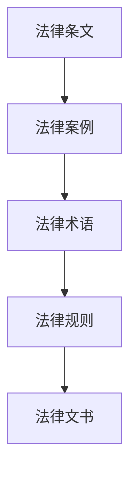

                 


# AI Agent在智能法律文书生成中的角色

## 关键词：AI Agent, 法律文书生成, 生成式AI, 法律知识图谱, 系统架构设计

## 摘要：本文探讨了AI Agent在智能法律文书生成中的角色，从背景、核心概念、算法原理、系统架构设计、项目实战到最佳实践，全面分析了AI Agent如何赋能法律文书生成。通过详细的技术分析和实际案例，本文揭示了AI Agent在提升法律文书生成效率和准确性中的潜力，同时探讨了当前面临的挑战和未来的发展方向。

---

# 第1章: AI Agent与智能法律文书生成的背景与概念

## 1.1 AI Agent的基本概念与核心特征

### 1.1.1 AI Agent的定义与核心特征

- **定义**: AI Agent（人工智能代理）是指能够感知环境、自主决策并执行任务的智能实体。它通过传感器获取信息，利用算法进行分析和推理，并通过执行器与环境互动。
- **核心特征**:
  - 感知能力: 通过多种传感器或数据源获取环境信息。
  - 决策能力: 基于获取的信息进行分析和推理，做出决策。
  - 执行能力: 根据决策结果执行操作，完成任务。
  - 学习能力: 通过反馈机制不断优化自身行为。

### 1.1.2 AI Agent与传统软件的区别

| 特性 | 传统软件 | AI Agent |
|------|----------|----------|
| 智能性 | 无智能性，遵循固定规则 | 具备智能性，能自主决策和学习 |
| 适应性 | 无法自适应环境变化 | 能够根据环境变化调整行为 |
| 交互方式 | 单向交互，用户输入→系统输出 | 双向交互，具备主动感知和反馈能力 |

## 1.2 法律文书生成的背景与挑战

### 1.2.1 法律文书的基本类型与特点

- **类型**: 包括合同、起诉书、判决书、法律意见书等。
- **特点**: 格式规范、内容严谨、条款清晰。

### 1.2.2 法律文书生成的传统方式及其局限性

- **传统方式**: 依赖人工编写，耗时且效率低。
- **局限性**:
  - 易出错: 由于人为疏忽可能导致法律文书错误。
  - 效率低: 手工编写耗时长，难以满足大量需求。
  - 一致性差: 不同律师编写的内容可能存在差异。

### 1.2.3 智能化法律文书生成的需求与趋势

- **需求**: 提高效率、降低成本、确保准确性。
- **趋势**: 随着AI技术的发展，智能化生成法律文书成为行业趋势。

## 1.3 AI Agent在法律领域的应用现状

### 1.3.1 AI Agent在法律咨询中的应用

- **案例**: 法律问答机器人通过自然语言处理（NLP）技术回答用户问题。

### 1.3.2 AI Agent在法律文书生成中的应用

- **案例**: 自动生成合同、起诉书等法律文书。

### 1.3.3 当前应用中的主要问题与挑战

- **问题**: 数据不足、模型不够准确、法律知识图谱不完善。
- **挑战**: 法律文书的复杂性和严谨性要求高，AI模型需要不断优化。

---

# 第2章: AI Agent与法律知识图谱

## 2.1 法律知识图谱的构建

### 2.1.1 法律知识图谱的定义与特点

- **定义**: 通过图结构表示法律概念及其关系的知识库。
- **特点**: 结构化、可扩展、动态更新。

### 2.1.2 法律知识图谱的构建方法

- **步骤**: 数据收集、实体识别、关系抽取、知识融合。
- **工具**: 使用NLP工具和知识图谱构建框架（如Ubergraph）。

### 2.1.3 法律知识图谱的应用场景

- **场景**: 法律信息检索、法律推理、法律文书生成。

## 2.2 AI Agent与法律知识图谱的结合

### 2.2.1 AI Agent如何利用法律知识图谱进行推理

- **推理过程**: 通过图结构进行路径分析和关系推理。

### 2.2.2 法律知识图谱对AI Agent决策的支持

- **支持方式**: 提供法律条文、案例和术语的语义关联。

## 2.3 法律知识图谱的Mermaid实体关系图



## 2.4 本章小结

---

# 第3章: AI Agent在法律文书生成中的算法原理

## 3.1 生成式AI的基本原理

### 3.1.1 生成式AI的定义与特点

- **定义**: 通过深度学习模型生成文本的技术。
- **特点**: 基于概率分布生成文本，具备上下文理解和生成能力。

### 3.1.2 基于Transformer的生成模型

- **模型结构**: 编码器-解码器架构，自注意力机制。
- **数学模型**: Scaled Dot-Product Attention。

$$
\text{Attention}(Q, K, V) = \text{softmax}\left(\frac{QK^T}{\sqrt{d_k}}\right)V
$$

### 3.1.3 法律知识图谱的结合

- **方法**: 将法律知识图谱嵌入到生成模型中，提供语义指导。

---

# 第4章: 法律文书生成系统分析与架构设计

## 4.1 系统功能设计

### 4.1.1 法律文书生成系统模块划分

- **模块**: 用户界面、知识库、生成引擎、反馈系统。

## 4.2 系统架构设计

### 4.2.1 分层架构

- **分层**: 表现层、业务逻辑层、数据访问层。

### 4.2.2 模块交互流程

- **流程**: 用户输入需求→知识库提供支持→生成引擎输出文档→反馈优化。

## 4.3 系统接口设计

### 4.3.1 输入接口

- **输入**: 用户需求描述、相关法律条文。

### 4.3.2 输出接口

- **输出**: 生成的法律文书、错误提示。

---

# 第5章: 项目实战

## 5.1 智能合同生成系统

### 5.1.1 系统环境安装

- **工具**: Python 3.8+, PyTorch, Hugging Face Transformers。

### 5.1.2 核心代码实现

```python
from transformers import GPT2LMHeadModel, GPT2Tokenizer

model_name = 'gpt2-medium'
tokenizer = GPT2Tokenizer.from_pretrained(model_name)
model = GPT2LMHeadModel.from_pretrained(model_name)
```

### 5.1.3 功能实现分析

- **功能**: 根据用户提供的合同模板和参数，生成完整合同。

### 5.1.4 实际案例分析

- **案例**: 自动生成商业合同，确保条款符合相关法律要求。

---

# 第6章: 最佳实践与注意事项

## 6.1 数据质量的重要性

- **建议**: 使用高质量的法律文书数据进行模型训练。

## 6.2 模型调优技巧

- **技巧**: 调整学习率、批量大小、训练轮数。

## 6.3 系统可解释性

- **重要性**: 提高用户信任度，便于问题排查。

## 6.4 法律伦理与合规性

- **注意事项**: 遵守相关法律法规，确保生成内容的合法性。

---

# 作者：AI天才研究院/AI Genius Institute & 禅与计算机程序设计艺术 /Zen And The Art of Computer Programming

