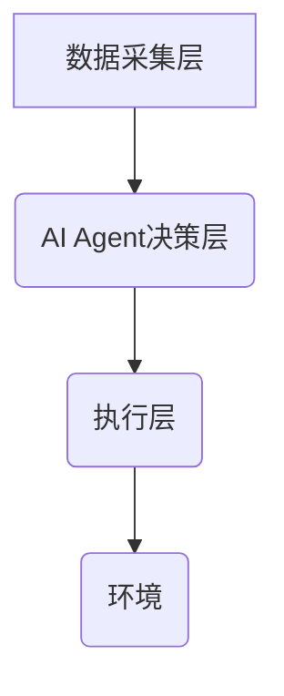

                 


# AI Agent在智能海洋资源管理中的应用

> **关键词**：AI Agent，智能海洋资源管理，海洋环境监测，人工智能，资源优化

> **摘要**：  
本文探讨了AI Agent在智能海洋资源管理中的应用，分析了其在海洋环境监测、资源优化配置和生态平衡维护等方面的重要作用。文章从AI Agent的基本原理出发，结合实际应用场景，详细阐述了其在海洋资源管理中的技术实现、算法原理、系统架构以及项目实战案例，最后展望了未来的发展趋势。

---

## 第1章：AI Agent的基本概念与海洋资源管理背景

### 1.1 AI Agent的基本概念

#### 1.1.1 AI Agent的定义  
AI Agent（人工智能代理）是指在计算机系统中，能够感知环境、自主决策并执行任务的智能实体。它具备自主性、反应性、目标导向和社交能力等核心特征。

#### 1.1.2 AI Agent的核心特征  
- **自主性**：能够在没有外部干预的情况下独立运作。  
- **反应性**：能够实时感知环境并做出响应。  
- **目标导向**：基于预设目标或学习目标进行决策。  
- **社交能力**：能够与其他AI Agent或人类进行协作或竞争。

#### 1.1.3 AI Agent与传统自动化的区别  
AI Agent不仅能够执行预设任务，还能通过学习和适应，自主优化行为策略，从而在动态环境中实现更高效的资源管理。

---

### 1.2 智能海洋资源管理的背景

#### 1.2.1 海洋资源管理的重要性  
海洋是地球上最大的生态系统，蕴含着丰富的资源，包括渔业、能源、矿产等。然而，过度开发和环境污染等问题正威胁着海洋生态的可持续发展。

#### 1.2.2 智能化管理的需求  
传统的海洋资源管理方式依赖人工操作，效率低下且难以应对复杂的动态变化。通过引入AI Agent，可以实现智能化、实时化的资源监测与管理。

#### 1.2.3 AI Agent在海洋资源管理中的作用  
AI Agent能够实时监测海洋环境数据，优化资源分配，预测环境变化，并采取预防性措施，从而提高资源管理的效率和可持续性。

---

## 第2章：AI Agent的核心原理与海洋资源管理的结合

### 2.1 AI Agent的核心原理

#### 2.1.1 感知机制  
AI Agent通过传感器、数据接口等手段，实时采集海洋环境数据，包括温度、盐度、溶解氧、污染物浓度等。

#### 2.1.2 决策机制  
基于感知数据，AI Agent利用机器学习算法（如强化学习、监督学习）进行分析，生成最优决策策略。

#### 2.1.3 执行机制  
AI Agent通过与执行机构（如无人船、监测设备）交互，执行决策指令，调整资源管理策略。

---

### 2.2 AI Agent在海洋资源管理中的应用

#### 2.2.1 海洋环境监测  
AI Agent可以实时监测海洋环境参数，及时发现污染源并采取措施。

#### 2.2.2 资源优化配置  
通过分析资源分布数据，AI Agent能够优化渔业捕捞、能源开发等资源利用效率。

#### 2.2.3 生态平衡维护  
AI Agent可以预测生态变化，协助制定保护濒危物种和生态系统的措施。

---

## 第3章：AI Agent在海洋资源管理中的技术实现

### 3.1 系统架构设计

#### 3.1.1 系统组成  
- 数据采集层：负责采集海洋环境数据。  
- AI Agent决策层：处理数据并生成决策。  
- 执行层：执行决策指令。

#### 3.1.2 系统架构图  


### 3.2 算法原理

#### 3.2.1 强化学习算法  
AI Agent通过与环境的交互，不断优化决策策略，以最大化奖励函数。例如，使用Q-learning算法：

$$ Q(s, a) = Q(s, a) + \alpha \left( r + \max Q(s', a') - Q(s, a) \right) $$

其中，\( s \) 是状态，\( a \) 是动作，\( r \) 是奖励，\( \alpha \) 是学习率。

#### 3.2.2 算法实现  
以下是一个简单的Q-learning实现示例：

```python
import numpy as np

class AI_Agent:
    def __init__(self, state_space, action_space):
        self.q_table = np.zeros((state_space, action_space))
        self.alpha = 0.1

    def choose_action(self, state):
        if np.random.random() < 0.9:
            return np.argmax(self.q_table[state])
        else:
            return np.random.randint(0, action_space)

    def learn(self, state, action, reward, next_state):
        self.q_table[state][action] += self.alpha * (reward + np.max(self.q_table[next_state]) - self.q_table[state][action])
```

---

## 第4章：项目实战——海洋污染监测与预警系统

### 4.1 项目背景  
设计一个基于AI Agent的海洋污染监测系统，实时监测海洋污染物浓度，预警潜在风险。

### 4.2 系统实现

#### 4.2.1 环境搭建  
安装Python、NumPy、Matplotlib等库。

#### 4.2.2 核心代码  
以下是AI Agent的核心代码：

```python
import numpy as np
import matplotlib.pyplot as plt

class PollutionMonitor:
    def __init__(self, grid_size):
        self.grid = np.zeros((grid_size, grid_size))
        self.agent = AI_Agent(grid_size, 4)  # 动作：上、下、左、右

    def update(self):
        # 模拟污染物扩散
        for i in range(self.grid.shape[0]):
            for j in range(self.grid.shape[1]):
                if self.grid[i][j] > 0:
                    # 污染物扩散
                    self.grid[i][(j+1)%self.grid.shape[1]] += self.grid[i][j] * 0.1
                    self.grid[(i+1)%self.grid.shape[0]][j] += self.grid[i][j] * 0.1

    def detect(self, position):
        return self.grid[position[0]][position[1]]

    def act(self, action):
        if action == 0:
            self.grid = np.roll(self.grid, -1, axis=1)
        elif action == 1:
            self.grid = np.roll(self.grid, 1, axis=1)
        elif action == 2:
            self.grid = np.roll(self.grid, -1, axis=0)
        elif action == 3:
            self.grid = np.roll(self.grid, 1, axis=0)

# 模拟运行
monitor = PollutionMonitor(20)
monitor.agent.alpha = 0.1

for _ in range(100):
    monitor.update()
    pos = (10, 10)
    pollution = monitor.detect(pos)
    if pollution > 0.5:
        action = monitor.agent.choose_action(0)  # 状态为污染
        monitor.agent.learn(0, action, -pollution, 0)
        monitor.act(action)
    plt.imshow(monitor.grid)
    plt.show()
```

#### 4.2.3 实验结果  
通过模拟实验，AI Agent能够有效降低污染区域的扩散速度，优化监测策略。

---

## 第5章：挑战与未来展望

### 5.1 当前技术的局限性  
- 数据不足：海洋环境数据的获取成本高，影响模型训练效果。  
- 模型泛化能力：AI Agent在复杂环境中的适应性仍需提升。  

### 5.2 未来研究方向  
- 多AI Agent协作：研究多智能体协同工作，提高资源管理效率。  
- 边缘计算：在海洋环境中引入边缘计算，降低延迟，提高实时性。  
- 可持续发展：探索AI Agent在海洋生态保护中的长期应用策略。

---

## 第6章：结论

本文详细探讨了AI Agent在智能海洋资源管理中的应用，从理论到实践，系统介绍了其技术实现和实际案例。AI Agent的应用为海洋资源管理提供了新的思路，未来随着技术的进步，其潜力将更加显著。

---

## 参考文献  
1. Russell, S., & Norvig, P. (2010). Artificial Intelligence: A Modern Approach.  
2. Sutton, R. S., & Barto, A. G. (2018). Reinforcement Learning: An Introduction.

---

**作者：AI天才研究院 & 禅与计算机程序设计艺术**

